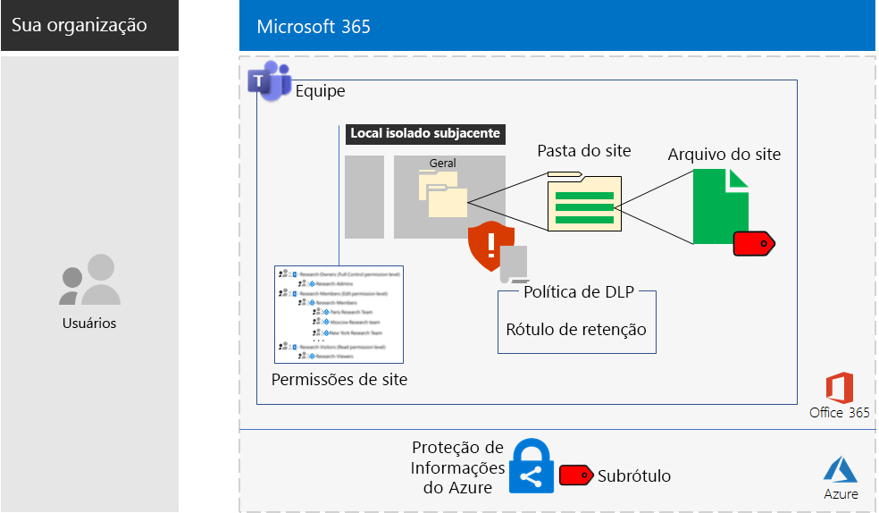

# Sites do Microsoft Teams e do SharePoint Online para dados altamente controladosMicrosoft Teams and SharePoint Online sites for highly regulated data

*Este cenário aplica-se às versões E3 e E5 do Microsoft 365 Enterprise**This scenario applies to both the E3 and E5 versions of Microsoft 365 Enterprise*

O Microsoft 365 Enterprise inclui um conjunto completo de serviços em nuvem para que você possa criar, armazenar e proteger seus dados altamente regulados. Isso inclui os dados:Microsoft 365 Enterprise includes a full suite of cloud-based services so that you can create, store, and secure your highly regulated data. This includes data that is:

- Sujeitos a regulamentações regionais.Subject to regional regulations.
- Mais importantes de sua organização, como segredos comerciais, financeiros ou informações de recursos humanos e estratégias da organização.The most valuable data for your organization, such as trade secrets, financial or human resources information, and organization strategy.

Um cenário da Microsoft 365 Enterprise baseada na nuvem, que atende a essa necessidade comercial, requer que você:A Microsoft 365 Enterprise cloud-based solution that meets this business need requires that you:

- Armazene ativos digitais (documentos, apresentações de slides, planilhas etc.) em um site de equipe do SharePoint Online ou na guia **Arquivos** de uma equipe Microsoft Teams.Store digital assets (documents, slide decks, spreadsheets, etc.) in a SharePoint Online team site or in the **Files** tab of a Microsoft Teams team.
- Bloqueie o site ou a equipe para impedir:Lock down the site or team to prevent:
   - O acesso a apenas um conjunto específico de contas de usuário por meio de associações de grupo, que inclui aqueles que podem acessar o site de equipe do SharePoint Online, qual o nível de permissão e quem pode administrá-lo.Access to only a specific set of user accounts through group membership, which includes those who can access the SharePoint Online team site and at what level of permission, and those who can administer it.
   - Que membros do site concedam acesso a outras pessoas.Members of the site from granting access to others.
   - Que aqueles que não sejam membros do site solicitem acesso a ele.Non-members of the site from requesting access to the site.
- Configurar um rótulo de retenção do Office 365 para seus sites ou equipes do SharePoint Online como uma maneira padrão de definir políticas de retenção nos documentos no site ou na equipe.Configure an Office 365 retention label for your SharePoint Online sites or teams as a default way to define retention policies on the documents in the site or team.
- Impedir usuários de enviar arquivos para fora da organização.Block users from sending files outside the organization.
- Criptografe os ativos digitais mais importantes do site ou da equipe.Encrypt the most sensitive digital assets of the site or team.
- Adicione permissões aos ativos digitais mais importantes para que, mesmo que sejam compartilhados fora do site, só seja possível abri-lo com as credenciais válidas de uma conta de usuário que tenha a permissão.Add permissions to the most sensitive digital assets so that if even if they get shared outside of the site, opening the asset still requires the valid credentials of a user account that has permission.

A tabela a seguir mapeia os requisitos desse cenário para um recurso do Microsoft 365 Enterprise.The following table maps the requirements of this solution to a feature of Microsoft 365 Enterprise.

|||
|:-------|:-----|
| **Requisito****Requirement** | **Recurso do Microsoft 365 Enterprise****Microsoft 365 Enterprise feature** |
| Armazenar ativos digitaisStore digital assets | Sites e equipes do SharePoint Online no Office 365SharePoint Online team sites and teams in Office 365 |
| Bloquear o siteLock down the site | Permissões do site de equipe do SharePoint Online e grupos do Azure ADAzure AD groups and SharePoint Online team site permissions |
| Rotular os ativos digitais do siteLabel the digital assets of the site | Rótulos de retenção do Office 365Office 365 retention labels |
| Bloquear usuários ao enviar arquivos para fora da organização.Block users when sending files outside the organization | Políticas de Prevenção Contra Perda de Dados (DLP) no Office 365Data Loss Prevention (DLP) policies in Office 365 |
| Criptografar todos os ativos digitais do siteEncrypt all of the digital assets of the site | Sub-rótulos de Proteção de Informações do Azure no Enterprise Mobility + Security (EMS)Azure Information Protection sub-labels in Enterprise Mobility + Security (EMS) |
| Adicionar permissões aos ativos digitais do siteAdd permissions to the digital assets of the site | Sub-rótulos da Proteção de Informações do Azure no EMSAzure Information Protection sub-labels in EMS |
|||

Estas são as configurações para um site do SharePoint Online.Here is the configuration for a SharePoint Online site.

Este cenário exige que você já tenha implantado:This solution requires that you have already deployed:

- A fase de [identidade](identity-infrastructure.md) e as etapas 1 e 2 da fase de [proteção de informações](infoprotect-infrastructure.md) da infraestrutura de base.The [Identity](identity-infrastructure.md) phase and steps 1 and 2 of the [Information protection](infoprotect-infrastructure.md) phase of the foundation infrastructure. 
- Para dados altamente regulados nos sites de equipe do SharePoint Online, o [SharePoint Online](sharepoint-online-onedrive-workload.md).For highly regulated data in SharePoint Online team sites, [SharePoint Online](sharepoint-online-onedrive-workload.md).
- Para dados altamente regulados nas equipes do Microsoft Teams, o [Microsoft Teams](teams-workload.md).For highly regulated data in Microsoft Teams teams, [Microsoft Teams](teams-workload.md).

As fases a seguir orientam você quanto ao design, à configuração e à geração de adoção dos sites e equipes do SharePoint Online para dados altamente regulados.The following phases step you through the design, configuration, and driving adoption for SharePoint Online sites and teams for highly regulated data.

Para ver como a Contoso Corporation, uma organização multinacional fictícia representativa, projetou um site do SharePoint Online para suas equipes de pesquisa, consulte esta [configuração de exemplo](contoso-sharepoint-online-site-for-highly-confidential-assets.md).To see how the Contoso Corporation, a fictional but representative multi-national organization, designed a SharePoint Online site for its research teams, see this [example configuration](contoso-sharepoint-online-site-for-highly-confidential-assets.md).

Uma equipe para dados altamente regulados requer que você primeiro crie um site de equipe do SharePoint Online para dados altamente regulados. Em seguida, você cria uma nova equipe que usa o grupo do Office 365 do site de equipe do SharePoint Online. Consulte a Fase 2, Etapa 4 para obter mais informações.A team for highly regulated data requires that you first create a SharePoint Online team site for highly regulated data. You then create a new team that uses the Office 365 group of the SharePoint Online team site. See Phase 2, Step 4 for more information.

Estas são as configurações para uma equipe.Here is the configuration for a team.

## Pré-requisitos de acesso ao dispositivo e identidadeIdentity and device access prerequisites

Para proteger o acesso à equipe ou ao site do SharePoint Online, assegure-se de ter configurado [políticas de identidade e de acesso ao dispositivo](identity-access-policies.md) e as [políticas de acesso recomendadas do SharePoint Online](sharepoint-file-access-policies.md).To protect access to the team or SharePoint Online site, ensure that you have configured [identity and device access policies](identity-access-policies.md) and the [recommended SharePoint Online access policies](sharepoint-file-access-policies.md).

## Fase 1: DesignPhase 1: Design

Para criar um site ou uma equipe do SharePoint Online para dados altamente regulados, primeiro você precisa identificar a finalidade dele. Por exemplo, o departamento de pesquisa e desenvolvimento e uma organização de manufatura precisa de um site do SharePoint Online para armazenar especificações atuais de design de produtos existentes e um local para colaborar em novos produtos. Apenas os membros do departamento de Pesquisa e Desenvolvimento e determinados executivos poderão acessar o site.To create a SharePoint Online site or team for highly regulated data, you must first identify its purpose. For example, the research and development department of a manufacturing organization needs a SharePoint Online site to store current design specifications for existing products and a place to collaborate on new products. Only members of the Research & Development department and selected executives will be allowed to access the site.

Essa finalidade gerará a determinação de itens essenciais de configuração como:That purpose will drive the determination of essential configuration items such as:

- O conjunto de grupos do SharePoint e os conjuntos de permissão do SharePoint OnlineThe set of SharePoint Online permission sets and SharePoint groups
- O conjunto de grupos de acesso, grupos de segurança do Azure AD e seus membros para adicionar aos grupos do SharePointThe set of access groups, the Azure AD security groups and their members to add to the SharePoint groups
- O rótulo de retenção do Office 365 a ser atribuído ao site e o conjunto de políticas DLP para o rótuloThe Office 365 retention label to assign to the site and the set of DLP policies for the label
- As configurações do sub-rótulo de Proteção de Informações do Azure que os usuários aplicam a ativos digitais altamente confidenciais armazenados no siteThe settings of an Azure Information Protection sub-label that users apply to highly sensitive digital assets stored in the site

Quando determinado, você usa essas configurações para configurar o site na Fase 2.Once determined, you use these settings to configure the site in Phase 2. 

### Etapa 1: Um site isolado do SharePoint OnlineStep 1: An isolated SharePoint Online site

A versão bloqueada de um site de equipe do SharePoint Online é conhecida como um site isolado. Ao contrário das configurações padrão de sites de equipe privados, sites isolados são configurados para evitar:The locked-down version of a SharePoint Online team site is known as an isolated site. Unlike the default settings of private team sites, isolated sites are configured to prevent:

- O acesso daqueles que não são membros de grupos especificados.Access to those who are not members of specified groups.
- A solicitação de acesso.The requesting of access.
- A concessão não autorizada de acesso por membros atuais de grupos especificados.The unauthorized granting of access by current members of specified groups.
- Administração do site pelos membros de grupo de acesso.Administration of the site by access group members.

A segurança dos sites de equipe do SharePoint Online que contêm ativos altamente regulados não muda, a não ser que seja alterada por um administrador do SharePoint para o site.The security of SharePoint Online team sites that contain highly regulated assets do not change unless done by a SharePoint administrator for the site.

Consulte [Projetar um site de equipe isolado do SharePoint Online](https://docs.microsoft.com/office365/enterprise/design-an-isolated-sharepoint-online-team-site) para obter detalhes para determinar o conjunto de níveis de permissão, grupos do SharePoint, grupos de acesso e membros do grupo.See [Design an isolated SharePoint Online team site](https://docs.microsoft.com/office365/enterprise/design-an-isolated-sharepoint-online-team-site) for the details to determine the set of permission levels, SharePoint groups, access groups, and group members.

### Etapa 2: rótulos de retenção do Office 365 e políticas DLPStep 2: Office 365 retention labels and DLP policies

Quando aplicados a um site de equipe do SharePoint Online, os rótulos de retenção do Office 365 oferecem um método padrão para classificar todos os ativos digitais armazenados no site.When applied to a SharePoint Online team site, Office 365 retention labels provide a default method of classifying all digital assets stored on the site.
 
Nos sites do SharePoint Online para dados altamente controlados, você precisa determinar qual rótulo de retenção do Office 365 será usado.For SharePoint Online sites for highly regulated data, you need to determine which Office 365 retention label to use.

Para considerações de design dos rótulos do Office 365, consulte [Rótulos e classificação do Office 365](https://docs.microsoft.com/office365/securitycompliance/secure-sharepoint-online-sites-and-files#office-365-retention-labels).For the design considerations of Office 365 labels, see [Office 365 classification and labels](https://docs.microsoft.com/office365/securitycompliance/secure-sharepoint-online-sites-and-files#office-365-retention-labels).

Para proteger informações confidenciais e evitar a divulgação acidental ou intencional, use as políticas DLP. Para obter mais informações, consulte esta [visão geral](https://docs.microsoft.com/office365/securitycompliance/data-loss-prevention-policies).To protect sensitive information and prevent its accidental or intentional disclosure, you use DLP policies. For more information, see this [overview](https://docs.microsoft.com/office365/securitycompliance/data-loss-prevention-policies).

Para sites do SharePoint para dados altamente controlados, você deve configurar uma política DLP do rótulo de retenção do Office 365 atribuído ao site para bloquear usuários quando eles tentam compartilhar ativos digitais com usuários externos.For SharePoint Online sites for highly regulated data, you must configure a DLP policy for the Office 365 retention label assigned to the site to block users when they attempt to share digital assets with external users. 

### Etapa 3: seu sub-rótulo de Proteção de Informações do AzureStep 3: Your Azure Information Protection sub-label

Para fornecer um conjunto de permissões e a criptografia para seus ativos digitais mais importantes, os usuários devem aplicar um rótulo de Proteção de Informações do Azure usando o cliente de Proteção de Informações do Azure. Para usar rótulos de Proteção de Informações do Azure em sites do SharePoint Online para dados altamente regulamentados, você deve configurar um sub-rótulo de Proteção de Informações do Azure em uma política com escopo.To provide encryption and a set of permissions to your most sensitive digital assets, users must apply an Azure Information Protection label using the Azure Information Protection client. To use Azure Information Protection labels for SharePoint Online sites for highly regulated data, you must configure an Azure Information Protection sub-label in a scoped policy. 

Um sub-rótulo existe em um rótulo existente. Por exemplo, você pode criar um sub-rótulo Pesquisa e Desenvolvimento no rótulo Altamente Confidencial. Uma política com escopo é uma que se aplica apenas a um subconjunto de usuários. Nos sites do SharePoint Online para dados altamente regulamentados, o escopo é o conjunto de usuários que são membros dos grupos de acesso do site.A sub-label exists under an existing label. For example, you can create a Research & Development sub-label under the Highly Confidential label. A scoped policy is one that applies only to a subset of users. For SharePoint Online sites for highly regulated data, the scope is the set of users that are members of the access groups for the site.

As configurações do sub-rótulo aplicado acompanham o ativo. Mesmo que ele seja baixado e compartilhado fora do site, apenas as contas de usuário autenticadas com permissões poderão abri-lo.The settings of the applied sub-label travel with the asset. Even if it is downloaded and shared outside the site, only authenticated user accounts that have permissions can open it.

### Resultados de designDesign results

Você determinou o seguinte:You have determined the following:

- O conjunto de grupos e níveis de permissão do SharePointThe set of SharePoint groups and permission levels
- O conjunto de grupos de acesso e os membros deles em cada nível de permissãoThe set of access groups and their members for each permission level
- O rótulo de retenção apropriado do Office 365 e a política DLP que está associada ao rótuloThe appropriate Office 365 retention label and the DLP policy that is associated with the label
- As configurações do sub-rótulo Proteção de Informações do Azure que incluem criptografia e permissõesThe settings of the Azure Information Protection sub-label that include encryption and permissions

## Fase 2: ConfigurarPhase 2: Configure

Nesta fase, você usa as configurações determinadas na Fase 1 e as implementa para criar um site do SharePoint Online para dados altamente regulamentados.In this phase, you take the settings determined in Phase 1 and implement them to create a SharePoint Online site for highly regulated data.

### Etapa 1: criar e configurar um site de equipe do SharePoint Online isoladoStep 1: Create and configure an isolated SharePoint Online team site

Use as instruções em [Implantar um site de equipe do SharePoint Online isolado](https://docs.microsoft.com/office365/enterprise/deploy-an-isolated-sharepoint-online-team-site) para:Use the instructions in [Deploy an isolated SharePoint Online team site](https://docs.microsoft.com/office365/enterprise/deploy-an-isolated-sharepoint-online-team-site) to:

- Crie e preencha os grupos de acesso para cada nível de permissão do SharePoint usado no site.Create and populate the access groups for each SharePoint permission level used on the site.
- Crie e configure o site de equipe isolado.Create and configure the isolated team site.

### Etapa 2: configurar o site para uma política DLP de um rótulo de retenção do Office 365Step 2: Configure the site for an Office 365 retention label DLP policy

Use as instruções em [Proteger arquivos do SharePoint Online com DLP e rótulos do Office 365](https://docs.microsoft.com/office365/enterprise/protect-sharepoint-online-files-with-office-365-labels-and-dlp) para:Use the instructions in [Protect SharePoint Online files with Office 365 labels and DLP](https://docs.microsoft.com/office365/enterprise/protect-sharepoint-online-files-with-office-365-labels-and-dlp) to:

- Identificar ou criar o rótulo de retenção do Office 365 e aplicá-lo ao seu site isolado do SharePoint Online.Identify or create the Office 365 retention label and apply it to your isolated SharePoint Online site.
- Crie e configure a política DLP que bloqueia os usuários quando eles tentam compartilhar um ativo digital em seu site do SharePoint Online fora da organização.Create and configure the DLP policy that blocks users when they attempt to share a digital asset on your SharePoint Online site outside the organization.

### Etapa 3: criar um sub-rótulo de Proteção de Informações do Azure no siteStep 3: Create an Azure Information Protection sub-label for the site

Use as instruções em [Proteger arquivos do SharePoint Online com Proteção de Informações do Azure](https://docs.microsoft.com/office365/enterprise/protect-sharepoint-online-files-with-azure-information-protection) para:Use the instructions in [Protect SharePoint Online files with Azure Information Protection](https://docs.microsoft.com/office365/enterprise/protect-sharepoint-online-files-with-azure-information-protection) to: 

- Crie e configure um sub-rótulo Proteção de Informações do Azure em uma política com escopo.Create and configure an Azure Information Protection sub-label in a scoped policy.
- Implante do cliente de Proteção de Informações do Azure nos computadores de usuário.Deploy the Azure Information Protection client to user computers.

### Etapa 4 (opcional): criar e configurar uma equipe para dados altamente regulamentadosStep 4 (optional): Create a team for the highly regulated data

Se desejar uma equipe para dados altamente regulamentados, você primeiro cria um site do SharePoint Online para dados altamente regulamentados. Quando cria o site de equipe privado inicial do SharePoint Online, você especifica um nome de grupo do Office 365.If you want a team for highly regulated data, you first create a SharePoint Online site for highly regulated data. When you create the initial private SharePoint Online team site, you specify an Office 365 group name.

Depois que o site do SharePoint Online altamente regulamentado estiver configurado, use estas etapas para convertê-lo em uma equipe para dados altamente regulamentados:After the SharePoint Online site for highly regulated data is fully configured, use these steps to convert it into a team for highly regulated data:

1. Entrar no Office 365.Sign in to Office 365.
2. Na guia **Microsoft Office Home**, clique em **Teams**.From the **Microsoft Office Home** tab, click **Teams**.
3. Na guia **Microsoft Teams**, no painel **Ingressar ou criar uma equipe**, clique em **Criar equipe**.From the **Microsoft Teams** tab, in the **Join or create a team** pane, click **Create team**.
4. No painel **Criar sua equipe**, clique em **Criar uma equipe de um grupo existente do Office 365**.In the **Create your team** pane, click **Create a team from an existing Office 365 group**.
5. Na lista dos grupos do Office 365, selecione o nome do grupo do Office 365 que corresponde ao site do SharePoint Online para dados altamente regulamentados e clique em **Escolher equipe**.In the list of Office 365 groups, select the name of the Office 365 group corresponding to the SharePoint Online site for highly regulated data, and then click **Choose team**.

A guia **Arquivos** da nova equipe lista o conteúdo da pasta **Geral** da área **Documentos** do site do SharePoint Online correspondente. Para ver o resto dos recursos do site do SharePoint Online da equipe, clique nas reticências e clique em **Abrir no SharePoint**.The **Files** tab of the new team lists the contents of the **General** folder of the **Documents** area of the corresponding SharePoint Online site. To see the rest of the resources of the SharePoint Online site for the team, click the ellipsis, and then click **Open in SharePoint**.

### Resultados da configuraçãoConfiguration results

Você configurou o seguinte:You have configured the following:

- Um site isolado do SharePoint OnlineA SharePoint Online isolated site
- Um rótulo de retenção do Office 365 atribuído ao site isolado do SharePoint OnlineAn Office 365 retention label assigned to the SharePoint Online isolated site
- Uma política DLP para o rótulo de retenção do Office 365A DLP policy for the Office 365 retention label
- Um sub-rótulo de Proteção de Informações do Azure de uma política com escopo que os usuários podem aplicar aos ativos digitais mais confidenciais armazenados no site e aplica as permissõesAn Azure Information Protection sub-label of a scoped policy that users can apply to the most sensitive digital assets stored in the site that encrypts the asset and enforces permissions
- Se necessário, uma equipe de dados altamente regulamentados com base no site do SharePoint OnlineIf needed, a team for highly regulated data based on the SharePoint Online site

## Fase 3: Gerar adoção do usuárioPhase 3: Drive user adoption

Um site ou uma equipe do SharePoint Online para dados altamente regulamentados podem proteger os dados apenas se eles sejam constantemente usados para armazenamento e acesso dos ativos digitais confidenciais. Essa é a fase mais difícil, já que ela depende da mudança de comportamento dos usuários.A SharePoint Online site or team for highly regulated data can only protect that data if it is consistently used for storage and access of sensitive digital assets. This is the hardest phase because it relies on users changing their ways. 

Por exemplo, os executivos que estão acostumados a armazenar arquivos confidenciais em unidades USB ou em soluções de armazenamento pessoais na nuvem agora os armazenarão exclusivamente em um site ou equipe do SharePoint Online para dados altamente regulamentados.For example, executives that are used to storing sensitive files on USB drives or on personal cloud-based storage solutions will now have to store them exclusively in a SharePoint Online site or team for highly regulated data.

### Etapa 1: Treinar os usuáriosStep 1: Train your users

Depois de concluir a configuração, treine o conjunto de usuários que são membros dos grupos de acesso do site:After completing your configuration, train the set of users who are members of the site access groups:

- Sobre a importância de usar o novo site ou equipe para proteger ativos importantes e as consequências de um vazamento de dados altamente regulamentados, como ramificações legais, multas regulamentares, ransomware ou perda de vantagem competitiva.On the importance of using the new site or team to protect valuable assets and the consequences of a highly regulated data leak, such as legal ramifications, regulatory fines, ransomware, or loss of competitive advantage.
- Como acessar o site e os ativos dele.How to access the site and its assets.
- Como criar novos arquivos no site e carregar novos arquivos armazenados localmente.How to create new files on the site and upload new files stored locally.
- Como a política DLP bloqueia o compartilhamento de arquivos externamente por parte do usuário.How the DLP policy blocks them from sharing files externally.
- Como usar o cliente de Proteção de Informações do Azure para rotular os ativos digitais mais confidenciais com o sub-rótulo configurado.How to use the Azure Information Protection client to label the most sensitive digital assets with the configured sub-label.
- Como o sub-rótulo de Proteção de Informações do Azure protege um ativo mesmo quando ele vaza para fora do site ou da equipe.How the Azure Information Protection sub-label protects an asset even when it is leaked off the site or team.

Este treinamento deve incluir exercícios práticos para que os usuários possam experimentar essas operações e os resultados.This training should include hands-on exercises so that the users can experience these operations and their results.

### Etapa 2: conduzir análises periódicas de utilização e arquivosStep 2: Conduct periodic reviews of usage and files

Nas semanas após o treinamento, o administrador do SharePoint do site ou da equipe do SharePoint Online pode:In the weeks after training, the SharePoint administrator for the SharePoint Online site or team can:

- Analise a utilização do site ou da equipe e comparar com as expectativas de utilização.Analyze usage for the site or team and compare it with usage expectations.
- Verifique se os arquivos altamente confidenciais foram rotulados corretamente com o sub-rótulo Proteção de Informações do Azure.Verify that highly sensitive files have been properly labeled with the Azure Information Protection sub-label.

Repita o treinamento dos usuários conforme necessário.Retrain your users as needed.

### Resultados de adoção do usuárioUser adoption results

Ativos digitais confidenciais são armazenados exclusivamente nos sites ou equipes do SharePoint Online para dados altamente regulamentados e os ativos mais importantes têm o sub-rótulo de Proteção de Informações do Azure aplicado.Sensitive digital assets are stored exclusively on SharePoint Online sites or teams for highly regulated data and that the most sensitive assets have the configured Azure Information Protection sub-label applied.

## Como a Contoso Corporation implantou o Microsoft 365 EnterpriseHow the Contoso Corporation deployed Microsoft 365 Enterprise

Contoso Corporation é uma corporação fictícia mas representante global do conglomerado de produção com sede em Paris, França.The Contoso Corporation is a fictional but representative global manufacturing conglomerate with its headquarters in Paris, France. Veja como Contoso projetou, configurou e, em seguida adotou a um [site seguro do SharePoint Online site](contoso-sharepoint-online-site-for-highly-confidential-assets.md) para suas equipes de pesquisa em Paris, Moscou, Nova York, Pequim e Bengaluru (Bangalore).See how Contoso designed, configured, and then drove the adoption of a [secure SharePoint Online site](contoso-sharepoint-online-site-for-highly-confidential-assets.md) for their research teams in Paris, Moscow, New York, Beijing, and Bangalore. 

## Confira tambémSee also

[Guia de implantaçãoDeployment guide](deploy-microsoft-365-enterprise.md)

[Guias de laboratório de testeTest lab guides](m365-enterprise-test-lab-guides.md)

[Proteger os sites do SharePoint Online em um ambiente de desenvolvimento/testeSecure SharePoint Online sites in a dev/test environment](https://docs.microsoft.com/office365/enterprise/secure-sharepoint-online-sites-in-a-dev-test-environment)
