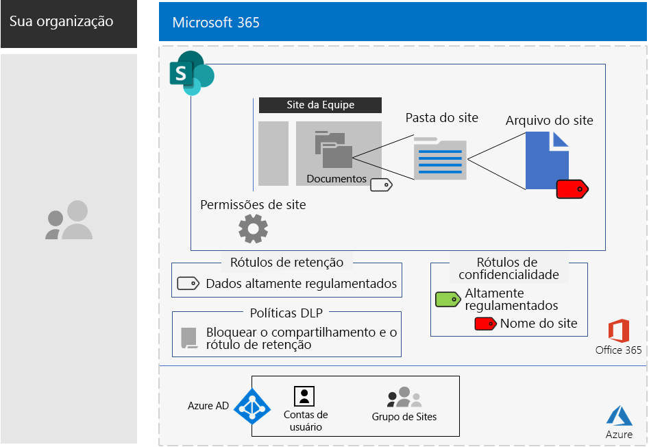

# Sites do SharePoint para dados altamente regulamentados

*Este cenário aplica-se às versões E3 e E5 do Microsoft 365 Enterprise*

O Microsoft 365 Enterprise inclui um pacote completo de serviços baseados em nuvem, para que você possa criar, armazenar e proteger seus dados altamente regulamentados armazenados em arquivos. Isso inclui dados que são:

- Sujeitos a regulamentações regionais.
- Mais importantes de sua organização, como segredos comerciais, financeiros ou informações de recursos humanos e estratégias da organização.

Um cenário da Microsoft 365 Enterprise baseada na nuvem, que atende a essa necessidade comercial, requer que você:

- Armazene arquivos (documentos, apresentações de slides, planilhas, etc.) em um site de equipe do SharePoint.
- Bloqueie o site para impedir:
  - Acesso a usuários que não são membros do grupo do Office 365 para o site.
  - Que membros do site concedam acesso a outras pessoas.
  - Que aqueles que não sejam membros do site solicitem acesso a ele.
- Configure um rótulo de retenção do Office 365 para seus sites do SharePoint como uma maneira padrão de impedir que os usuários enviem arquivos fora da organização.
- Criptografe os arquivos mais confidenciais do site com criptografia que acompanha o arquivo.
- Adicione permissões aos arquivos mais confidenciais para que, mesmo que sejam compartilhados fora do site, a abertura do arquivo ainda exija as credenciais válidas de uma conta de usuário que tenha a permissão.

A tabela a seguir mapeia os requisitos desse cenário para um recurso do Microsoft 365 Enterprise.

|||
|:-------|:-----|
| **Requisito** | **Recurso do Microsoft 365 Enterprise** |
| Armazenar arquivos  | Sites de equipe do SharePoint |
| Bloquear o site | Grupos do Azure Active Directory (Azure AD) e permissões de site de equipe do SharePoint |
| Rotular os arquivos do site | Rótulos de retenção do Office 365 |
| Bloquear usuários ao enviar arquivos para fora da organização. | Políticas de Prevenção Contra Perda de Dados (DLP) no Office 365 |
| Criptografar todos os arquivos do site | Sub-rótulos de confidencialidade do Office 365 |
| Adicionar permissões aos arquivos do site | Sub-rótulos de confidencialidade do Office 365 |
|||

Estas são as configurações para um site do SharePoint seguro.

Este cenário exige que você já tenha implantado:

- A fase de [identidade](identity-infrastructure.md) e as etapas 1 e 2 da fase de [proteção de informações](infoprotect-infrastructure.md) da infraestrutura de base. 
- [SharePoint](sharepoint-online-onedrive-workload.md).

As fases a seguir o ajudarão a projetar, configurar e direcionar a adoção de sites do SharePoint para dados altamente regulamentados.

Para ver como a Contoso Corporation, uma organização multinacional fictícia, porém representativa, projetou um site do SharePoint para suas equipes de pesquisa, confira esta [configuração de exemplo](contoso-sharepoint-online-site-for-highly-confidential-assets.md).

## Pré-requisitos de acesso ao dispositivo e identidade

Para proteger o acesso ao site do SharePoint, assegure-se de ter configurado [políticas de identidade e de acesso ao dispositivo](identity-access-policies.md) e as [políticas de acesso recomendadas do SharePoint](sharepoint-file-access-policies.md).

## Fase 1: Design

Para criar um site do SharePoint para dados altamente regulamentados, você deve primeiro identificar sua finalidade. Por exemplo, o departamento de pesquisa e desenvolvimento de uma organização de manufatura precisa de um site do SharePoint para armazenar especificações de design atuais de produtos existentes e um local para colaborar em novos produtos. Somente os membros do departamento de Pesquisa e Desenvolvimento e os executivos selecionados terão permissão para acessar o site.

Essa finalidade gerará a determinação de itens essenciais de configuração como:

- O rótulo de retenção do Office 365 para atribuir à parte Documentos do site e às políticas de DLP para o rótulo
- As configurações de um sub-rótulo de confidencialidade do Office 365 que os usuários aplicam a arquivos altamente confidenciais armazenados no site

Quando determinado, você usa essas configurações para configurar o site na Fase 2. 

### Etapa 1 rótulos de retenção do Office 365 e políticas DLP

Quando aplicada à parte de Documentos de um site de equipe do SharePoint, os rótulos de retenção do Office 365 fornecem um método padrão de classificação de todos os arquivos armazenados no site.
 
Nos sites do SharePoint para dados altamente controlados, você precisa determinar qual rótulo de retenção do Office 365 será usado.

Para considerações de design dos rótulos do Office 365, consulte [Rótulos e classificação do Office 365](https://docs.microsoft.com/office365/securitycompliance/secure-sharepoint-online-sites-and-files#office-365-retention-labels).

Para proteger informações confidenciais e evitar a divulgação acidental ou intencional, use as políticas DLP. Para obter mais informações, consulte esta [visão geral](https://docs.microsoft.com/office365/securitycompliance/data-loss-prevention-policies).

Para sites do SharePoint, você deve configurar uma política DLP do rótulo de retenção do Office 365 atribuído ao site para bloquear usuários quando eles tentam compartilhar arquivos com usuários externos. 

### Etapa 2: Sub-rótulo de confidencialidade do Office 365

Para fornecer criptografia e um conjunto de permissões para seus arquivos mais confidenciais, os usuários devem aplicar um sub-rótulo de confidencialidade do Office 365.

Existe uma sub-rótulo em um rótulo existente. Por exemplo, você pode criar um sub-rótulo de Pesquisa e Desenvolvimento no rótulo Altamente Regulamentado. Para sites do SharePoint para dados altamente regulamentados, configure as permissões para que somente os membros do site possam abrir e alterar o arquivo ao qual o sub-rótulo está anexado.

As configurações do sub-rótulo aplicado acompanham o arquivo. Mesmo que ele tenha sido vazado fora do site, somente as contas de usuário autenticado que têm permissões poderão abri-lo.

### Resultados de design

Você determinou o seguinte:

- O rótulo de retenção apropriado do Office 365 e a política DLP que está associada ao rótulo
- As configurações do sub-rótulo de confidencialidade do Office 365 que inclui criptografia e permissões

## Fase 2: Configurar

Nesta fase, você usa as configurações determinadas na Fase 1 e as implementa para criar um site do SharePoint para dados altamente regulamentados.

### Etapa 1: Criar um site de equipe do SharePoint privado com proprietários e membros do grupo do Office 365 correspondente

Siga [essas instruções]( https://support.office.com/article/create-a-site-in-sharepoint-online-4d1e11bf-8ddc-499d-b889-2b48d10b1ce8) para criar um site de equipe do SharePoint privado.

### Etapa 2: Configurar permissões adicionais para o site de equipe do SharePoint

No site do SharePoint, defina estas configurações de permissão.

1.  Na barra de ferramentas, clique no ícone Configurações e, em seguida, clique em **Permissões do site**.
2.  No painel **Permissões do site**, clique em **Configurações de permissões avançadas**.
3.  Na nova guia **Permissões** do navegador, clique em **Configurações de Solicitação de Acesso**.
4.  Na caixa de diálogo **Configurações de Solicitações de Acesso**, desmarque **Permitir que os membros compartilhem o site e arquivos e pastas individuais** e **Permitir solicitações de acesso** (para que todas as três caixas de seleção sejam desmarcadas) e, depois, clique em **OK**.

Com essas configurações, a capacidade de membros do grupo de sites compartilharem o site com outros membros ou de não membros solicitarem acesso ao site é desativada.

### Etapa 3: Configurar o site para um rótulo de retenção do Office 365

Use as instruções em [Proteger arquivos do SharePoint com rótulos do Office 365 e DLP](https://docs.microsoft.com/office365/enterprise/protect-sharepoint-online-files-with-office-365-labels-and-dlp) para:

1. Crie e publique um rótulo de retenção para dados altamente regulamentados (se necessário).
2. Configure o site para o rótulo de retenção criado na etapa 1.
3. Crie uma política DLP para dados altamente regulamentados que usam o rótulo de retenção criado na etapa 2 e impede que os usuários enviem arquivos fora da organização

#### Etapa 4: Criar um sub-rótulo de confidencialidade do Office 365 para o site

Ao contrário de um rótulo de confidencialidade para dados altamente regulamentados que qualquer pessoa pode aplicar a qualquer arquivo, um site seguro precisa de seu próprio sub-rótulo, para que os arquivos com o sub-rótulo atribuído:

- São criptografadas e a criptografia acompanha o arquivo.
-   Contenham permissões personalizadas para que somente os membros do grupo de sites possam abri-lo.

Para atingir esse nível adicional de segurança para os arquivos armazenados no site, você deve configurar um novo rótulo de confidencialidade, que é um sub-rótulo do rótulo geral para arquivos altamente regulamentados. Somente os membros do grupo do site poderão vê-lo na lista de sub-rótulos do rótulo altamente regulamentado.

Use as instruções [aqui](https://docs.microsoft.com/microsoft-365/compliance/encryption-sensitivity-labels) para configurar um sub-rótulo da etiqueta que você está usando para arquivos altamente regulamentados com as seguintes configurações:

- O nome do sub-rótulo contém o nome do site para facilitar a associação ao atribuir o sub-rótulo a um arquivo.
- A criptografia está ativada.
- O grupo de sites tem permissões de Coautoria.

### Resultados da configuração

Você configurou o seguinte:

- Configurações de permissão mais restritivas no site do SharePoint
- Um rótulo de retenção do Office 365 atribuído à parte de Documentos do site do SharePoint
- Uma política DLP para o rótulo de retenção do Office 365
- Um sub-rótulo de confidencialidade do Office 365 que os usuários podem aplicar aos arquivos mais confidenciais armazenados no site que criptografa o arquivo e permite apenas o acesso de Coautor aos membros do grupo de sites da equipe 

Esta é a configuração resultante.

Este é um exemplo de um usuário que aplicou o sub-rótulo de confidencialidade a um arquivo armazenado no site.

## Fase 3: Gerar adoção do usuário

Um site do SharePoint para dados altamente regulamentados só poderá proteger os dados se for usado de maneira consistente para o armazenamento e o acesso a arquivos confidenciais. Esta é a fase mais difícil porque depende dos usuários de mudar seus hábitos e preferências. 

Por exemplo, os funcionários que estão acostumados a armazenar arquivos confidenciais em unidades USB ou em soluções de armazenamento pessoal baseadas em nuvem agora precisam armazená-los exclusivamente em um site do SharePoint para obter dados altamente regulamentados.

### Etapa 1: treinar os usuários

Depois de concluir a configuração, treine o conjunto de usuários que são membros dos grupos de acesso do site:

- Sobre a importância de usar o novo site para proteger arquivos valiosos e as consequências de um vazamento de dados altamente regulamentados, como ramificações legais, multas regulatórias, ransomware ou perda de vantagem competitiva.
- Como acessar o site e seus arquivos.
- Como criar novos arquivos no site e carregar novos arquivos armazenados localmente.
- Como a política DLP bloqueia o compartilhamento de arquivos externamente por parte do usuário.
- Como rotular os arquivos mais confidenciais com o sub-rótulo para o site.
- Como o sub-rótulo protege um arquivo, mesmo quando vazado do site.

Este treinamento deve incluir exercícios práticos para que os usuários possam experimentar essas operações e os resultados.

### Etapa 2: conduzir análises periódicas de utilização e arquivos

Nas semanas após o treinamento, o administrador do SharePoint para o site do SharePoint pode:

- Analisar o uso do site e compará-lo a expectativas de uso.
- Verificar se os arquivos altamente confidenciais foram rotulados corretamente com o sub-rótulo de confidencialidade.

Repita o treinamento dos usuários conforme necessário.

### Resultados de adoção do usuário

Os arquivos altamente regulamentados são armazenados exclusivamente em sites do SharePoint para dados altamente regulamentados e os arquivos mais confidenciais têm o sub-rótulo de confidencialidade para o site aplicado.

## Como a Contoso Corporation implantou o Microsoft 365 Enterprise

Contoso Corporation é uma corporação fictícia mas representante global do conglomerado de produção com sede em Paris, França. Veja como Contoso projetou, configurou e, em seguida, orientou a adoção de um [site do SharePoint seguro](contoso-sharepoint-online-site-for-highly-confidential-assets.md) para suas equipes de pesquisa em Paris, Moscou, Nova York, Pequim e Bengaluru (Bangalore). 

## Confira também

[Guia de implantação](deploy-microsoft-365-enterprise.md)

[Guias de laboratório de teste](m365-enterprise-test-lab-guides.md)

