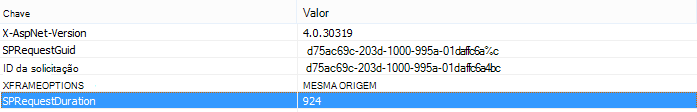
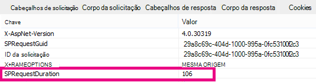

# Usar a Web Part de Pesquisa de Conteúdo em vez de Web Part de Consulta de Conteúdo para melhorar o desempenho no SharePoint Online

Este artigo descreve como aumentar o desempenho substituindo a Web Part de Consulta de Conteúdo pela Web Part de Pesquisa de Conteúdo no SharePoint Server 2013 e SharePoint Online.
  
Um dos novos recursos mais avançados do SharePoint Server 2013 e SharePoint Online é a Web Part de Pesquisa de Conteúdo (CSWP). Esta Web Part usa o índice de pesquisa para recuperar rapidamente os resultados que são mostrados ao usuário. Use a Web Part de Pesquisa de Conteúdo em vez da Web Part de Consulta de Conteúdo (CQWP) em suas páginas para melhorar o desempenho de seus usuários.
  
Usar uma Web Part de Pesquisa de Conteúdo em uma Web Part de Consulta de Conteúdo quase sempre resultará em um desempenho de carga de página significativamente melhor no SharePoint Online. Há um pouco de configuração adicional para obter a consulta correta, mas as recompensas são um desempenho aprimorado e usuários mais felizes.
  
## Comparando o ganho de desempenho que você obter com o uso da Web Part de Pesquisa de Conteúdo em vez de Web Part de Consulta de Conteúdo

Os exemplos a seguir mostram os ganhos relativos de desempenho que você pode receber ao usar uma Web Part de Pesquisa de Conteúdo em vez de uma Web Part de Consulta de Conteúdo. Os efeitos são mais óbvios com uma estrutura de site complexa e consultas de conteúdo muito amplas.
  
Este site de exemplo tem as seguintes características:
  
- 8 níveis de subsites.
    
- Lista usando um tipo de conteúdo "frutas" personalizado.
    
- Na Web Part, a consulta de conteúdo é ampla, retornando todos os itens com o tipo de conteúdo de "frutas".
    
- O exemplo usa apenas 50 itens entre os 8 sites. Os efeitos serão ainda mais pronunciados para sites com mais conteúdo.
    
Aqui está uma captura de tela dos resultados da Web Part de Consulta de Conteúdo.
  

  
No Internet Explorer, use a **guia Rede** das ferramentas de desenvolvedor F12 para ver os detalhes do header de resposta. Na captura de tela a seguir, o valor do **SPRequestDuration** para esta carga de página é de 924 milissegundos. 
  

  
 **SPRequestDuration** indica a quantidade de trabalho que é feita no servidor para preparar a página. Alternar conteúdo por consulta Web Parts conteúdo por pesquisa Web Parts reduz drasticamente o tempo necessário para renderizar a página. Por outro lado, uma página com uma Web Part de Pesquisa de Conteúdo equivalente, retornando o mesmo número de resultados tem um **valor SPRequestDuration** de 106 milissegundos, conforme mostrado nesta captura de tela: 
  

  
## Adicionar uma Web Part de Pesquisa de Conteúdo no SharePoint Online

Adicionar uma Web Part de Pesquisa de Conteúdo é muito semelhante a uma Web Part de Consulta de Conteúdo regular. Consulte a seção *"Adicionar uma Web Part de Pesquisa de Conteúdo"* em [Configurar uma Web Part](https://support.office.com/article/Configure-a-Content-Search-Web-Part-in-SharePoint-0dc16de1-dbe4-462b-babb-bf8338c36c9a)de Pesquisa de Conteúdo em SharePoint .
  
## Criando a consulta de pesquisa correta para sua Web Part de Pesquisa de Conteúdo

Depois de adicionar uma Web Part de Pesquisa de Conteúdo, você pode refinar a pesquisa e retornar os itens que deseja. Para obter instruções detalhadas sobre como fazer isso, consulte a seção "Exibir conteúdo configurando uma consulta avançada em uma Web Part de Pesquisa de *Conteúdo"* em Configure a Content [Search Web Part in SharePoint](https://support.office.com/article/Configure-a-Content-Search-Web-Part-in-SharePoint-0dc16de1-dbe4-462b-babb-bf8338c36c9a).
  
## Ferramenta de teste e criação de consultas

Para uma ferramenta para criar e testar consultas complexas, consulte a [Ferramenta de Consulta de Pesquisa](https://sp2013searchtool.codeplex.com/) no Codeplex. 
  

