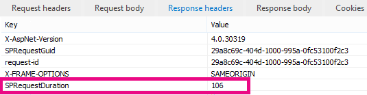

# Usando a Web Part de pesquisa de conteúdo em vez da Web Part de consulta de conteúdo para melhorar o desempenho no SharePoint OnlineUsing Content Search Web Part instead of Content Query Web Part to improve performance in SharePoint Online

Este artigo descreve como aumentar o desempenho substituindo a Web Part de consulta de conteúdo pela Web Part de pesquisa de conteúdo no SharePoint Server 2013 e no SharePoint Online.This article describes how to increase performance by replacing the Content Query Web Part with the Content Search Web Part in SharePoint Server 2013 and SharePoint Online.
  
Um dos novos recursos mais poderosos do SharePoint Server 2013 e do SharePoint Online é a Web Part de pesquisa de conteúdo (CSWP).One of the most powerful new features of SharePoint Server 2013 and SharePoint Online is the Content Search Web Part (CSWP). Esta Web Part usa o índice de pesquisa para recuperar rapidamente os resultados mostrados para o usuário.This Web Part uses the search index to quickly retrieve results which are shown to the user. Use a Web Part de pesquisa de conteúdo em vez da Web Part de consulta de conteúdo (CQWP) em suas páginas para melhorar o desempenho de seus usuários.Use the Content Search Web Part instead of the Content Query Web Part (CQWP) in your pages to improve performance for your users.
  
Usar uma Web Part de pesquisa de conteúdo em uma Web Part de consulta de conteúdo quase sempre resultará em um desempenho de carregamento de página significativamente melhor no SharePoint Online.Using a Content Search Web Part over a Content Query Web Part will almost always result in significantly better page load performance on SharePoint Online. Há uma pequena configuração adicional para obter a consulta certa, mas os prêmios têm desempenho aprimorado e mais feliz usuários.There is a little additional configuration to get the right query, but the rewards are improved performance and happier users.
  
## Comparando o ganho de desempenho obtido usando a Web Part de pesquisa de conteúdo em vez da Web Part de consulta de conteúdoComparing the performance gain you get from using Content Search Web Part instead of Content Query Web Part

Os exemplos a seguir mostram os ganhos de desempenho relativos que você pode receber ao usar uma Web Part de pesquisa de conteúdo em vez de uma Web Part de consulta de conteúdo.The following examples show the relative performance gains you may receive when you use a Content Search Web Part instead of a Content Query Web Part. Os efeitos são mais óbvios com uma estrutura de site complexa e consultas de conteúdo muito abrangentes.The effects are more obvious with a complex site structure and very broad content queries.
  
Este exemplo de site tem as seguintes características:This example site has the following characteristics:
  
- 8 níveis de subsites.8 levels of subsites.
    
- Listas que usam um tipo de conteúdo "fruta" personalizado.Lists using a custom "fruit" content type.
    
- Na Web Part, a consulta de conteúdo é ampla, retornando todos os itens com o tipo de conteúdo "fruta".In the Web Part, the content query is broad, returning all items with the content type of "fruit".
    
- O exemplo usa apenas 50 itens nos 8 sites.The example only uses 50 items across the 8 sites. Os efeitos serão ainda mais pronunciados para sites com mais conteúdo.The effects will be even more pronounced for sites with more content.
    
Veja a seguir uma captura de tela dos resultados da Web Part de consulta de conteúdo.Here is a screen shot of the results of the Content Query Web Part.
  

  
No Internet Explorer, use a guia **rede** das ferramentas de desenvolvedor F12 para examinar os detalhes do cabeçalho da resposta.In Internet Explorer, use the **Network** tab of the F12 developer tools to look at the details for the response header. Na captura de tela a seguir, o valor de **SPRequestDuration** para esta carga de página é de 924 milissegundos.In the following screen shot, the value for the **SPRequestDuration** for this page load is 924 milliseconds. 
  

  
 **SPRequestDuration** indica a quantidade de trabalho feito no servidor para preparar a página.**SPRequestDuration** indicates the amount of work that is done on the server to prepare the page. Alternar conteúdo por Web Parts de consulta com conteúdo por Web Parts de pesquisa reduz drasticamente o tempo que leva para renderizar a página.Switching Content by Query Web Parts with Content by Search Web Parts dramatically reduces the time it takes to render the page. Por outro lado, uma página com uma Web Part de pesquisa de conteúdo equivalente, retornando o mesmo número de resultados tem um valor de **SPRequestDuration** de 106 milissegundos, conforme mostrado nesta captura de tela:By contrast, a page with an equivalent Content Search Web Part, returning the same number of results has an **SPRequestDuration** value of 106 milliseconds as shown in this screen shot: 
  

  
## Adicionando uma Web Part de pesquisa de conteúdo no SharePoint OnlineAdding a Content Search Web Part in SharePoint Online

A adição de uma Web Part de pesquisa de conteúdo é muito semelhante a uma Web Part de consulta de conteúdo normal.Adding a Content Search Web Part is very similar to a regular Content Query Web Part. Consulte a seção  *"adicionar uma Web Part de pesquisa de conteúdo"*  em [Configurar uma Web Part de pesquisa de conteúdo no SharePoint](https://support.office.com/article/Configure-a-Content-Search-Web-Part-in-SharePoint-0dc16de1-dbe4-462b-babb-bf8338c36c9a).See the section  *"Add a Content Search Web Part"*  in [Configure a Content Search Web Part in SharePoint](https://support.office.com/article/Configure-a-Content-Search-Web-Part-in-SharePoint-0dc16de1-dbe4-462b-babb-bf8338c36c9a).
  
## Criando a consulta de pesquisa certa para a Web Part de pesquisa de conteúdoCreating the right search query for your Content Search Web Part

Depois de adicionar uma Web Part de pesquisa de conteúdo, você pode refinar a pesquisa e retornar os itens desejados.Once you have added a Content Search Web Part, you can refine the search and return the items you want. Para obter instruções detalhadas sobre como fazer isso, confira a seção  *"exibir conteúdo Configurando uma consulta avançada em uma Web Part de pesquisa de conteúdo"*  em [Configurar uma Web Part de pesquisa de conteúdo no SharePoint](https://support.office.com/article/Configure-a-Content-Search-Web-Part-in-SharePoint-0dc16de1-dbe4-462b-babb-bf8338c36c9a).For detailed instructions on how to do this, see the section,  *"Display content by configuring an advanced query in a Content Search Web Part"*  in [Configure a Content Search Web Part in SharePoint](https://support.office.com/article/Configure-a-Content-Search-Web-Part-in-SharePoint-0dc16de1-dbe4-462b-babb-bf8338c36c9a).
  
## Ferramenta de criação e teste de consultaQuery building and testing tool

Para uma ferramenta para compilar e testar consultas complexas, consulte a [ferramenta de consulta de pesquisa](https://sp2013searchtool.codeplex.com/) no CodePlex.For a tool to build and test complex queries, see the [Search Query Tool](https://sp2013searchtool.codeplex.com/) on Codeplex. 
  

