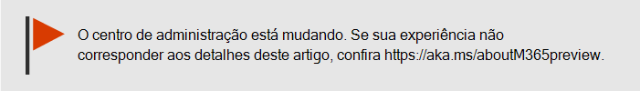

# Como verificar a saúde do serviço do Microsoft 365

Você pode exibir a saúde do seu serviços Microsoft, incluindo Office na Web, Yammer, Microsoft Dynamics CRM e serviços de nuvem de  gerenciamento de dispositivos móveis, na página Saúde do serviço no centro de administração do [Microsoft 365](https://go.microsoft.com/fwlink/p/?linkid=2024339). Se tiver problemas com um serviço em nuvem, poderá verificar a integridade do serviço para determinar se é um problema conhecido com uma resolução em andamento, antes de chamar o suporte ou perder tempo na solução de problemas.

Se você não conseguir entrar no centro de administração, poderá usar a página [de status](https://status.office365.com) do serviço para verificar se há problemas conhecidos que impedem que você faça logon em seu locatário.  Inscreva-se também para nos [acompanhar](https://twitter.com/MSFT365Status) @MSFT365status no Twitter para ver informações sobre determinados eventos.

## Como verificar a integridade do serviço

1. Vá para o Microsoft 365 de administração [https://admin.microsoft.com](https://go.microsoft.com/fwlink/p/?linkid=2024339) em , e entre com uma conta de administrador.

    > [!NOTE]
    > As pessoas que são atribuídas à função de administrador global ou de suporte ao serviço podem exibir a saúde do serviço. Para permitir que os administradores do Exchange, SharePoint e Skype for Business visualizem a integridade do serviço, eles também devem receber a função de administrador do serviço. Para obter mais informações sobre funções que podem exibir a saúde do serviço, consulte [Sobre funções de administrador](../admin/add-users/about-admin-roles.md?preserve-view=true&view=o365-worldwide#commonly-used-microsoft-365-admin-center-roles).

2. Se você não estiver usando o novo centro de administração, na home **page,** selecione a opção **Experimentar** o novo centro de administração no canto superior direito.

3. Para exibir a saúde do serviço, no centro de administração, acesse Health Service health , ou selecione o cartão de saúde do serviço  >  no **painel 1.**  O cartão de painel indica se há um problema de serviço ativo e links para a página de saúde **do Serviço** detalhada.

4. Na página **Saúde do** serviço, o estado de saúde de cada serviço de nuvem é mostrado em um formato de tabela.

   

A **guia Todos os** serviços (o modo de exibição padrão) mostra todos os serviços e seu estado de saúde atual. Um ícone e a **coluna Status** indicam o estado de cada serviço.

Para filtrar sua exibição para serviços que estão enfrentando um incidente, selecione a guia **Incidentes** na parte superior da página. Selecionar a **guia Avisos** mostrará apenas os serviços que atualmente têm uma consultoria postada.

A **guia Histórico** mostra o histórico de incidentes e avisos que foram resolvidos.

Se você estiver enfrentando um problema com um serviço de Microsoft 365 e não  o vir listado na página de saúde do serviço, conte-nos sobre ele selecionando Relatar um problema **e** concluindo o formulário curto. Vamos ver os dados e relatórios relacionados de outras organizações para ver a generalização do problema e se ele se originou com nosso serviço. Se tiver feito isso, vamos adicioná-lo como  um novo incidente ou aviso na página de saúde do Serviço, onde você pode acompanhar sua resolução. Se você não vê-lo aparecer na lista em cerca de 30 minutos, considere entrar em contato com o suporte para resolver o problema.

Para personalizar sua exibição de quais serviços são mostrados no painel, selecione Preferências Exibição personalizada e **desempaxe** as caixas de seleção dos serviços que você deseja filtrar para fora do seu painel de saúde  >  do serviço. Verifique se a caixa de seleção está selecionada para cada serviço que você deseja monitorar.

Para se inscrever nas notificações por email de novos incidentes que afetam o locatário e as alterações de status de um incidente ativo, selecione **Preferências** Email , clique em  >   **Enviar-me** notificações de pagões de serviço no email e especifique:

- Até dois endereços de email.
- Se você deseja notificações para incidentes ou avisos
- Os serviços para os quais você deseja notificação

> [!NOTE]
> Cada administrador pode ter suas Preferências definidas e o limite acima de dois endereços de email é por conta de administrador.

> [!TIP]
> Você também pode usar o aplicativo [Microsoft 365 administrador](https://go.microsoft.com/fwlink/p/?linkid=627216) em seu dispositivo móvel para exibir a saúde do serviço, que é uma ótima maneira de se manter atualizado com notificações por push.

### Exibir detalhes da integridade do serviço postado

Na **exibição Todos os serviços,** selecionar o status do serviço abrirá uma exibição resumida de avisos ou incidentes.

O resumo do aviso ou incidente fornece as seguintes informações:

- **Título** - Um resumo do problema.
- **Serviço** - O nome do serviço afetado.
- **ID** - Um identificador numérico para o problema.
- **Status** - Como esse problema afeta o serviço.
- **Hora de início** - A hora em que o problema começou.
- **Última atualização** - A última vez em que a mensagem de saúde do serviço foi atualizada. Postamos mensagens frequentes para que você saiba o progresso que estamos fazendo na aplicação de uma solução.

Selecione o título do problema para ver a página de detalhes  do problema, que mostra mais informações sobre o problema, incluindo o histórico de todas as mensagens postadas enquanto trabalhamos em uma solução.

### Traduzir dados da integridade do serviço

Como as explicações de integridade do serviço são postadas em tempo real, elas não são traduzidas automaticamente para o seu idioma, e os detalhes de um evento de serviço estão apenas em inglês. Para traduzir a explicação, siga estas etapas:

1. Acesse [Tradutor](https://www.bing.com/translator/).

2. Na página **Integridade do Serviço**, selecione um incidente ou aviso. Em **Mostrar Detalhes**, copie o texto sobre o problema.

3. No Tradutor, cole o texto e escolha **Traduzir**.

### Definições

Na maioria das vezes, os serviços aparecerão como saudáveis sem mais informações. Quando um serviço está com um problema, ele é identificado como um aviso ou um incidente e mostra um status atual.

> [!TIP]
> Os eventos de manutenção planejados não são exibidos na integridade do serviço. Você pode acompanhar os eventos de manutenção planejados atualizando-se com o **Centro de Mensagens**. Filtre para mensagens categorizadas como Preparar-se para a mudança para descobrir quando a mudança acontecerá, seu efeito e como se preparar para isso. Consulte [Central de mensagens em Microsoft 365](https://support.office.com/article/38fb3333-bfcc-4340-a37b-deda509c2093) para obter mais detalhes.

### Incidentes e avisos

| Ícone | Descrição |
|:-----|:-----|
||Quando um serviço exibe um aviso, estamos cientes de um problema que está afetando alguns usuários, mas o serviço ainda está disponível. Em um aviso, muitas vezes há uma solução para o problema, e o problema pode ser intermitente ou ter alcance e impacto limitados no usuário.    |
||Quando um serviço exibe um incidente ativo, esse é um problema crítico, e o serviço ou uma função principal do serviço está indisponível. Por exemplo, os usuários podem não conseguir enviar e receber emails, ou não é possível entrar. Os incidentes terão um impacto perceptível nos usuários. Quando há um incidente em andamento, fornecemos atualizações sobre a investigação, os esforços de atenuação e a confirmação de resolução no painel de Integridade do serviço.    |

### Definições de status

| Status | Definição |
|:-----|:-----|
|**Investigando** | Estamos cientes de um possível problema e reunindo mais informações sobre o que está acontecendo e o escopo de impacto. |
|**Degradação do serviço** | Confirmamos que existe um problema que pode afetar o uso de um serviço ou recurso. Talvez você veja esse status se um serviço apresentar um desempenho mais lento do que o normal, se houver interrupções intermitentes ou se um recurso não estiver funcionando, por exemplo. |
|**Interrupção do serviço** | Você verá esse status se determinarmos que um problema afeta a capacidade dos usuários de acessar o serviço. Neste caso, a questão é significativa e pode ser reproduzida de forma consistente. |
|**Restaurando o serviço** | A causa do problema foi identificada, sabemos quais ações corretivas devem ser tomadas e estamos no processo de retomar o estado de integridade do serviço. |
|**Recuperação estendida** | Esse status indica que uma ação corretiva está em andamento para restaurar o serviço para a maioria dos usuários, mas levará algum tempo para alcançar todos os sistemas afetados. Você também poderá ver esse status se tivermos feito uma correção temporária para reduzir o impacto enquanto aguardamos para aplicar uma correção permanente. |
|**Investigação suspensa** | Se a nossa investigação detalhada de um problema potencial resultar em uma solicitação de informações adicionais de clientes para nos permitir investigar mais, você verá esse status. Se precisarmos de você para prosseguir, informaremos quais dados ou logs precisamos. |
|**Serviço restaurado** | Confirmamos que a ação corretiva solucionou o problema subjacente, e o serviço foi restaurado para um estado íntegro. Para descobrir o que deu errado, confira os detalhes do problema. |
|**Falso positivo** | Após uma investigação detalhada, confirmamos que o serviço está saudável e funcionando conforme projetado. Nenhum impacto no serviço foi observado ou a causa do incidente originado fora do serviço. |
|**Relatório pós-incidente publicado** | Publicamos um Relatório de Incidentes Post para um problema específico que inclui informações de causa raiz e as próximas etapas para garantir que um problema semelhante não se recidiva. |

### Histórico

A saúde do serviço permite que você veja o status de saúde atual e veja o histórico de quaisquer avisos de serviço e incidentes que afetaram seu locatário nos últimos 30 dias. Para exibir a saúde passada de todos os serviços, selecione **Exibir histórico** na página de detalhes do problema.

Uma lista de todas as mensagens de integridade de serviço postadas no cronograma selecionado é exibida, conforme mostrado abaixo:

Expanda qualquer linha para exibir mais detalhes sobre o problema.

Para obter mais informações sobre nosso compromisso com o tempo de atividade, consulte [Operações transparentes do Microsoft 365](/office365/servicedescriptions/office-365-platform-service-description/service-health-and-continuity).

## Tópicos relacionados

[Relatórios de atividades no Microsoft 365 de administração](https://support.office.com/article/0d6dfb17-8582-4172-a9a9-aed798150263)

[Preferências do Centro de Mensagens](../admin/manage/message-center.md?preserve-view=true&view=o365-worldwide#preferences)

[Como verificar a Windows de versão no Centro de administração](/windows/deployment/update/check-release-health)
