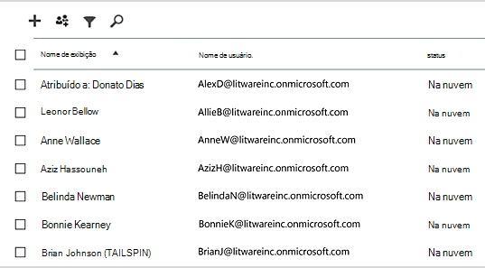
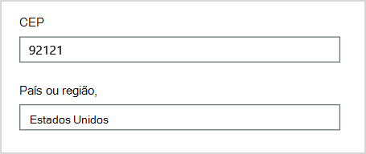

# <a name="why-you-need-to-use-powershell-for-microsoft-365"></a><span data-ttu-id="46f91-103">Por que você precisa usar o PowerShell para Microsoft 365</span><span class="sxs-lookup"><span data-stu-id="46f91-103">Why you need to use PowerShell for Microsoft 365</span></span>

<span data-ttu-id="46f91-104">*Este artigo se aplica tanto ao Microsoft 365 Enterprise quanto ao Office 365 Enterprise.*</span><span class="sxs-lookup"><span data-stu-id="46f91-104">*This article applies to both Microsoft 365 Enterprise and Office 365 Enterprise.*</span></span>

<span data-ttu-id="46f91-105">Com o Centro de administração do Microsoft 365, você pode gerenciar suas contas de usuário e licenças do Microsoft 365.</span><span class="sxs-lookup"><span data-stu-id="46f91-105">With the Microsoft 365 admin center, you can manage your Microsoft 365 user accounts and licenses.</span></span> <span data-ttu-id="46f91-106">Você também pode gerenciar seus serviços do Microsoft 365, como o Exchange Online, o Teams e o SharePoint Online.</span><span class="sxs-lookup"><span data-stu-id="46f91-106">You can also manage your Microsoft 365 services, such as Exchange Online, Teams, and SharePoint Online.</span></span> <span data-ttu-id="46f91-107">Se você usar o PowerShell para gerenciar esses serviços, poderá aproveitar o ambiente de linguagem de linha de comando e script para velocidade, automação e recursos adicionais.</span><span class="sxs-lookup"><span data-stu-id="46f91-107">If you instead use PowerShell to manage these services, you can and take advantage of the command-line and scripting language environment for speed, automation, and additional capabilities.</span></span>
  
<span data-ttu-id="46f91-108">Este artigo mostra como usar o PowerShell para gerenciar o Microsoft 365 para:</span><span class="sxs-lookup"><span data-stu-id="46f91-108">This article shows how to use PowerShell to manage Microsoft 365 to:</span></span>
  
- <span data-ttu-id="46f91-109">Revelar informações adicionais que você não pode ver no Centro de administração do Microsoft 365</span><span class="sxs-lookup"><span data-stu-id="46f91-109">Reveal additional information that you can't see in the Microsoft 365 admin center</span></span>
    
- <span data-ttu-id="46f91-110">Configurar recursos e configurações só é possível com o PowerShell</span><span class="sxs-lookup"><span data-stu-id="46f91-110">Configure features and settings only possible with PowerShell</span></span>
    
- <span data-ttu-id="46f91-111">Fazer operações em massa</span><span class="sxs-lookup"><span data-stu-id="46f91-111">Do bulk operations</span></span>
    
- <span data-ttu-id="46f91-112">Filtrar dados</span><span class="sxs-lookup"><span data-stu-id="46f91-112">Filter data</span></span>
    
- <span data-ttu-id="46f91-113">Imprimir ou salvar dados</span><span class="sxs-lookup"><span data-stu-id="46f91-113">Print or save data</span></span>
    
- <span data-ttu-id="46f91-114">Gerenciar entre serviços</span><span class="sxs-lookup"><span data-stu-id="46f91-114">Manage across services</span></span>
    
<span data-ttu-id="46f91-115">Lembre-se de que o PowerShell para o Microsoft 365 é um conjunto de módulos para Windows PowerShell, que é um ambiente de linha de comando para plataformas e serviços baseados no Windows.</span><span class="sxs-lookup"><span data-stu-id="46f91-115">Keep in mind that PowerShell for Microsoft 365 is a set of modules for Windows PowerShell, which is a command-line environment for Windows-based services and platforms.</span></span> <span data-ttu-id="46f91-116">Esse ambiente cria um idioma de shell de comando que pode ser estendido com módulos adicionais.</span><span class="sxs-lookup"><span data-stu-id="46f91-116">This environment creates a command-shell language that can be extended with additional modules.</span></span> <span data-ttu-id="46f91-117">Ele fornece uma maneira de executar comandos ou scripts simples ou complexos.</span><span class="sxs-lookup"><span data-stu-id="46f91-117">It provides a way to execute simple or complex commands or scripts.</span></span> <span data-ttu-id="46f91-118">Por exemplo, depois de instalar o PowerShell para módulos do Microsoft 365 e se conectar à sua assinatura do Microsoft 365, você pode executar o seguinte comando para listar todas as caixas de correio de usuário para Microsoft Exchange Online:</span><span class="sxs-lookup"><span data-stu-id="46f91-118">For example, after you install the PowerShell for Microsoft 365 modules and connect to your Microsoft 365 subscription, you can run the following command to list all the user mailboxes for Microsoft Exchange Online:</span></span>
  
```powershell
Get-Mailbox
```

<span data-ttu-id="46f91-119">Você também pode obter a lista de caixas de correio usando o Centro de administração do Microsoft 365, mas contar os itens em todas as listas de todos os sites de todos os seus aplicativos Web não é fácil.</span><span class="sxs-lookup"><span data-stu-id="46f91-119">You could also get the list of mailboxes by using the Microsoft 365 admin center but counting the items in all the lists for all the sites for all of your web apps isn't easy.</span></span>
  
<span data-ttu-id="46f91-120">O PowerShell para o Microsoft 365 foi projetado para ajudá-lo a gerenciar o Microsoft 365, não para substituir o centro de administração do Microsoft 365.</span><span class="sxs-lookup"><span data-stu-id="46f91-120">PowerShell for Microsoft 365 is designed to help you manage Microsoft 365, not to replace the Microsoft 365 admin center.</span></span> <span data-ttu-id="46f91-121">Os administradores precisam poder usar o PowerShell para o Microsoft 365 porque existem alguns procedimentos de configuração que só podem ser feitos por meio de comandos do PowerShell para o Microsoft 365.</span><span class="sxs-lookup"><span data-stu-id="46f91-121">Admins need to be able to use PowerShell for Microsoft 365 because there are some configuration procedures that can only be done through PowerShell for Microsoft 365 commands.</span></span> <span data-ttu-id="46f91-122">Para esses casos, você precisa saber como:</span><span class="sxs-lookup"><span data-stu-id="46f91-122">For these cases, you need to know how to:</span></span>
  
- <span data-ttu-id="46f91-123">Instale o PowerShell para módulos do Microsoft 365 (feito apenas uma vez para cada computador administrador).</span><span class="sxs-lookup"><span data-stu-id="46f91-123">Install the PowerShell for Microsoft 365 modules (done only one time for each administrator computer).</span></span>
    
- <span data-ttu-id="46f91-124">Conecte-se à sua assinatura do Microsoft 365 (uma vez para cada sessão do PowerShell).</span><span class="sxs-lookup"><span data-stu-id="46f91-124">Connect to your Microsoft 365 subscription (one time for each PowerShell session).</span></span>
    
- <span data-ttu-id="46f91-125">Reúna as informações necessárias para executar os comandos necessários do PowerShell para o Microsoft 365.</span><span class="sxs-lookup"><span data-stu-id="46f91-125">Gather the information needed to run the required PowerShell for Microsoft 365 commands.</span></span>
    
- <span data-ttu-id="46f91-126">Execute os comandos do PowerShell para o Microsoft 365.</span><span class="sxs-lookup"><span data-stu-id="46f91-126">Run PowerShell for Microsoft 365 commands.</span></span>
    
<span data-ttu-id="46f91-127">Depois de aprender essas habilidades básicas, você não precisa listar seus usuários de caixa de correio usando o **comando Get-Mailbox.**</span><span class="sxs-lookup"><span data-stu-id="46f91-127">After you learn these basic skills, you don't have to list your mailbox users by using the **Get-Mailbox** command.</span></span> <span data-ttu-id="46f91-128">Você também não precisa entender como criar um novo comando, como o comando mencionado anteriormente, para contar todos os itens em todas as listas para todos os sites de todos os seus aplicativos Web.</span><span class="sxs-lookup"><span data-stu-id="46f91-128">You also don't have to understand how to create a new command like the command cited previously to count all the items in all the lists for all the sites for all of your web apps.</span></span> <span data-ttu-id="46f91-129">A Microsoft e a comunidade de administradores podem ajudá-lo com as tarefas necessárias.</span><span class="sxs-lookup"><span data-stu-id="46f91-129">Microsoft and the community of administrators can help you with such tasks as needed.</span></span>
  
## <a name="powershell-for-microsoft-365-can-reveal-information-that-you-cant-see-with-the-microsoft-365-admin-center"></a><span data-ttu-id="46f91-130">O PowerShell para o Microsoft 365 pode revelar informações que você não pode ver com o centro de administração do Microsoft 365</span><span class="sxs-lookup"><span data-stu-id="46f91-130">PowerShell for Microsoft 365 can reveal information that you can't see with the Microsoft 365 admin center</span></span>

<span data-ttu-id="46f91-131">O Centro de administração do Microsoft 365 exibe muitas informações úteis.</span><span class="sxs-lookup"><span data-stu-id="46f91-131">The Microsoft 365 admin center displays many useful information.</span></span> <span data-ttu-id="46f91-132">Mas ele não exibe todas as informações possíveis que o Microsoft 365 armazena sobre usuários, licenças, caixas de correio e sites.</span><span class="sxs-lookup"><span data-stu-id="46f91-132">But it doesn't display all the possible information that Microsoft 365 stores about users, licenses, mailboxes, and sites.</span></span> <span data-ttu-id="46f91-133">Veja um exemplo para usuários *e grupos* no Centro de administração do Microsoft 365:</span><span class="sxs-lookup"><span data-stu-id="46f91-133">Here's an example for *users and groups* in the Microsoft 365 admin center:</span></span>
  

  
<span data-ttu-id="46f91-135">Esta exibição fornece as informações necessárias em muitos casos.</span><span class="sxs-lookup"><span data-stu-id="46f91-135">This view provides the information that you need in many cases.</span></span> <span data-ttu-id="46f91-136">No entanto, há momentos em que você precisa de mais.</span><span class="sxs-lookup"><span data-stu-id="46f91-136">However, there are times when you need more.</span></span> <span data-ttu-id="46f91-137">Por exemplo, o licenciamento do Microsoft 365 (e os recursos do Microsoft 365 disponíveis para um usuário) dependem em parte da localização geográfica do usuário.</span><span class="sxs-lookup"><span data-stu-id="46f91-137">For example, Microsoft 365 licensing (and the Microsoft 365 features available to a user) depends in part on the user's geographic location.</span></span> <span data-ttu-id="46f91-138">As políticas e recursos que você pode estender a um usuário que mora nos Estados Unidos podem não ser os mesmos que os que você pode estender para um usuário na Índia ou bélgica.</span><span class="sxs-lookup"><span data-stu-id="46f91-138">The policies and features that you can extend to a user who lives in the United States might not be the same as those that you can extend to a user in India or Belgium.</span></span> <span data-ttu-id="46f91-139">Siga estas etapas no Centro de administração do Microsoft 365 para determinar a localização geográfica de um usuário:</span><span class="sxs-lookup"><span data-stu-id="46f91-139">Follow these steps in the Microsoft 365 admin center to determine a user's geographic location:</span></span>
  
1. <span data-ttu-id="46f91-140">Clique duas vezes no **Nome de exibição** do usuário.</span><span class="sxs-lookup"><span data-stu-id="46f91-140">Double-click the user's **Display Name**.</span></span>
    
2. <span data-ttu-id="46f91-141">No painel de exibição de propriedades do usuário, selecione **detalhes**.</span><span class="sxs-lookup"><span data-stu-id="46f91-141">In the user properties display pane, select **details**.</span></span>
    
3. <span data-ttu-id="46f91-142">Na exibição de detalhes, selecione **detalhes adicionais**.</span><span class="sxs-lookup"><span data-stu-id="46f91-142">In the details display, select **additional details**.</span></span>
    
4. <span data-ttu-id="46f91-143">Role até encontrar o título **País ou região**:</span><span class="sxs-lookup"><span data-stu-id="46f91-143">Scroll until you find the heading **Country or region**:</span></span>
    
     
  
5. <span data-ttu-id="46f91-145">Escreva o nome de exibição e localização do usuário em um pedaço de papel ou copie e cole no Bloco de notas.</span><span class="sxs-lookup"><span data-stu-id="46f91-145">Write the user's display name and location on a piece of paper, or copy and paste it into Notepad.</span></span>
    
<span data-ttu-id="46f91-146">Você deve repetir este procedimento para cada usuário.</span><span class="sxs-lookup"><span data-stu-id="46f91-146">You must repeat this procedure for each user.</span></span> <span data-ttu-id="46f91-147">Se você tiver muitos usuários, esse processo poderá ser tedioso.</span><span class="sxs-lookup"><span data-stu-id="46f91-147">If you have many users, this process can be tedious.</span></span> <span data-ttu-id="46f91-148">Com o PowerShell para o Microsoft 365, você pode exibir essas informações para todos os seus usuários usando o seguinte comando:</span><span class="sxs-lookup"><span data-stu-id="46f91-148">With PowerShell for Microsoft 365, you can display this information for all of your users by using the following command:</span></span>
  
```powershell
Get-AzureADUser | Select DisplayName, UsageLocation
```


>[!Note]
><span data-ttu-id="46f91-149">O PowerShell Core não dá suporte ao Módulo do Microsoft Azure Active Directory para módulos Windows PowerShell e cmdlets que têm *Msol* em seu nome.</span><span class="sxs-lookup"><span data-stu-id="46f91-149">PowerShell Core doesn't support the Microsoft Azure Active Directory Module for Windows PowerShell module and cmdlets that have *Msol* in their name.</span></span> <span data-ttu-id="46f91-150">Você precisa executar esses cmdlets de Windows PowerShell.</span><span class="sxs-lookup"><span data-stu-id="46f91-150">You have to run these cmdlets from Windows PowerShell.</span></span>
>

<span data-ttu-id="46f91-151">Veja um exemplo dos resultados:</span><span class="sxs-lookup"><span data-stu-id="46f91-151">Here's an example of the results:</span></span>
  
```powershell
DisplayName                               UsageLocation
-----------                               -------------
Bonnie Kearney                            GB
Fabrice Canel                             BR
Brian Johnson (TAILSPIN)                  US
Anne Wallace                              US
Alex Darrow                               US
David Longmuir                            BR
```

<span data-ttu-id="46f91-152">A interpretação deste comando do PowerShell é: Obter todos os usuários na assinatura atual do Microsoft 365 (**Get-AzureADUser**), mas exibir apenas o nome e o local para cada usuário (**Selecione DisplayName, UsageLocation**).</span><span class="sxs-lookup"><span data-stu-id="46f91-152">The interpretation of this PowerShell command is: Get all of the users in the current Microsoft 365 subscription (**Get-AzureADUser**), but only display the name and location for each user (**Select DisplayName, UsageLocation**).</span></span>
  
<span data-ttu-id="46f91-153">Como o PowerShell para o Microsoft 365 oferece suporte a um idioma de shell de comando, você pode manipular ainda mais as informações obtidas pelo comando **Get-AzureADUser.**</span><span class="sxs-lookup"><span data-stu-id="46f91-153">Because PowerShell for Microsoft 365 supports a command-shell language, you can further manipulate the information obtained by the **Get-AzureADUser** command.</span></span> <span data-ttu-id="46f91-154">Por exemplo, talvez você gostaria de classificar esses usuários por sua localização, agrupando todos os usuários brasileiros, todos os usuários dos Estados Unidos e assim por diante.</span><span class="sxs-lookup"><span data-stu-id="46f91-154">For example, maybe you'd like to sort these users by their location, grouping all the Brazilian users together, all the United States users together, and so on.</span></span> <span data-ttu-id="46f91-155">Aqui está o comando:</span><span class="sxs-lookup"><span data-stu-id="46f91-155">Here's the command:</span></span>
  
```powershell
Get-AzureADUser | Select DisplayName, UsageLocation | Sort UsageLocation, DisplayName
```

<span data-ttu-id="46f91-156">Veja um exemplo dos resultados:</span><span class="sxs-lookup"><span data-stu-id="46f91-156">Here's an example of the results:</span></span>
  
```powershell
DisplayName                                 UsageLocation
-----------                                 -------------
David Longmuir                              BR
Fabrice Canel                               BR
Bonnie Kearney                              GB
Alex Darrow                                 US
Anne Wallace                                US
Brian Johnson (TAILSPIN)                    US
```

<span data-ttu-id="46f91-157">A interpretação deste comando do PowerShell é: Obter todos os usuários na assinatura atual do Microsoft 365, mas exibir apenas o nome e o local para cada usuário e classificar primeiro por sua localização e, em seguida, seu nome (**Sort UsageLocation, DisplayName**).</span><span class="sxs-lookup"><span data-stu-id="46f91-157">The interpretation of this PowerShell command is: Get all the users in the current Microsoft 365 subscription, but only display the name and location for each user and sort them first by their location and then their name (**Sort UsageLocation, DisplayName**).</span></span>
  
<span data-ttu-id="46f91-158">Você também pode usar filtragem adicional.</span><span class="sxs-lookup"><span data-stu-id="46f91-158">You can also use additional filtering.</span></span> <span data-ttu-id="46f91-159">Por exemplo, se você quiser ver informações sobre usuários baseados no Brasil, use este comando:</span><span class="sxs-lookup"><span data-stu-id="46f91-159">For example, if you only want to see information about users based in Brazil, use this command:</span></span>
  
```powershell
Get-AzureADUser | Where {$_.UsageLocation -eq "BR"} | Select DisplayName, UsageLocation 
```

<span data-ttu-id="46f91-160">Veja um exemplo dos resultados:</span><span class="sxs-lookup"><span data-stu-id="46f91-160">Here's an example of the results:</span></span>
  
```powershell
DisplayName                                           UsageLocation
-----------                                           -------------
David Longmuir                                        BR
Fabrice Canel                                         BR
```

<span data-ttu-id="46f91-161">A interpretação deste comando do PowerShell é: Obter todos os usuários na assinatura atual do Microsoft 365 cujo local é Brasil (**Onde {$ \_ . UsageLocation -eq "BR"}**) e, em seguida, exibe o nome e o local para cada usuário.</span><span class="sxs-lookup"><span data-stu-id="46f91-161">The interpretation of this PowerShell command is: Get all the users in the current Microsoft 365 subscription whose location is Brazil (**Where {$\_.UsageLocation -eq "BR"}**) and then display the name and location for each user.</span></span>
  
 <span data-ttu-id="46f91-162">**Uma observação sobre domínios grandes**</span><span class="sxs-lookup"><span data-stu-id="46f91-162">**A note about large domains**</span></span>
  
<span data-ttu-id="46f91-163">Se você tiver um domínio grande com dezenas de milhares de usuários, tentar alguns dos exemplos que mostramos neste artigo pode levar à throttling.</span><span class="sxs-lookup"><span data-stu-id="46f91-163">If you have a large domain with tens of thousands of users, trying some of the examples we show in this article could lead to throttling.</span></span> <span data-ttu-id="46f91-164">Com base em fatores como a energia de computação e a largura de banda de rede disponível, você pode estar tentando fazer muito ao mesmo tempo.</span><span class="sxs-lookup"><span data-stu-id="46f91-164">Based on factors like computing power and available network bandwidth, you may be trying to do too much at one time.</span></span> <span data-ttu-id="46f91-165">Grandes organizações podem querer dividir algumas dessas operações do PowerShell em dois comandos.</span><span class="sxs-lookup"><span data-stu-id="46f91-165">Large organizations might want to split some of these PowerShell operations into two commands.</span></span>

<span data-ttu-id="46f91-166">Por exemplo, o comando a seguir retorna todas as contas de usuário e mostra o nome e o local de cada uma delas:</span><span class="sxs-lookup"><span data-stu-id="46f91-166">For example, the following command returns all the user accounts and shows the name and location for each:</span></span>
  
```powershell
Get-AzureADUser | Select DisplayName, UsageLocation
```

<span data-ttu-id="46f91-167">Isso funciona bem com domínios menores.</span><span class="sxs-lookup"><span data-stu-id="46f91-167">That works great for smaller domains.</span></span> <span data-ttu-id="46f91-168">Mas em uma organização grande, talvez você queira dividir essa operação em dois comandos: um comando para armazenar as informações da conta do usuário em uma variável e outro para exibir as informações necessárias.</span><span class="sxs-lookup"><span data-stu-id="46f91-168">But in a large organization, you might want to split that operation into two commands: one command to store the user account information in a variable and another to display the needed information.</span></span> <span data-ttu-id="46f91-169">Exemplo:</span><span class="sxs-lookup"><span data-stu-id="46f91-169">Here's an example:</span></span>
  
```powershell
$x = Get-AzureADUser
$x | Select DisplayName, UsageLocation
```

<span data-ttu-id="46f91-170">A interpretação desse conjunto de comandos do PowerShell é:</span><span class="sxs-lookup"><span data-stu-id="46f91-170">The interpretation of this set of PowerShell commands is:</span></span>
1. <span data-ttu-id="46f91-171">Obter todos os usuários na assinatura atual do Microsoft 365 e armazenar as informações em uma variável chamada $x (**$x = Get-AzureADUser**).</span><span class="sxs-lookup"><span data-stu-id="46f91-171">Get all the users in the current Microsoft 365 subscription and store the information in a variable named $x (**$x = Get-AzureADUser**).</span></span>
1.  <span data-ttu-id="46f91-172">Exibe o conteúdo da variável *$x*, mas inclui apenas o nome e o local para cada usuário (**$x | Selecione DisplayName, UsageLocation**).</span><span class="sxs-lookup"><span data-stu-id="46f91-172">Display the contents of the variable *$x*, but only include the name and location for each user (**$x | Select DisplayName, UsageLocation**).</span></span>
  
## <a name="microsoft-365-has-features-that-you-can-only-configure-with-powershell-for-microsoft-365"></a><span data-ttu-id="46f91-173">O Microsoft 365 tem recursos que você só pode configurar com o PowerShell para o Microsoft 365</span><span class="sxs-lookup"><span data-stu-id="46f91-173">Microsoft 365 has features that you can only configure with PowerShell for Microsoft 365</span></span>

<span data-ttu-id="46f91-174">O Centro de administração do Microsoft 365 destina-se a fornecer acesso a tarefas administrativas comuns e úteis que se aplicam à maioria dos ambientes.</span><span class="sxs-lookup"><span data-stu-id="46f91-174">The Microsoft 365 admin center is intended to provide access to common, useful administrative tasks that apply to most environments.</span></span> <span data-ttu-id="46f91-175">Em outras palavras, o Centro de administração do Microsoft 365 foi projetado para que o administrador típico possa realizar as tarefas de gerenciamento mais comuns.</span><span class="sxs-lookup"><span data-stu-id="46f91-175">In other words, the Microsoft 365 admin center was designed so that the typical administrator can carry out the most-common management tasks.</span></span> <span data-ttu-id="46f91-176">Mas há algumas tarefas que não podem ser feitas no centro de administração.</span><span class="sxs-lookup"><span data-stu-id="46f91-176">But there are some tasks that can't be done in the admin center.</span></span>
  
<span data-ttu-id="46f91-177">Por exemplo, o Centro de administração do Skype for Business Online fornece algumas opções para criar convites de reunião personalizados:</span><span class="sxs-lookup"><span data-stu-id="46f91-177">For example, the Skype for Business Online admin center provides a few options for creating custom meeting invitations:</span></span>
  

  
<span data-ttu-id="46f91-179">Com essas configurações, você pode adicionar um toque de personalização e profissionalismo a convites de reunião.</span><span class="sxs-lookup"><span data-stu-id="46f91-179">With these settings, you can add a touch of personalization and professionalism to meeting invitations.</span></span> <span data-ttu-id="46f91-180">Mas há mais configurações de reunião do que simplesmente criar convites de reunião personalizados.</span><span class="sxs-lookup"><span data-stu-id="46f91-180">But there's more to meeting-configuration settings than simply creating custom meeting invitations.</span></span> <span data-ttu-id="46f91-181">Por exemplo, por padrão, as reuniões permitem:</span><span class="sxs-lookup"><span data-stu-id="46f91-181">For example, by default, meetings allow:</span></span>
  
- <span data-ttu-id="46f91-182">Usuários anônimos obterem entrada automática para cada reunião.</span><span class="sxs-lookup"><span data-stu-id="46f91-182">Anonymous users to gain automatic entrance to each meeting.</span></span>
    
- <span data-ttu-id="46f91-183">Participantes gravem a reunião.</span><span class="sxs-lookup"><span data-stu-id="46f91-183">Attendees to record the meeting.</span></span>
    
- <span data-ttu-id="46f91-184">Todos os usuários da sua organização serem designado como apresentadores quando eles entrarem na reunião.</span><span class="sxs-lookup"><span data-stu-id="46f91-184">All users from your organization to be designated as presenters when they join the meeting.</span></span>
    
<span data-ttu-id="46f91-185">Essas configurações não estão disponíveis no Centro de administração do Skype for Business Online.</span><span class="sxs-lookup"><span data-stu-id="46f91-185">These settings aren't available from the Skype for Business Online admin center.</span></span> <span data-ttu-id="46f91-186">Você pode controlá-los do PowerShell para o Microsoft 365.</span><span class="sxs-lookup"><span data-stu-id="46f91-186">You can control them from PowerShell for Microsoft 365.</span></span> <span data-ttu-id="46f91-187">Aqui está um comando que desabilita essas três configurações:</span><span class="sxs-lookup"><span data-stu-id="46f91-187">Here's a command that disables these three settings:</span></span>
  
```powershell
Set-CsMeetingConfiguration -AdmitAnonymousUsersByDefault $False -AllowConferenceRecording $False -DesignateAsPresenter "None"
```

> [!NOTE]
> <span data-ttu-id="46f91-188">Para executar esse comando, você deve instalar o Módulo do PowerShell do [Skype for Business Online. ](https://www.microsoft.com/download/details.aspx?id=39366)</span><span class="sxs-lookup"><span data-stu-id="46f91-188">To run this command, you must install the [Skype for Business Online PowerShell Module ](https://www.microsoft.com/download/details.aspx?id=39366).</span></span>
  
<span data-ttu-id="46f91-189">A interpretação deste comando do PowerShell é:</span><span class="sxs-lookup"><span data-stu-id="46f91-189">The interpretation of this PowerShell command is:</span></span>
 
1. <span data-ttu-id="46f91-190">Nas configurações para novas reuniões do Skype for Business Online (**Set-CsMeetingConfiguration**), desabilitar permitindo que usuários anônimos obtenham entrada automática em reuniões (**-AdmitAnonymousUsersByDefault $False**).</span><span class="sxs-lookup"><span data-stu-id="46f91-190">In the settings for new Skype for Business Online meetings (**Set-CsMeetingConfiguration**), disable allowing anonymous users to gain automatic entrance to meetings (**-AdmitAnonymousUsersByDefault $False**).</span></span>
2.  <span data-ttu-id="46f91-191">Desabilitar a capacidade de os participantes gravarem reuniões (**-AllowConferenceRecording $False**).</span><span class="sxs-lookup"><span data-stu-id="46f91-191">Disable the ability for attendees to record meetings (**-AllowConferenceRecording $False**).</span></span>
3. <span data-ttu-id="46f91-192">Não designe todos os usuários de sua organização como apresentadores (**-DesignateAsPresenter "None"**).</span><span class="sxs-lookup"><span data-stu-id="46f91-192">Don't designate all users from your organization as presenters (**-DesignateAsPresenter "None"**).</span></span>
  
<span data-ttu-id="46f91-193">Para restaurar essas configurações padrão (habilitar as opções), execute este comando:</span><span class="sxs-lookup"><span data-stu-id="46f91-193">To restore these default settings (enable the options), run this command:</span></span>
  
```powershell
Set-CsMeetingConfiguration -AdmitAnonymousUsersByDefault $True -AllowConferenceRecording $True -DesignateAsPresenter "Company"
```

<span data-ttu-id="46f91-194">Há outros cenários semelhantes também, e é por isso que os administradores devem saber como executar comandos do PowerShell para o Microsoft 365.</span><span class="sxs-lookup"><span data-stu-id="46f91-194">There are other similar scenarios as well, which is why administrators should know how to run PowerShell for Microsoft 365 commands.</span></span>
  
## <a name="powershell-for-microsoft-365-is-great-for-bulk-operations"></a><span data-ttu-id="46f91-195">O PowerShell para o Microsoft 365 é ótimo para operações em massa</span><span class="sxs-lookup"><span data-stu-id="46f91-195">PowerShell for Microsoft 365 is great for bulk operations</span></span>

<span data-ttu-id="46f91-196">Interfaces visuais como o Centro de administração do Microsoft 365 são mais valiosas quando você tem uma única operação a ser realizada.</span><span class="sxs-lookup"><span data-stu-id="46f91-196">Visual interfaces like the Microsoft 365 admin center are most valuable when you have a single operation to do.</span></span> <span data-ttu-id="46f91-197">Por exemplo, se você precisar desabilitar uma conta de usuário, poderá usar o centro de administração para localizar e limpar rapidamente uma caixa de seleção.</span><span class="sxs-lookup"><span data-stu-id="46f91-197">For example, if you need to disable one user account, you can use the admin center to quickly locate and clear a checkbox.</span></span> <span data-ttu-id="46f91-198">Isso pode ser mais fácil do que executar uma operação semelhante no PowerShell.</span><span class="sxs-lookup"><span data-stu-id="46f91-198">This may be easier than performing a similar operation in PowerShell.</span></span>
  
<span data-ttu-id="46f91-199">Mas se você precisar alterar muitas coisas ou algumas coisas selecionadas em um conjunto grande de outras coisas, o Centro de administração do Microsoft 365 pode não ser a melhor ferramenta.</span><span class="sxs-lookup"><span data-stu-id="46f91-199">But if you have to change many things or some selected things within a large set of other things, the Microsoft 365 admin center might not be the best tool.</span></span> <span data-ttu-id="46f91-200">Por exemplo, digamos que você tenha que alterar o prefixo em milhares de números de telefone ou remover o usuário *específico Ken Myer* de todos os sites do SharePoint Online.</span><span class="sxs-lookup"><span data-stu-id="46f91-200">For example, say you have to change the prefix on thousands of phone numbers or remove the specific user *Ken Myer* from all your SharePoint Online sites.</span></span> <span data-ttu-id="46f91-201">Como você faria isso no centro de administração do Microsoft 365?</span><span class="sxs-lookup"><span data-stu-id="46f91-201">How would you do that in the Microsoft 365 admin center?</span></span>
  
<span data-ttu-id="46f91-202">Para o último exemplo, diga que você tem várias centenas de sites do SharePoint Online e não sabe de quais ken Meyer é membro.</span><span class="sxs-lookup"><span data-stu-id="46f91-202">For the last example, say you have several hundred SharePoint Online sites, and you don't know which ones Ken Meyer is a member of.</span></span> <span data-ttu-id="46f91-203">Você teria que começar no Centro de administração do Microsoft 365 e executar este procedimento para cada site:</span><span class="sxs-lookup"><span data-stu-id="46f91-203">You would have to start at the Microsoft 365 admin center and then perform this procedure for each site:</span></span>
  
1. <span data-ttu-id="46f91-204">Selecione a **URL** do site.</span><span class="sxs-lookup"><span data-stu-id="46f91-204">Select the **URL** of the site.</span></span>
    
2. <span data-ttu-id="46f91-205">Na caixa **propriedades do conjunto de sites,** selecione o link Endereço do **Site** para abrir o site.</span><span class="sxs-lookup"><span data-stu-id="46f91-205">In the **site collection properties** box, select the **Web Site Address** link to open the site.</span></span>
    
3. <span data-ttu-id="46f91-206">No site, selecione **Compartilhar**.</span><span class="sxs-lookup"><span data-stu-id="46f91-206">On the site, select **Share**.</span></span>
    
4. <span data-ttu-id="46f91-207">Na caixa **de diálogo** Compartilhar, selecione o link que mostra todos os usuários que têm permissões para o site:</span><span class="sxs-lookup"><span data-stu-id="46f91-207">In the **Share** dialog box, select the link that shows all the users who have permissions to the site:</span></span>
    
     
  
5. <span data-ttu-id="46f91-209">Na caixa **de diálogo Compartilhado com,** selecione **Avançado**.</span><span class="sxs-lookup"><span data-stu-id="46f91-209">In the **Shared With** dialog box, select **Advanced**.</span></span>
    
6. <span data-ttu-id="46f91-210">Role para baixo a lista de usuários, encontre e selecione Ken Myer (supondo que ele tenha permissões para o site) e selecione **Remover Permissões do Usuário**.</span><span class="sxs-lookup"><span data-stu-id="46f91-210">Scroll down the list of users, find and select Ken Myer (assuming he has permissions to the site), and then select **Remove User Permissions**.</span></span>
    
<span data-ttu-id="46f91-211">Isso levaria muito *tempo* para várias centenas de sites.</span><span class="sxs-lookup"><span data-stu-id="46f91-211">This would take a *long* time for several hundred sites.</span></span>
  
<span data-ttu-id="46f91-212">A alternativa é executar o seguinte comando no PowerShell para o Microsoft 365 para remover Ken Myer de todos os seus sites:</span><span class="sxs-lookup"><span data-stu-id="46f91-212">The alternative is to run the following command in PowerShell for Microsoft 365 to remove Ken Myer from all your sites:</span></span>
  
```powershell
Get-SPOSite | ForEach {Remove-SPOUser -Site $_.Url -LoginName "kenmyer@litwareinc.com"}
```

> [!NOTE]
> <span data-ttu-id="46f91-213">Este comando requer que você instale o módulo do PowerShell do [SharePoint Online.](/powershell/sharepoint/sharepoint-online/connect-sharepoint-online?view=sharepoint-ps)</span><span class="sxs-lookup"><span data-stu-id="46f91-213">This command requires that you install the [SharePoint Online PowerShell module](/powershell/sharepoint/sharepoint-online/connect-sharepoint-online?view=sharepoint-ps).</span></span> 
  
<span data-ttu-id="46f91-214">A interpretação deste comando do PowerShell é: Obter todos os sites do SharePoint na assinatura atual do Microsoft 365 (**Get-SPOSite**) e para cada site remover Ken Meyer da lista de usuários que podem acessá-lo (**ForEach {Remove-SPOUser -Site $ \_ . Url -LoginName "kenmyer \@ litwareinc.com"}**).</span><span class="sxs-lookup"><span data-stu-id="46f91-214">The interpretation of this PowerShell command is: Get all of the SharePoint sites in the current Microsoft 365 subscription (**Get-SPOSite**) and for each site remove Ken Meyer from the list of users who can access it (**ForEach {Remove-SPOUser -Site $\_.Url -LoginName "kenmyer\@litwareinc.com"}**).</span></span>
  
<span data-ttu-id="46f91-215">Falamos para o Microsoft 365 remover Ken Meyer de todos os sites, incluindo aqueles aos quais ele não tem acesso.</span><span class="sxs-lookup"><span data-stu-id="46f91-215">We tell Microsoft 365 to remove Ken Meyer from every site, including those that he doesn't have access to.</span></span> <span data-ttu-id="46f91-216">Portanto, os resultados mostrarão erros para os sites aos qual ele não tem acesso.</span><span class="sxs-lookup"><span data-stu-id="46f91-216">So the results will show errors for those sites that he doesn't have access to.</span></span> <span data-ttu-id="46f91-217">Podemos usar uma condição adicional neste comando para remover Ken Meyer somente dos sites que o têm na lista de logon.</span><span class="sxs-lookup"><span data-stu-id="46f91-217">We can use an additional condition on this command to remove Ken Meyer only from the sites that have him on their login list.</span></span> <span data-ttu-id="46f91-218">Mas os erros retornados não causam danos aos próprios sites.</span><span class="sxs-lookup"><span data-stu-id="46f91-218">But the errors that are returned cause no harm to the sites themselves.</span></span> <span data-ttu-id="46f91-219">Esse comando pode levar alguns minutos para ser executado em centenas de sites, em vez de horas de trabalho por meio do Centro de administração do Microsoft 365.</span><span class="sxs-lookup"><span data-stu-id="46f91-219">This command might take a few minutes to run against hundreds of sites, rather than hours of working through the Microsoft 365 admin center.</span></span>
  
<span data-ttu-id="46f91-220">Aqui está outro exemplo de operação em massa.</span><span class="sxs-lookup"><span data-stu-id="46f91-220">Here's another bulk operation example.</span></span> <span data-ttu-id="46f91-221">Use este comando para adicionar *Bonnie Kearney*, uma nova administradora do SharePoint, a todos os sites da organização:</span><span class="sxs-lookup"><span data-stu-id="46f91-221">Use this command to add *Bonnie Kearney*, a new SharePoint administrator, to all sites in the organization:</span></span>
  
```powershell
Get-SPOSite | ForEach {Add-SPOUser -Site $_.Url -LoginName "bkearney@litwareinc.com" -Group "Members"}
```

<span data-ttu-id="46f91-222">A interpretação deste comando do PowerShell é: Obter todos os sites do SharePoint na assinatura atual do Microsoft 365 e para cada site permitir acesso a Bonnie Kearney adicionando seu nome de logon ao grupo Membros do site (**ForEach {Add-SPOUser -Site $ \_ . Url -LoginName "bkearney \@ litwareinc.com" -Group "Members"}**).</span><span class="sxs-lookup"><span data-stu-id="46f91-222">The interpretation of this PowerShell command is: Get all the SharePoint sites in the current Microsoft 365 subscription and for each site allow Bonnie Kearney access by adding her login name to the Members group of the site (**ForEach {Add-SPOUser -Site $\_.Url -LoginName "bkearney\@litwareinc.com" -Group "Members"}**).</span></span>
  
## <a name="powershell-for-microsoft-365-is-great-at-filtering-data"></a><span data-ttu-id="46f91-223">O PowerShell para o Microsoft 365 é ótimo na filtragem de dados</span><span class="sxs-lookup"><span data-stu-id="46f91-223">PowerShell for Microsoft 365 is great at filtering data</span></span>

<span data-ttu-id="46f91-224">O Centro de administração do Microsoft 365 fornece várias maneiras de filtrar seus dados para localizar facilmente um subconjunto de informações direcionado.</span><span class="sxs-lookup"><span data-stu-id="46f91-224">The Microsoft 365 admin center provides several ways to filter your data to easily locate a targeted subset of information.</span></span> <span data-ttu-id="46f91-225">Por exemplo, o Exchange facilita a filtragem de praticamente qualquer propriedade da caixa de correio de um usuário.</span><span class="sxs-lookup"><span data-stu-id="46f91-225">For example, Exchange makes it easy to filter on practically any property of a user mailbox.</span></span> <span data-ttu-id="46f91-226">Por exemplo, aqui está a lista de caixas de correio para todos os usuários que moram na cidade de Bloomington:</span><span class="sxs-lookup"><span data-stu-id="46f91-226">For example, here's the list of mailboxes for all the users who live in the city of Bloomington:</span></span>
  

  
<span data-ttu-id="46f91-228">O Centro de administração do Exchange também permite que você combine critérios de filtro.</span><span class="sxs-lookup"><span data-stu-id="46f91-228">The Exchange Admin center also lets you combine filter criteria.</span></span> <span data-ttu-id="46f91-229">Por exemplo, você pode encontrar as caixas de correio de todas as pessoas que moram em Bloomington e trabalham no departamento de Finanças.</span><span class="sxs-lookup"><span data-stu-id="46f91-229">For example, you can find the mailboxes for all the people who live in Bloomington and work in the Finance department.</span></span>
  
<span data-ttu-id="46f91-230">Mas há limitações para o que você pode fazer no Centro de Administração do Exchange.</span><span class="sxs-lookup"><span data-stu-id="46f91-230">But there are limitations to what you can do in the Exchange Admin center.</span></span> <span data-ttu-id="46f91-231">Por exemplo, você não pôde encontrar facilmente as caixas de correio de pessoas que moram em *Bloomington* ou San Diego, ou as caixas de correio de todas as pessoas que não moram em Bloomington.</span><span class="sxs-lookup"><span data-stu-id="46f91-231">For example, you couldn't as easily find the mailboxes of people who live in Bloomington *or* San Diego, or the mailboxes for all people who don't live in Bloomington.</span></span>
  
<span data-ttu-id="46f91-232">Você pode usar o seguinte comando do PowerShell para o Microsoft 365 para obter uma lista de caixas de correio para todas as pessoas que moram em Bloomington ou San Diego:</span><span class="sxs-lookup"><span data-stu-id="46f91-232">You can use the following PowerShell for Microsoft 365 command to get a list of mailboxes for all the people who live in Bloomington or San Diego:</span></span>
  
```powershell
Get-User | Where {$_.RecipientTypeDetails -eq "UserMailbox" -and ($_.City -eq "San Diego" -or $_.City -eq "Bloomington")} | Select DisplayName, City
```

<span data-ttu-id="46f91-233">Veja um exemplo dos resultados:</span><span class="sxs-lookup"><span data-stu-id="46f91-233">Here's an example of the results:</span></span>
  
```powershell
DisplayName                              City
-----------                              ----
Alex Darrow                              San Diego
Bonnie Kearney                           San Diego
Julian Isla                              Bloomington
Rob Young                                Bloomington
```

<span data-ttu-id="46f91-234">A interpretação deste comando do PowerShell é: Obter todos os usuários na assinatura atual do Microsoft 365 que tenham uma caixa de correio na cidade de San Diego ou Bloomington (**Onde {$ \_ . RecipientTypeDetails -eq "UserMailbox" -and ($ \_ . Cidade -eq "San Diego" -ou $ \_ . City -eq "Bloomington")}**), e, em seguida, exibir o nome e a cidade para cada um (**Selecione DisplayName, City**).</span><span class="sxs-lookup"><span data-stu-id="46f91-234">The interpretation of this PowerShell command is: Get all the users in the current Microsoft 365 subscription who have a mailbox in the city of San Diego or Bloomington (**Where {$\_.RecipientTypeDetails -eq "UserMailbox" -and ($\_.City -eq "San Diego" -or $\_.City -eq "Bloomington")}**), and then display the name and city for each (**Select DisplayName, City**).</span></span>
  
<span data-ttu-id="46f91-235">E aqui está o comando para listar todas as caixas de correio para pessoas que moram em qualquer lugar, exceto Bloomington:</span><span class="sxs-lookup"><span data-stu-id="46f91-235">And here's the command to list all the mailboxes for people who live anywhere except Bloomington:</span></span>
  
```powershell
Get-User | Where {$_.RecipientTypeDetails -eq "UserMailbox" -and $_.City -ne "Bloomington"} | Select DisplayName, City
```

<span data-ttu-id="46f91-236">Veja um exemplo dos resultados:</span><span class="sxs-lookup"><span data-stu-id="46f91-236">Here's an example of the results:</span></span>
  
```powershell
DisplayName                               City
-----------                               ----
MOD Administrator                         Redmond
Alex Darrow                               San Diego
Allie Bellew                              Bellevue
Anne Wallace                              Louisville
Aziz Hassouneh                            Cairo
Belinda Newman                            Charlotte
Bonnie Kearney                            San Diego
David Longmuir                            Waukesha
Denis Dehenne                             Birmingham
Garret Vargas                             Seattle
Garth Fort                                Tulsa
Janet Schorr                              Bellevue
```

<span data-ttu-id="46f91-237">A interpretação deste comando do PowerShell é: Obter todos os usuários na assinatura atual do Microsoft 365 que tenham uma caixa de correio não localizada na cidade de Bloomington (**Onde {$ \_ . RecipientTypeDetails -eq "UserMailbox" -and $ \_ . City -ne "Bloomington"}**) e, em seguida, exibir o nome e a cidade para cada um.</span><span class="sxs-lookup"><span data-stu-id="46f91-237">The interpretation of this PowerShell command is: Get all the users in the current Microsoft 365 subscription who have a mailbox not located in the city of Bloomington (**Where {$\_.RecipientTypeDetails -eq "UserMailbox" -and $\_.City -ne "Bloomington"}**), and then display the name and city for each.</span></span>
  
### <a name="use-wildcards"></a><span data-ttu-id="46f91-238">Usar caracteres curinga</span><span class="sxs-lookup"><span data-stu-id="46f91-238">Use wildcards</span></span>

<span data-ttu-id="46f91-239">Você também pode usar caracteres curinga em seus filtros do PowerShell para corresponder a parte de um nome.</span><span class="sxs-lookup"><span data-stu-id="46f91-239">You can also use wildcard characters in your PowerShell filters to match part of a name.</span></span> <span data-ttu-id="46f91-240">Por exemplo, suponha que você esteja procurando uma conta de usuário.</span><span class="sxs-lookup"><span data-stu-id="46f91-240">For example, suppose you're looking for a user account.</span></span> <span data-ttu-id="46f91-241">Tudo o que você pode lembrar é que o sobrenome do usuário era *Anderson* ou talvez *Henderson* ou *Jorgenson*.</span><span class="sxs-lookup"><span data-stu-id="46f91-241">All you can remember is that the user's last name was *Anderson* or maybe *Henderson* or *Jorgenson*.</span></span>
  
<span data-ttu-id="46f91-242">Você pode rastrear esse usuário no centro de administração do Microsoft 365 usando a ferramenta de pesquisa e realizando três pesquisas diferentes:</span><span class="sxs-lookup"><span data-stu-id="46f91-242">You could track down that user in the Microsoft 365 admin center by using the search tool and carrying out three different searches:</span></span>
  
- <span data-ttu-id="46f91-243">Uma para  *Mendes*</span><span class="sxs-lookup"><span data-stu-id="46f91-243">One for  *Anderson*</span></span> 
    
- <span data-ttu-id="46f91-244">Uma para  *Gonçalves*</span><span class="sxs-lookup"><span data-stu-id="46f91-244">One for  *Henderson*</span></span> 
    
- <span data-ttu-id="46f91-245">Uma para  *Gomes*</span><span class="sxs-lookup"><span data-stu-id="46f91-245">One for  *Jorgenson*</span></span> 
    
<span data-ttu-id="46f91-246">Como todos esses três nomes terminam em "filho", você pode dizer ao PowerShell para exibir todos os usuários cujo nome termina em "filho".</span><span class="sxs-lookup"><span data-stu-id="46f91-246">Because all three of these names end in "son", you can tell PowerShell to display all the users whose name ends in "son".</span></span> <span data-ttu-id="46f91-247">Aqui está o comando:</span><span class="sxs-lookup"><span data-stu-id="46f91-247">Here's the command:</span></span>
  
```powershell
Get-User -Filter '{LastName -like "*son"}'
```

<span data-ttu-id="46f91-248">A interpretação deste comando do PowerShell é: Obter todos os usuários na assinatura atual do Microsoft 365, mas usar um filtro que lista apenas os usuários cujos sobrenomes terminam em "filho" (**-Filter '{LastName -like " \* son"}'**).</span><span class="sxs-lookup"><span data-stu-id="46f91-248">The interpretation of this PowerShell command is: Get all the users in the current Microsoft 365 subscription, but use a filter that only lists the users whose last names end in "son" (**-Filter '{LastName -like "\*son"}'**).</span></span> <span data-ttu-id="46f91-249">O \* representa qualquer conjunto de caracteres, que são letras no sobrenome do usuário.</span><span class="sxs-lookup"><span data-stu-id="46f91-249">The \* stands for any set of characters, which are letters in the user's last name.</span></span>
  
## <a name="powershell-for-microsoft-365-makes-it-easy-to-print-or-save-data"></a><span data-ttu-id="46f91-250">O PowerShell para o Microsoft 365 facilita a impressão ou a economia de dados</span><span class="sxs-lookup"><span data-stu-id="46f91-250">PowerShell for Microsoft 365 makes it easy to print or save data</span></span>

<span data-ttu-id="46f91-251">O Centro de administração do Microsoft 365 permite exibir listas de dados.</span><span class="sxs-lookup"><span data-stu-id="46f91-251">The Microsoft 365 admin center lets you view lists of data.</span></span> <span data-ttu-id="46f91-252">Veja um exemplo do Centro de administração do Skype for Business Online exibindo uma lista de usuários que foram habilitados para o Skype for Business Online:</span><span class="sxs-lookup"><span data-stu-id="46f91-252">Here's an example of the Skype for Business Online admin center displaying a list of users who have been enabled for Skype for Business Online:</span></span>
  

  
<span data-ttu-id="46f91-254">Para salvar essas informações em um arquivo, você deve colar em um documento ou planilha do Microsoft Excel.</span><span class="sxs-lookup"><span data-stu-id="46f91-254">To save that information to a file, you must paste it into a document or Microsoft Excel worksheet.</span></span> <span data-ttu-id="46f91-255">Qualquer caso pode exigir formatação adicional.</span><span class="sxs-lookup"><span data-stu-id="46f91-255">Either case might require additional formatting.</span></span> <span data-ttu-id="46f91-256">Além disso, o Centro de administração do Microsoft 365 não oferece uma maneira de imprimir diretamente a lista exibida.</span><span class="sxs-lookup"><span data-stu-id="46f91-256">Additionally, the Microsoft 365 admin center doesn't provide a way to directly print the displayed list.</span></span>
  
<span data-ttu-id="46f91-257">Felizmente, você pode usar o PowerShell para não apenas exibir a lista, mas salvá-la em um arquivo que pode ser facilmente importado para o Excel.</span><span class="sxs-lookup"><span data-stu-id="46f91-257">Fortunately, you can use PowerShell to not only display the list but to save it to a file that can be easily imported into Excel.</span></span> <span data-ttu-id="46f91-258">Aqui está um comando de exemplo para salvar dados de usuário do Skype for Business Online em um arquivo CSV (valores separados por vírgula), que pode ser facilmente importado como uma tabela em uma planilha do Excel:</span><span class="sxs-lookup"><span data-stu-id="46f91-258">Here's an example command to save Skype for Business Online user data to a comma-separated values (CSV) file, which can then be easily imported as a table in an Excel worksheet:</span></span>
  
```powershell
Get-CsOnlineUser | Select DisplayName, UserPrincipalName, UsageLocation | Export-Csv -Path "C:\Logs\SfBUsers.csv" -NoTypeInformation
```

<span data-ttu-id="46f91-259">Veja um exemplo dos resultados:</span><span class="sxs-lookup"><span data-stu-id="46f91-259">Here's an example of the results:</span></span>
  

  
<span data-ttu-id="46f91-261">A interpretação deste comando do PowerShell é: Obter todos os usuários do Skype for Business Online na assinatura atual do Microsoft 365 (**Get-CsOnlineUser**); obtenha apenas o nome de usuário, UPN e local (**Selecione DisplayName, UserPrincipalName, UsageLocation**); e salve essas informações em um arquivo CSV chamado C: \\ Logs \\SfBUsers.csv (**Export-Csv -Path "C: \\ Logs \\SfBUsers.csv" -NoTypeInformation**).</span><span class="sxs-lookup"><span data-stu-id="46f91-261">The interpretation of this PowerShell command is: Get all the Skype for Business Online users in the current Microsoft 365 subscription (**Get-CsOnlineUser**); obtain only the user name, UPN, and location (**Select DisplayName, UserPrincipalName, UsageLocation**); and then save that information in a CSV file named C:\\Logs\\SfBUsers.csv (**Export-Csv -Path "C:\\Logs\\SfBUsers.csv" -NoTypeInformation**).</span></span>
  
<span data-ttu-id="46f91-262">Você também pode usar opções para salvar essa lista como um arquivo XML ou uma página HTML.</span><span class="sxs-lookup"><span data-stu-id="46f91-262">You can also use options to save this list as an XML file or an HTML page.</span></span> <span data-ttu-id="46f91-263">Na verdade, com comandos adicionais do PowerShell, você pode salvá-lo diretamente como um arquivo do Excel, com qualquer formatação personalizada que quiser.</span><span class="sxs-lookup"><span data-stu-id="46f91-263">In fact, with additional PowerShell commands, you could save it directly as an Excel file, with any custom formatting you want.</span></span>
  
<span data-ttu-id="46f91-264">Você também pode enviar a saída de um comando do PowerShell que exibe uma lista diretamente para a impressora padrão no Windows.</span><span class="sxs-lookup"><span data-stu-id="46f91-264">You can also send the output of a PowerShell command that displays a list directly to the default printer in Windows.</span></span> <span data-ttu-id="46f91-265">Aqui está um comando de exemplo:</span><span class="sxs-lookup"><span data-stu-id="46f91-265">Here's an example command:</span></span>
  
```powershell
Get-CsOnlineUser | Select DisplayName, UserPrincipalName, UsageLocation | Out-Printer
```

<span data-ttu-id="46f91-266">O seu documento impresso ficará assim:</span><span class="sxs-lookup"><span data-stu-id="46f91-266">Here's what your printed document will look like:</span></span>
  

  
<span data-ttu-id="46f91-268">A interpretação deste comando do PowerShell é: Obter todos os usuários do Skype for Business Online na assinatura atual do Microsoft 365; obter apenas o nome de usuário, UPN e local; e, em seguida, envie essas informações para a impressora padrão do Windows (**Out-Printer**).</span><span class="sxs-lookup"><span data-stu-id="46f91-268">The interpretation of this PowerShell command is: Get all the Skype for Business Online users in the current Microsoft 365 subscription; obtain only the user name, UPN, and location; and then send that information to the default Windows printer (**Out-Printer**).</span></span>
  
<span data-ttu-id="46f91-269">O documento impresso tem a mesma formatação simples que a exibição na janela de comando do PowerShell.</span><span class="sxs-lookup"><span data-stu-id="46f91-269">The printed document has the same simple formatting as the display in the PowerShell command window.</span></span> <span data-ttu-id="46f91-270">Para obter uma cópia impressa, basta adicionar **| Out-Printer** até o final do comando.</span><span class="sxs-lookup"><span data-stu-id="46f91-270">To get a hard copy, just add **| Out-Printer** to the end of the command.</span></span>
  
## <a name="powershell-for-microsoft-365-lets-you-manage-across-server-products"></a><span data-ttu-id="46f91-271">O PowerShell para o Microsoft 365 permite que você gerencie entre produtos de servidor</span><span class="sxs-lookup"><span data-stu-id="46f91-271">PowerShell for Microsoft 365 lets you manage across server products</span></span>

<span data-ttu-id="46f91-272">Os componentes que comem o Microsoft 365 foram projetados para trabalhar em conjunto.</span><span class="sxs-lookup"><span data-stu-id="46f91-272">The components that make up Microsoft 365 are designed to work together.</span></span> <span data-ttu-id="46f91-273">Por exemplo, suponha que você adicione um novo usuário ao Microsoft 365 e especifique informações como o departamento do usuário e o número de telefone.</span><span class="sxs-lookup"><span data-stu-id="46f91-273">For example, suppose you add a new user to Microsoft 365, and you specify such information as the user's department and phone number.</span></span> <span data-ttu-id="46f91-274">Essas informações estarão disponíveis se você acessar as informações do usuário em qualquer um dos serviços do Microsoft 365: Skype for Business Online, Exchange ou SharePoint.</span><span class="sxs-lookup"><span data-stu-id="46f91-274">That information will then be available if you access the user's information in any of the Microsoft 365 services: Skype for Business Online, Exchange, or SharePoint.</span></span>
  
<span data-ttu-id="46f91-275">Mas isso é para informações comuns que abrangem o pacote de produtos.</span><span class="sxs-lookup"><span data-stu-id="46f91-275">But that's for common information that spans the suite of products.</span></span> <span data-ttu-id="46f91-276">Informações específicas do produto, como informações sobre a caixa de correio do Exchange de um usuário, normalmente não estão disponíveis no pacote.</span><span class="sxs-lookup"><span data-stu-id="46f91-276">Product-specific information, such as information about a user's Exchange mailbox, isn't typically available across the suite.</span></span> <span data-ttu-id="46f91-277">Por exemplo, informações sobre se a caixa de correio de um usuário está habilitada ou não está disponível apenas no Centro de administração do Exchange.</span><span class="sxs-lookup"><span data-stu-id="46f91-277">For example, information about whether a user's mailbox is enabled or not is available only in the Exchange admin center.</span></span>
  
<span data-ttu-id="46f91-278">Suponha que você queira fazer um relatório que mostre as seguintes informações sobre todos os seus usuários:</span><span class="sxs-lookup"><span data-stu-id="46f91-278">Suppose you'd like to make a report that shows the following information for all your users:</span></span>
  
- <span data-ttu-id="46f91-279">O nome de exibição do usuário</span><span class="sxs-lookup"><span data-stu-id="46f91-279">The user's display name</span></span>
    
- <span data-ttu-id="46f91-280">Se o usuário está licenciado para o Microsoft 365</span><span class="sxs-lookup"><span data-stu-id="46f91-280">Whether the user is licensed for Microsoft 365</span></span>
    
- <span data-ttu-id="46f91-281">Se a caixa de correio do Exchange do usuário está habilitada</span><span class="sxs-lookup"><span data-stu-id="46f91-281">Whether the user's Exchange mailbox has been enabled</span></span>
    
- <span data-ttu-id="46f91-282">Se o usuário está habilitado para o Skype for Business online</span><span class="sxs-lookup"><span data-stu-id="46f91-282">Whether the user is enabled for Skype for Business Online</span></span>
    
<span data-ttu-id="46f91-283">Você não pode produzir facilmente esse relatório no Centro de administração do Microsoft 365.</span><span class="sxs-lookup"><span data-stu-id="46f91-283">You can't easily produce such a report in the Microsoft 365 admin center.</span></span> <span data-ttu-id="46f91-284">Em vez disso, você teria que criar um documento separado para armazenar as informações, como uma planilha do Excel.</span><span class="sxs-lookup"><span data-stu-id="46f91-284">Instead, you would have to create a separate document to store the information, such as an Excel worksheet.</span></span> <span data-ttu-id="46f91-285">Em seguida, obter todos os nomes de usuário e informações de licenciamento do Centro de administração do Microsoft 365, obter informações de caixa de correio do Centro de Administração do Exchange, obter informações do Skype for Business Online do Centro de Administração do Skype for Business Online e combinar essas informações.</span><span class="sxs-lookup"><span data-stu-id="46f91-285">Then, get all the user names and licensing information from the Microsoft 365 admin center, get mailbox information from the Exchange Admin center, get Skype for Business Online information from the Skype for Business Online Admin center, and then combine that information.</span></span>
  
<span data-ttu-id="46f91-286">A alternativa é usar um script do PowerShell para compilar o relatório para você.</span><span class="sxs-lookup"><span data-stu-id="46f91-286">The alternative is to use a PowerShell script to compile the report for you.</span></span>
  
<span data-ttu-id="46f91-287">O script de exemplo a seguir é mais complicado do que os comandos que você viu até agora neste artigo.</span><span class="sxs-lookup"><span data-stu-id="46f91-287">The following example script is more complicated than the commands you've seen so far in this article.</span></span> <span data-ttu-id="46f91-288">No entanto, ele mostra o potencial de usar o PowerShell para criar exibições de informações difíceis de obter de outra forma.</span><span class="sxs-lookup"><span data-stu-id="46f91-288">But, it shows the potential of using PowerShell to create information views that are difficult to get otherwise.</span></span> <span data-ttu-id="46f91-289">Este é o script para compilar e exibir a lista de que você precisa:</span><span class="sxs-lookup"><span data-stu-id="46f91-289">Here's the script to compile and display the list you need:</span></span>
  
```powershell
$x = Get-AzureADUser

foreach ($i in $x)
    {
      $y = Get-Mailbox -Identity $i.UserPrincipalName
      $i | Add-Member -MemberType NoteProperty -Name IsMailboxEnabled -Value $y.IsMailboxEnabled

      $y = Get-CsOnlineUser -Identity $i.UserPrincipalName
      $i | Add-Member -MemberType NoteProperty -Name EnabledForSfB -Value $y.Enabled
    }

$x | Select DisplayName, IsLicensed, IsMailboxEnabled, EnabledforSfB
```

<span data-ttu-id="46f91-290">Veja um exemplo dos resultados:</span><span class="sxs-lookup"><span data-stu-id="46f91-290">Here's an example of the results:</span></span>
  
```powershell
DisplayName             IsLicensed   IsMailboxEnabled   EnabledForSfB
-----------             ----------   ----------------   --------------
Bonnie Kearney          True         True               True
Fabrice Canel           True         True               True
Brian Johnson           False        True               False
Anne Wallace            True         True               True
Alex Darrow             True         True               True
David Longmuir          True         True               True
Katy Jordan             False        True               False
Molly Dempsey           False        True               False
```

<span data-ttu-id="46f91-291">A interpretação deste script do PowerShell é:</span><span class="sxs-lookup"><span data-stu-id="46f91-291">The interpretation of this PowerShell script is:</span></span>  

1. <span data-ttu-id="46f91-292">Obter todos os usuários na assinatura atual do Microsoft 365 e armazenar as informações em uma variável chamada *$x* (**$x = Get-AzureADUser**).</span><span class="sxs-lookup"><span data-stu-id="46f91-292">Get all the users in the current Microsoft 365 subscription and store the information in a variable that's named *$x* (**$x = Get-AzureADUser**).</span></span>
1. <span data-ttu-id="46f91-293">Inicie um loop que executa todos os usuários na variável $x (**foreach ($i em $x)**).</span><span class="sxs-lookup"><span data-stu-id="46f91-293">Start a loop that runs over all the users in the variable $x (**foreach ($i in $x)**).</span></span>  
1. <span data-ttu-id="46f91-294">Defina uma variável *chamada $y* e armazene as informações de caixa de correio do usuário nele ( $y =**Get-Mailbox -Identity $i.UserPrincipalName**).</span><span class="sxs-lookup"><span data-stu-id="46f91-294">Define a variable named *$y* and store the user's mailbox information in it (**$y = Get-Mailbox -Identity $i.UserPrincipalName**).</span></span>
1. <span data-ttu-id="46f91-295">Adicione uma nova propriedade às informações do usuário chamada *IsMailBoxEnabled*.</span><span class="sxs-lookup"><span data-stu-id="46f91-295">Add a new property to the user information that's named *IsMailBoxEnabled*.</span></span> <span data-ttu-id="46f91-296">De defini-lo como o valor da propriedade IsMailBoxEnabled da caixa de correio do usuário (**$i | Add-Member -MemberType NoteProperty -Name IsMailboxEnabled -Value $y.IsMailboxEnabled**).</span><span class="sxs-lookup"><span data-stu-id="46f91-296">Set it to the value of the IsMailBoxEnabled property of the user's mailbox (**$i | Add-Member -MemberType NoteProperty -Name IsMailboxEnabled -Value $y.IsMailboxEnabled**).</span></span>
1. <span data-ttu-id="46f91-297">Defina uma variável chamada *$y*, e armazene as informações do Skype for Business Online do usuário nele (**$y = Get-CsOnlineUser -Identity $i.UserPrincipalName**).</span><span class="sxs-lookup"><span data-stu-id="46f91-297">Define a variable named *$y*, and store the user's Skype for Business Online information in it (**$y = Get-CsOnlineUser -Identity $i.UserPrincipalName**).</span></span>
1. <span data-ttu-id="46f91-298">Adicione uma nova propriedade às informações do usuário chamadas *EnabledForSfB*.</span><span class="sxs-lookup"><span data-stu-id="46f91-298">Add a new property to the user information that's named *EnabledForSfB*.</span></span> <span data-ttu-id="46f91-299">De defini-lo como o valor da propriedade Enabled das informações do Skype for Business Online do usuário (**$i | Add-Member -MemberType NoteProperty -Name EnabledForSfB -Value $y.Enabled**).</span><span class="sxs-lookup"><span data-stu-id="46f91-299">Set it to the value of the Enabled property of the user's Skype for Business Online information (**$i | Add-Member -MemberType NoteProperty -Name EnabledForSfB -Value $y.Enabled**).</span></span>
1. <span data-ttu-id="46f91-300">Exibe a lista de usuários, mas inclui apenas seu nome, se eles estão licenciados e as duas novas propriedades que indicam se sua caixa de correio está habilitada e se elas estão habilitadas para o Skype for Business Online (**$x | Selecione DisplayName, IsLicensed, IsMailboxEnabled, EnabledforSfB**).</span><span class="sxs-lookup"><span data-stu-id="46f91-300">Display the list of users, but include only their name, whether they are licensed, and the two new properties that indicate whether their mailbox is enabled and whether they are enabled for Skype for Business Online (**$x | Select DisplayName, IsLicensed, IsMailboxEnabled, EnabledforSfB**).</span></span>
  
## <a name="see-also"></a><span data-ttu-id="46f91-301">Confira também</span><span class="sxs-lookup"><span data-stu-id="46f91-301">See also</span></span>

[<span data-ttu-id="46f91-302">Introdução ao Windows PowerShell para o Microsoft 365</span><span class="sxs-lookup"><span data-stu-id="46f91-302">Get started with PowerShell for Microsoft 365</span></span>](getting-started-with-microsoft-365-powershell.md)
  
[<span data-ttu-id="46f91-303">Gerenciar contas de usuário, licenças e grupos do Microsoft 365 com o PowerShell</span><span class="sxs-lookup"><span data-stu-id="46f91-303">Manage Microsoft 365 user accounts, licenses, and groups with PowerShell</span></span>](manage-user-accounts-and-licenses-with-microsoft-365-powershell.md)
  
[<span data-ttu-id="46f91-304">Usar o PowerShell do Windows para criar relatórios no Microsoft 365</span><span class="sxs-lookup"><span data-stu-id="46f91-304">Use Windows PowerShell to create reports in Microsoft 365</span></span>](use-windows-powershell-to-create-reports-in-microsoft-365.md)