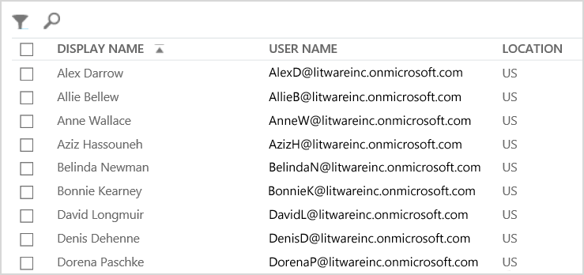

# <a name="why-you-need-to-use-powershell-for-microsoft-365"></a>Por que você precisa usar o PowerShell para Microsoft 365

*Este artigo se aplica tanto ao Microsoft 365 Enterprise quanto ao Office 365 Enterprise.*

Com o centro de administração do Microsoft 365, você pode gerenciar suas licenças e contas de usuário do Microsoft 365. Você também pode gerenciar seus serviços do Microsoft 365, como o Exchange Online, o Teams e o SharePoint Online. Se, em vez disso, você usar o PowerShell para gerenciar esses serviços, poderá aproveitar o ambiente de linha de comando e de linguagem de script para velocidade, automação e recursos adicionais.
  
Este artigo mostra como usar o PowerShell para gerenciar o Microsoft 365 para:
  
- Revelar informações adicionais que você não consegue ver no centro de administração do Microsoft 365
    
- Configurar recursos e configurações somente para o PowerShell
    
- Realizar operações em massa
    
- Filtrar dados
    
- Imprimir ou salvar dados
    
- Gerenciar entre serviços
    
Tenha em mente que o PowerShell para Microsoft 365 é um conjunto de módulos para o Windows PowerShell, que é um ambiente de linha de comando para plataformas e serviços baseados no Windows. Esse ambiente cria um idioma de Shell de comando que pode ser estendido com módulos adicionais. Ele oferece uma maneira de executar comandos ou scripts simples ou complexos. Por exemplo, depois de instalar os módulos do PowerShell para o Microsoft 365 e se conectar à sua assinatura do Microsoft 365, você pode executar o seguinte comando para listar todas as caixas de correio de usuário do Microsoft Exchange Online:
  
```powershell
Get-Mailbox
```

Você também pode obter a lista de caixas de correio usando o centro de administração do Microsoft 365, mas contar os itens em todas as listas de todos os sites de todos os seus aplicativos Web não é fácil.
  
O PowerShell para Microsoft 365 foi projetado para ajudá-lo a gerenciar o Microsoft 365, não substituir o centro de administração do Microsoft 365. Os administradores precisam ser capazes de usar o PowerShell para a Microsoft 365 porque há alguns procedimentos de configuração que podem ser feitos apenas por meio do PowerShell para os comandos do Microsoft 365. Nesses casos, você precisa saber como:
  
- Instale os módulos do PowerShell para o Microsoft 365 (feito apenas uma vez para cada computador do administrador).
    
- Conecte-se à sua assinatura do Microsoft 365 (uma vez para cada sessão do PowerShell).
    
- Reúna as informações necessárias para executar os comandos do PowerShell necessários para o Microsoft 365.
    
- Execute o PowerShell para os comandos do Microsoft 365.
    
Após aprender essas habilidades básicas, não é necessário listar seus usuários de caixa de correio usando o comando **Get-Mailbox** . Você também não precisa entender como criar um novo comando como o comando citado anteriormente para contar todos os itens em todas as listas de todos os sites de todos os seus aplicativos Web. A Microsoft e a comunidade de administradores podem ajudá-lo com tarefas, conforme necessário.
  
## <a name="powershell-for-microsoft-365-can-reveal-information-that-you-cant-see-with-the-microsoft-365-admin-center"></a>O PowerShell para Microsoft 365 pode revelar informações que você não consegue ver com o centro de administração do Microsoft 365

O centro de administração do Microsoft 365 exibe muitas informações úteis. Mas não exibe todas as informações possíveis que a Microsoft 365 armazena sobre usuários, licenças, caixas de correio e sites. Veja um exemplo de *usuários e grupos* no centro de administração do Microsoft 365:
  

  
Este modo de exibição fornece as informações que você precisa em muitos casos. No entanto, há ocasiões em que você precisa de mais. Por exemplo, o licenciamento da Microsoft 365 (e os recursos do Microsoft 365 disponíveis para um usuário) dependem parte do local geográfico do usuário. As políticas e os recursos que você pode estender para um usuário que reside nos Estados Unidos podem não ser os mesmos que podem ser estendidos a um usuário na Índia ou na Bélgica. Siga estas etapas no centro de administração do Microsoft 365 para determinar a localização geográfica de um usuário:
  
1. Clique duas vezes no **Nome de exibição** do usuário.
    
2. No painel de exibição de propriedades do usuário, selecione **detalhes**.
    
3. Na exibição detalhes, selecione **detalhes adicionais**.
    
4. Role até encontrar o título **país ou região**:
    
     
  
5. Escreva o nome de exibição e localização do usuário em um pedaço de papel ou copie e cole no Bloco de notas.
    
Você deve repetir este procedimento para cada usuário. Se você tiver muitos usuários, esse processo pode ser entediante. Com o PowerShell para Microsoft 365, você pode exibir essas informações para todos os seus usuários usando o seguinte comando:
  
```powershell
Get-AzureADUser | Select DisplayName, UsageLocation
```


>[!Note]
>O PowerShell Core não é compatível com o módulo Microsoft Azure Active Directory para o módulo e cmdlets do Windows PowerShell que têm o *MSol* em seu nome. Você precisa executar esses cmdlets do Windows PowerShell.
>

Veja um exemplo dos resultados:
  
```powershell
DisplayName                               UsageLocation
-----------                               -------------
Bonnie Kearney                            GB
Fabrice Canel                             BR
Brian Johnson (TAILSPIN)                  US
Anne Wallace                              US
Alex Darrow                               US
David Longmuir                            BR
```

A interpretação deste comando do PowerShell é: obter todos os usuários na assinatura atual do Microsoft 365 (**Get-AzureADUser**), mas apenas exibir o nome e o local para cada usuário (**selecione DisplayName, UsageLocation**).
  
Como o PowerShell para Microsoft 365 oferece suporte a um idioma de Shell de comando, você pode manipular ainda mais as informações obtidas pelo comando **Get-AzureADUser** . Por exemplo, talvez você queira classificar esses usuários pelo local, agrupar todos os usuários brasileiros juntos, todos os usuários do Brasil e assim por diante. Este é o comando:
  
```powershell
Get-AzureADUser | Select DisplayName, UsageLocation | Sort UsageLocation, DisplayName
```

Veja um exemplo dos resultados:
  
```powershell
DisplayName                                 UsageLocation
-----------                                 -------------
David Longmuir                              BR
Fabrice Canel                               BR
Bonnie Kearney                              GB
Alex Darrow                                 US
Anne Wallace                                US
Brian Johnson (TAILSPIN)                    US
```

A interpretação deste comando do PowerShell é: obter todos os usuários na assinatura atual do Microsoft 365, mas apenas exibir o nome e o local de cada usuário e classificá-los primeiro pelo local e, em seguida, o nome (**classificar UsageLocation, DisplayName**).
  
Você também pode usar filtragem adicional. Por exemplo, se você quiser ver informações sobre usuários baseados no Brasil, use este comando:
  
```powershell
Get-AzureADUser | Where {$_.UsageLocation -eq "BR"} | Select DisplayName, UsageLocation 
```

Veja um exemplo dos resultados:
  
```powershell
DisplayName                                           UsageLocation
-----------                                           -------------
David Longmuir                                        BR
Fabrice Canel                                         BR
```

A interpretação deste comando do PowerShell é: obter todos os usuários na assinatura atual do Microsoft 365, cujo local é Brasil (**onde {$ \_ . UsageLocation-EQ "BR"}**) e, em seguida, exibe o nome e o local para cada usuário.
  
 **Uma observação sobre domínios grandes**
  
Se você tiver um domínio grande com dezenas de milhares de usuários, tentar alguns dos exemplos mostrados neste artigo pode levar à limitação. Com base em fatores como energia de computação e largura de banda de rede disponível, você pode estar tentando fazer muito mais de uma vez. Grandes organizações podem querer dividir algumas destas operações do PowerShell em dois comandos.

Por exemplo, o comando a seguir retorna todas as contas de usuário e mostra o nome e o local de cada um:
  
```powershell
Get-AzureADUser | Select DisplayName, UsageLocation
```

Isso funciona bem com domínios menores. Mas em uma organização de grande porte, talvez você queira dividir essa operação em dois comandos: um comando para armazenar as informações da conta de usuário em uma variável e outra para exibir as informações necessárias. Exemplo:
  
```powershell
$x = Get-AzureADUser
$x | Select DisplayName, UsageLocation
```

A interpretação deste conjunto de comandos do PowerShell é:
1. Obter todos os usuários na assinatura atual do Microsoft 365 e armazenar as informações em uma variável chamada $x (**$x = Get-AzureADUser**).
1.  Exibir o conteúdo da variável *$x*, mas incluir apenas o nome e o local para cada usuário (**$x | Selecione DisplayName, UsageLocation**).
  
## <a name="microsoft-365-has-features-that-you-can-only-configure-with-powershell-for-microsoft-365"></a>A Microsoft 365 tem recursos que você só pode configurar com o PowerShell para Microsoft 365

O centro de administração do Microsoft 365 destina-se a fornecer acesso a tarefas administrativas comuns e úteis que se aplicam à maioria dos ambientes. Em outras palavras, o centro de administração do Microsoft 365 foi projetado para que o administrador típico possa realizar as tarefas de gerenciamento mais comuns. Mas há algumas tarefas que não podem ser realizadas no centro de administração.
  
Por exemplo, o centro de administração do Skype for Business online oferece algumas opções para criar convites de reunião personalizados:
  

  
Com essas configurações, você pode adicionar um toque de personalização e profissionalismo a convites de reunião. Mas há mais informações para atender às definições de configuração do que simplesmente criar convites de reunião personalizados. Por exemplo, por padrão, as reuniões permitem:
  
- Usuários anônimos obterem entrada automática para cada reunião.
    
- Participantes gravem a reunião.
    
- Todos os usuários da sua organização serem designado como apresentadores quando eles entrarem na reunião.
    
Essas configurações não estão disponíveis no centro de administração do Skype for Business online. Você pode controlá-los do PowerShell para o Microsoft 365. Veja um comando que desabilita estas três configurações:
  
```powershell
Set-CsMeetingConfiguration -AdmitAnonymousUsersByDefault $False -AllowConferenceRecording $False -DesignateAsPresenter "None"
```

> [!NOTE]
> Para executar este comando, você deve instalar o [módulo PowerShell do Skype for Business online ](https://www.microsoft.com/download/details.aspx?id=39366).
  
A interpretação deste comando do PowerShell é:
 
1. Nas configurações para novas reuniões do Skype for Business online (**set-CsMeetingConfiguration**), desabilite a permissão de usuários anônimos para obter a entrada automática em reuniões (**-AdmitAnonymousUsersByDefault $false**).
2.  Desabilitar a capacidade dos participantes de registrarem reuniões (**-AllowConferenceRecording $false**).
3. Não designe todos os usuários de sua organização como apresentadores (**-DesignateAsPresenter "nenhum"**).
  
Para restaurar essas configurações padrão (habilitar as opções), execute este comando:
  
```powershell
Set-CsMeetingConfiguration -AdmitAnonymousUsersByDefault $True -AllowConferenceRecording $True -DesignateAsPresenter "Company"
```

Há outros cenários similares, e é por isso que os administradores devem saber como executar os comandos do PowerShell para Microsoft 365.
  
## <a name="powershell-for-microsoft-365-is-great-for-bulk-operations"></a>O PowerShell para Microsoft 365 é ótimo para operações em massa

Interfaces visuais como o centro de administração do Microsoft 365 são mais valiosas quando você tem uma única operação a ser feita. Por exemplo, se for necessário desabilitar uma conta de usuário, você poderá usar o centro de administração para localizar e desmarcar rapidamente uma caixa de seleção. Isso pode ser mais fácil do que executar uma operação semelhante no PowerShell.
  
Mas se você precisar alterar muitas coisas ou algumas coisas selecionadas em um grande conjunto de outras coisas, o centro de administração do Microsoft 365 pode não ser a melhor ferramenta. Por exemplo, digamos que você tenha que alterar o prefixo em milhares de números de telefone ou remover o usuário específico *Ken Myer* de todos os seus sites do SharePoint Online. Como fazer isso no centro de administração do Microsoft 365?
  
Para o último exemplo, digamos que você tenha centenas de sites do SharePoint Online e não saiba quais Ken Araújo é membro. Você teria que começar no centro de administração do Microsoft 365 e, em seguida, executar este procedimento para cada site:
  
1. Selecione a **URL** do site.
    
2. Na caixa **Propriedades do conjunto de sites** , selecione o link **endereço do site** para abrir o site.
    
3. No site, selecione **compartilhar**.
    
4. Na caixa de diálogo **compartilhar** , selecione o link que mostra todos os usuários que têm permissões para o site:
    
     
  
5. Na caixa de diálogo **compartilhado com** , selecione **avançado**.
    
6. Role para baixo na lista de usuários, encontre e selecione Ken Myer (supondo que ele tenha permissões para o site) e selecione **remover permissões do usuário**.
    
Isso pode levar *muito* tempo para várias centenas de sites.
  
A alternativa é executar o seguinte comando no PowerShell para o Microsoft 365 para remover Ken Myer de todos os sites:
  
```powershell
Get-SPOSite | ForEach {Remove-SPOUser -Site $_.Url -LoginName "kenmyer@litwareinc.com"}
```

> [!NOTE]
> Este comando requer que você instale o [módulo do PowerShell do SharePoint Online](https://docs.microsoft.com/powershell/sharepoint/sharepoint-online/connect-sharepoint-online?view=sharepoint-ps). 
  
A interpretação deste comando do PowerShell é: obter todos os sites do SharePoint na assinatura atual do Microsoft 365 (**Get-SPOSite**) e para cada site remover Ken Araújo da lista de usuários que podem acessá-lo (**foreach {remove-marido-site $ \_ . URL-LoginName "kenmyer \@ litwareinc.com"}**).
  
Dizem para a Microsoft 365 remover Ken Araújo de todos os sites, incluindo aqueles aos quais ele não tem acesso. Portanto, os resultados mostrarão erros para os sites aos quais ele não tem acesso. Podemos usar uma condição adicional nesse comando para remover Ken Araújo apenas dos sites que o possuem em sua lista de login. Mas os erros retornados não causam danos aos próprios sites. Este comando pode levar alguns minutos para ser executado em centenas de sites, em vez de horas de trabalho por meio do centro de administração do Microsoft 365.
  
Este é outro exemplo de operação em massa. Use este comando para adicionar *Bonnie Kearney*, um novo administrador do SharePoint, a todos os sites na organização:
  
```powershell
Get-SPOSite | ForEach {Add-SPOUser -Site $_.Url -LoginName "bkearney@litwareinc.com" -Group "Members"}
```

A interpretação deste comando do PowerShell é: obter todos os sites do SharePoint na assinatura atual do Microsoft 365 e para cada site permitir o acesso do Bonnie Kearney adicionando seu nome de login ao grupo de membros do site (**foreach {Add-marido-site $ \_ . URL-LoginName "bkearney \@ litwareinc.com"-Group "Members"}**).
  
## <a name="powershell-for-microsoft-365-is-great-at-filtering-data"></a>O PowerShell para Microsoft 365 é ótimo para filtrar dados

O centro de administração do Microsoft 365 oferece várias maneiras de filtrar seus dados para localizar facilmente um subconjunto de informações direcionado. Por exemplo, o Exchange facilita a filtragem de praticamente qualquer propriedade da caixa de correio de um usuário. Por exemplo, aqui está a lista de caixas de correio para todos os usuários que vivem na cidade de Belo Horizonte:
  

  
O Centro de administração do Exchange também permite que você combine critérios de filtro. Por exemplo, você pode encontrar as caixas de correio de todas as pessoas que vivem no belo horizonte e trabalhar no departamento financeiro.
  
Mas há limitações para o que você pode fazer no centro de administração do Exchange. Por exemplo, você não podia localizar facilmente as caixas de correio de pessoas que moram no belo horizonte *ou* no San Diego ou nas caixas de correio de todas as pessoas que não residem no belo horizonte.
  
Você pode usar o seguinte comando do PowerShell para Microsoft 365 para obter uma lista de caixas de correio para todas as pessoas que vivem no belo horizonte ou San Diego:
  
```powershell
Get-User | Where {$_.RecipientTypeDetails -eq "UserMailbox" -and ($_.City -eq "San Diego" -or $_.City -eq "Bloomington")} | Select DisplayName, City
```

Veja um exemplo dos resultados:
  
```powershell
DisplayName                              City
-----------                              ----
Alex Darrow                              San Diego
Bonnie Kearney                           San Diego
Julian Isla                              Bloomington
Rob Young                                Bloomington
```

A interpretação deste comando do PowerShell é: obter todos os usuários na assinatura atual do Microsoft 365 que tenha uma caixa de correio na cidade de San Diego ou Belo Horizonte (**onde {$ \_ . RecipientTypeDetails-EQ "UserMailbox"-e ($ \_ . City-eq "San Diego"-ou $ \_ . City-eq "Belo Horizonte")}**) e, em seguida, exiba o nome e a cidade de cada (**selecione DisplayName, City**).
  
E aqui está o comando para listar todas as caixas de correio de pessoas que vivem em qualquer lugar, exceto Belo Horizonte:
  
```powershell
Get-User | Where {$_.RecipientTypeDetails -eq "UserMailbox" -and $_.City -ne "Bloomington"} | Select DisplayName, City
```

Veja um exemplo dos resultados:
  
```powershell
DisplayName                               City
-----------                               ----
MOD Administrator                         Redmond
Alex Darrow                               San Diego
Allie Bellew                              Bellevue
Anne Wallace                              Louisville
Aziz Hassouneh                            Cairo
Belinda Newman                            Charlotte
Bonnie Kearney                            San Diego
David Longmuir                            Waukesha
Denis Dehenne                             Birmingham
Garret Vargas                             Seattle
Garth Fort                                Tulsa
Janet Schorr                              Bellevue
```

A interpretação deste comando do PowerShell é: obter todos os usuários na assinatura atual do Microsoft 365 que possua uma caixa de correio não localizada na cidade de Belo Horizonte (**onde {$ \_ . RecipientTypeDetails-EQ "UserMailbox"-e $ \_ . City-NE "Belo Horizonte"}**) e, em seguida, exiba o nome e a cidade de cada um.
  
### <a name="use-wildcards"></a>Usar caracteres curinga

Você também pode usar caracteres curinga em seus filtros do PowerShell para corresponder a parte de um nome. Por exemplo, suponha que você esteja procurando uma conta de usuário. Tudo o que você pode lembrar é que o sobrenome do usuário era *Anderson* ou talvez *Gonçalves* ou *Gomes*.
  
Você pode rastrear esse usuário no centro de administração do Microsoft 365 usando a ferramenta de pesquisa e executando três pesquisas diferentes:
  
- Uma para  *Mendes* 
    
- Uma para  *Gonçalves* 
    
- Uma para  *Gomes* 
    
Como todos os três desses nomes terminam em "Son", você pode dizer ao PowerShell para exibir todos os usuários cujo nome termina em "Son". Este é o comando:
  
```powershell
Get-User -Filter '{LastName -like "*son"}'
```

A interpretação deste comando do PowerShell é: obter todos os usuários na assinatura atual do Microsoft 365, mas usar um filtro que liste apenas os usuários cujos sobrenomes terminam em "Son" (**-Filter ' {LastName-like " \* Son"} '**). O \* representa um conjunto de caracteres, que são letras no último nome do usuário.
  
## <a name="powershell-for-microsoft-365-makes-it-easy-to-print-or-save-data"></a>O PowerShell para Microsoft 365 facilita a impressão ou a gravação de dados

O centro de administração 365 da Microsoft permite exibir listas de dados. Veja um exemplo do centro de administração do Skype for Business online que exibe uma lista de usuários que foram habilitados para o Skype for Business Online:
  

  
Para salvar essas informações em um arquivo, você deve colá-las em um documento ou em uma planilha do Microsoft Excel. Qualquer um dos casos pode exigir formatação adicional. Além disso, o centro de administração do Microsoft 365 não oferece uma maneira de imprimir diretamente a lista exibida.
  
Felizmente, você pode usar o PowerShell para não apenas exibir a lista, mas salvá-la em um arquivo que pode ser facilmente importado para o Excel. Veja um exemplo de comando para salvar dados de usuário do Skype for Business online em um arquivo de valores separados por vírgula (CSV), que pode ser facilmente importado como uma tabela em uma planilha do Excel:
  
```powershell
Get-CsOnlineUser | Select DisplayName, UserPrincipalName, UsageLocation | Export-Csv -Path "C:\Logs\SfBUsers.csv" -NoTypeInformation
```

Veja um exemplo dos resultados:
  

  
A interpretação deste comando do PowerShell é: obter todos os usuários do Skype for Business online na assinatura atual do Microsoft 365 (**Get-CsOnlineUser**); Obtenha apenas o nome de usuário, o UPN e o local (**selecione DisplayName, userPrincipalName, UsageLocation**); e, em seguida, salve essas informações em um arquivo CSV chamado C: \\ logs \\SfBUsers.csv (**Export-CSV-Path "C: \\ logs \\SfBUsers.csv"-NoTypeInformation**).
  
Você também pode usar opções para salvar esta lista como um arquivo XML ou uma página HTML. Na verdade, com outros comandos do PowerShell, você pode salvá-lo diretamente como um arquivo do Excel, com qualquer formatação personalizada desejada.
  
Você também pode enviar a saída de um comando do PowerShell que exibe uma lista diretamente para a impressora padrão no Windows. Veja um exemplo de comando:
  
```powershell
Get-CsOnlineUser | Select DisplayName, UserPrincipalName, UsageLocation | Out-Printer
```

O seu documento impresso ficará assim:
  

  
A interpretação deste comando do PowerShell é: obter todos os usuários do Skype for Business online na assinatura atual do Microsoft 365; obter apenas o nome de usuário, o UPN e o local; e, em seguida, envie essas informações para a impressora padrão do Windows (**Out-Printer**).
  
O documento impresso tem a mesma formatação simples que a exibição na janela de comando do PowerShell. Para obter uma cópia impressa, basta adicionar **| Out-Printer** até o final do comando.
  
## <a name="powershell-for-microsoft-365-lets-you-manage-across-server-products"></a>O PowerShell para Microsoft 365 permite que você gerencie nos produtos de servidor

Os componentes que compõem o Microsoft 365 são projetados para funcionar juntos. Por exemplo, suponha que você adicione um novo usuário ao Microsoft 365 e especifique essas informações como o departamento e o número de telefone do usuário. Essas informações estarão disponíveis se você acessar as informações do usuário em qualquer um dos serviços do Microsoft 365: Skype for Business Online, Exchange ou SharePoint.
  
Mas isso é para informações comuns que abrangem o pacote de produtos. Informações específicas do produto, como informações sobre a caixa de correio do Exchange de um usuário, normalmente não estão disponíveis no pacote. Por exemplo, informações sobre se a caixa de correio de um usuário está habilitada ou não só está disponível no centro de administração do Exchange.
  
Suponha que você queira fazer um relatório que mostre as seguintes informações sobre todos os seus usuários:
  
- O nome de exibição do usuário
    
- Se o usuário está licenciado para o Microsoft 365
    
- Se a caixa de correio do Exchange do usuário está habilitada
    
- Se o usuário está habilitado para o Skype for Business online
    
Não é possível produzir facilmente esse relatório no centro de administração do Microsoft 365. Em vez disso, você precisaria criar um documento separado para armazenar as informações, como uma planilha do Excel. Em seguida, obtenha todos os nomes de usuário e informações de licenciamento do centro de administração do Microsoft 365, obtenha informações de caixa de correio do centro de administração do Exchange, obtenha informações do Skype for Business online no centro de administração do Skype for Business Online e, em seguida, Combine essas informações.
  
A alternativa é usar um script do PowerShell para compilar o relatório para você.
  
O script de exemplo a seguir é mais complicado do que os comandos que você viu até o momento neste artigo. No entanto, ele mostra o potencial de usar o PowerShell para criar modos de exibição de informações que são difíceis de obter de outra forma. Veja aqui o script para compilar e exibir a lista de que você precisa:
  
```powershell
$x = Get-AzureADUser

foreach ($i in $x)
    {
      $y = Get-Mailbox -Identity $i.UserPrincipalName
      $i | Add-Member -MemberType NoteProperty -Name IsMailboxEnabled -Value $y.IsMailboxEnabled

      $y = Get-CsOnlineUser -Identity $i.UserPrincipalName
      $i | Add-Member -MemberType NoteProperty -Name EnabledForSfB -Value $y.Enabled
    }

$x | Select DisplayName, IsLicensed, IsMailboxEnabled, EnabledforSfB
```

Veja um exemplo dos resultados:
  
```powershell
DisplayName             IsLicensed   IsMailboxEnabled   EnabledForSfB
-----------             ----------   ----------------   --------------
Bonnie Kearney          True         True               True
Fabrice Canel           True         True               True
Brian Johnson           False        True               False
Anne Wallace            True         True               True
Alex Darrow             True         True               True
David Longmuir          True         True               True
Katy Jordan             False        True               False
Molly Dempsey           False        True               False
```

A interpretação deste script do PowerShell é:  

1. Obter todos os usuários na assinatura atual do Microsoft 365 e armazenar as informações em uma variável denominada *$x* (**$x = Get-AzureADUser**).
1. Inicie um loop que é executado em todos os usuários na variável $x (**foreach ($i em $x)**).  
1. Definir uma variável chamada *$y* e armazenar as informações de caixa de correio do usuário nela (**$y = Get-Mailbox-Identity $i. UserPrincipalName**).
1. Adicione uma nova propriedade às informações de usuário chamadas *IsMailBoxEnabled*. Defina-o como o valor da propriedade IsMailBoxEnabled da caixa de correio do usuário (**$i | Add-Member-MemberType observação-Name IsMailBoxEnabled-value $y. IsMailBoxEnabled**).
1. Definir uma variável chamada *$y*e armazenar as informações do Skype for Business Online do usuário nela (**$y = Get-CsOnlineUser-Identity $i. UserPrincipalName**).
1. Adicione uma nova propriedade às informações de usuário chamadas *EnabledForSfB*. Defina-o como o valor da propriedade Enabled das informações do Skype for Business Online do usuário (**$i | Add-Member-MemberType observação-Name EnabledForSfB-value $y. Enabled**).
1. Exibir a lista de usuários, mas incluir apenas o nome deles, se eles estão licenciados e as duas novas propriedades que indicam se a caixa de correio está habilitada e se eles estão habilitados para o Skype for Business online (**$x | Selecione DisplayName, islicensed, IsMailboxEnabled, EnabledforSfB**).
  
## <a name="see-also"></a>Confira também

[Introdução ao Windows PowerShell para o Microsoft 365](getting-started-with-microsoft-365-powershell.md)
  
[Gerenciar contas de usuário, licenças e grupos do Microsoft 365 com o PowerShell](manage-user-accounts-and-licenses-with-microsoft-365-powershell.md)
  
[Usar o PowerShell do Windows para criar relatórios no Microsoft 365](use-windows-powershell-to-create-reports-in-microsoft-365.md)
