# Guia passo a passo de atualização manual do Windows 7 para Windows 10

Este artigo descreve o processo de atualização manual de um PC com Windows 7 Enterprise para o Windows 10 Enterprise. Para outras edições do Windows 7, como Home e  Professional, o processo é muito semelhante, mas você também tem a opção de atualizar diretamente usando a ferramenta de criação de mídia. As atualizações para qualquer edição do Windows 7 para o Windows 10 requerem uma chave do produto (Product Key) válida, ou uma edição superior do Windows, por exemplo, o Windows 7 Professional pode atualizar para o Windows 10 Pro, mas não pode ser atualizado para o Windows 10 Home. O Windows 7 Ultimate deve ser atualizado para o Windows 10 Pro.

## O Windows 10 é atualizado usando a ferramenta de criação de mídia ou arquivos ISO

Você pode atualizar para o Windows 10 diretamente usando a [ferramenta de criação de mídia](https://www.microsoft.com/en-us/software-download/windows10ISO) ou usá-la para baixar o Windows 10 como um arquivo ISO. Você deve observar se o seu sistema atual é de 32 ou 64 bits, o idioma padrão do sistema e a edição do Windows 7 (por exemplo, Home, Professional ou Enterprise). No Windows 7, essas informações estão localizadas no sistema do painel de controle \>Sistema e Segurança\>. A ferramenta de criação de mídia não oferece suporte ao Windows 10 Enterprise para atualizações, criação de mídia de instalação ou download de arquivos ISO. O Windows 10 Enterprise é necessário se você estiver atualizando do Windows 7 Enterprise.

Ao atualizar do Windows 7 Enterprise para o Windows 10 Enterprise, você precisará fazer o download do arquivo ISO para seu idioma e arquitetura (32 bits ou 64 bits) no [Centro de Atendimento de Licenciamento por Volume](https://www.microsoft.com/licensing/servicecenter/default.aspx).

Se você planeja executar a atualização usando um arquivo ISO, será necessário extrair os arquivos no ISO para o seu sistema de arquivos local, para uma unidade removível, ou você pode gravar o arquivo ISO em um DVD. Você pode extrair os arquivos de instalação dentro do ISO usando um PC com Windows 8 ou mais recente e salvá-los em um armazenamento USB removível ou usar um aplicativo como o [7zip](https://www.7-zip.org/) para extrair o conteúdo do seu arquivo ISO para uma pasta na sua unidade local no Windows 7.

Depois de ter a mídia de instalação disponível no Windows 7, você poderá iniciar a atualização executando o setup.exe, conforme mostrado abaixo.

**Dica importante: para uma atualização no local em que os aplicativos e seus dados são migrados para o Windows 10, você precisará iniciar o processo a partir de uma sessão do Windows 7 em execução. A inicialização para instalar mídia de um drive de DVD ou USB não lhe dará a opção de manter seus aplicativos e arquivos, em vez disso, executará uma instalação limpa do Windows 10.**

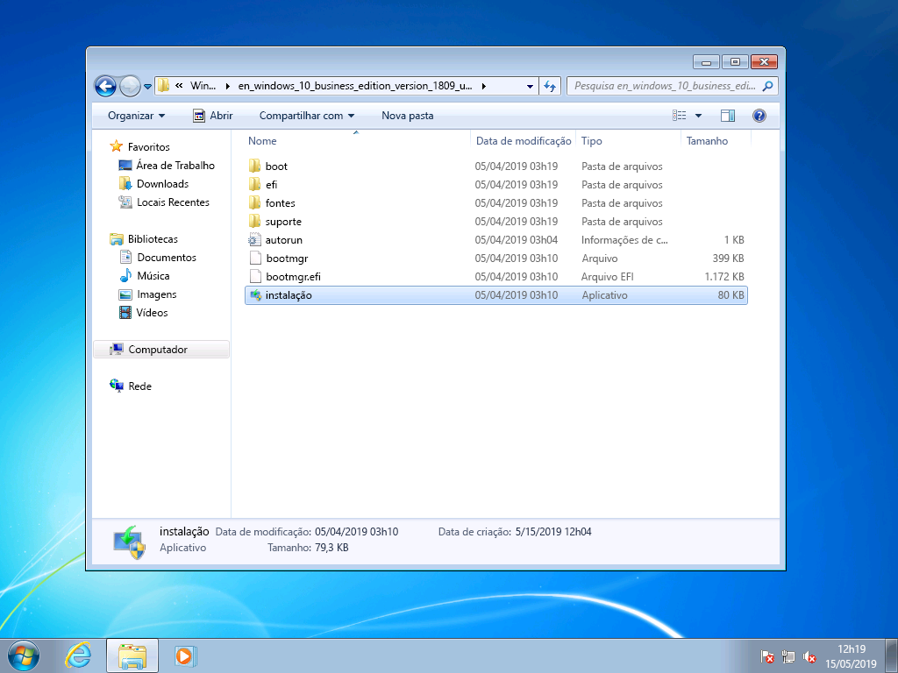

Na Instalação do Windows 10, você será orientado durante o processo de instalação e a primeira tela fornecerá uma opção para baixar atualizações, drivers e recursos opcionais. Isso é recomendável para ajudar a garantir o sucesso com a atualização

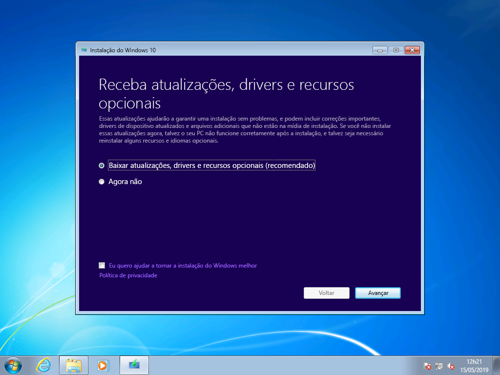

Depois que as atualizações forem aplicadas, a Instalação do Windows 10 passará para a próxima fase, Selecionar imagem. Aqui, você precisará selecionar sua edição do Windows. Nesse caso, como o PC já tem o Windows 7 Enterprise instalado, selecione o Windows 10 Enterprise.

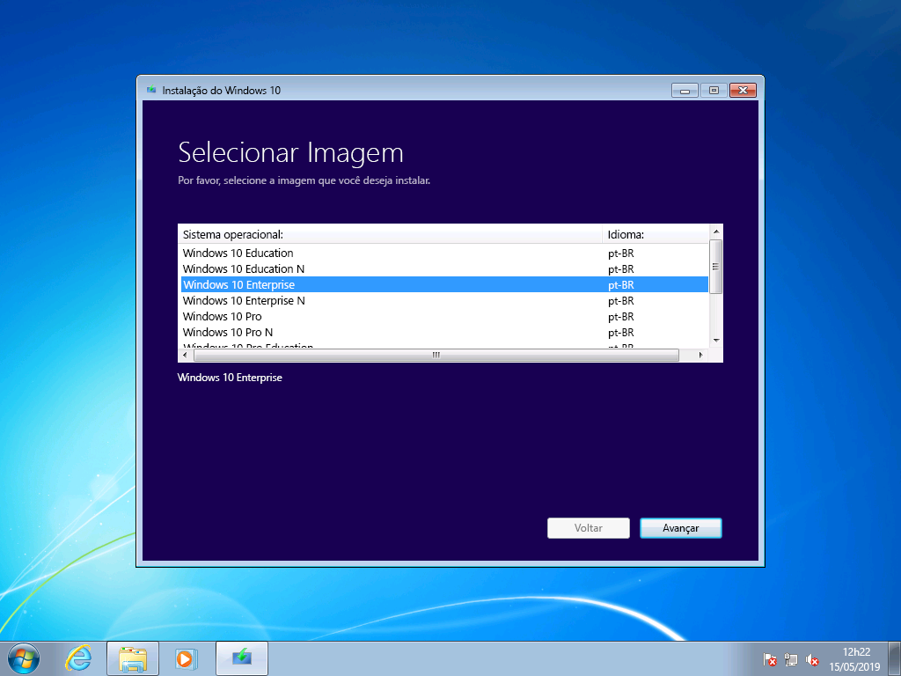

Na próxima tela da Instalação do Windows 10, você receberá os avisos e os termos de licença aplicáveis. Depois de ler e entender os avisos e termos, clique em "Aceitar" para continuar ou "Recusar" para cancelar.

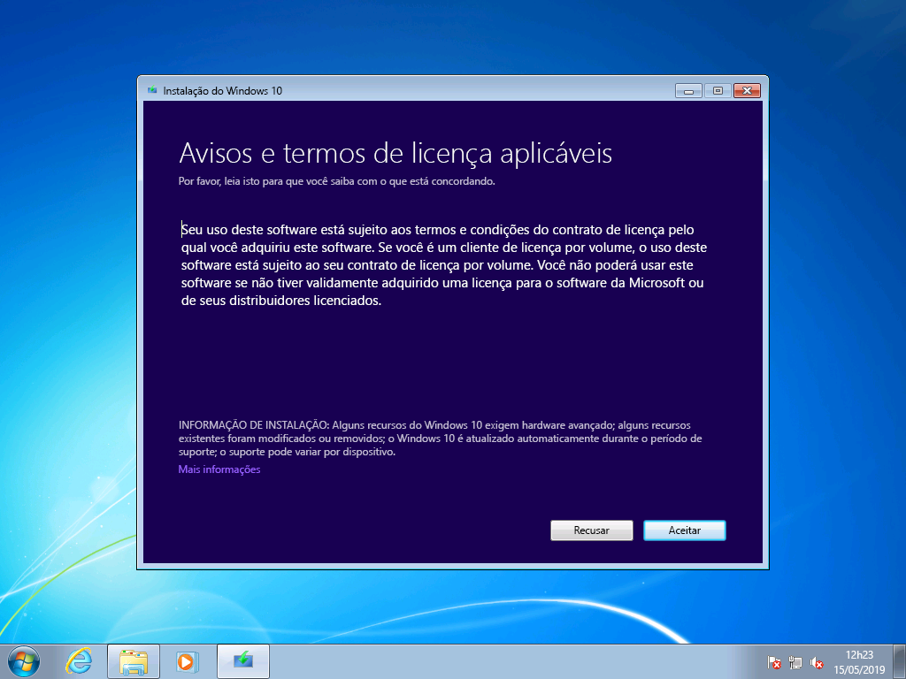

Agora a Instalação do Windows 10 procurará atualizações adicionais.

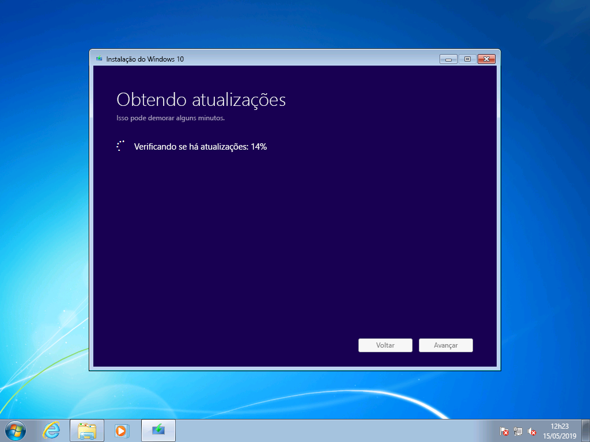

Uma vez concluída, a Instalação do Windows 10 estará pronta para ser instalada, por padrão, é configurada para instalar o Windows 10 e manter seus arquivos pessoais e aplicativos instalados. Essa é a opção recomendada. Ao clicar em "Alterar o que manter", você encontrará opções adicionais. Caso contrário, clique em "Instalar".

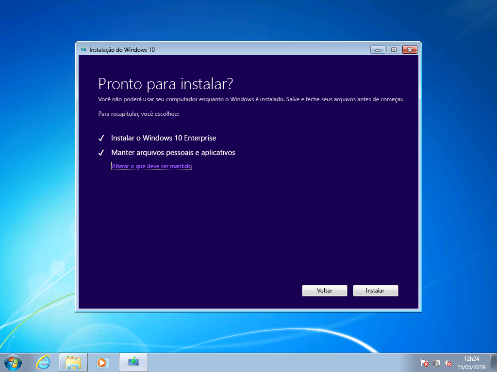

Se você selecionar "Alterar o que manter", verá as seguintes opções:

"Manter somente arquivos pessoais" não migrará os aplicativos instalados ou as configurações do Windows 7 para o Windows 10. Em vez disso, os arquivos e as contas de usuário serão movidos para o Windows. Será necessário reinstalar os aplicativos mais tarde com essa opção. Use essa opção somente se você tiver certeza de que pode reinstalar e configurar os aplicativos necessários após a instalação do Windows, caso contrário, mantenha a opção padrão "Manter arquivos pessoais e aplicativos".

"Nada" excluirá seus arquivos, aplicativos e configurações e executará uma instalação limpa do Windows. Use essa opção somente se você tiver feito o backup dos dados que deseja manter e reinstalar os aplicativos.

Agora, a instalação do Windows 10 receberá as atualizações novamente com base no que você selecionou na tela anterior.

Agora, o Windows 10 será instalado durante alguns minutos, e caso você tenha optado por manter seus arquivos pessoais e aplicativos, tudo estará nos mesmos locais de arquivo, e seus aplicativos estarão disponíveis no Windows 10.

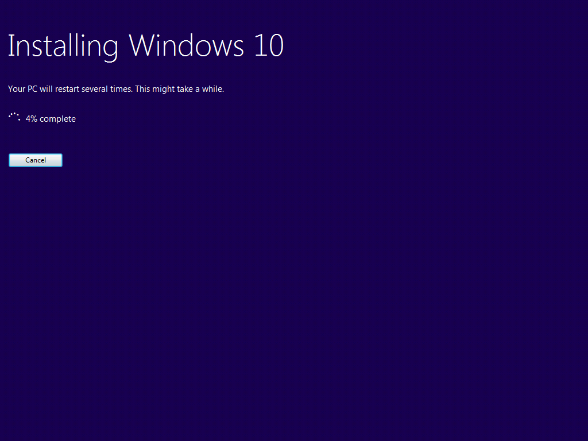

## 

## Recuperação no Windows 10

Após a instalação do Windows 10, a opção recuperação no Windows 10 oferecerá até 10 dias para voltar para o Windows 7. Isso é útil se um aplicativo ou dispositivo não funcionar corretamente, e você precisar voltar para a sua instalação anterior do Windows 7. Após 10 dias, por padrão, o Windows 10 liberará o espaço consumido pelos arquivos de recuperação do Windows 7 no disco rígido e excluirá arquivos da instalação anterior. Embora o Windows 7 seja excluído após esse e você não consiga reverter o Windows 7, seus aplicativos e arquivos pessoais permanecerão no Windows 10.

Para iniciar o processo de voltar para o Windows 7, navegue até as Configurações de Recuperação \>Atualização & Segurança\>. Em Voltar para o Windows 7, selecione "Introdução".

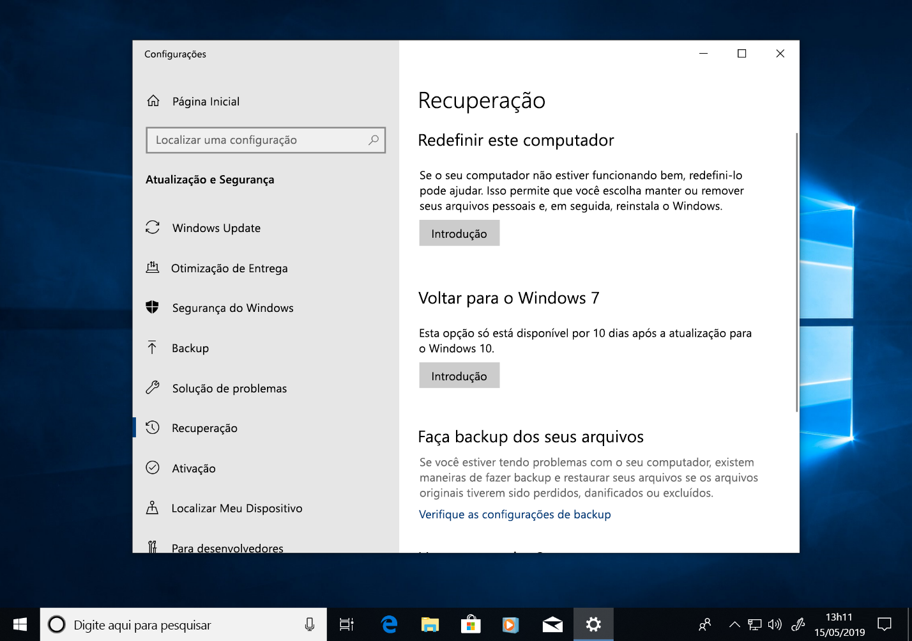

Agora, o Windows 10 perguntará por que você está voltando. Se houver um motivo técnico, isso é útil para preencher, a fim de ajudar a impulsionar a resolução e garantir que outras pessoas possam se beneficiar da sua experiência.

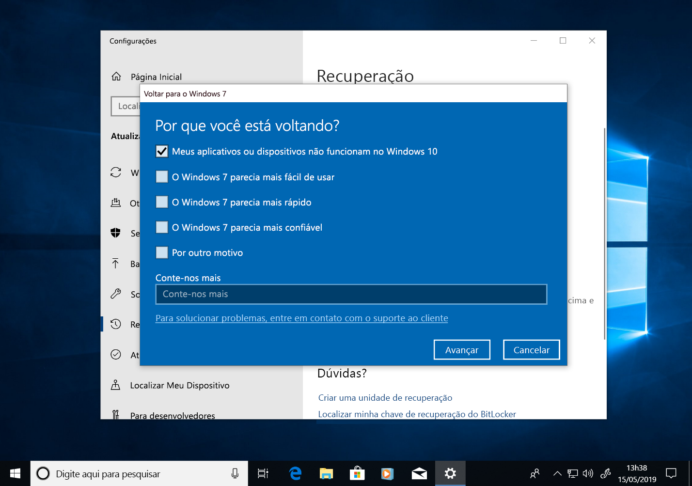

Em muitos casos, a sua versão do Windows 10 poderá ter atualizações disponíveis, o que pode resolver problemas técnicos. É recomendável verificar se há atualizações e, se encontradas e instaladas, verifique se isso resolve os problemas que você enfrentou.

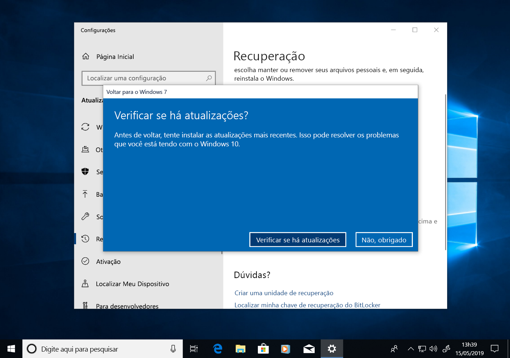

Se as atualizações não resolverem os problemas e você precisar reverter para a instalação anterior do Windows 7, há uma chance de alguns aplicativos precisarem ser reinstalados - como qualquer aplicativo instalado durante o período de execução do Windows 10 - e algumas configurações podem ser perdidas. É importante saber que os arquivos e os documentos salvos localmente enquanto você usava o Windows 10 permanecerão e estarão disponíveis quando você estiver novamente no Windows 7. 

Antes de começar, certifique-se de que você tenha uma conta de domínio ou local e uma senha prontos para a instalação anterior do Windows 7.

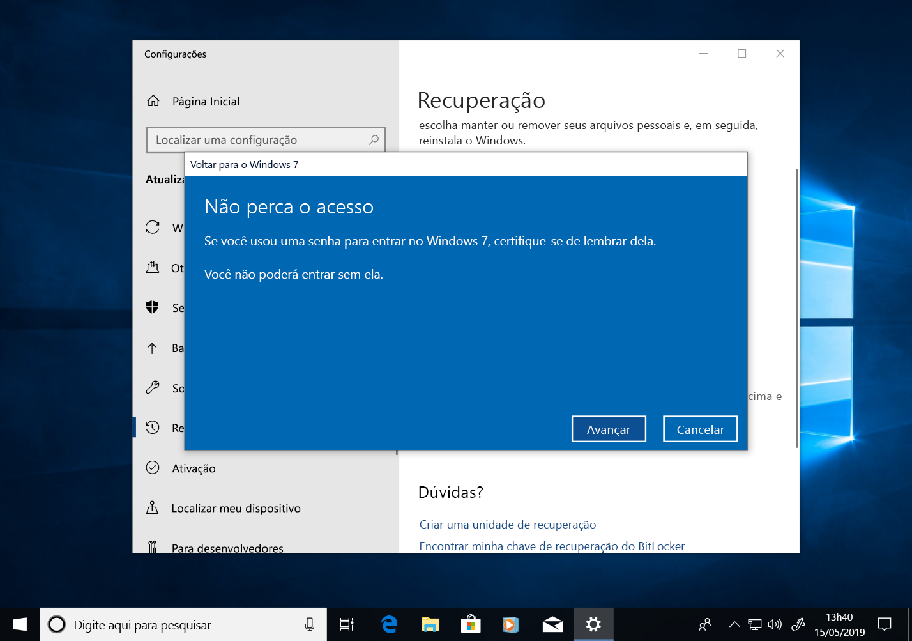

A partir daqui, você pode iniciar o processo para voltar para o Windows 7. Depois de alguns minutos, seu computador será reinicializado no Windows 7 com a mesma experiência anterior à atualização para o Windows 10.

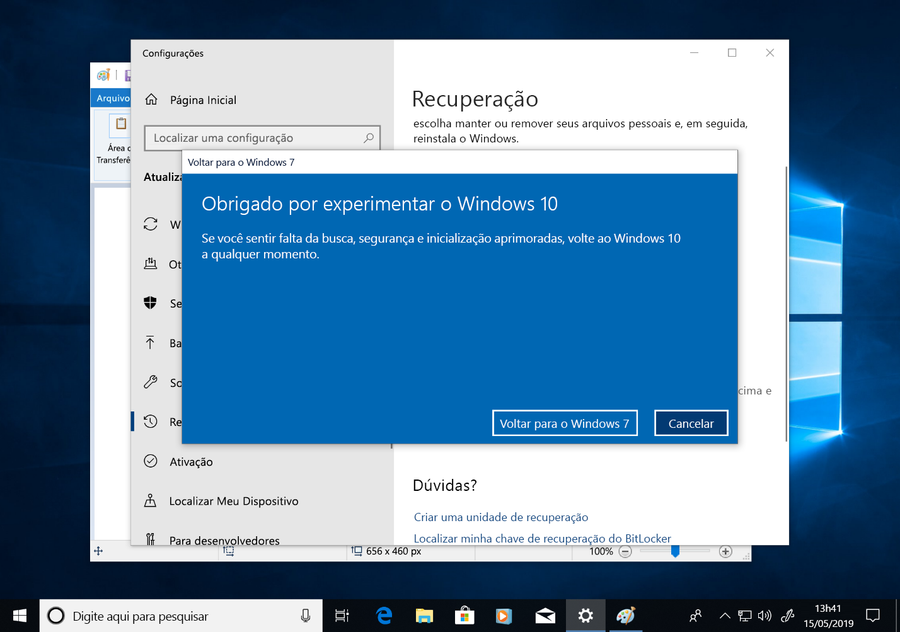

## Migrar para o Windows 10 em um novo computador

Outra opção recomendada é mover para o Windows 10 em um novo computador. Se essa for a sua preferência, você pode transferir seus arquivos do computador antigo usando o backup do [OneDrive](https://support.office.com/article/b5e918be-0fd4-4095-98da-bceed57f8e0c?ocid=MoveToWindows10), o [Backup e a Restauração integrados ao Windows](https://support.microsoft.com/help/4469209?ocid=MoveToWindows10), o uso manual de um [dispositivo de armazenamento externo](https://support.microsoft.com/pt-BR/help/4465814/windows-7-move-files-off-pc-with-an-external-storage-device?ocid=MoveToWindows10) ou ferramentas como o [PCmover Express da Laplink](https://www.microsoft.com/en-us/windows/transfer-your-data). Com qualquer uma dessas opções, você ainda precisará reinstalar todos os aplicativos necessários que não estão incluídos no Windows 10. Para saber mais sobre as suas opções para mover-se manualmente de um PC existente com Windows 7 para um novo PC com Windows 10, consulte [Movendo para um PC com Windows 10](https://support.microsoft.com/pt-BR/help/4229823?ocid=MoveToWindows10) no Suporte do Windows.

## [Centro de Implantação do Computador](https://aka.ms/howtoshift)