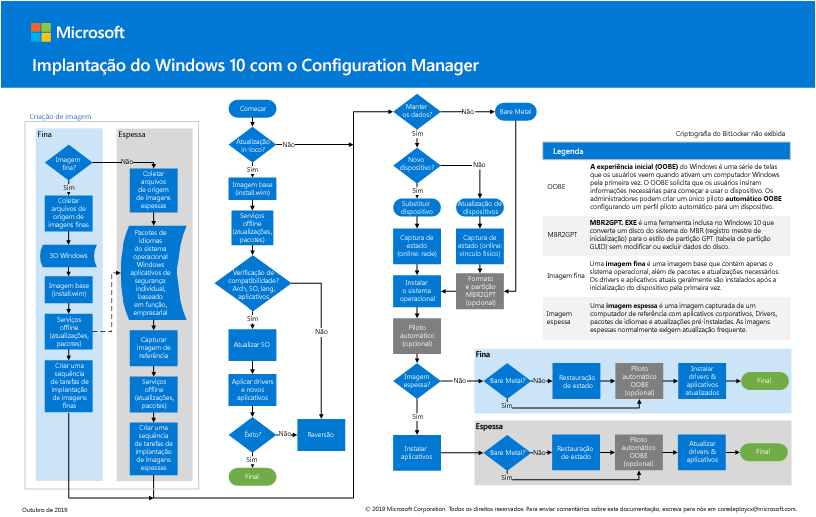

# Etapa 2: implantar o Windows 10 Enterprise para dispositivos existentes como uma atualização in-locoStep 2: Deploy Windows 10 Enterprise for existing devices as an in-place upgrade

*Este artigo aplica-se às versões E3 e E5 do Microsoft 365 Enterprise**This article applies to both the E3 and E5 versions of Microsoft 365 Enterprise*

O caminho mais simples para atualizar os computadores que estão executando o Windows 7 ou o Windows 8,1 para o Windows 10 é por meio de uma atualização in-loco.The simplest path to upgrade PCs currently running Windows 7 or Windows 8.1 to Windows 10 is through an in-place upgrade. Você pode usar uma sequência de tarefas do System Center Configuration Manager (Configuration Manager) para automatizar completamente o processo.You can use a System Center Configuration Manager (Configuration Manager) task sequence to completely automate the process. 

Se você tiver computadores que executam o Windows 7 ou o Windows 8,1, recomendamos esse caminho se sua organização estiver implantando o Windows 10.If you have existing computers running Windows 7 or Windows 8.1, we recommend this path if your organization is deploying Windows 10. Isso utiliza o programa de instalação do Windows (Setup. exe) para executar uma atualização in-loco, que preserva automaticamente todos os dados, configurações, aplicativos e drivers da versão do sistema operacional existente.This leverages the Windows installation program (Setup.exe) to perform an in-place upgrade, which automatically preserves all data, settings, applications, and drivers from the existing operating system version. Isso requer o menor esforço de ti, porque não há necessidade de nenhuma infraestrutura de implantação complexa.This requires the least IT effort, because there is no need for any complex deployment infrastructure.

Siga estas etapas para configurar e implantar uma imagem do Windows 10 Enterprise usando o Configuration Manager como uma atualização in-loco.Follow these steps to configure and deploy a Windows 10 Enterprise image using Configuration Manager as an in-place upgrade.

## Pôster de implantação do Windows 10 com o System Center Configuration ManagerThe Windows 10 deployment with System Center Configuration Manager poster

O pôster do Gerenciador de configurações é uma página no modo paisagem (17x11).The Configuration Manager poster is one page in landscape mode (17x11). Clique na imagem abaixo para exibir um PDF no navegador.Click the image below to view a PDF in your browser. 

Você também pode fazer o download deste pôster em formato [PDF](https://github.com/MicrosoftDocs/windows-itpro-docs/raw/public/windows/deployment/media/Windows10DeploymentConfigManager.pdf) ou do [Visio](https://github.com/MicrosoftDocs/windows-itpro-docs/raw/public/windows/deployment/media/Windows10DeploymentConfigManager.vsdx).You can also download this poster in [PDF](https://github.com/MicrosoftDocs/windows-itpro-docs/raw/public/windows/deployment/media/Windows10DeploymentConfigManager.pdf) or [Visio](https://github.com/MicrosoftDocs/windows-itpro-docs/raw/public/windows/deployment/media/Windows10DeploymentConfigManager.vsdx) format.

## Parte 1: verificar a preparação para atualizar o WindowsPart 1: Verify readiness to upgrade Windows

Primeiro, use o recurso de prontidão de atualização do Windows Analytics para fornecer ideias e recomendações poderosas sobre os computadores, aplicativos e drivers em sua organização, sem custo adicional e sem requisitos de infraestrutura adicionais.First, use the Upgrade Readiness capability of Windows Analytics to provide powerful insights and recommendations about the computers, applications, and drivers in your organization, at no extra cost and without additional infrastructure requirements. Este novo serviço orienta você por meio da atualização e dos projetos de atualização de recursos usando um fluxo de trabalho com base nas práticas recomendadas pela Microsoft.This new service guides you through upgrade and feature update projects using a workflow based on Microsoft recommended practices. Os dados de inventário atualizados permitem que você equilibre custos e riscos em seus projetos de atualização.Up-to-date inventory data allows you to balance cost and risk in your upgrade projects.

Consulte [gerenciar atualizações do Windows com a preparação para atualização](https://docs.microsoft.com/windows/deployment/upgrade/manage-windows-upgrades-with-upgrade-readiness) para saber mais, introdução, usar e solucionar problemas de preparação da atualização.See [Manage Windows upgrades with Upgrade Readiness](https://docs.microsoft.com/windows/deployment/upgrade/manage-windows-upgrades-with-upgrade-readiness) to learn more, get started, use, and troubleshoot Upgrade Readiness.

Em seguida, siga o guia para usar o System Center Configuration Manager (Branch atual) para atualizar o sistema operacional Windows 7 ou posterior para o Windows 10.Next, follow the guide to use System Center Configuration Manager (Current Branch) to upgrade Windows 7 or later operating system to Windows 10. Como em qualquer implantação de alto risco, é recomendável fazer backup dos dados do usuário antes de prosseguir.As with any high-risk deployment, we recommend backing up user data before proceeding. O armazenamento em nuvem do OneDrive está pronto para ser usado para usuários licenciados da Microsoft 365 e pode ser usado para armazenar com segurança seus arquivos.OneDrive cloud storage is ready to use for licensed Microsoft 365 users and can be used to securely store their files. Para obter mais informações, consulte o [Guia de início rápido do onedrive](https://aka.ms/ODfBquickstartguide).For more info, see [OneDrive quick start guide](https://aka.ms/ODfBquickstartguide). Para acessar essa página, você deve entrar como administrador de locatário ou administrador global em um Office 365 ou Microsoft 365 locatário.To access this page, you must sign in as a tenant admin or global admin in an Office 365 or Microsoft 365 tenant.

Para obter uma lista de versões do Gerenciador de configurações e as versões do cliente Windows 10 correspondentes suportadas, consulte [support for Windows 10 for System Center Configuration Manager](https://aka.ms/supportforwin10sccm).For a list of Configuration Manager versions and the corresponding Windows 10 client versions that are supported, see [Support for Windows 10 for System Center Configuration Manager](https://aka.ms/supportforwin10sccm).

**Para verificar a preparação para atualizar o Windows****To verify readiness to upgrade Windows**

Revise esses requisitos antes de iniciar a implantação do Windows 10:Review these requirements before starting your Windows 10 deployment:

- **Edições do Windows qualificadas para atualização** : seus dispositivos devem estar executando edições do Windows 7 ou Windows 8,1 qualificadas para atualização para o Windows 10 Enterprise.**Windows editions eligible for upgrade** - Your devices must be running editions of Windows 7 or Windows 8.1 that are eligible for upgrade to Windows 10 Enterprise. Para obter uma lista de edições suportadas, consulte [caminhos de atualização do Windows 10](https://aka.ms/win10upgradepaths).For a list of supported editions, see [Windows 10 upgrade paths](https://aka.ms/win10upgradepaths). 
- **Dispositivos suportados** : a maioria dos computadores compatíveis com o Windows 8,1 será compatível com o Windows 10.**Supported devices** - Most computers that are compatible with Windows 8.1 will be compatible with Windows 10. Talvez seja necessário instalar drivers atualizados no Windows 10 para que seus dispositivos funcionem corretamente.You may need to install updated drivers in Windows 10 for your devices to properly function. Consulte [Windows 10 Specifications](https://aka.ms/windows10specifications) para obter mais informações.See [Windows 10 specifications](https://aka.ms/windows10specifications) for more info.
- **Preparação da implantação** : Certifique-se de ter o seguinte antes de começar a configurar a implantação:**Deployment preparation** - Make sure you have the following before you start configuring the deployment:
    - Mídia de instalação do Windows 10: a mídia de instalação deve estar localizada em uma unidade separada, com o ISO já montado.Windows 10 installation media - The installation media must be located on a separate drive, with the ISO already mounted. Você pode obter a ISO de [downloads para assinantes do MSDN](https://aka.ms/msdn-subscriber-downloads) ou do [centro de serviços de licenciamento por volume](https://aka.ms/mvlsc).You can obtain the ISO from [MSDN Subscriber Downloads](https://aka.ms/msdn-subscriber-downloads) or from the [Volume Licensing Service Center](https://aka.ms/mvlsc).
    - Backups de dados do usuário – embora os dados do usuário sejam migrados na atualização, a prática recomendada é configurar um cenário de backup.Backups of user data - Although user data will be migrated in the upgrade, best practice is to configure a backup scenario. Por exemplo, exporte todos os dados do usuário para uma conta do OneDrive, unidade flash USB criptografada no BitLocker ou servidor de arquivos de rede.For example, export all user data to a OneDrive account, BitLocker To Go-encrypted USB flash drive, or network file server. Para obter mais informações, consulte [back up or Transfer Data in Windows](https://aka.ms/backuptransferdatawindows).For more information, see [Back up or transfer data in Windows](https://aka.ms/backuptransferdatawindows).
- **Preparação do ambiente** : você usará uma estrutura de servidor do Configuration Manager existente para se preparar para a implantação do sistema operacional.**Environment preparation** - You will use an existing Configuration Manager server structure to prepare for operating system deployment. Além da configuração base, as seguintes configurações devem ser feitas no ambiente do Configuration Manager:In addition to the base setup, the following configurations should be made in the Configuration Manager environment:
    1. [Estenda o esquema do Active Directory](https://aka.ms/extendadschema) e [crie um contêiner de gerenciamento do sistema](https://aka.ms/createsysmancontainer).[Extend the Active Directory Schema](https://aka.ms/extendadschema) and [create a System Management container](https://aka.ms/createsysmancontainer).
    2. Habilitar a descoberta de florestas do Active Directory e a descoberta de sistema do Active Directory.Enable Active Directory Forest Discovery and Active Directory System Discovery. Para obter mais informações, consulte [Configure Discovery Methods for System Center Configuration Manager](https://aka.ms/configurediscoverymethods).For more info, see [Configure discovery methods for System Center Configuration Manager](https://aka.ms/configurediscoverymethods).
    3. Criar limites de intervalo IP e grupo de limite para a atribuição de conteúdo e de site.Create IP range boundaries and boundary group for content and site assignment. Para obter mais informações, consulte [definir limites do site e grupos de limite para o System Center Configuration Manager](https://aka.ms/definesiteboundaries).For more info, see [Define site boundaries and boundary groups for System Center Configuration Manager](https://aka.ms/definesiteboundaries).
    4. Adicione e configure a função de ponto do Configuration Manager Reporting Services.Add and configure the Configuration Manager reporting services point role. Para obter mais informações, consulte [Configuring Reporting in Configuration Manager](https://aka.ms/configurereporting).For more info, see [Configuring Reporting in Configuration Manager](https://aka.ms/configurereporting).
    5. Criar uma estrutura de pasta do sistema de arquivos para pacotes.Create a file system folder structure for packages.
    6. Criar uma estrutura de pasta do console do Configuration Manager para pacotes.Create a Configuration Manager console folder structure for packages.
    7. Instale as atualizações do System Center Configuration Manager (Branch atual) e os pré-requisitos adicionais do Windows 10.Install System Center Configuration Manager (Current Branch) updates and any additional Windows 10 prerequisites.

## Parte 2: adicionar uma imagem do Windows 10 so usando o Configuration ManagerPart 2: Add a Windows 10 OS image using Configuration Manager
Agora, você precisará criar um pacote de atualização do sistema operacional que contenha a mídia de instalação completa do Windows 10.Now you'll need to create an operating system upgrade package that contains the full Windows 10 installation media. Nas etapas a seguir, você usará o Gerenciador de configurações para criar um pacote de atualização para o Windows 10 Enterprise x64.In the following steps, you’ll use Configuration Manager to create an upgrade package for Windows 10 Enterprise x64.

**Para adicionar uma imagem do Windows 10 so usando o Configuration Manager****To add a Windows 10 OS image using Configuration Manager**

1. Usando o console do Gerenciador de configurações, no espaço de trabalho da **biblioteca de software** , clique com o botão direito do mouse no nó pacotes de **atualização do sistema operacional** e selecione **Adicionar pacote de atualização do sistema operacional**.Using the Configuration Manager console, in the **Software Library** workspace, right-click the **Operating System Upgrade Packages** node, and then select **Add Operating System Upgrade Package**.
2. Na página **fonte de dados** , especifique o caminho UNC para a mídia x64 do Windows 10 Enterprise e, em seguida, selecione **Avançar**.On the **Data Source** page, specify the UNC path to the Windows 10 Enterprise x64 media, and then select **Next**.
3. Na página **geral** , especifique **atualização do Windows 10 Enterprise x64**e, em seguida, selecione **Avançar**.On the **General** page, specify **Windows 10 Enterprise x64 Upgrade**, and then select **Next**. 
4. Na página **Resumo** , selecione **Avançar**e, em seguida, selecione **Fechar**.On the **Summary** page, select **Next**, and then select **Close**. 
5. Clique com o botão direito do mouse no pacote de **atualização do Windows 10 Enterprise x64** criado e selecione **distribuir conteúdo**.Right-click the created **Windows 10 Enterprise x64 Update** package, and then select **Distribute Content**. 
6. Escolha seu ponto de distribuição.Choose your distribution point.

## Parte 3: definir configurações de implantaçãoPart 3: Configure deployment settings
Nesta etapa, você configurará uma sequência de tarefas de atualização que contém as configurações para a atualização do Windows 10.In this step, you'll configure an upgrade task sequence that contains the settings for the Windows 10 upgrade. Você identificará os dispositivos a serem atualizados e, em seguida, implantará a sequência de tarefas nesses dispositivos.You'll then identify the devices to upgrade, and then deploy the task sequence to those devices.

### Criar uma sequência de tarefasCreate a task sequence
Para criar uma sequência de tarefas de atualização, execute as seguintes etapas:To create an upgrade task sequence, perform the following steps:
  
1. No console do Gerenciador de configurações, no espaço de trabalho da **biblioteca de software** , expanda **sistemas operacionais**.In the Configuration Manager console, in the **Software Library** workspace, expand **Operating Systems**. 
2. Clique com o botão direito do mouse no nó **sequências de tarefas** e selecione **criar sequência de tarefas**.Right-click the **Task Sequences** node, and then select **Create Task Sequence**.
3. Na página **criar uma nova sequência de tarefas** , selecione **atualizar um sistema operacional do pacote de atualização**e, em seguida, selecione **Avançar**.On the **Create a new task sequence** page, select **Upgrade an operating system from upgrade package**, and then select **Next**.
4. Na página **informações da sequência de tarefas** , especifique **atualização do Windows 10 Enterprise x64**e, em seguida, selecione **Avançar**.On the **Task Sequence Information** page, specify **Windows 10 Enterprise x64 Upgrade**, and then select **Next**.
5. Na página **atualizar o sistema operacional Windows** , selecione **procurar** e escolha o **pacote de atualização do sistema operacional de atualização do Windows 10 Enterprise x64**, selecione **OK**e, em seguida, selecione **Avançar**.On the **Upgrade the Windows operating system** page, select **Browse** and choose the **Windows 10 Enterprise x64 Upgrade operating system upgrade package**, select **OK**, and then select **Next**.
6. Continue através das páginas restantes do assistente e selecione **fechar**.Continue through the remaining wizard pages, and then select **Close**.

### Criar uma coleção de dispositivosCreate a device collection
Após criar a sequência de tarefas de atualização, você precisará criar uma coleção que contenha os dispositivos que você irá atualizar.After you create the upgrade task sequence, you'll need to create a collection that contains the devices you will upgrade.

> [!NOTE]
> Use as configurações a seguir para testar a implantação em um único dispositivo.Use the following settings to test the deployment on a single device. Você pode usar regras de associação diferentes para incluir grupos de dispositivos quando estiver pronto.You can use different membership rules to include groups of devices when you are ready. Para obter mais informações, consulte [como criar coleções no System Center Configuration Manager](https://aka.ms/sccm-create-collections).For more info, see [How to create collections in System Center Configuration Manager](https://aka.ms/sccm-create-collections).

1. No console do Gerenciador de configurações, no espaço de trabalho **ativos e conformidade** , clique com o botão direito do mouse em **coleções de dispositivos**e selecione **criar coleção de dispositivos**.In the Configuration Manager console, in the **Assets and Compliance** workspace, right-click **Device Collections**, and then select **Create Device Collection**. 
2. No Assistente para criar coleção de dispositivos, na página **geral** , insira as seguintes configurações e selecione **Avançar**:In the Create Device Collection wizard, on the **General** page, enter the following settings and then select **Next**:
    - Name: atualização do Windows 10 Enterprise x64Name: Windows 10 Enterprise x64 Upgrade
    - Limitação de coleção: All SystemsLimiting Collection: All Systems
3. Na página **regras de associação** , selecione \*\*\*\* > **regra direta** de adição de regra para iniciar o assistente de criação de regra de associação direta.On the **Membership Rules** page, select **Add Rule** > **Direct rule** to launch the Create Direct Membership Rule Wizard.
4. Na página de **boas-vindas** do assistente para criar regra de associação direta, selecione **Avançar**.On the **Welcome** page of the Create Direct Membership Rule Wizard, select **Next**.
5. Na página **Pesquisar recursos** , insira as configurações a seguir, substituindo o texto do **valor** do espaço reservado pelo nome do dispositivo que você está atualizando:On the **Search for Resources** page, enter the following settings, replacing the placeholder **Value** text with the name of the device you are upgrading: 
    - Classe de recurso: recurso do sistemaResource Class: System Resource
    - Nome do atributo: nomeAttribute Name: Name
    - Valor: *PC0003*Value: *PC0003*
6. Na página **selecionar recursos** , selecione seu dispositivo e selecione **Avançar**.On the **Select Resources** page, select your device, and select **Next**.
7. Conclua o assistente de criação de regra de associação direta e o assistente para criar coleção de dispositivos.Complete the Create Direct Membership Rule wizard and the Create Device Collection Wizard.  
8. Revise o conjunto de atualização do Windows 10 Enterprise x64.Review the Windows 10 Enterprise x64 Upgrade collection. Não continue até ver as máquinas que você adicionou na coleção.Do not continue until you see the machines you added in the collection.

### Criar uma implantação de sistema operacionalCreate an operating system deployment
Siga estas etapas para criar uma implantação para a sequência de tarefas.Follow these steps to create a deployment for the task sequence.

1. No console do Gerenciador de configurações, no espaço de trabalho da **biblioteca de software** , clique com o botão direito do mouse na sequência de tarefas que você criou em uma etapa anterior e selecione **implantar**.In the Configuration Manager console, in the **Software Library** workspace, right-click the task sequence you created in a previous step, and then select **Deploy**.
2. Na página **geral** , selecione o conjunto de **atualização do Windows 10 Enterprise x64** e, em seguida, selecione **Avançar**.On the **General** page, select the **Windows 10 Enterprise x64 Upgrade** collection, and then select **Next**.
3. Na página **conteúdo** , selecione **Avançar**.On the **Content** page, select **Next**.
4. Na página **configurações de implantação** , selecione as seguintes configurações e, em seguida, selecione **Avançar**:On the **Deployment Settings** page, select the following settings, and then select **Next**:

    > [!NOTE]
    > Para esta implantação de teste, você definirá o objetivo como **disponível**, o que requer a intervenção do usuário para iniciar a implantação.For this test deployment, you'll set the purpose to **Available**, which requires user intervention to start the deployment. Em um ambiente de produção, talvez você queira automatizar a implantação usando a finalidade necessária, que envolve a configuração de opções adicionais, como agendamento quando a implantação é executada.In a production environment, you may wish to automate the deployment using the Required purpose, which involves configuring additional options such as scheduling when the deployment is run. 

    - Ação: instalarAction: Install
    - Propósito: disponívelPurpose: Available

5. Na página **agendamento** , aceite as configurações padrão e, em seguida, selecione **Avançar**.On the **Scheduling** page, accept the default settings, and then select **Next**.
6. Na página **experiência do usuário** , aceite as configurações padrão e, em seguida, selecione **Avançar**.On the **User Experience** page, accept the default settings, and then select **Next**.
7. Na página **alertas** , aceite as configurações padrão e, em seguida, selecione **Avançar**.On the **Alerts** page, accept the default settings, and then select **Next**.
8. Na página **Resumo** , selecione **Avançar**e, em seguida, selecione **Fechar**.On the **Summary** page, select **Next**, and then select **Close**.

## Parte 4: iniciar a sequência de tarefas de atualização do Windows 10Part 4: Start the Windows 10 upgrade task sequence
Siga estas etapas para iniciar a sequência de tarefas de atualização do Windows 10 no dispositivo que você está atualizando.Follow these steps to start the Windows 10 Upgrade task sequence on the device that you are upgrading.
 
1. Faça logon no computador do Windows e inicie a **central de software**.Log on to the Windows computer and start **Software Center**.
2. Selecione a sequência de tarefas que você criou em uma etapa anterior e selecione **instalar**.Select the task sequence that you created in a previous step, and then select **Install**.
3. Quando a sequência de tarefas começa, inicia automaticamente o processo de atualização in-loco invocando o programa de instalação do Windows (Setup. exe) com os parâmetros de linha de comando necessários para executar uma atualização automatizada, que preserva todos os dados, configurações, aplicativos e drivers.When the task sequence begins, it automatically initiates the in-place upgrade process by invoking the Windows setup program (Setup.exe) with the necessary command-line parameters to perform an automated upgrade, which preserves all data, settings, apps, and drivers.
4. Depois que a sequência de tarefas for concluída com êxito, o computador será totalmente atualizado para o Windows 10.After the task sequence completes successfully, the computer will be fully upgraded to Windows 10.

Se você tiver problemas ao usar o Windows 10 em um ambiente corporativo, poderá consultar [as principais soluções de suporte da Microsoft para obter os problemas mais comuns](https://docs.microsoft.com/windows/client-management/windows-10-support-solutions).If you experience issues when using Windows 10 in an enterprise environment, you can consult [top Microsoft Support solutions for the most common issues](https://docs.microsoft.com/windows/client-management/windows-10-support-solutions). Esses recursos incluem artigos de KB, atualizações e artigos de biblioteca.These resources include KB articles, updates, and library articles.

Durante a implantação das atualizações em sua organização, use o recurso de conformidade de atualização do Windows Analytics para fornecer uma visão holística da conformidade de atualização do sistema operacional, o progresso da implantação e a solução de problemas de falha para dispositivos Windows 10.During the rollout of updates across your organization, use the Update Compliance capability of Windows Analytics to provide a holistic view of OS update compliance, update deployment progress, and failure troubleshooting for Windows 10 devices. Esse novo serviço usa dados de diagnóstico, incluindo o progresso da instalação, a configuração do Windows Update e outras informações para fornecer essas insights, sem custo adicional e sem requisitos de infraestrutura adicionais.This new service uses diagnostic data including installation progress, Windows Update configuration and other information to provide such insights, at no extra cost and without additional infrastructure requirements. Se ele é usado com o Windows Update para empresas ou outras ferramentas de gerenciamento, você pode ter certeza de que seus dispositivos estão atualizados corretamente.Whether it's used with Windows Update for Business or other management tools, you can be assured that your devices are properly updated.

Confira [monitorar as atualizações do Windows e o Windows Defender Antivirus com a conformidade de atualização](https://docs.microsoft.com/windows/deployment/update/update-compliance-monitor) para saber mais, começar e usar a conformidade de atualização.See [Monitor Windows Updates and Windows Defender Antivirus with Update Compliance](https://docs.microsoft.com/windows/deployment/update/update-compliance-monitor) to learn more, get started, and use Update Compliance.

Como ponto de verificação provisório, é possível conferir os [Critérios de saída](windows10-exit-criteria.md#crit-windows10-step2) para esta etapa.As an interim checkpoint, you can see the [exit criteria](windows10-exit-criteria.md#crit-windows10-step2) corresponding to this step.

## Próxima etapaNext step

|||
|:-------|:-----|
|| [Implantar o Windows 10 Enterprise para novos dispositivos com o Windows AutoPilotDeploy Windows 10 Enterprise for new devices with Windows Autopilot](windows10-deploy-autopilot.md) |
