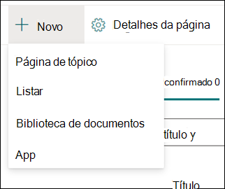
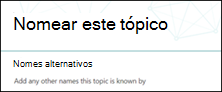
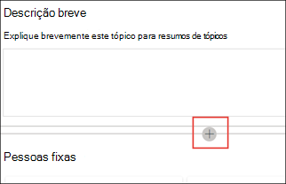

# Criar um novo tópico (versão prévia)

> [!Note] 
> O conteúdo deste artigo é para a visualização privada do Project Cortex. [Mais informações sobre o Projeto Cortex](https://aka.ms/projectcortex).

No tópico experiências, você pode criar um novo tópico se não foi descoberto por meio da indexação ou se a tecnologia AI não encontrou evidências suficientes para estabelecer o mesmo como um tópico.

## Requisitos

Para criar um novo tópico, você precisa:
- Ter um tópico enfrentando licença.
- Tem permissões para [**quem pode criar ou editar tópicos**](https://docs.microsoft.com/microsoft-365/knowledge/topic-experiences-user-permissions). Os administradores de conhecimento podem conceder essa permissão aos usuários nas configurações de permissões de tópico da rede de conhecimento. 

> [!Note] 
> Os usuários que têm permissão para gerenciar tópicos no centro de tópicos (gerentes de conhecimento) já têm permissões para criar e editar tópicos.

## Para criar um novo tópico:

1. Na página central de tópicos, selecione **novo** e, em seguida, selecione **página de tópico**. Se você não conseguir ver a **nova** opção no centro de tópicos, talvez você não tenha as permissões necessárias.

    

2. Na página novo tópico, você pode preencher as informações sobre o novo modelo de tópico:

    - Na seção **nomear este tópico** , digite o nome do novo tópico.
    
    - Na seção **nomes alternativos** , digite nomes ou acrônimos que também são usados para referir-se ao tópico.
    
    - Na seção **Descrição curta** , digite uma ou duas sentenças descrição do tópico. Este texto será usado para o cartão de tópico associado.
    
    - Na seção **pessoas** , digite os nomes dos especialistas no assunto do tópico. As pessoas que você adicionar manualmente ao tópico serão exibidas na página de tópico como **pessoas fixadas**.
    
    - Na seção **arquivos e páginas** , selecione **Adicionar** e, na próxima página, você pode selecionar arquivos associados do onedrive ou páginas do SharePoint Online.
    
    - Na seção **sites** , selecione **Adicionar**. No painel  **sites** exibido, selecione os sites associados ao tópico.

    
    
3. Se você precisar adicionar outros componentes à página, como texto, imagens, Web Parts, links, etc., selecione o ícone de tela no meio da página para localizar e adicioná-los.

    

4. Quando terminar, selecione **publicar** para publicar a página de tópico. As páginas de tópicos publicadas serão exibidas na guia **páginas** .

Depois que você publicar o artigo, o nome do tópico, o nome alternativo, a descrição e as pessoas fixas serão exibidos para todos os usuários licenciados que exibem o artigo. Arquivos, páginas e sites só serão exibidos na página de tópico se o visualizador tiver permissões do Office 365 para o item. 

A página do novo tópico é formada por Web Parts que são compatíveis com a *rede de conhecimento*. Isso significa que, como o AI coleta mais informações sobre o tópico, as informações nessas Web Parts serão atualizadas com sugestões para tornar a página mais útil para os usuários.

## Confira também

  

