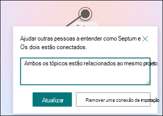
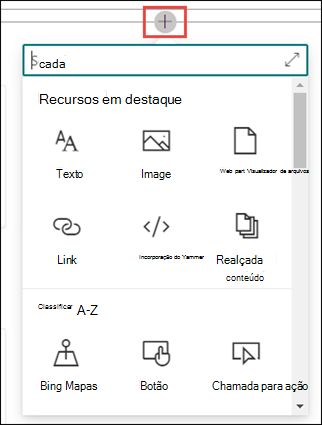

# Criar um novo tópicoCreate a new topic 

Em Tópicos do Viva, você pode criar um novo tópico se um não for descoberto por meio da indexação ou se a tecnologia de IA não tiver encontrado evidências suficientes para estabeleça-la como um tópico.In Viva Topics, you can create a new topic if one is not discovered through indexing or if the AI technology did not find enough evidence to establish it as a topic.

> [!Note] 
> Embora as informações em um tópico coletado pela AI tenham sido cortadas pela [segurança,](topic-experiences-security-trimming.md)observe que a descrição do tópico e as informações das pessoas em um tópico criado manualmente são visíveis para todos os usuários que têm permissões para exibir o tópico.While information in a topic that is gathered by AI is [security trimmed](topic-experiences-security-trimming.md), note that topic description and people information in a manually created topic is visible to all users who have permissions to view the topic. 

## RequisitosRequirements

Para criar um novo tópico, você precisa:To create a new topic, you need to:
- Tenha uma licença de Tópicos do Viva.Have a Viva Topics license.
- Ter permissões para [**Quem pode criar ou editar tópicos**](./topic-experiences-user-permissions.md).Have permissions to [**Who can create or edit topics**](./topic-experiences-user-permissions.md). Os administradores de conhecimento podem dar aos usuários essa permissão nas configurações de permissões do tópico Tópicos do Viva.Knowledge admins can give users this permission in the Viva Topics topic permissions settings. 

> [!Note] 
> Os usuários que têm permissão para gerenciar tópicos no centro de tópicos (gerentes de conhecimento) já têm permissões para criar e editar tópicos.Users who have permission to manage topics in the topic center (knowledge managers) already have permissions to create and edit topics.

## Para criar um tópicoTo create a topic

Você pode criar um novo tópico a partir de dois locais:You can create a new topic from two locations:

- Home page da central de tópicos: qualquer usuário licenciado com a permissão Quem pode criar ou editar **tópicos** (colaboradores) pode criar um novo tópico a partir da central de tópicos selecionando o <b>menu</b> Novo e selecione <b>Página tópico</b>.Topic center home page: Any licensed user with the **Who can create or edit topics** permission (contributors) can create a new topic from the topic center by selecting the <b>New</b> menu and select <b>Topic page</b>.  

       

- Página Gerenciar tópicos: qualquer usuário licenciado que tenha Quem pode gerenciar a permissão de **tópicos (gerentes** de conhecimento) pode criar um novo tópico na página Gerenciar tópicos na Central de Tópicos selecionando a página <b>Novo tópico.</b>Manage topics page:  Any licensed user who has **Who can manage topics** permission (knowledge managers) can create a new topic from the Manage topics page in the Topic Center by selecting <b>New topic page</b>.  

       

### Para criar um novo tópico:To create a new topic:

1. Selecione a opção para criar uma nova Página de Tópicos na faixa de opções na página Gerenciar Tópicos.Select the option to create a new Topic Page from the ribbon on the Manage Topics page.

2.   Na seção **Nome deste tópico,** digite o nome do novo tópico.In the **Name this topic** section, type the name of the new topic.

       

3. Na seção <b>Nomes Alternativos,</b> digite quaisquer outros nomes aos qual o tópico possa ser referido.In the <b>Alternate Names</b> section, type any other names that the topic might be referred to. 

       
4. Na seção <b>Descrição,</b> digite algumas frases que descrevem o tópico.In the <b>Description</b> section, type a couple of sentences that describe the topic. 

     

4. Na seção <b>Pessoas fixadas,</b> você pode "fixar" uma pessoa para mostrar a ela como tendo uma conexão com o tópico (por exemplo, um proprietário de um recurso conectado).In the <b>Pinned people</b> section, you can "pin" a person to show them as having a connection to the topic (for example, an owner of a connected resource). Comece digitando seu nome ou <b></b> endereço de email na caixa adicionar um novo usuário e selecione o usuário que você deseja adicionar nos resultados da pesquisa.Begin by typing their name or email address in the <b>add a new user</b> box, and then select the user you want to add from the search results. Você também pode "desempinar" selecionando o ícone <b>Remover</b> da lista no cartão de usuário.You can also "unpin" them by selecting the <b>Remove from list</b> icon on the user card. Você também pode arrastar a pessoa para alterar a ordem que a lista de pessoas aparece.You can also drag the person to change the order that the list of people appear.
 
     

5. Na seção <b>Arquivos fixados e</b> páginas, você pode adicionar ou "fixar" um arquivo ou página de site do SharePoint associada ao tópico.In the <b>Pinned files and pages</b> section, you can add or "pin" a file or SharePoint site page that is associated to the topic.

    
 
    Para adicionar um novo arquivo, selecione <b>Adicionar</b>, selecione o site do SharePoint em seus sites Frequent ou Followed e selecione o arquivo na biblioteca de documentos do site.To add a new file, select <b>Add</b>, select the SharePoint site from your Frequent or Followed sites, and then select the file from the site's document library.

    Você também pode usar <b>a opção De um link</b> para adicionar um arquivo ou página fornecendo a URL.You can also use the <b>From a link</b> option to add a file or page by providing the URL. 

    > [!Note] 
    > Os arquivos e páginas que você adiciona devem estar localizados no mesmo locatário do Microsoft 365.Files and pages that you add must be located within the same Microsoft 365 tenant. Se quiser adicionar um link a um recurso externo no tópico, você pode adicioná-lo por meio do ícone de tela na etapa 8.If you want to add a link to an external resource in the topic, you can add it through the canvas icon in step 8.

6.  A <b>seção Sites relacionados</b> mostra sites que têm informações sobre o tópico.The <b>Related sites</b> section shows sites that have information about the topic. 

     

    Você pode adicionar um site relacionado selecionando <b>Adicionar</b> e, em seguida, pesquisando o site ou selecionando-o em sua lista de sites Frequentes ou Recentes.You can add a related site by selecting <b>Add</b> and then either searching for the site, or selecting it from your list of Frequent or Recent sites. 
    
     

7. A <b>seção Tópicos relacionados</b> mostra conexões existentes entre tópicos.The <b>Related topics</b> section shows connections that exist between topics. Você pode adicionar uma conexão a um tópico diferente selecionando o botão <b>Conectar a</b> um tópico relacionado e digitando o nome do tópico relacionado e selecionando-o nos resultados da pesquisa.You can add a connection to a different topic by selecting the <b>Connect to a related topic</b> button, and then typing the name of the related topic, and selecting it from the search results. 

      

    Em seguida, você pode dar uma descrição de como os tópicos estão relacionados e selecionar <b>Atualizar</b>.You can then give a description of how the topics are related, and select <b>Update</b>. 

     

   O tópico relacionado adicionado será exibido como um tópico conectado.The related topic you added will display as a connected topic.

     

   Para remover um tópico relacionado, selecione o tópico que você deseja remover e selecione o <b>ícone Remover tópico.</b>To remove a related topic, select the topic you want to remove, then select the <b>Remove topic</b> icon. 
 
      

   Em seguida, <b>selecione Remover</b>.Then select <b>Remove</b>. 

     
     
 

8. Você também pode adicionar itens estáticos à página (como texto, imagens ou links) selecionando o ícone de tela, que você pode encontrar abaixo da descrição curta.You can also add static items to the page (such as text, images, or links) by selecting the canvas icon, which you can find below the short description. A seleção abrirá a caixa de ferramentas do SharePoint da qual você pode escolher o item que deseja adicionar à página.Selecting it will open the SharePoint toolbox from which you can choose the item you want to add to the page.

     

9. Selecione **Publicar** para salvar suas alterações.Select **Publish** to save your changes. 

Depois de publicar a página, o nome do tópico, o nome alternativo, a descrição e as pessoas fixadas serão exibidos para todos os usuários licenciados que exibirem o tópico.After you publish the page, the topic name, alternate name, description, and pinned people will display to all licensed users who view the topic. Arquivos, páginas e sites específicos só serão exibidos na página de tópicos se o visualizador tiver permissões do Office 365 para o item.Specific files, pages, and sites will only appear on the topic page if the viewer has Office 365 permissions to the item. 

## Confira tambémSee also

