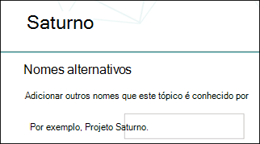

# Criar um novo tópico 

Em Tópicos do Viva, você pode criar um novo tópico se não for descoberto por meio da indexação ou se a tecnologia de IA não tiver encontrado evidências suficientes para estabeleça-o como um tópico.

> [!Note] 
> Embora as informações em um tópico coletados pela IA tenham sido cortadas com segurança, observe que a descrição do tópico e as informações das pessoas em um tópico criado manualmente são visíveis para todos os usuários que têm permissões para exibir o tópico. 

## Requisitos

Para criar um novo tópico, você precisa:
- Ter uma licença de Tópicos do Viva.
- Ter permissões para [**Quem pode criar ou editar tópicos.**](https://docs.microsoft.com/microsoft-365/knowledge/topic-experiences-user-permissions) Os administradores de conhecimento podem dar aos usuários essa permissão nas configurações de permissões do tópico Tópicos do Viva. 

> [!Note] 
> Os usuários que têm permissão para gerenciar tópicos no centro de tópicos (gerentes de conhecimento) já têm permissões para criar e editar tópicos.

## Para criar um tópico

Você pode criar um novo tópico a partir de dois locais:

- Home page do centro de tópicos: qualquer usuário licenciado com a permissão Quem pode criar ou editar **tópicos** (colaboradores) pode criar um novo tópico na central de tópicos selecionando o <b>menu</b> Novo e selecionar a página <b>Tópico.</b>  

       

- Página Gerenciar tópicos: qualquer usuário licenciado que tenha a permissão Quem pode gerenciar **tópicos (gerentes** de conhecimento) pode criar um novo tópico na página Gerenciar tópicos na Central de Tópicos selecionando a página <b>Novo tópico.</b>  

       

### Para criar um novo tópico:

1. Na seção **Nome deste tópico,** digite o nome do novo tópico.

       

2. Na seção <b>Nomes Alternativos,</b> digite qualquer outro nome ao qual o tópico possa ser referido. 

       
3. Na seção <b>Descrição,</b> digite algumas frases que descrevem o tópico. 

     

4. Na seção <b>Pessoas fixadas,</b> você pode "fixar" uma pessoa para exibi-la como um especialista no assunto sobre o tópico. Comece digitando seu nome ou <b></b> endereço de email na caixa adicionar um novo usuário e selecione o usuário que você deseja adicionar nos resultados da pesquisa. Você também pode "inpiná-los" selecionando o ícone <b>Remover da</b> lista no cartão do usuário. Você também pode arrastar a pessoa para alterar a ordem em que a lista de pessoas aparece.
 
     

5. Na seção <b>Arquivos e páginas</b> fixados, você pode adicionar ou "fixar" um arquivo ou uma página de site do SharePoint que está associada ao tópico.

    
 
    Para adicionar um novo arquivo, selecione <b>Adicionar</b>, selecione o site do SharePoint em seus sites Frequentes ou Seguidos e selecione o arquivo na biblioteca de documentos do site.

    Você também pode usar <b>a opção De um link</b> para adicionar um arquivo ou página fornecendo a URL. 

    > [!Note] 
    > Os arquivos e páginas que você adiciona devem estar localizados no mesmo locatário do Microsoft 365. Se quiser adicionar um link a um recurso externo no tópico, você pode adicioná-lo por meio do ícone de tela na etapa 8.

6.  A <b>seção Sites relacionados</b> mostra sites que têm informações sobre o tópico. 

     

    Você pode adicionar um site relacionado selecionando <b>Adicionar</b> e, em seguida, pesquisando o site ou selecionando-o em sua lista de sites Frequentes ou Recentes. 
    
     

7. A <b>seção Tópicos relacionados</b> mostra conexões que existem entre tópicos. Você pode adicionar uma conexão a um tópico diferente selecionando o botão Conectar <b>a</b> um tópico relacionado, digitando o nome do tópico relacionado e selecionando-o nos resultados da pesquisa. 

      

    Em seguida, você pode dar uma descrição de como os tópicos estão relacionados e selecionar <b>Atualizar.</b> 

     

   O tópico relacionado adicionado será exibido como um tópico conectado.

     

   Para remover um tópico relacionado, selecione o tópico que você deseja remover e selecione o <b>ícone Remover</b> tópico. 
 
      

   Em seguida, <b>selecione Remover</b>. 

     
     
 

8. Você também pode adicionar itens estáticos à página (como texto, imagens ou links) selecionando o ícone de tela, que pode ser localizado abaixo da descrição curta. Se você selecioná-la, ela abrirá a caixa de ferramentas do SharePoint da qual você pode escolher o item que deseja adicionar à página.

     

9. Selecione **Publicar** para salvar suas alterações. 

Depois de publicar a página, o nome do tópico, o nome alternativo, a descrição e as pessoas fixadas serão exibidos para todos os usuários licenciados que exibirem o tópico. Arquivos, páginas e sites específicos só aparecerão na página de tópico se o visualizador tiver permissões do Office 365 para o item. 

## Confira também

  

