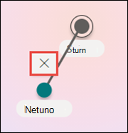
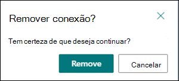

# Editar um tópico existente em Tópicos do Microsoft Viva 

 

> [!VIDEO https://www.microsoft.com/videoplayer/embed/RE4LA4n]  

 

Em Tópicos do Viva, você pode editar um tópico existente. Talvez seja necessário fazer isso se quiser corrigir ou adicionar informações adicionais a uma página de tópico existente. 

> [!Note] 
> Embora as informações em um tópico coletado pela AI são cortadas pela [segurança,](topic-experiences-security-trimming.md)observe que a descrição do tópico e as informações de pessoas que você adiciona manualmente ao editar um tópico existente são visíveis para todos os usuários que têm permissões para exibir tópicos. 

## Requisitos

Para editar um tópico existente, você precisa:
- Tenha uma licença de Tópicos do Viva.
- Ter permissões para [**Quem pode criar ou editar tópicos**](./topic-experiences-user-permissions.md). Os administradores de conhecimento podem dar aos usuários essa permissão nas configurações de permissões do tópico Tópicos do Viva. 

> [!Note] 
> Os usuários que têm permissão para gerenciar tópicos no Centro de Tópicos (gerentes de conhecimento) já têm permissões para criar e editar tópicos.

## Como editar uma página de tópico

Os usuários que têm a permissão Quem pode criar ou editar **tópicos** podem editar um <b></b> tópico abrindo a página de tópico de um destaque de tópico e selecionando o botão Editar na parte superior direita da página de tópicos. A página de tópicos também pode ser aberta na home page da central de tópicos, onde você pode encontrar todos os tópicos aos quais você tem uma conexão.

      

Os gerentes de conhecimento também podem editar tópicos diretamente da página Gerenciar Tópicos selecionando o tópico e selecionando <b>Editar</b> na barra de ferramentas.

      

### Para editar uma página de tópico

1. Na página de tópicos, selecione **Editar**. Isso permite que você faça alterações conforme necessário na página de tópicos.

       

2. Na seção <b>Nomes Alternativos,</b> digite quaisquer outros nomes aos qual o tópico possa ser referido. 

       
3. Na seção <b>Descrição,</b> digite algumas frases que descrevem o tópico. Ou se uma descrição já existir, atualize-a se necessário.

     

4. Na seção <b>Pessoas Fixadas,</b> você pode "fixar" uma pessoa para mostrar a ela como tendo uma conexão com o tópico (por exemplo, um proprietário de um recurso conectado). Comece digitando seu nome ou endereço de email na caixa <b>Adicionar</b> um novo usuário e selecionando o usuário que você deseja adicionar nos resultados da pesquisa. Você também pode "desempinar" selecionando o ícone <b>Remover</b> da lista no cartão de usuário.
 
     

    A <b>seção Pessoas sugeridas</b> mostra aos usuários que a IA acha que podem estar conectados ao tópico a partir de sua conexão com recursos sobre o tópico. Você pode alterar seu status de Sugerido para Fixado selecionando o ícone de pino no cartão de usuário.

    

5. Na seção <b>Arquivos fixados e</b> páginas, você pode adicionar ou "fixar" um arquivo ou página de site do SharePoint associada ao tópico.

    
 
    Para adicionar um novo arquivo, selecione <b>Adicionar</b>, selecione o site do SharePoint em seus sites Frequent ou Followed e selecione o arquivo na biblioteca de documentos do site.

    Você também pode usar <b>a opção De um link</b> para adicionar um arquivo ou página fornecendo a URL. 

   > [!Note] 
   > Os arquivos e páginas que você adiciona devem estar localizados no mesmo locatário do Microsoft 365. Se você quiser adicionar um link a um recurso externo no tópico, você pode adicioná-lo por meio do ícone de tela na etapa 9.

6. A <b>seção Arquivos e páginas sugeridos</b> mostra arquivos e páginas que a IA sugere estar associada ao tópico.

    

    Você pode alterar um arquivo ou página sugerido para um arquivo ou página fixado selecionando o ícone fixado.

7.  A <b>seção Sites relacionados</b> mostra sites que têm informações sobre o tópico. 

     

    Você pode adicionar um site relacionado selecionando <b>Adicionar</b> e, em seguida, pesquisando o site ou selecionando-o em sua lista de sites Frequentes ou Recentes. 
    
     

8. A <b>seção Tópicos relacionados</b> mostra conexões existentes entre tópicos. Você pode adicionar uma conexão a um tópico diferente selecionando o botão <b>Conectar a</b> um tópico relacionado e digitando o nome do tópico relacionado e selecionando-o nos resultados da pesquisa. 

      

    Em seguida, você pode dar uma descrição de como os tópicos estão relacionados e selecionar <b>Atualizar</b>. 

     

   O tópico relacionado adicionado será exibido como um tópico conectado.

     

   Para remover um tópico relacionado, selecione o tópico que você deseja remover e selecione o <b>ícone Remover tópico.</b> 
 
      

   Em seguida, <b>selecione Remover</b>. 

     

9. Você também pode adicionar itens estáticos à página , como texto, imagens ou links, selecionando o ícone de tela, que você pode encontrar abaixo da descrição curta. A seleção abrirá a caixa de ferramentas do SharePoint da qual você pode escolher o item que deseja adicionar à página.

     

10. Selecione **Publicar** **ou Republicar para** salvar suas alterações. **Republicar** será sua opção disponível se o tópico tiver sido publicado anteriormente.

## Confira também

