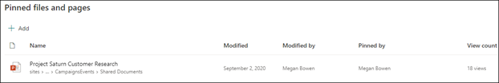
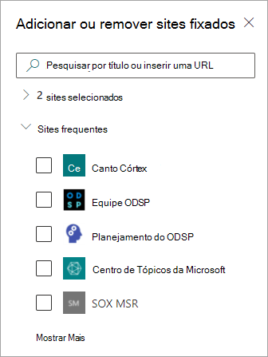

# Editar um tópico existente em Tópicos do Microsoft VivaEdit an existing topic in Microsoft Viva Topics 

 

> [!VIDEO https://www.microsoft.com/videoplayer/embed/RE4LA4n]  

 

Em Tópicos do Viva, você pode editar um tópico existente.In Viva Topics, you can edit an existing topic. Talvez seja necessário fazer isso se quiser corrigir ou adicionar informações adicionais a uma página de tópicos existente.You might need to do this if you want to correct or add additional information to an existing topic page. 

> [!Note] 
> Embora as informações em um tópico coletado pela AI são cortadas pela [segurança,](topic-experiences-security-trimming.md)a descrição do tópico e as informações de pessoas que você adiciona manualmente ao editar um tópico existente são visíveis para todos os usuários que têm permissões para exibir tópicos.While information in a topic that is gathered by AI is [security trimmed](topic-experiences-security-trimming.md), the topic description and people information that you manually add when editing an existing topic is visible to all users who have permissions to view topics. 

## RequirementsRequirements

Para editar um tópico existente, você precisa:To edit an existing topic, you need to:
- Ter uma licença do Viva Topics.Have a Viva Topics license.
- Ter permissões para [criar ou editar tópicos](./topic-experiences-user-permissions.md).Have permissions to [create or edit topics](./topic-experiences-user-permissions.md). Os Administradores de conhecimento podem dar aos usuários essa permissão nas configurações de permissões do tópico do Viva Topics.Knowledge admins can give users this permission in the Viva Topics topic permissions settings. 

> [!Note] 
> Os usuários que têm permissão para gerenciar tópicos no centro de tópicos (gerentes de conhecimento) já têm permissões para criar e editar tópicos.Users who have permission to manage topics in the topic center (knowledge managers) already have permissions to create and edit topics.

## Como editar uma página de tópicoHow to edit a topic page

Os usuários que têm o Who podem criar ou editar *tópicos* permissão podem editar um tópico  abrindo a página de tópico de um destaque de tópico e, em seguida, selecionando o botão Editar na parte superior direita da página de tópico.Users who have the *Who can create or edit topics* permission can edit a topic by opening the topic page from a topic highlight, and then selecting the **Edit** button on the top right of the topic page. A página de tópicos também pode ser aberta na home page da central de tópicos, onde você pode encontrar todos os tópicos aos quais você tem uma conexão.The topic page can also be opened from the topic center home page where you can find all the topics that you have a connection to.

      

Os gerentes de conhecimento também podem editar tópicos diretamente da página **Gerenciar tópicos** selecionando o tópico e selecionando **Editar** na barra de ferramentas.Knowledge managers can also edit topics directly from the **Manage topics** page by selecting the topic, and then selecting **Edit** in the toolbar.

   

### Para editar uma página de tópicoTo edit a topic page

1. Na página de tópicos, selecione **Editar**.On the topic page, select **Edit**. Isso permite que você faça alterações na página de tópico conforme necessário.This lets you make changes as needed to the topic page.

     

2. Na seção **Nomes alternativos,** digite quaisquer outros nomes aos qual o tópico possa ser referido.In the **Alternate names** section, type any other names that the topic might be referred to. 

    

3. Na seção **Descrição**, digite algumas frases que descrevam o tópico.In the **Description** section, type a couple of sentences that describes the topic. Ou se uma descrição já existir, atualize-a, se necessário.Or if a description already exists, update it if needed.

     

4. Na seção **Pessoas fixadas**, você pode “fixar” uma pessoa para mostrar que ela tem uma conexão com o tópico (por exemplo, um proprietário de um recurso conectado).In the **Pinned people** section, you can "pin" a person to show them as having a connection the topic (for example, an owner of a connected resource). Comece digitando seu nome ou endereço de email na caixa **Adicionar** um novo usuário e selecionando o usuário que você deseja adicionar nos resultados da pesquisa.Begin by typing their name or email address in the **Add a new user** box, and then selecting the user you want to add from the search results. Você também pode "desempinar" selecionando o ícone **Remover** da lista no cartão de usuário.You can also "unpin" them by selecting the **Remove from list** icon on the user card.
 
     

    A seção **Pessoas sugeridas** mostra usuários que a IA acredita estarem conectados ao tópico a partir de suas conexões aos recursos sobre o tópico.The **Suggested people** section shows users that AI thinks might be connected to the topic from their connection to resources about the topic. Você pode mudar o status de Sugeridos para Fixados selecionando o ícone de fixação no cartão de usuário.You can change their status from Suggested to Pinned by selecting the pin icon on the user card.

   

5. Na seção **Arquivos e páginas fixados**, você pode adicionar um “fixar” um arquivo ou página de site do SharePoint associada ao tópico.In the **Pinned files and pages** section, you can add or "pin" a file or SharePoint site page that is associated to the topic.

   
 
    Para adicionar um novo arquivo, selecione **Adicionar**, selecione o site SharePoint de seus sites Frequentes ou Seguidos e selecione o arquivo na biblioteca de documentos do site.To add a new file, select **Add**, select the SharePoint site from your Frequent or Followed sites, and then select the file from the site's document library.

    Você também pode usar a opção **De um link** para adicionar um arquivo ou página fornecendo a URL.You can also use the **From a link** option to add a file or page by providing the URL. 

   > [!Note] 
   > Arquivos e páginas que você adicionar devem estar localizados no mesmo locatário Microsoft 365.Files and pages that you add must be located within the same Microsoft 365 tenant. Se você quiser adicionar um link a um recurso externo no tópico, você pode adicioná-lo por meio do ícone de tela na etapa 9.If you want to add a link to an external resource in the topic, you can add it through the canvas icon in step 9.

6. A **seção Arquivos e páginas sugeridos** mostra arquivos e páginas que a IA sugere estar associada ao tópico.The **Suggested files and pages** section shows files and pages that AI suggests to be associated to the topic.

   

    Você pode alterar um arquivo ou página sugerida para uma arquivo ou página fixada selecionando o ícone de fixação.You can change a suggested file or page to a pinned file or page by selecting the pinned icon.

7.  Na seção **Sites Fixados,** você pode adicionar ou "fixar" um site associado ao tópico.In the **Pinned sites** section, you can add or “pin” a site that is associated to the topic. 

    

    Para adicionar um novo site, selecione **Adicionar** e, em seguida, pesquise o site ou selecione-o na sua lista de sites Frequentes ou Recentes.To add a new site, select **Add** and then either search for the site, or select it from your list of Frequent or Recent sites.
    
    

8. A **seção Sites** sugeridos mostra os sites que a IA sugere estar associado ao tópico.The **Suggested sites** section shows the sites that AI suggests to be associated to the topic. 

     

    Você pode alterar um site sugerido para um site fixado selecionando o ícone fixado.You can change a suggested site to a pinned site by selecting the pinned icon.

<!---

7.  The <b>Related sites</b> section shows sites that have information about the topic. 

     

    You can add a related site by selecting <b>Add</b> and then either searching for the site, or selecting it from your list of Frequent or Recent sites. 
    
     

8. The <b>Related topics</b> section shows connections that exists between topics. You can add a connection to a different topic by selecting the <b>Connect to a related topic</b> button, and then typing the name of the related topic, and selecting it from the search results. 

      

    You can then give a description of how the topics are related, and select <b>Update</b>. 

     

   The related topic you added will display as a connected topic.

     

   To remove a related topic, select the topic you want to remove, then select the <b>Remove topic</b> icon. 
 
      

   Then select <b>Remove</b>. 

     

--->

9. Você também pode adicionar itens estáticos à pagina, como texto, imagens ou links, selecionando o ícone de tela, que você pode encontrar abaixo da breve descrição.You can also add static items to the page — such as text, images, or links - by selecting the canvas icon, which you can find below the short description. A seleção abrirá a SharePoint de ferramentas da qual você pode escolher o item que deseja adicionar à página.Selecting it will open the SharePoint toolbox from which you can choose the item you want to add to the page.

   

10. Selecione **Publicar** ou **Republicar** para salvar suas alterações.Select **Publish** or **Republish** to save your changes. **Republicar** será sua opção disponível se o tópico tiver sido publicado anteriormente.**Republish** will be your available option if the topic has been published previously.

