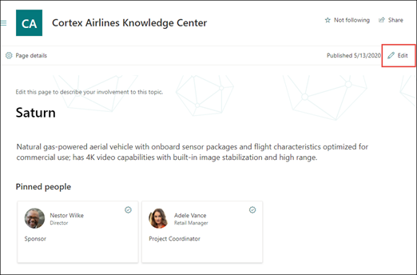

# Editar um tópico existenteEdit an existing topic 

 

> [!VIDEO https://www.microsoft.com/videoplayer/embed/RE4LA4n]  

 

Em Tópicos do Viva, você pode editar um tópico existente.In Viva Topics, you can edit an existing topic. Talvez seja necessário fazer isso se quiser corrigir ou adicionar informações adicionais a uma página de tópicos existente.You may need to do this if you want to correct or add additional information to an existing topic page. 

> [!Note] 
> Embora as informações em um tópico coletados pela ia tenham sido cortadas com [segurança,](topic-experiences-security-trimming.md)observe que as informações que você adiciona manualmente ao editar um tópico existente são visíveis para todos os usuários que têm permissões para exibir tópicos.While information in a topic that is gathered by AI is [security trimmed](topic-experiences-security-trimming.md), note that information that you manually add when editing an existing topic is visible to all users who have permissions to view topics. 

## RequisitosRequirements

Para editar um tópico existente, você precisa:To edit an existing topic, you need to:
- Ter uma licença de Tópicos do Viva.Have a Viva Topics license.
- Ter permissões para [**Quem pode criar ou editar tópicos.**](https://docs.microsoft.com/microsoft-365/knowledge/topic-experiences-user-permissions)Have permissions to [**Who can create or edit topics**](https://docs.microsoft.com/microsoft-365/knowledge/topic-experiences-user-permissions). Os administradores de conhecimento podem dar aos usuários essa permissão nas configurações de permissões do tópico Tópicos do Viva.Knowledge admins can give users this permission in the Viva Topics topic permissions settings. 

> [!Note] 
> Os usuários que têm permissão para gerenciar tópicos na Central de Tópicos (gerentes de conhecimento) já têm permissões para criar e editar tópicos.Users who have permission to manage topics in the Topic center (knowledge managers) already have permissions to create and edit topics.

## Como editar uma página de tópicoHow to edit a topic page

Os usuários que têm a permissão Quem pode criar ou **editar tópicos** podem editar um <b></b> tópico abrindo a página de tópico a partir de um destaque de tópico e, em seguida, selecionando o botão Editar no canto superior direito da página de tópicos.Users who have the **Who can create or edit topics** permission can edit a topic by opening the topic page from a topic highlight, and then selecting the <b>Edit</b> button on the top right of the topic page. A página de tópicos também pode ser aberta na home page do centro de tópicos, onde você pode encontrar todos os tópicos aos quais tem uma conexão.The topic page can also be opened from the topic center home page where you can find all the topics that you have a connection to.

      

Os gerentes de conhecimento também podem editar tópicos diretamente da página Gerenciar Tópicos selecionando o tópico e selecionando <b>Editar</b> na barra de ferramentas.Knowledge managers can also edit topics directly from the Manage Topics page by selecting the topic, and then selecting <b>Edit</b> in the toolbar.

      

### Para editar uma página de tópicoTo edit a topic page

1. Na página de tópicos, selecione **Editar**.On the topic page, select **Edit**. Isso permite que você faça alterações conforme necessário na página de tópicos.This allows you to make changes as you need to the topic page.

       

2. Na seção <b>Nomes Alternativos,</b> digite qualquer outro nome ao qual o tópico possa ser referido.In the <b>Alternate Names</b> section, type any other names that the topic might be referred to. 

       
3. Na seção <b>Descrição,</b> digite algumas frases que descrevem o tópico.In the <b>Description</b> section, type a couple of sentences that describes the topic. Ou, se já existir uma descrição, atualize-a se necessário.Or if a description already exists, update it if needed.

     

4. Na seção <b>Pessoas fixadas,</b> você pode "fixar" uma pessoa para exibi-la como um especialista no assunto sobre o tópico.In the <b>Pinned people</b> section, you can "pin" a person to show them as a subject matter expert on the topic. Comece digitando seu nome ou <b></b> endereço de email na caixa Adicionar um novo usuário e selecione o usuário que você deseja adicionar nos resultados da pesquisa.Begin by typing their name or email address in the <b>Add a new user</b> box, and then selecting the user you want to add from the search results. Você também pode "inpiná-los" selecionando o ícone <b>Remover da</b> lista no cartão do usuário.You can also "unpin" them by selecting the <b>Remove from list</b> icon on the user card.
 
     

    A <b>seção Pessoas sugeridas</b> mostra aos usuários que a IA acha que podem ser especialistas no assunto no tópico em sua conexão com recursos sobre o tópico.The <b>Suggested people</b> section shows users that AI thinks might be subject matter experts on the topic from their connection to resources about the topic. Você pode alterar o status de Sugerido para Fixado selecionando o ícone de pin no cartão do usuário.You can change their status from Suggested to Pinned by selecting the pin icon on the user card.

    

5. Na seção <b>Arquivos e páginas</b> fixados, você pode adicionar ou "fixar" um arquivo ou uma página de site do SharePoint que está associada ao tópico.In the <b>Pinned files and pages</b> section, you can add or "pin" a file or SharePoint site page that is associated to the topic.

    
 
    Para adicionar um novo arquivo, selecione <b>Adicionar</b>, selecione o site do SharePoint em seus sites Frequentes ou Seguidos e selecione o arquivo na biblioteca de documentos do site.To add a new file, select <b>Add</b>, select the SharePoint site from your Frequent or Followed sites, and then select the file from the site's document library.

    Você também pode usar <b>a opção De um link</b> para adicionar um arquivo ou página fornecendo a URL.You can also use the <b>From a link</b> option to add a file or page by providing the URL. 

6. A <b>seção Arquivos e páginas Sugeridos</b> mostra arquivos e páginas que a IA sugere que sejam associadas ao tópico.The <b>Suggested files and pages</b> section shows files and pages that AI suggests to be associated to the topic.

    

    Você pode fazer uma sugestão de arquivo ou página para um arquivo ou página fixada selecionando o ícone fixado.You can make a suggested file or page to a pinned file or page by selecting the pinned icon.

7.  A <b>seção Sites relacionados</b> mostra sites que têm informações sobre o tópico.The <b>Related sites</b> section shows sites that have information about the topic. 

     

    Você pode adicionar um site relacionado selecionando <b>Adicionar</b> e, em seguida, pesquisando o site ou selecionando-o em sua lista de sites Frequentes ou Recentes.You can add a related site by selecting <b>Add</b> and then either searching for the site, or selecting it from your list of Frequent or Recent sites. 
    
     

8. A <b>seção Tópicos Relacionados</b> mostra conexões existentes entre tópicos.The <b>Related topics</b> section shows connections that exists between topics. Você pode adicionar uma conexão a um tópico diferente selecionando o botão Conectar <b>a</b> um tópico relacionado, digitando o nome do tópico relacionado e selecionando-o nos resultados da pesquisa.You can add a connection to a different topic by selecting the <b>Connect to a related topic</b> button, and then typing the name of the related topic, and selecting it from the search results. 

      

    Em seguida, você pode dar uma descrição de como os tópicos estão relacionados e selecionar <b>Atualizar.</b>You can then give a description of how the topics are related, and select <b>Update</b>. 

     

   O tópico relacionado adicionado será exibido como um tópico conectado.The related topic you added will display as a connected topic.

     

9. Você também pode adicionar itens estáticos à página , como texto, imagens ou links, selecionando o ícone de tela, que pode ser localizado abaixo da descrição curta.You can also add static items to the page — such as text, images, or links - by selecting the canvas icon, which you can find below the short description. Se você selecioná-la, ela abrirá a caixa de ferramentas do SharePoint da qual você pode escolher o item que deseja adicionar à página.Selecting it will open the SharePoint toolbox from which you can choose the item you want to add to the page.

     

10. Selecione **Publicar** ou **Republicar para** salvar suas alterações.Select **Publish** or **Republish** to save your changes. **Republicar** será sua opção disponível se o tópico tiver sido publicado anteriormente.**Republish** will be your available option if the topic has been published previously.

## Confira tambémSee also

  

