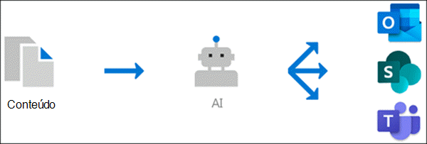

# 0verview de gerenciamento de conhecimento (versão prévia)Knowledge management 0verview (Preview)

> [!Note] 
> O conteúdo deste artigo é para a visualização privada do Project Cortex.The content in this article is for Project Cortex Private Preview. [Saiba mais sobre o Project CortexFind out more about Project Cortex](https://aka.ms/projectcortex) 

O gerenciamento de conhecimento usa a tecnologia Microsoft AI, a Microsoft 365, o Delve, Pesquisar e outros componentes e serviços para criar uma rede de conhecimento em seu ambiente do Microsoft 365.Knowledge management uses Microsoft AI technology, Microsoft 365, Delve, Search, and other components and services to build a knowledge network in your Microsoft 365 environment. 

      

É a meta de fornecer informações aos usuários nos aplicativos que usam diariamente, como o Outlook, o Teams e o SharePoint.It's goal is to deliver information to you users in apps they use everyday, such as Outlook, Teams, and SharePoint.

Por exemplo, os usuários visualizam termos não familiares em seus emails, sites do SharePoint ou em conversas do Teams, que desejam saber mais.For example, users see unfamiliar terms in their emails, SharePoint sites, or in Teams conversations, that they want to know more about. O gerenciamento de conhecimento usa o AI para pesquisa e identifica automaticamente esses **Tópicos**, e compila as informações sobre eles, como uma breve descrição, especialistas no assunto e sites, arquivos e páginas relacionados a ele.Knowledge management uses AI to automatically searches for and identifies these **topics**, and compiles information about them, such as a short description, subject matter experts on the topic, and sites, files, and pages that are related to it. Você pode optar por atualizar as informações do tópico, conforme necessário.You can choose to update the topic information as needed. Em seguida, você pode disponibilizar os tópicos aos usuários, o que significa que, para cada instância do tópico que aparece em aplicativos como Outlook, Teams e SharePoint, o texto será realçado.You can then make the topics available to your users, which means that for every instance of the topic that appears in apps such as Outlook, Teams, and SharePoint, the text will be highlighted. Os usuários podem optar por selecionar o tópico para saber mais sobre ele por meio dos detalhes do tópico.Users can choose to select the topic to learn more about it through the topic details.

## Descoberta de tópicosTopic discovery

O gerenciamento de conhecimento usa a tecnologia Microsoft AI para pesquisar **Tópicos** no seu ambiente do Office 365.Knowledge Management uses Microsoft AI technology to search for **topics** in your Office 365 environment.

Um tópico é uma frase ou um termo que é organizacional significativo ou importante.A topic is a phrase or term that is organizationally significant or important. Ele tem um significado específico para a organização e tem recursos relacionados a ele que podem ajudar as pessoas a entender o que é e encontrar mais informações sobre ele.It has a specific meaning to the organization, and has resources related to it that can help people understand what it is and find more information about it.

Quando um tópico é descoberto, uma **página de tópico** é criada para ele que contém informações que foram coletadas por meio da descoberta de tópicos, como:When a topic is discovered, a **topic page** is created for it that contains information that was gathered through topic discovery, such as:

- Uma breve descrição do tópico.A short description of the topic.
- Usuários que podem ter conhecimento do tópico.Users who might be knowledgeable about the topic.
- Arquivos, páginas e sites relacionados ao tópico.Files, pages, and sites that are related to the topic.

## Gerenciamento de tópicosTopic management

O gerenciamento de tópicos é feito no **centro de tópicos**da sua organização.Topic management is done in your organization's **topic center**. O site do centro de tópicos é criado durante a instalação e serve como seu centro de conhecimento para sua organização.The topic center site is created during setup and serves as your center of knowledge for your organization. Ele conterá uma lista de todos os tópicos que foram descobertos em seu ambiente, bem como todas as páginas de tópicos que foram criadas para esses tópicos.It will contain a list of all topics that were discovered in your environment, as well as all topic pages that were created for these topics. 

Os usuários que receberão as permissões corretas poderão fazer o seguinte no centro de tópicos:Users who are provided the correct permissions will be able to do the following in the topic center:

- Confirmar ou rejeitar tópicos que foram descobertos em seu locatário.Confirm or reject topics that were discovered in your tenant.
- Crie novos tópicos manualmente, conforme necessário (por exemplo, se não forem fornecidas informações suficientes para serem descobertas por meio do AI).Create new topics manually as needed (for example, if not enough information was provided for it to be discovered through AI).
- Editar páginas de tópico existentes.Edit existing topic pages. 

Confira [o tópico trabalhar com no tópico central](work-with-topics.md) para obter mais informações.See [Work with topic in the topic center](work-with-topics.md) for more information.  

## Controles de administradorAdmin controls

Os controles de administrador no centro de administração do Microsoft 365 permitem que você gerencie sua rede de conhecimento.Admin controls in the Microsoft 365 admin center  allow you to manage your knowledge network. Eles permitem que um administrador global do Microsoft 365 ou do SharePoint:They allow a Microsoft 365 global or SharePoint admin to:

- Controlar quais usuários da sua organização têm permissão para ver tópicos em seus aplicativos cliente ou nos resultados de pesquisa do SharePoint.Control which users in your organization are allowed to see topics in their client apps or in SharePoint search results.
- Controlar quais sites do SharePoint serão rastreados para Pesquisar tópicos.Control which SharePoint sites will be crawled to search for topics.
- Configure o tópico Discovery para excluir termos específicos que você não deseja que sejam um tópico.Configure topic discovery to exclude specific terms that you don't want to be a topic.
- Controlar quais usuários podem confirmar ou rejeitar tópicos no centro de tópicos.Control which users can to confirm or reject topics in the topic center.
- Controlar quais usuários podem criar e editar tópicos no centro de tópicos.Control which users can create and edit topics in the topic center.

Consulte [gerenciar sua rede de conhecimento](manage-knowledge-network.md) para obter mais informações.See [Manage your knowledge network](manage-knowledge-network.md) for more information. 

## Organizada de tópicosTopic curation

O AI funcionará continuamente para fornecer sugestões para melhorar seus tópicos à medida que as alterações ocorrerem em seu ambiente.AI will continually work to provide you suggestions to improve your topics as changes occur in your environment.

Os usuários que permitem o acesso para ver os tópicos em seus trabalhos diários têm permissão para fazer sugestões para melhorá-los.Users who you allow access to see topics in their daily work are allowed to make suggestions to improve them. Por exemplo, se um usuário exibir a página de tópico e ver informações incorretas ou que precisam ser adicionadas, um link na página de tópico permite que eles enviem uma solicitação para atualizar as informações.For example, if a user views the topic page and sees information that is incorrect or needs to be added, a link on the topic page allows them to submit a request to update the information.

Além disso, os usuários com permissões adequadas podem marcar itens como conversa de equipes que são relevantes para um tópico e adicioná-los a um tópico específico.Additionally, users with proper permissions can tag items such as Teams conversation that are relevant to a topic, and add them to a specific topic.

## Confira tambémSee also
[Configurar o gerenciamento de conhecimentoSet up knowledge management](set-up-knowledge-network.md) 
[Visão geral do centro de tópicosTopic center overview](topic-center-overview.md)
