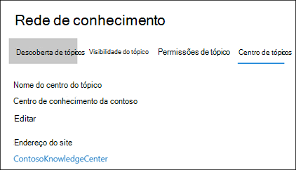
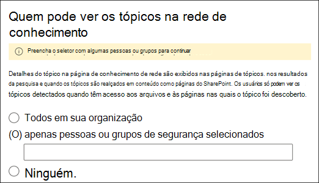
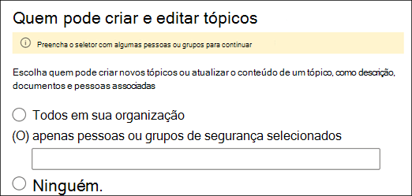
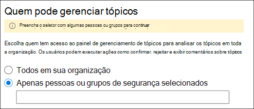
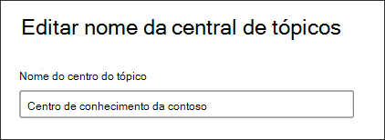

# Gerenciar sua rede de gerenciamento de conhecimento (versão prévia)Manage your knowledge management network (Preview)

> [!Note] 
> O conteúdo deste artigo é para a visualização privada do Project Cortex.The content in this article is for Project Cortex Private Preview. [Saiba mais sobre o Project Cortex](https://aka.ms/projectcortex).[Find out more about Project Cortex](https://aka.ms/projectcortex).

Depois de [Configurar o gerenciamento de conhecimento](set-up-knowledge-network.md), a qualquer momento depois, um administrador pode fazer ajustes nas suas definições de configuração através do centro de administração do Microsoft 365.After you [set up knowledge management](set-up-knowledge-network.md), at any time afterwards an admin can make adjustments to your configuration settings through the Microsoft 365 admin center.

Por exemplo, você pode precisar ajustar suas configurações para qualquer um dos seguintes:For example, you may need to adjust your settings for any of the following:
- Adicione novas fontes do SharePoint aos tópicos de meus.Add new SharePoint sources to mine topics.
- Alterar quais usuários terão acesso aos tópicos.Change which users will have access to topics.
- Alterar quais usuários têm permissões para executar tarefas no centro de tópicos.Change which users have permissions to do tasks on the topic center.
- Alterar o nome do seu centro de tópicoChange the name of your topic center

## RequisitosRequirements 
Você deve ter permissões de administrador global ou administrador do SharePoint para poder acessar o centro de administração do Microsoft 365 e gerenciar tarefas de conhecimento organizacional.You must have Global Admin or SharePoint admin permissions to be able to access the Microsoft 365 admin center and manage Organizational knowledge tasks.

## Para acessar as configurações de gerenciamento de conhecimento:To access knowledge management settings:

1. No centro de administração do Microsoft 365, selecione **configuração**e, em seguida, exiba a seção de **conhecimento organizacional** .In the Microsoft 365 admin center, select **Setup**, and then view the **Organizational Knowledge** section.
2. Na seção **conhecimento organizacional** , clique em **conectar pessoas a conhecimento**.In the **Organizational Knowledge** section, click **Connect people to knowledge**. 

      

3. Na página **conectar pessoas a conhecimento** , selecione **gerenciar** para abrir o painel **configurações de rede de conhecimento** .On the **Connect people to knowledge** page, select **Manage** to open the **Knowledge network settings** pane. 

      

## Alterar o modo como a rede de conhecimento pode encontrar tópicosChange how the knowledge network can find topics

Selecione a guia **descoberta de tópico** se quiser atualizar suas escolhas para as fontes de tópico do SharePoint.Select the **Topic discovery** tab if you want to update your choices for  for SharePoint topic sources. Essa configuração permite que você selecione os sites do SharePoint em seu locatário que serão rastreados e extraídos para tópicos.This setting let you select the SharePoint sites in your tenant that will be crawled and mined for topics.

1. Na guia **descoberta de tópico** , em **selecionar fontes de tópicos do SharePoint**, selecione **Editar**.On the **Topic discovery** tab, under **Select SharePoint topic sources**, select **Edit**.
2. Na página **selecionar fontes de tópicos do SharePoint** , selecione quais sites do SharePoint serão rastreados como fontes para seus tópicos durante a descoberta.On the **Select SharePoint topic sources** page, select which SharePoint sites will be crawled as sources for your topics during discovery. Isso inclui:This includes: 
    a.a. **Todos os sites**: todos os sites do SharePoint em seu locatário.**All sites**: All SharePoint sites in your tenant. Isso captura sites atuais e futuros.This captures current and future sites. 
    b.b. **Todos, exceto sites selecionados**: digite os nomes dos sites que você deseja excluir.**All, except selected sites**: Type the names of the sites you want to exclude.  Você também pode carregar uma lista de sites que deseja recusar da descoberta.You can also upload a list of sites you want to opt out from discovery. Os sites criados no futuro serão incluídos como fontes para descoberta de tópicos.Sites created in the future will be included as sources for topic discovery.  
    c.c. **Somente sites selecionados**: digite os nomes dos sites que você deseja incluir.**Only selected sites**: Type the names of the sites you want to include. Você também pode carregar uma lista de sites.You can also upload a list of sites. Os sites criados no futuro não serão incluídos como fontes para descoberta de tópicos.Sites created in the future will not be included as sources for topic discovery.  

      
   
    Se você tiver um número de sites que você deseja excluir (se você selecionar **todos, exceto os sites selecionados**) ou incluir (se você selecionou **apenas sites selecionados**), poderá optar por carregar um arquivo CSV com os nomes e URLs dos sites.If you have a number of sites that you want to exclude (if you select **All, except selected sites**) or include (if you selected **Only selected sites**), you can choose to upload a CSV file with the site names and URLs. Você pode selecionar **baixar modelo de site. csv** se quiser usar o arquivo de modelo CSV.You can select **Download site template .csv** if you want to use the CSV template file.

3. Selecione **Salvar**.Select **Save**.

##  Alterar quem pode ver os tópicos em sua organizaçãoChange who can see topics in your organization

Selecione a guia **descoberta de tópico** se você deseja atualizar quem em sua organização pode ver tópicos descobertos nos resultados da pesquisa e quando os tópicos estão realçados em conteúdo como páginas do SharePoint.Select the **Topic discovery** tab if you want to update who in your organization can see discovered topics in search results and when topics are highlighted in content like SharePoint pages.

1. Na guia **descoberta de tópicos** , em **quem pode ver os tópicos na rede de conhecimento**, selecione **Editar**.On the **Topic discovery** tab, under **Who can see topics in the knowledge network**, select **Edit**.
2. Na página **quem pode ver os tópicos da página da rede de conhecimento** , você escolhe quem terá acesso aos detalhes do tópico, como tópicos realçados, cartões de tópicos, respostas de tópicos em pesquisa e páginas de tópicos.On the **Who can see topics in the knowledge network** page, you choose who will have access to topic details, such as highlighted topics, topic cards, topic answers in search, and topic pages. Você pode selecionar:You can select: 
    a.a. **Todos em sua organização****Everyone in your organization** 
    b.b. **Apenas pessoas ou grupos de segurança selecionados****Only selected people or security groups** 
    c.c. **Ninguém****No one** 

       
3. Selecione **Salvar**.Select **Save**.  
 
> [!Note] 
> Embora essa configuração permita que você selecione qualquer usuário em sua organização, somente os usuários que têm licenças de gerenciamento de conhecimento atribuídas poderão exibir tópicos.While this setting allows you to select any user in your organization, only users who have knowledge management licenses assigned to them will be able to view topics.

## Alterar quem tem permissões para executar tarefas no centro de tópicosChange who has permissions to do tasks on the topic center

Selecione a guia **permissões de tópico** se quiser atualizar quem tem permissões para fazer o seguinte na página central de tópicos:Select the **Topic permissions** tab if you want to update who has permissions to do the following in the topic center page:

- Quais usuários podem criar e editar tópicos: criar novos tópicos que não foram encontrados durante a descoberta ou editar detalhes da página de tópico existente.Which users can create and edit topics: Create new topics that were not found during discovery or edit existing topic page details.
- Quais usuários podem gerenciar tópicos: confirmar ou rejeitar tópicos descobertos.Which users can manage topics: Confirm or reject discovered topics.

Para atualizar as permissões para criar e editar tópicos:To update who has permissions to create and edit topics:

1. Na guia **permissões de tópico** , em **quem pode criar e editar tópicos**, selecione **Editar**.On the **Topic permissions** tab, under **Who can create and edit topics**, select **Edit**. 
2. Na página **quem pode criar e editar tópicos** , você pode selecionar:On the **Who can create and edit topics** page, you can select: 
    a.a. **Todos em sua organização****Everyone in your organization** 
    b.b. **Apenas pessoas ou grupos de segurança selecionados****Only selected people or security groups** 

       

3. Selecione **Salvar**.Select **Save**. 

Para atualizar as permissões para gerenciar tópicos:To update who has permissions to manage topics:

1. Na guia **permissões de tópico** , em **quem pode gerenciar tópicos**, selecione **Editar**.On the **Topic permissions** tab, under **Who can manage topics**, select **Edit**. 
2. Na página **quem pode gerenciar os tópicos** , você pode selecionar:On the **Who can manage topics** page, you can select: 
    a.a. **Todos em sua organização****Everyone in your organization** 
    b.b. **Pessoas ou grupos de segurança selecionados****Selected people or security groups** 

       

3. Selecione **Salvar**.Select **Save**. 

##  Atualizar o nome da central de tópicosUpdate your topic center name

Selecione a guia **central de tópicos** se você deseja atualizar o nome do seu centro de tópico.Select the **Topic center** tab if you want to update the name of your topic center. 

1. Na guia **central de tópicos** , em **nome da central de tópicos**, selecione **Editar**.On the **Topic center** tab, under **Topic center name**, select **Edit**.
2. Na página **Editar nome da central de tópicos** , na caixa **nome da central de tópicos** , digite o novo nome para o seu centro de tópico.On the **Edit topic center name** page, in the **Topic center name** box, type the new name for your topic center.
3. Selecione **Salvar**Select **Save**

       

## Confira tambémSee also

  

