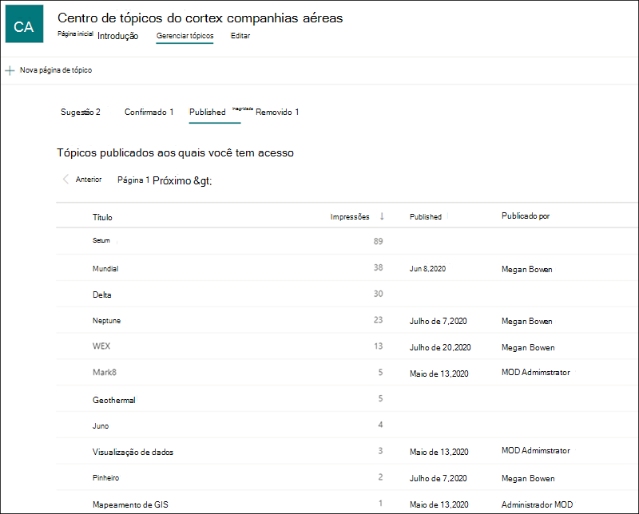
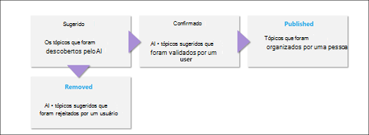

# Gerenciar tópicos no Centro de Tópicos (Visualização)

> [!Note] 
> O conteúdo deste artigo é para o Project Cortex Private Preview. [Mais informações sobre o Projeto Cortex](https://aka.ms/projectcortex).

 

> [!VIDEO https://www.microsoft.com/videoplayer/embed/RE4LxDx]  

 

No Centro de tópicos, um gerente de conhecimento pode exibir a página Gerenciar tópicos para revisar **tópicos** que foram identificados nos locais de origem do SharePoint, conforme especificado pelo administrador de conhecimento.  

      

Os gerentes de conhecimento ajudam a orientar tópicos descobertos pelo ciclo de vida do tópico no qual os tópicos são:

- Sugerido: um tópico foi identificado pela IA e tem recursos, conexões e propriedades de suporte suficientes para atender ao limite do tópico.
- Confirmado: Um tópico sugerido pela IA é validado. A validação é feita por confirmação de um administrador de conhecimento. Além disso, um tópico pode ser confirmado se pelo menos dois usuários daem comentários positivos por meio de comentários de tópicos de que o tópico é válido.
- Removido: um tópico é rejeitado por um administrador de conhecimento e não estará mais visível para os visitantes. O tópico pode estar em qualquer estado quando é removido (sugerido ou confirmado). 
- Publicado: um tópico confirmado que foi atualizado manualmente.

      

## Requisitos

Para gerenciar tópicos na Central de Tópicos, você precisa:
- Ter uma licença de Experiências de Tópico.
- Ter permissões para [**Quem pode gerenciar tópicos.**](https://docs.microsoft.com/microsoft-365/knowledge/topic-experiences-user-permissions) Os administradores de conhecimento podem dar aos usuários essa permissão nas configurações de permissões do tópico Rede de Conhecimento. 

Você não poderá exibir a página Gerenciar Tópicos na Central de Tópicos, a menos que tenha a permissão Quem pode gerenciar **tópicos.**

No centro de tópicos, um gerente de conhecimento pode revisar tópicos que foram identificados nos locais de origem do SharePoint especificados e pode confirmá-los ou rejeitá-los. Um gerente de conhecimento também pode criar e publicar novas páginas de tópico se uma não foi encontrada na descoberta de tópicos ou editar as existentes se elas precisam ser atualizadas.

## Revisar tópicos sugeridos

Na página Gerenciar Tópicos da Central de Tópicos, os tópicos descobertos nos locais de origem especificados do SharePoint serão listados na **guia Sugeridos.** Um gerente de conhecimento pode revisar tópicos não confirmados e optar por confirmá-los ou rejeitá-los.

Para revisar um tópico sugerido:

1. Na página **Gerenciar tópicos,** selecione a **guia Sugerido,** selecione o tópico para abrir a página de tópicos. 

2. Na página de tópicos, revise a página de tópico e selecione **Editar** se precisar fazer alterações na página.

3. Depois de analisar o tópico, volte para a página Gerenciar tópicos. Para o tópico selecionado, você pode:

   - Selecione a marca de seleção para confirmar o tópico.
    
   - Selecione o **x** se quiser rejeitar o tópico.

    Os tópicos confirmados serão removidos **da lista Sugeridos** e agora serão exibidos na **lista Confirmado.**

    Os tópicos rejeitados serão removidos **da lista Sugeridos** e agora serão exibidos na **guia** Removido.

     

## Tópicos confirmados

Na página Gerenciar tópicos, os tópicos que foram descobertos em seus locais de origem especificados do SharePoint e que foram confirmados por  um gerente de conhecimento ou "de origem de lotes" confirmados por duas ou mais pessoas por meio do mecanismo de comentários do cartão serão listados na guia Confirmado. Se necessário, um usuário com permissões para gerenciar tópicos pode revisar tópicos confirmados e optar por rejeitá-los.

Para revisar um tópico confirmado:

1. Na guia **Confirmado,** selecione o tópico para abrir a página de tópico. 

2. Na página de tópicos, revise a página de tópico e selecione **Editar** se precisar fazer alterações na página.

Observe que você ainda pode optar por rejeitar um tópico confirmado.  Para fazer isso, vá para o tópico selecionado na lista Confirmado e selecione **o x** se quiser rejeitar o tópico.

## Tópicos publicados
Tópicos publicados foram editados para que informações específicas sempre apareçam para quem encontrar a página. Os tópicos criados manualmente estão listados aqui.

