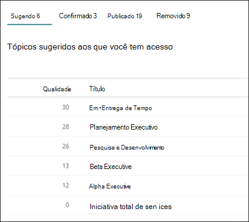

# Gerenciar tópicos no centro de tópicos no Microsoft Viva TopicsManage topics in the topic center in Microsoft Viva Topics

 

> [!VIDEO https://www.microsoft.com/videoplayer/embed/RE4LxDx]  

 

No centro de tópicos Tópicos do Viva, um gerente de conhecimento pode exibir a página Gerenciar tópicos para revisar **tópicos** identificados nos locais de origem conforme especificado pelo administrador de conhecimento.In the Viva Topics topic center, a knowledge manager can view the **Manage topics** page to review topics that have been identified in the source locations as specified by your knowledge admin.  

      

Os gerentes de conhecimento ajudam a orientar tópicos descobertos por meio dos vários estágios de ciclo de vida de tópicos:Knowledge managers help to guide discovered topics through the various topic lifecycle stages:

- **Sugerido**: um tópico foi identificado pela AI e tem recursos de suporte suficientes, conexões e propriedades.**Suggested**: A topic has been identified by AI and has enough supporting resources, connections, and properties.
- **Confirmado**: Um tópico sugerido pela AI é validado.**Confirmed**: A topic that has been suggested by AI is validated. A validação é feita por confirmação de um gerente de conhecimento.Validation is done by confirmation from a knowledge manager. Além disso, um tópico pode ser confirmado se houver 2 votos positivos líquidos dos usuários finais recebidos por meio dos mecanismos de feedback no cartão de tópico.Additionally, a topic can be confirmed if there is a net positive 2 votes from end users received via the feedback mechanisms on the topic card.
- **Publicado**: Um tópico confirmado que foi abordado: foram feitas edições manuais para melhorar sua qualidade.**Published**: A confirmed topic that has been curated: manual edits have been made to improve its quality.
- **Removido**: um tópico é rejeitado por um gerente de conhecimento e não será mais visível para os visualizadores.**Removed**: A topic is rejected by a knowledge manager and will no longer be visible to viewers. O tópico pode estar em qualquer estado quando é removido (sugerido, confirmado ou publicado).The topic can be in any state when it is removed (suggested, confirmed, or published). Quando um tópico publicado é removido, a página com os detalhes de cura precisará ser excluída manualmente por meio da Biblioteca de Páginas do centro de tópicos.When a published topic is removed, the page with the curated details will need to be deleted manually through the Pages Library of the topic center.

      

> [!Note] 
> Na página Gerenciar Tópicos, cada gerente de conhecimento só poderá ver tópicos em que eles tenham acesso aos arquivos e páginas subjacentes conectados ao tópico.On the Manage Topics page, each knowledge manager will only be able to see topics where they have access to the underlying files and pages connected to the topic. Essa aparação de permissão será refletida na lista de tópicos que aparecem nas guias **Sugeridas** **,** **Confirmadas,** Removidas e **Publicadas.**This permission trimming will be reflected in the list of topics that appear in the **Suggested**, **Confirmed**, **Removed**, and **Published** tabs. O tópico conta, no entanto, mostrar o total de contagens na organização, independentemente das permissões.The topic counts, however, show the total counts in the organization regardless of permissions.

## RequisitosRequirements

Para gerenciar tópicos no centro de tópicos, você precisa:To manage topics in the topic center, you need to:
- Tenha uma licença de Tópicos do Viva.Have a Viva Topics license.

- Tenha a [**permissão Quem pode gerenciar tópicos.**](./topic-experiences-user-permissions.md)Have the [**Who can manage topics**](./topic-experiences-user-permissions.md) permission. Os administradores de conhecimento podem dar aos usuários essa permissão nas configurações de permissões do tópico Tópicos do Viva.Knowledge admins can give users this permission in the Viva Topics topic permissions settings. 

Você não poderá exibir a página Gerenciar Tópicos no centro de tópicos, a menos que você tenha a permissão **Quem pode gerenciar tópicos.**You will not be able to view the Manage Topics page in the topic center unless you have the **Who can manage topics** permission.

No centro de tópicos, um gerente de conhecimento pode revisar tópicos que foram identificados nos locais de origem especificados e podem confirmá-los ou rejeitá-los.In the topic center, a knowledge manager can review topics that have been identified in the source locations you specified, and can either confirm or reject them. Um gerente de conhecimento também pode criar e publicar novas páginas de tópicos se uma não foi encontrada na descoberta de tópicos ou editar as existentes, caso precisem ser atualizadas.A knowledge manager can also create and publish new topic pages if one was not found in topic discovery, or edit existing ones if they need to be updated.

## Revisar tópicos sugeridosReview suggested topics

Na página Gerenciar Tópicos do centro de tópicos, os tópicos que foram descobertos em seus locais de origem especificados do SharePoint serão listados na **guia Sugerido.** Se necessário, um gerente de conhecimento pode revisar tópicos não confirmados e optar por confirmá-los ou rejeitá-los.On the topic center Manage Topics page, topics that were discovered in your specified SharePoint source locations will be listed in the **Suggested** tab. If needed, a knowledge manager can review unconfirmed topics and choose to confirm or reject them.

      

Para revisar um tópico sugerido:To review a suggested topic:

1. Na página **Gerenciar tópicos,** selecione a **guia Sugerido,** selecione o tópico para abrir a página de tópicos.On the **Manage topics** page, select the **Suggested** tab, select the topic to open the topic page. 

2. Na página de tópicos, revise a página de tópicos e selecione **Editar** se precisar fazer alterações na página.On the topic page, review the topic page, and select **Edit** if you need to make any changes to the page. A publicação de todas as edições moverá este tópico para a **guia Publicado.**Publishing any edits will move this topic to the **Published** tab.

3. Depois de revisar o tópico, volte para a página Gerenciar Tópicos.After reviewing the topic, go back to the Manage Topics page. Para o tópico selecionado, você pode:For the selected topic, you can:

   - Selecione a marca de seleção para confirmar o tópico.Select the check mark to confirm the topic.
    
   - Selecione **o x** se quiser rejeitar o tópico.Select the **x** if you want to reject the topic.

    Os tópicos confirmados serão removidos da **lista Sugerida** e agora serão exibidos na **lista Confirmado.**Confirmed topics will be removed from the **Suggested** list and will now display in the **Confirmed** list.

    Os tópicos rejeitados serão removidos da lista **Sugerida** e agora serão exibidos na **guia Removido.**Rejected topics will be removed from the **Suggested** list and will now display in the **Removed** tab.

     

### Pontuação de qualidadeQuality score

Cada tópico que aparece na página Tópicos Sugeridos tem uma pontuação de qualidade atribuída a ele.Each topic that appears on your Suggested Topics page has a quality score assigned to it. A pontuação de qualidade é um reflexo da quantidade de informações que o usuário médio verá para obter as informações sobre o tópico, tendo em mente que cada usuário pode ver mais ou menos informações devido às permissões que podem ou não ter sobre as informações em um tópico.The quality score is a reflection of the amount of information that the average user will see for the information on the topic, keeping in mind that each user might see more or less information because of the permissions they might or might not have on the information in a topic. 

A pontuação de qualidade pode ajudar a dar informações sobre os tópicos com mais informações e pode ser útil para encontrar tópicos que podem precisar ser editados manualmente.The quality score can help give insight to the topics with the most information and can be useful for finding topics that may need to be manually edited. Por exemplo, um tópico com uma pontuação de qualidade menor pode ser o resultado de alguns usuários não terem permissões do SharePoint para arquivos ou sites pertinentes que a AI incluiu no tópico.For example, a topic with a lower quality score might be the result of some users not having SharePoint permissions to pertinent files or sites that AI has included in the topic. Em seguida, um colaborador pode editar o tópico para incluir as informações (quando apropriado), que serão visualizadas para todos os usuários que podem exibir o tópico.A contributor could then edit the topic to include the information (when appropriate), which will then be viewable to all users who can view the topic.

### ImpressõesImpressions

A **coluna Impressões** exibe o número de vezes que um tópico foi mostrado aos usuários finais.The **Impressions** column displays the number of times a topic has been shown to end users. Isso inclui exibições por meio de cartões de resposta de tópicos na pesquisa e nos destaques do tópico.This includes views through topic answer cards in search and through topic highlights. Ele não reflete o clique sobre esses tópicos, mas que o tópico foi exibido.It does not reflect the click-through on these topics, but that the topic has been displayed. A **coluna Impressões** mostrará tópicos nas guias **Sugeridas** **,** Confirmadas, Publicadas e Removidas na página Gerenciar Tópicos. The **Impressions** column will show for topics in the **Suggested**, **Confirmed**, **Published**, and **Removed** tabs on the Manage Topics page.

## Tópicos confirmadosConfirmed topics

Na página Gerenciar Tópicos, os tópicos que foram descobertos em seus locais de origem especificados do SharePoint e foram confirmados por um gerente de conhecimento ou "crowdsourced" confirmados por uma rede de duas ou mais pessoas (balanceamento de votos de usuários negativos contra votos positivos de usuários) por meio do mecanismo de feedback de cartão serão listados na guia Confirmado.  Se necessário, um usuário com permissões para gerenciar tópicos pode revisar tópicos confirmados e optar por rejeitá-los.On the Manage Topics page, topics that were discovered in your specified SharePoint source locations and have been confirmed by a knowledge manager or "crowdsourced" confirmed by a net two or more people (balancing negative user votes against positive user votes) through the card feedback mechanism will be listed in the **Confirmed** tab. If needed, a user with permissions to manage topics can review confirmed topics and choose to reject them.

Para revisar um tópico confirmado:To review a confirmed topic:

1. Na guia **Confirmado,** selecione o tópico para abrir a página de tópicos.On the **Confirmed** tab, select the topic to open the topic page. 

2. Na página de tópicos, revise a página de tópicos e selecione **Editar** se precisar fazer alterações na página.On the topic page, review the topic page, and select **Edit** if you need to make any changes to the page.

Observe que você ainda pode optar por rejeitar um tópico confirmado.Note that you can still choose to reject a confirmed topic. Para fazer isso, vá para  o tópico selecionado na guia Confirmado e selecione **o x** se quiser rejeitar o tópico.To do this, go to the selected topic on the **Confirmed** tab, and select the **x** if you want to reject the topic.

## Tópicos publicadosPublished topics
Os tópicos publicados foram editados para que informações específicas sempre apareçam para quem encontrar a página.Published topics have been edited so that specific information will always appear to whoever encounters the page. Os tópicos criados manualmente também estão listados aqui.Manually created topics are listed here as well.

     
