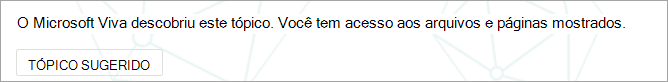
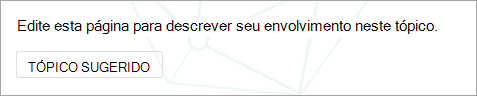
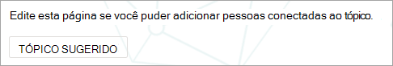
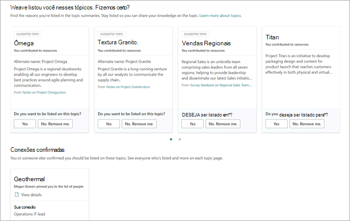

# Gerenciar tópicos em escala nos Tópicos do Microsoft Viva

Quando você indexa seus SharePoint sites ou toda a sua organização para Tópicos do Viva, muitos tópicos podem ser gerados. Quando isso acontece e você vê milhares de tópicos sugeridos na página **Gerenciar tópicos,** pode ser um desafio saber por onde começar. Este artigo descreve como os Tópicos do Viva ajudam a otimizar quais tópicos e informações são mostrados aos usuários que estão procurando informações, mesmo em grandes organizações com um grande número de tópicos.

Primeiro, um lembrete dos [quatro estágios dos tópicos](manage-topics.md#topic-stages):

- **Sugerido**: um tópico foi identificado pela IA e tem recursos, conexões e propriedades de suporte suficientes. (Eles são marcados como **um Tópico Sugerido** na interface do usuário.)

- **Confirmado**: um tópico que foi descoberto pela AI e foi validado. A validação de tópico ocorre quando:

   - Um gerente de conhecimento confirma um tópico. Um gerente de [conhecimento confirma um tópico na](manage-topics.md#confirmed-topics) página Gerenciar **tópicos.**

   - Vários usuários confirmam um tópico. Deve haver uma rede de dois votos positivos recebidos dos usuários que votaram usando o mecanismo de comentários no cartão de tópico. Por exemplo, se um usuário votou positivo e um usuário votou negativo para um tópico específico, você ainda precisaria de mais dois votos positivos para que o tópico fosse confirmado.
 
- **Publicado**: um tópico que foi abordado. As edições manuais foram feitas para melhorar sua qualidade ou foram criadas por um usuário.

- **Removido**: um tópico que foi rejeitado e não estará mais visível para os visualizadores. Um tópico pode ser removido em qualquer estado (sugerido, confirmado ou publicado). A remoção de tópico ocorre quando:

   - Um gerente de conhecimento remove um tópico. Um gerente de conhecimento remove um tópico na página **Gerenciar** tópicos.

   - Vários usuários lançam votos negativos usando o mecanismo de comentários no cartão de tópico. Para que um tópico seja removido, deve haver uma rede de dois votos negativos recebidos dos usuários. Por exemplo, se um usuário votou negativo e um usuário votou positivo para um tópico específico, você ainda precisaria de mais dois votos negativos para que o tópico fosse removido.

  Quando um tópico publicado é removido, a página com os detalhes de cura precisará ser excluída manualmente por meio da Biblioteca de Páginas do centro de tópicos.

## Função de gerente de conhecimento 

Ao configurar os Tópicos do Viva, você adicionará um grupo de usuários que recebe permissões para ver a página Gerenciar **tópicos** no centro de tópicos. Ele aparecerá apenas para esses usuários que ocupam a função de curadoria principal para os tópicos. Eles terão acesso aos dados sobre os tópicos e poderão ver listas de todos os tópicos que eles têm acesso para revisar e fazer a curadoria.

Os funcionários nesta função devem ter permissões amplas para exibir uma ampla matriz de tópicos. Ou se as permissões são segmentadas, talvez você queira selecionar um grupo de usuários que representam diferentes áreas da empresa e podem fazer a cura para suas próprias áreas.

Quando você analisa pela primeira vez os tópicos no centro de tópicos, os tópicos sugeridos são puramente definidos por AI. Os gerentes de conhecimento podem querer revisar cada um deles antes de lançar Tópicos do Viva para uma ampla comunidade de usuários. Ao trabalhar em escala, essa abordagem raramente é prática devido aos milhares de tópicos.

A abordagem recomendada é encontrar um equilíbrio dos tópicos mais pertinentes ou importantes para seu conjunto inicial de usuários e se concentrar na cura desses tópicos antes da publicação dos Tópicos do Viva. Comece a coletar comentários dos usuários e permitir que o crowdsourcing determine os padrões de uso e contribuição de seus usuários para informar as estratégias sugeridas neste artigo.

É importante reconhecer que o sistema identificará e mostrará tópicos publicados sugeridos por IA e com cura humana para todos os usuários. No entanto, isso não significa que todos os tópicos sugeridos serão mostrados para todos os usuários finais. As configurações de segurança no local mostrarão apenas os tópicos que cada funcionário pode acessar com base nas permissões definidas no próprio conteúdo.

Como gerente de conhecimento com permissões para exibir a página Gerenciar **tópicos,** você pode ver um número muito maior de tópicos listados devido às suas próprias permissões elevadas, dependendo da sua função na organização e no nível de acesso. Você também terá acesso a exibições que permitem ver tópicos listados em um único local em vez de acessá-los usando realçamentos ou pesquisa.

Além disso, provavelmente há uma porcentagem menor de tópicos que serão exibidos pela maioria dos usuários e um conjunto maior de mais tópicos que serão vistos com muito menos frequência devido a permissões. Como resultado, é bom primeiro focalizar as tarefas de cura nos tópicos mais importantes para sua organização e que são as mais prováveis de serem vistas de forma mais ampla.

Este artigo aborda algumas estratégias de cura. Essas estratégias podem significar que os tópicos menos frequentes ou menos comuns podem não ser totalmente abordados pelos gerentes de conhecimento. No entanto, esses tópicos sugeridos permanecem úteis e podem fornecer informações ou um ponteiro para uma pessoa, o que pode salvar o horário de um funcionário de procurar um ponto de partida. Permitir atualizações de crowdsourced para tópicos é benéfico e fornece mais conteúdo e cobertura para os tópicos menos comuns.

Este artigo fornece algumas diretrizes e práticas recomendadas para abordar o gerenciamento e a cura de tópicos.

## Noções básicas sobre tópicos sugeridos

Quando os tópicos são descobertos pela AI, eles são marcados como um Tópico Sugerido **,** tanto na página Gerenciar **tópicos,** quanto nos cartões de tópico que são apresentados aos usuários. Qualquer tópico que não tenha sido marcado como removido será mostrado aos usuários, incluindo tópicos confirmados, publicados e sugeridos. Os tópicos em todos os três estados estão disponíveis para usuários finais.

Em um cartão de tópico ou página, usamos várias dicas para mostrar como a IA gerou as informações. O sistema usa uma variedade de evidências para adicionar os recursos, principalmente por meio do próprio conteúdo.

- Os rótulos mostram que um tópico é sugerido e que foi descoberto por Tópicos do Viva.  

   

- Informações sobre os estados de cartão de onde uma definição veio especificando sua origem.

- As pessoas sugeridas são derivadas pela agreging pessoas que escreveram ou editaram documentos com evidências de tópicos. Se uma pessoa grava um documento que tem um nome de tópico no título e esse documento tem muitos exibições, pode exigir apenas um documento para estabelecer a pessoa como relacionada. No entanto, em muitos casos, mais evidências são melhores e as pessoas listadas trabalharam em vários documentos.  

   

- Para os arquivos e páginas mostrados, o sistema identifica quantas vezes o tópico foi mencionado no documento, mas o tópico também deve ser mencionado em um contexto específico que identifica a referência ao tópico de tipo específico (como projeto ou equipe). Isso é o que conta como evidência para a IA. O sistema também considera a ocorrência de um nome de tópico nos títulos de documentos, tipos de documentos e outros recursos de análise (como exibições).

   

   

   

Esses atributos demonstram que o conteúdo foi adicionado pela AI e como a IA fez essa determinação.

### Comunicação

Ao se comunicar com seus usuários sobre Tópicos do Viva, é importante esclarecer a diferença entre os tópicos sugeridos pela IA e o conteúdo e seus equivalentes de cura.

Como leitor, você deve exibir tópicos sugeridos com um olhar mais crítico. Eles não devem ser percebidos como fontes autoritativas de verdade organizacional. Em vez disso, eles são uma ferramenta de descoberta de caminho para acessar o conhecimento tácito que é apresentado por meio do conteúdo ao que você tem acesso. A IA descobriu o tópico e tem evidências suficientes para mostrar a você, mas seu valor não foi confirmado por uma pessoa.

### Controles Crowdsourced

Os tópicos sugeridos podem ser aprimorados pela curadoria da página e por meio de comentários de crowdsourced sobre o tópico.

Quando os usuários interagem com um tópico sugerido, eles podem fazer uma pergunta simples na interface do usuário. Por exemplo: *este tópico foi relevante para a página?* *Essa pessoa é relevante para o tópico?* *Essa definição foi precisa?* Usando os comentários para essas perguntas, a precisão dos tópicos pode aumentar sem a necessidade de um indivíduo nomeado para fazer a cura da página.

A home page de um centro de tópicos é outro local onde os comentários sobre tópicos sugeridos são coletados. No centro de tópicos, um usuário pode ver os tópicos aos quais foi associado e recebe a opção de confirmar essa associação ou remoção.

   

Quando você permite uma ampla gama de tópicos, considere os seguintes fatores:

-   Os usuários verão a **opção Editar** nas páginas de tópicos e poderão editar as páginas na mesma experiência que outras páginas SharePoint modernas.

-   Algumas Web Parts **de Tópico** Sugerido não podem ser removidas. O nome do tópico, nomes alternativos, definição, pessoas sugeridas e recursos sugeridos não podem ser removidos.

-   Pode levar algum tempo para um tópico sugerido ou confirmado que foi publicado ser movido para a lista **Publicado** na página **Gerenciar tópicos.**

    -   O tempo estimado para um tópico aparecer na pesquisa, realçamentos, hashtags ou anotações é de 2 horas.

    -   O tempo estimado para que um tópico apareça na lista **Publicado** na página **Tópicos gerenciados** não é superior a 24 horas na maioria dos casos. Você deve vê-los dentro de 2 horas, mas como há uma sincronização completa a cada 24 horas, a espera não deve ser maior do que 24 horas.

-   É possível que um usuário possa deixar um tópico publicado em estado de check-out ou edição. Um gerente de conhecimento pode vê-los na Biblioteca de Páginas do centro de tópicos e descartar as alterações do usuário para republicar o tópico ou entrar em contato com esse usuário para solicitar que ele verifique o tópico.

### A visibilidade e o conteúdo do tópico se baseiam nas permissões de um usuário

Ao revisar a lista de tópicos sugeridos como gerente de conhecimento, lembre-se de que o conteúdo de um tópico sugerido será dinamicamente baseado em permissões. O conteúdo sugerido e as pessoas que são mostradas para você podem não ser iguais àqueles que são apresentados a qualquer usuário ou outro gerente de conhecimento.

Com base nas permissões para exibir o conteúdo associado a um tópico, cada usuário pode ver um conjunto diferente de recursos sugeridos, pessoas, nomes alternativos e definição.

## Priorizar os tópicos para a cura

Você pode usar as estratégias a seguir para identificar tópicos que provavelmente serão proeminentes e, portanto, são bons candidatos à cura. 

### Taxonomias

O uso de taxonomias existentes pode fornecer uma lista de tópicos que provavelmente serão proeminentes para os usuários. Por exemplo, eles podem ser:

-   Produtos e serviços que sua organização fornece

-   Teams em sua organização

-   Projetos de alto perfil

Essa abordagem também pode ser tomada em um nível funcional ou departamento, com especialistas de assunto que entendem essa área da sua organização. O objetivo não é fazer com que eles revisem uma seleção ou todos os tópicos. Em vez disso, eles trazem seus próprios conhecimentos de domínio para orientar a cura seletiva.

### Pesquisa

Os termos comuns de pesquisa geralmente são descobertos como tópicos. Usando os [principais relatórios de consulta na Pesquisa da Microsoft,](/sharepoint/view-search-usage-reports)você pode identificar os termos de pesquisa mais frequentes em sua organização. Se os tópicos foram descobertos para esses termos, eles são bons candidatos à cura. Esses tópicos podem ser apresentados como cartões de resposta na Pesquisa da Microsoft.

Se você estiver usando indicadores da Pesquisa da Microsoft no momento, considere quais deles podem ser [substituídos](/microsoftsearch/manage-bookmarks)por um tópico. Um cartão de resposta de indicador contém um título, uma descrição e uma URL. Em algumas circunstâncias, um cartão de tópico pode ser mais útil para um usuário, e um cartão de tópico também mostra recursos e pessoas.

Na experiência de pesquisa do usuário, quando um usuário procura um termo como *viagem,* os resultados da pesquisa são exibidos na seguinte ordem de prioridade na Pesquisa da Microsoft:

1.  Tópicos publicados ou confirmados

2.  Indicadores

3.  Tópicos sugeridos

### Impressões e pontuação de qualidade

A [contagem de impressões](manage-topics.md#impressions) e a [pontuação de qualidade](manage-topics.md#quality-score) são métricas importantes para entender o comportamento de um tópico. O valor dessas métricas será limitado quando apenas gerentes de conhecimento ou equipes de IT têm acesso a tópicos. Expor tópicos a um grupo piloto de usuários gerará dados mais representativos para essas medidas.

Os tópicos com uma contagem de impressão alta provavelmente serão interagidos com mais frequência. A pontuação de qualidade para esses tópicos dará uma noção da riqueza desses tópicos. Tópicos com uma contagem de impressão alta e uma pontuação de baixa qualidade são bons alvos para a cura.

### Termos-chave da arquitetura de informações de sites organizacionais maiores

Sites de portal maiores em sua organização podem ter investido tempo na organização de sua arquitetura de informações e na navegação de seus sites em torno das principais áreas de tópicos para suas unidades de negócios, linhas de produtos, projetos importantes e assim por diante. A revisão desses termos e a identificação e a curadoria de tópicos para esses termos podem ajudar os usuários que estão procurando informações sobre essas áreas.

### Aproveitar bases de conhecimento internas ou sites wiki

Se sua organização investiu em bases de conhecimento ou sites wiki, eles podem fornecer uma lista de tópicos a ser usado para seus esforços iniciais de cura. Se eles são particularmente grandes, selecione os tópicos mais exibidos ou editados como um ponto de partida.

## Confira também

[Gerenciar tópicos no centro de tópicos](manage-topics.md)

[Visão geral do centro de tópicos](topic-center-overview.md)
