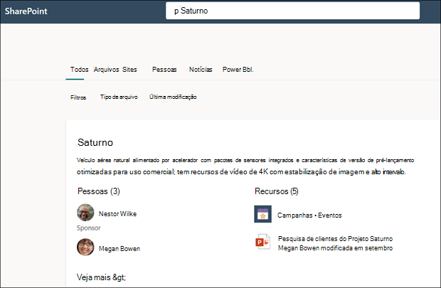

# Usar a Pesquisa da Microsoft para encontrar tópicos em Tópicos do Microsoft Viva

Embora os usuários do Viva Topics possam encontrar tópicos por meio de destaques de tópicos em seus sites SharePoint, eles também podem encontrá-los por meio da Pesquisa da Microsoft. 

## Resposta de tópico

Quando você pesquisa um tópico específico na Pesquisa da Microsoft (por exemplo, "Saturno"), se um tópico existir e for encontrado, ele exibirá o resultado no formato de sugestão Respostas.

A resposta do tópico será exibida:
- Nome do tópico
- Nomes alternativos: nomes alternativos ou acrônimos para o tópico.
- Definição: Descrição do tópico fornecido por AI ou adicionado manualmente por uma pessoa.
- Pessoas sugeridas ou fixadas: pessoas sugeridas por AI ou fixadas ao tópico por uma pessoa
- Recursos sugeridos ou fixados: arquivos, páginas ou sites sugeridos por AI ou fixados no tópico por uma pessoa. 

    

A página de tópico pode ser exibida nos resultados da pesquisa, mesmo que o cartão de resposta do tópico não apareça.

Os resultados da pesquisa no Word e PowerPoint também mostrarão a resposta do tópico quando uma for encontrada.

## Acrônimos

Em Tópicos do Viva, você pode editar manualmente um tópico para incluir um acrônimo para ele como <b>um Nome Alternativo</b>. Isso permite que um usuário que está pesquisando apenas o acrônimo do tópico encontre a resposta do tópico por meio da Pesquisa da Microsoft.

[As Respostas de](/microsoftsearch/manage-acronyms) Acrônimo são um recurso fornecido pela Pesquisa da Microsoft e são gerenciados separadamente dos Tópicos do Viva.

## Indicadores e tópicos

[Indicadores são](/microsoftsearch/manage-bookmarks) um recurso de Pesquisa da Microsoft que ajudam as pessoas a encontrar rapidamente sites e ferramentas importantes com apenas uma pesquisa (por exemplo, uma ferramenta de reserva de viagem em um site externo fora do locatário Microsoft 365 locatário). Eles são criados por administradores de pesquisa no Microsoft 365 de administração. 

Para usuários que estão procurando informações sobre como reservar uma viagem para trabalhar:

- Se alguns usuários conhecem o nome da ferramenta de viagem (por exemplo, "Concur"), é mais fácil criar um indicador para ir diretamente para o site externo.
- Para usuários que pesquisam geralmente por "viagem", crie um tópico sobre "Viagem" que tenha as informações que eles esperam ver. Considere adicionar um link ao site externo Concur na descrição do tópico. Se o link for, em vez disso, para um site de reserva de viagem interno hospedado no Microsoft 365 locatário, você poderá adicioná-lo ao "Recursos Fixados".
 
### Prioridade de resultados da pesquisa 
 
Na experiência de pesquisa de usuários, quando um usuário pesquisa um termo como "viagem", os resultados da pesquisa serão exibidos na seguinte prioridade na Pesquisa da Microsoft
1. Tópicos publicados ou confirmados 
2. Indicadores
3. Tópicos sugeridos
