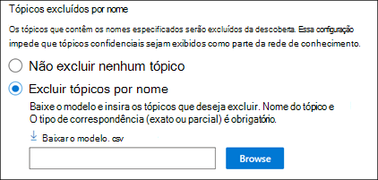
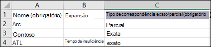
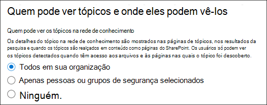
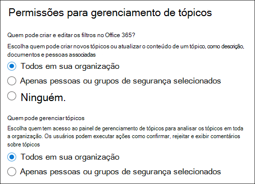
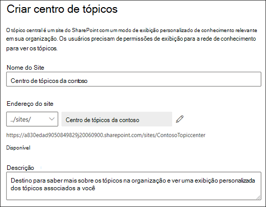
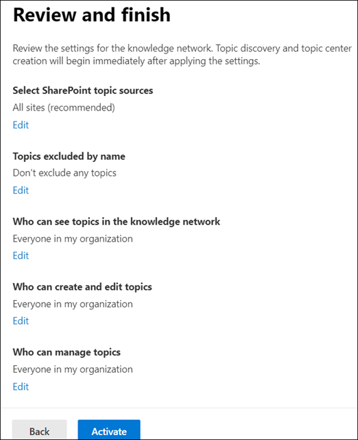

# Configurar o gerenciamento de conhecimento (versão prévia)Set up Knowledge Management (Preview)

> [!Note] 
> O conteúdo deste artigo é para a visualização privada do Project Cortex.The content in this article is for Project Cortex Private Preview. [Mais informações sobre o Projeto Cortex](https://aka.ms/projectcortex).[Find out more about Project Cortex](https://aka.ms/projectcortex).

Você pode usar o centro de administração do Microsoft 365 para configurar e configurar o [Gerenciamento de conhecimento](knowledge-management-overview.md).You can use the Microsoft 365 admin center to set up and configure [Knowledge Management](knowledge-management-overview.md). 

> [!Important]
> É importante planejar a melhor maneira de configurar e configurar o gerenciamento de conhecimento em seu ambiente.It is important to plan the best way to set up and configure Knowledge Management in your environment. Por exemplo, você precisará fazer considerações sobre o seguinte:For example, you will need to make considerations about the following:
- Quais sites do SharePoint você deseja analisar os tópicos.Which SharePoint sites you want to analyze for topics.
- Para quais usuários você deseja tornar os tópicos visíveis.Which users you want to make topics visible to.
- Quais usuários você deseja dar permissões para gerenciar tópicos no centro de tópicos.Which users you want to give permissions to manage topics in the topic center.
- Quais usuários você deseja dar permissões para criar ou editar tópicos no centro de tópicos.Which users you want to give permissions to create or edit topics in the topic center.
- Que nome você deseja dar à sua central de tópicos.What name you want to give your topic center.

> [!Note]
> Você pode achar útil criar grupos de segurança para atribuir aos usuários as permissões necessárias para exibir tópicos, gerenciar tópico e criar e editar tópicos.You may find it useful to create security groups to assign your users the permissions needed to view topics, manage topic, and create and edit topics.

Um administrador também pode [fazer alterações nas configurações selecionadas a qualquer momento após a configuração](topic-experiences-discovery.md) , por meio das configurações de gerenciamento de conhecimento no centro de administração do Microsoft 365.An admin can also [make changes to your selected settings anytime after setup](topic-experiences-discovery.md) through the Knowledge Management settings in the Microsoft 365 admin center.

## RequirementsRequirements 
Você deve ter permissões de administrador global ou administrador do SharePoint para poder acessar o centro de administração do Microsoft 365 e configurar tarefas de conhecimento organizacional.You must have Global Admin or SharePoint admin permissions to be able to access the Microsoft 365 admin center and set up Organizational knowledge tasks.

## Configurar sua rede de conhecimentoSet up your knowledge network

Configurar sua rede de conhecimento orienta você por meio do seguinte:Setting up your knowledge network walks you through the following:

- Descoberta de tópico: selecionar fontes e tópicos de tópico para excluir da descoberta.Topic discovery: Selecting topic sources and topics to  exclude from discovery.
- Visibilidade do tópico: selecionar quem pode exibir tópicos como destaques, nas páginas de pesquisa e tópico.Topic visibility: Selecting who can view topics as highlights, in search and topic pages.
- Permissões de tópico: selecionar quem pode criar, editar e gerenciar tópicos.Topic permissions: Selecting who can create, edit, and manage topics.
- Centro de tópicos: Crie seu centro de tópicos.Topic center: Create your topic center.
- Revisão: Verifique e aplique suas configurações.Review: Check and apply your settings.

Para configurar sua rede de conhecimento:To set up your knowledge network:

1. No centro de administração do Microsoft 365 (admin.microsoft.com), selecione **configuração** e, em seguida, exiba a seção de **conhecimento organizacional** .In the Microsoft 365 admin center (admin.microsoft.com), select **Setup** , and then view the **Organizational Knowledge** section.
2. Na seção **conhecimento organizacional** , clique em **conectar pessoas a conhecimento**.In the **Organizational Knowledge** section, click **Connect people to knowledge**. 

      

3. Na página **conectar pessoas a conhecimento** **, clique em introdução para** orientá-lo no processo de instalação.On the **Connect people to knowledge** page, click **Get started** to walk you through the setup process. 

      

4. Na página **escolha como a rede de conhecimento pode encontrar tópicos** , você configurará a descoberta de tópicos.On the **Choose how the knowledge network can find topics** page, you will configure topic discovery. Na seção **selecionar fontes de tópicos do SharePoint** , selecione quais sites do SharePoint serão rastreados como fontes para seus tópicos durante a descoberta.In the **Select SharePoint topic sources** section, select which SharePoint sites will be crawled as sources for your topics during discovery. Isso inclui:This includes: 
    a.a. **Todos os sites** : todos os sites do SharePoint em seu locatário.**All sites** : All SharePoint sites in your tenant. Isso captura sites atuais e futuros.This captures current and future sites. 
    b.b. **Todos, exceto sites selecionados** : digite os nomes dos sites que você deseja excluir.**All, except selected sites** : Type the names of the sites you want to exclude.  Você também pode carregar uma lista de sites que deseja recusar da descoberta.You can also upload a list of sites that you want to opt out from discovery. Os sites criados no futuro serão incluídos como fontes para descoberta de tópicos.Sites created in future will be included as sources for topic discovery.  
    c.c. **Somente sites selecionados** : digite os nomes dos sites que você deseja incluir.**Only selected sites** : Type the names of the sites you want to include. Você também pode carregar uma lista de sites.You can also upload a list of sites. Os sites criados no futuro não serão incluídos como fontes para descoberta de tópicos.Sites created in the future will not be included as sources for topic discovery.  

      
   
5. Na seção **excluir tópicos por nome** , você pode optar por incluir nomes de tópicos que não deseja que estejam nos resultados detectados.In the **Exclude topics by name** section, you can choose to includes names of topics you don't want to be in the discovered results. Use essa configuração para impedir que tópicos confidenciais sejam incluídos como parte da rede de conhecimento.Use this setting to prevent sensitive topics from being included as part of the knowledge network. As opções incluem:Your options include: 
    a.a. **Não excluir nenhum tópico****Don't exclude any topics**  
    b.b. **Excluir tópicos por nome** : se você tiver tópicos que não deseja mostrar aos usuários como parte da rede de conhecimento.**Exclude topics by name** :  If you have topics you don’t want shown to users as part of the knowledge network. 

      

    #### Como excluir tópicos por nomeHow to exclude topics by name    

    Se você precisar excluir tópicos, depois de selecionar **excluir tópicos por nome** , selecione **baixar o modelo. csv**.If you need to exclude topics, after selecting **Exclude topics by name** , select **Download the .csv template**. Use o Excel. Modelo CSV para incluir uma lista de tópicos que você deseja excluir dos resultados da descoberta.Use the Excel .CSV template to include a list of topics that you want to exclude from your discovery results.

      

    No modelo CSV, insira as seguintes informações sobre os tópicos que você deseja excluir:In the CSV template, enter the following information about the topics you want to exclude:

    - **Name** : digite o nome do tópico que você deseja excluir.**Name** : Type the name of the topic you want to exclude. Há duas maneiras de fazer isso:There are two ways to do this: 
        - Correspondência exata: você pode incluir o nome exato ou o acrônimo (por exemplo, *contoso* ou *ATL* ).Exact match: You can include the exact name or acronym (for example, *Contoso* or *ATL* ). 
        - Correspondência parcial: você pode excluir todos os tópicos que possuem uma palavra específica.Partial match: You can exclude all topics that have a specific word in it.  Por exemplo, o *arco* excluirá todos os tópicos com a palavra *arco* nele, como *círculo de arco* , solda de arco de *plasma* ou arco de *treinamento*. Observe que ele não excluirá tópicos nos quais o texto está incluído como parte de uma palavra, como *arquitetura*.For example, *arc* will exclude all topics with the word *arc* in it, such as *Arc circle* , *Plasma arc welding* , or *Training arc*. Note that it will not exclude topics in which the text is included as part of a word, such as *Architecture*. 
    - **Expansão (opcional)** : se você deseja excluir um acrônimo, digite as palavras que o acrônimo significa.**Expansion (optional)** : If you want to exclude an acronym, type the words the acronym stands for. 
    - **MatchType-Exact/partial** : digite se o nome inserido foi um tipo de correspondência *exata* ou *parcial* .**MatchType-Exact/Partial** : Type whether the name you entered was an *exact* or *partial* match type. 

    Depois de concluir e salvar o arquivo de modelo CSV, selecione **procurar** para localizá-lo e selecioná-lo.After you've completed and saved your CSV template file, select **Browse** to locate and select it.
    
    Selecione **Avançar**.Select **Next**. 

6. Na página **quem pode ver os tópicos e onde eles podem vê-los** , você configurará a visibilidade do tópico.On the **Who can see topics and where they can see them** page, you will configure topic visibility. Na configuração **quem pode ver os tópicos da configuração de rede de conhecimento** , você escolhe quem terá acesso aos detalhes do tópico, como tópicos realçados, cartões de tópicos, respostas de tópicos em pesquisa e páginas de tópicos.In the **Who can see topics in the knowledge network** setting, you choose who will have access to topic details, such as highlighted topics, topic cards, topic answers in search, and topic pages. Você pode selecionar:You can select: 
    a.a. **Todos em sua organização****Everyone in your organization** 
    b.b. **Apenas pessoas ou grupos de segurança selecionados****Only selected people or security groups** 
    c.c. **Ninguém****No one** 

       

 > [!Note] 
 > Embora essa configuração permita que você selecione qualquer usuário em sua organização, somente os usuários que têm licenças de gerenciamento de conhecimento atribuídas poderão exibir tópicos.While this setting allows you to select any user in your organization, only users who have knowledge management licenses assigned to them will be able to view topics. 

7. Na página **permissões para gerenciamento de tópicos** , escolha quem poderá criar, editar ou gerenciar tópicos.In the **Permissions for topic management** page, you choose who will be able to create, edit, or manage topics. Na seção **quem pode criar e editar tópicos** , você pode selecionar:In the **Who can create and edit topics** section, you can select: 
    a.a. **Todos em sua organização****Everyone in your organization** 
    b.b. **Apenas pessoas ou grupos de segurança selecionados****Only selected people or security groups** 
8. Na seção **quem pode gerenciar tópicos** , você pode selecionar:In the **Who can manage topics** section, you can select: 
    a.a. **Todos em sua organização****Everyone in your organization** 
    b.b. **Pessoas ou grupos de segurança selecionados****Selected people or security groups** 

      

    Selecione **Avançar**.Select **Next**. 
9. Na página **criar centro de tópicos** , você pode criar seu site do centro de tópicos no qual as páginas de tópicos podem ser exibidas e os tópicos podem ser gerenciados.On the **Create Topic  Center** page, you can create your topic center site in which topic pages can be viewed and topics can be managed.  Na caixa **nome da central de tópicos** , digite um nome para o seu centro de tópico.In the **Topic center name** box, type a name for your Topic center. Opcionalmente, você pode digitar uma descrição curta na caixa **Descrição do site** .You can optionally type a short description in the **Site description** box.  

Selecione **Avançar**.Select **Next**. 

      

10. Na página **Revisão e acabamento** , você pode olhar para a configuração selecionada e escolher fazer alterações.On the **Review and finish** page, you can look at your selected setting and choose to make changes. Se estiver satisfeito com as suas seleções, selecione **Ativar**.If you are satisfied with your selections, select **Activate**.

       

11. A página **da rede de conhecimento ativada** será exibida, confirmando que o sistema agora vai começar a analisar os sites selecionados para tópicos e criar o site do centro de conhecimento.The **Knowledge network activated** page will display, confirming that the system will now start analyzing your selected sites for topics and creating the Knowledge Center site. Selecione **Concluído**.Select **Done**. 

       

12. Você retornará à página **conectar pessoas para o conhecimento** .You'll be returned to your **Connect people to knowledge** page. A partir desta página, é possível selecionar **Gerenciar** para fazer quaisquer alterações em suas configurações.From this page, you can select **Manage** to make any changes to your configuration settings. 

         

> [!Note]
> Após a instalação, um administrador pode [fazer alterações nas configurações de gerenciamento de conhecimento selecionadas](topic-experiences-discovery.md) a qualquer momento, retornando a essa página.After setup, an admin can [make changes to your selected knowledge management settings](topic-experiences-discovery.md) any time by returning to this page.

## Confira tambémSee also

  

