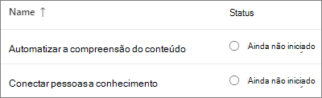
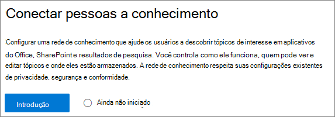
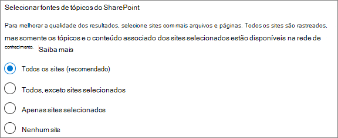
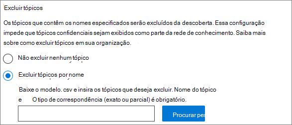
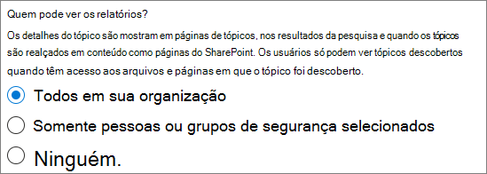
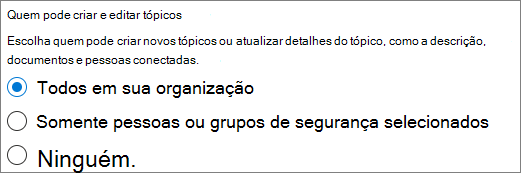
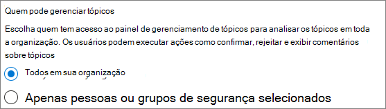
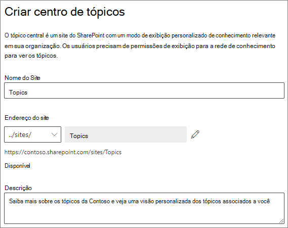
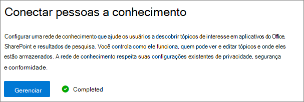

# Configurar tópicos do Microsoft VivaSet up Microsoft Viva Topics

Você pode usar o Centro de administração do Microsoft 365 para configurar e configurar [Tópicos.](topic-experiences-overview.md)You can use the Microsoft 365 admin center to set up and configure [Topics](topic-experiences-overview.md). 

É importante planejar a melhor maneira de configurar e configurar tópicos em seu ambiente.It is important to plan the best way to set up and configure topics in your environment. Leia Plan [for Microsoft Viva Topics](plan-topic-experiences.md) antes de começar os procedimentos neste artigo.Be sure to read [Plan for Microsoft Viva Topics](plan-topic-experiences.md) before you begin the procedures in this article.

Você deve estar inscrito em [Tópicos do Viva](https://www.microsoft.com/microsoft-viva/topics) e ser um administrador global ou administrador do SharePoint para acessar o centro de administração do Microsoft 365 e configurar Tópicos.You must be [subscribed to Viva Topics](https://www.microsoft.com/microsoft-viva/topics) and be a global administrator or SharePoint administrator to access the Microsoft 365 admin center and set up Topics.

Se você configurou o SharePoint para [exigir dispositivos](/sharepoint/control-access-from-unmanaged-devices)gerenciados, certifique-se de configurar Tópicos de um dispositivo gerenciado.If you have configured SharePoint to [require managed devices](/sharepoint/control-access-from-unmanaged-devices), be sure to set up Topics from a managed device.

## Demonstração de vídeoVideo demonstration

Este vídeo mostra o processo de configuração de Tópicos no Microsoft 365.This video shows the process for setting up Topics in Microsoft 365.

 

> [!VIDEO https://www.microsoft.com/videoplayer/embed/RE4Li0E]  

 

## Atribua licençasAssign licenses

Você deve atribuir licenças para os usuários que usarão Tópicos.You must assign licenses for the users who will be using Topics. Somente usuários com uma licença podem ver informações sobre tópicos, incluindo destaques, cartões de tópicos, páginas de tópicos e o centro de tópicos.Only users with a license can see information on topics including highlights, topic cards, topic pages and the topic center. 

Atribuição de licenças:To assign licenses:

1. No Centro de administração do Microsoft 365, em **Usuários**, clique em **Usuários ativos**.In the Microsoft 365 admin center, under **Users**, click **Active users**.

2. Selecione os usuários que você deseja licenciar e clique **em Licenças e aplicativos.**Select the users that you want to license, and click **Licenses and apps**.

3. Em **Licenças,** selecione **Viva Tópicos**.Under **Licenses**, select **Viva Topics**.

4. Em **Aplicativos,** certifique-se de que a Pesquisa **de Conectores do Graph com Índice (Tópicos** do Viva) e os Tópicos do Viva estão **selecionados.**Under **Apps**, make sure **Graph Connectors Search with Index (Viva Topics)** and **Viva Topics** are both selected.

   > [!div class="mx-imgBorder"]
   > 

5. Clique em **Salvar alterações**.Click **Save changes**.

Pode levar até uma hora para que os usuários tenham acesso a Tópicos depois que as licenças são atribuídas.It may take up to an hour for users to get access to Topics after the licenses are assigned.

## Configurar tópicosSet up Topics

Para configurar tópicosTo set up Topics

1. No Centro de administração do [Microsoft 365,](https://admin.microsoft.com)selecione **Instalação** e, em seguida, exibir a **seção Arquivos e** conteúdo.In the [Microsoft 365 admin center](https://admin.microsoft.com), select **Setup**, and then view the **Files and content** section.
2. Na seção **Arquivos e conteúdo,** clique em **Conectar pessoas ao conhecimento**.In the **Files and content** section, click **Connect people to knowledge**.

     

3. Na página **Conectar pessoas ao conhecimento,** clique em **Começar a** passar por você no processo de instalação.On the **Connect people to knowledge** page, click **Get started** to walk you through the setup process.

     

4. Na página **Escolher como os Tópicos do Viva podem encontrar tópicos,** você configurará a descoberta de tópicos.On the **Choose how Viva Topics can find topics** page, you will configure topic discovery. Na seção **Selecionar fontes de tópicos do SharePoint,** selecione quais sites do SharePoint serão rastreados como fontes para seus tópicos durante a descoberta.In the **Select SharePoint topic sources** section, select which SharePoint sites will be crawled as sources for your topics during discovery. Escolha entre:Choose from:
    - **Todos os sites**: Todos os sites do SharePoint em sua organização.**All sites**: All SharePoint sites in your organization. Isso inclui sites atuais e futuros.This includes current and future sites.
    - **Todos, exceto sites selecionados:** Digite os nomes dos sites que você deseja excluir.**All, except selected sites**: Type the names of the sites you want to exclude.  Você também pode carregar uma lista de sites que deseja excluir da descoberta.You can also upload a list of sites that you want to opt out from discovery. Os sites criados no futuro serão incluídos como fontes para descoberta de tópicos.Sites created in future will be included as sources for topic discovery. 
    - **Somente sites selecionados**: Digite os nomes dos sites que você deseja incluir.**Only selected sites**: Type the names of the sites you want to include. Você também pode carregar uma lista de sites.You can also upload a list of sites. Os sites criados no futuro não serão incluídos como fontes para descoberta de tópicos.Sites created in the future will not be included as sources for topic discovery.
    - **Nenhum site**: Não inclua sites do SharePoint.**No sites**: Do not include any SharePoint sites.

     
   
5. Na seção **Excluir tópicos por** nome, você pode adicionar nomes de tópicos que deseja excluir da descoberta de tópicos.In the **Exclude topics by name** section, you can add names of topics you want to exclude from topic discovery. Use essa configuração para impedir que informações confidenciais são incluídas como tópicos.Use this setting to prevent sensitive information from being included as topics. As opções são:The options are:
    - **Não exclua nenhum tópico****Don't exclude any topics** 
    - **Excluir tópicos por nome****Exclude topics by name**

     

    (Os gerentes de conhecimento também podem excluir tópicos no centro de tópicos após a descoberta.)(Knowledge managers can also exclude topics in the topic center after discovery.)

    #### Como excluir tópicos por nomeHow to exclude topics by name    

    Se você precisar excluir tópicos, depois de selecionar **Excluir tópicos** por nome, baixe o modelo .csv e atualize-o com a lista de tópicos que você deseja excluir dos resultados da descoberta.If you need to exclude topics, after selecting **Exclude topics by name**, download the .csv template and update it with the list of topics that you want to exclude from your discovery results.

     

    No modelo CSV, insira as seguintes informações sobre os tópicos que você deseja excluir:In the CSV template, enter the following information about the topics you want to exclude:

    - **Nome**: digite o nome do tópico que você deseja excluir.**Name**: Type the name of the topic you want to exclude. Há duas maneiras de fazer isso:There are two ways to do this:
        - Match exato: Você pode incluir o nome exato ou acrônimo (por exemplo, *Contoso* ou *ATL*).Exact match: You can include the exact name or acronym (for example, *Contoso* or *ATL*).
        - Match parcial: você pode excluir todos os tópicos que tenham uma palavra específica nele.Partial match: You can exclude all topics that have a specific word in it.  Por exemplo, *o arco* excluirá  todos os tópicos com o arco de palavra nele, como círculo de *arco,* *soldagem* de arco de plasma ou arco *treinamento*. Observe que ele não excluirá tópicos nos quais o texto é incluído como parte de uma palavra, como *Arquitetura*.For example, *arc* will exclude all topics with the word *arc* in it, such as *Arc circle*, *Plasma arc welding*, or *Training arc*. Note that it will not exclude topics in which the text is included as part of a word, such as *Architecture*.
    - **Significa (opcional)**: Se você quiser excluir um acrônimo, digite as palavras que o acrônimo representa.**Stands for (optional)**: If you want to exclude an acronym, type the words the acronym stands for.
    - **MatchType-Exact/Partial**: Digite se o nome inserido foi *um tipo de* combinação exato *ou* parcial.**MatchType-Exact/Partial**: Type whether the name you entered was an *exact* or *partial* match type.

    Depois de concluir e salvar seu arquivo .csv, selecione **Procurar** para localizá-lo e selecioná-lo.After you've completed and saved your .csv file, select **Browse** to locate and select it.
    
    Selecione **Avançar**.Select **Next**.

6. Na página **Quem pode ver tópicos e onde eles podem vê-los,** você configurará a visibilidade do tópico.On the **Who can see topics and where can they see them** page, you will configure topic visibility. Na **configuração Quem pode ver tópicos,** escolha quem terá acesso aos detalhes do tópico, como tópicos destacados, cartões de tópicos, respostas de tópicos na pesquisa e páginas de tópicos.In the **Who can see topics** setting, you choose who will have access to topic details, such as highlighted topics, topic cards, topic answers in search, and topic pages. Você pode selecionar:You can select:
    - **Todos na minha organização****Everyone in my organization**
    - **Somente pessoas selecionadas ou grupos de segurança****Only selected people or security groups**
    - **Ninguém****No one**

      

    > [!Note] 
    > Embora essa configuração permita que você selecione qualquer usuário em sua organização, somente os usuários que têm licenças de Experiências de Tópico atribuídas a eles poderão exibir tópicos.While this setting allows you to select any user in your organization, only users who have Topic Experiences licenses assigned to them will be able to view topics.

7. Na página **Permissões para gerenciamento de** tópicos, escolha quem poderá criar, editar ou gerenciar tópicos.In the **Permissions for topic management** page, you choose who will be able to create, edit, or manage topics. Na seção **Quem pode criar e editar tópicos,** você pode selecionar:In the **Who can create and edit topics** section, you can select:
    - **Todos na minha organização****Everyone in my organization**
    - **Somente pessoas selecionadas ou grupos de segurança****Only selected people or security groups**
    - **Ninguém****No one**

     

8. Na seção **Quem pode gerenciar tópicos,** você pode selecionar:In the **Who can manage topics** section, you can select:
    - **Todos na minha organização****Everyone in my organization**
    - **Somente pessoas selecionadas ou grupos de segurança****Only selected people or security groups**

     

    Selecione **Avançar**.Select **Next**.

9. Na página **Criar centro de** tópicos, você pode criar seu site central de tópicos no qual as páginas de tópicos podem ser exibidas e os tópicos podem ser gerenciados.On the **Create topic center** page, you can create your topic center site in which topic pages can be viewed and topics can be managed. Na caixa **Nome do site,** digite um nome para o centro de tópicos.In the **Site name** box, type a name for your topic center. Opcionalmente, você pode digitar uma breve descrição na caixa **Descrição.**You can optionally type a short description in the **Description** box. 

   Selecione **Avançar**.Select **Next**.

     

10. Na página **Revisão e acabamento**, você pode olhar para a configuração selecionada e escolher fazer alterações.On the **Review and finish** page, you can look at your selected setting and choose to make changes. Se estiver satisfeito com as suas seleções, selecione **Ativar**.If you are satisfied with your selections, select **Activate**.

11. A **página Tópicos do Viva** ativada será exibida, confirmando que o sistema agora começará a analisar os sites selecionados para tópicos e a criação do site central de tópicos.The **Viva Topics activated** page will display, confirming that the system will now start analyzing your selected sites for topics and creating the topic center site. Selecione **Concluído**.Select **Done**.

12. Você será retornado à página Conectar pessoas **à informação.**You'll be returned to your **Connect people to knowledge** page. A partir desta página, é possível selecionar **Gerenciar** para fazer quaisquer alterações em suas configurações.From this page, you can select **Manage** to make any changes to your configuration settings. 

        

Observe que a primeira descoberta de tópicos está habilitada, pode levar até duas semanas para que todos os tópicos sugeridos apareçam no modo de exibição Gerenciar Tópicos.Note that the first time topic discovery is enabled, it may take up to two weeks for all suggested topics to appear in the Manage Topics view. A descoberta de tópicos continua à medida que novos conteúdos ou atualizações para o conteúdo são feitos.Topic discovery continues as new content or updates to content are made. É normal ter flutuações no número de tópicos sugeridos em sua organização à medida que o Viva Topics avalia novas informações.It is normal to have fluctuations in the number of suggested topics in your organization as Viva Topics evaluates new information.

## Gerenciar experiências de tópicoManage topic experiences

Depois de configurar Tópicos, você pode alterar as configurações escolhidas durante a instalação no Centro de administração [do Microsoft 365.](https://admin.microsoft.com/AdminPortal#/featureexplorer/csi/KnowledgeManagement)Once you have set up Topics, you can change the settings that you chose during setup in the [Microsoft 365 admin center](https://admin.microsoft.com/AdminPortal#/featureexplorer/csi/KnowledgeManagement). Confira as seguintes referências:See the following references:

- [Gerenciar a descoberta de tópicos em Tópicos do Microsoft VivaManage topic discovery in Microsoft Viva Topics](topic-experiences-discovery.md)
- [Gerenciar visibilidade de tópicos em Tópicos do Microsoft VivaManage topic visibility in Microsoft Viva Topics](topic-experiences-knowledge-rules.md)
- [Gerenciar permissões de tópicos em Tópicos do Microsoft VivaManage topic permissions in Microsoft Viva Topics](topic-experiences-user-permissions.md)
- [Alterar o nome do centro de tópicos em Tópicos do Microsoft VivaChange the name of the topic center in Microsoft Viva Topics](topic-experiences-administration.md)

## Confira tambémSee also

[Visão geral das experiências do tópicoTopic Experiences Overview](topic-experiences-overview.md)
