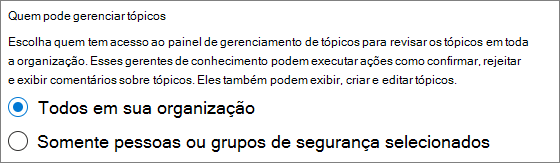

# Configurar tópicos do Microsoft Viva

Você pode usar o Microsoft 365 de administração para configurar e configurar [Tópicos.](topic-experiences-overview.md) 

É importante planejar a melhor maneira de configurar e configurar tópicos em seu ambiente. Leia Plan [for Microsoft Viva Topics](plan-topic-experiences.md) antes de começar os procedimentos neste artigo.

Você deve estar inscrito em [Tópicos](https://www.microsoft.com/microsoft-viva/topics) do Viva e ser um administrador global ou SharePoint para acessar o centro de administração Microsoft 365 e configurar Tópicos.

Se você configurou SharePoint [para exigir](/sharepoint/control-access-from-unmanaged-devices)dispositivos gerenciados, certifique-se de configurar Tópicos de um dispositivo gerenciado.

## Demonstração de vídeo

Este vídeo mostra o processo de configuração de Tópicos no Microsoft 365.

 

> [!VIDEO https://www.microsoft.com/videoplayer/embed/RE4Li0E]  

 

## Atribuir licenças

Você deve atribuir licenças para os usuários que usarão Tópicos. Somente usuários com uma licença podem ver informações sobre tópicos, incluindo destaques, cartões de tópicos, páginas de tópicos e o centro de tópicos. 

Atribuição de licenças:

1. No Centro de administração do Microsoft 365, em **Usuários**, clique em **Usuários ativos**.

2. Selecione os usuários que você deseja licenciar e clique **em Licenças e aplicativos.**

3. Em **Licenças,** selecione **Viva Tópicos**.

4. Em **Aplicativos,** certifique-se Graph Pesquisa de Conectores **com Índice (Tópicos** do Viva) e Tópicos do Viva estão **selecionados.**

   > [!div class="mx-imgBorder"]
   > 

5. Clique em **Salvar alterações**.

Pode levar até uma hora para que os usuários tenham acesso a Tópicos depois que as licenças são atribuídas.

## Configurar tópicos

> [!Note]
> A primeira descoberta de tópicos é habilitada, pode levar até duas semanas para que todos os tópicos sugeridos apareçam no modo de exibição Gerenciar Tópicos. A descoberta de tópicos continua à medida que novos conteúdos ou atualizações para o conteúdo são feitos. É normal ter flutuações no número de tópicos sugeridos em sua organização à medida que o Viva Topics avalia novas informações.

Para configurar tópicos
1. No centro [Microsoft 365 de administração,](https://admin.microsoft.com)selecione **Configurar** e, em seguida, exibir a seção **Arquivos e** conteúdo.
2. Na seção **Arquivos e conteúdo,** clique Conexão **pessoas para saber**.

     

3. Na página **Conexão pessoas para conhecimento,** clique em **Começar a** passar por você no processo de instalação.

     

4. Na página **Escolher como os Tópicos do Viva podem encontrar tópicos,** você configurará a descoberta de tópicos. Na seção **Selecionar SharePoint de** tópicos, selecione quais sites SharePoint serão rastreados como fontes para seus tópicos durante a descoberta. Escolha entre:
    - **Todos os**: todos os sites do Microsoft Office SharePoint Online em sua organização. Isso inclui sites atuais e futuros.
    - **Todos, exceto sites selecionados:** Digite os nomes dos sites que você deseja excluir.  Você também pode carregar uma lista de sites que deseja excluir da descoberta. Os sites criados no futuro serão incluídos como fontes para descoberta de tópicos. 
    - **Somente sites selecionados**: Digite os nomes dos sites que você deseja incluir. Você também pode carregar uma lista de sites. Sites criados no futuro não serão incluídos como fontes para descoberta de tópicos.
    - **Nenhum site**: Não incluir sites do Microsoft Office SharePoint Online.

     
   
5. Na seção **Excluir tópicos por** nome, você pode adicionar nomes de tópicos que deseja excluir da descoberta de tópicos. Use essa configuração para impedir que informações confidenciais são incluídas como tópicos. As opções são:
    - **Não exclua nenhum tópico** 
    - **Excluir tópicos por nome**

     

    (Os gerentes de conhecimento também podem excluir tópicos no centro de tópicos após a descoberta.)

    #### Como excluir tópicos por nome    

    Se você precisar excluir tópicos, depois de selecionar **Excluir tópicos** por nome, baixe o modelo de .csv e atualize-o com a lista de tópicos que você deseja excluir dos resultados da descoberta.

     

    No modelo CSV, insira as seguintes informações sobre os tópicos que você deseja excluir:

    - **Nome**: digite o nome do tópico que você deseja excluir. Há duas maneiras de fazer isso:
        - Match exato: Você pode incluir o nome exato ou acrônimo (por exemplo, *Contoso* ou *ATL*).
        - Match parcial: você pode excluir todos os tópicos que tenham uma palavra específica nele.  Por exemplo, *o arco* excluirá  todos os tópicos com o arco de palavra nele, como círculo de *arco,* *soldagem* de arco de plasma ou arco *treinamento*. Observe que ele não excluirá tópicos nos quais o texto é incluído como parte de uma palavra, como *Arquitetura*.
    - **Significa (opcional)**: Se você quiser excluir um acrônimo, digite as palavras que o acrônimo representa.
    - **MatchType-Exact/Partial**: Digite se o nome inserido foi *um tipo de* combinação exato *ou* parcial.

    Depois de concluir e salvar seu arquivo .csv, selecione **Procurar** para localizá-lo e selecioná-lo.
    
    Selecione **Avançar**.

6. No Who podem ver tópicos e onde eles podem **vê-los** na página, você configurará a visibilidade do tópico. Na Who pode ver a configuração de **tópicos,** escolha quem terá acesso aos detalhes do tópico, como tópicos destacados, cartões de tópicos, respostas de tópicos na pesquisa e páginas de tópicos. Você pode selecionar:
    - **Todos na minha organização**
    - **Somente pessoas selecionadas ou grupos de segurança**
    - **Ninguém**

      

    > [!Note] 
    > Embora essa configuração permita que você selecione qualquer usuário em sua organização, somente os usuários que têm licenças de Experiências de Tópico atribuídas a eles poderão exibir tópicos.

7. Na página **Permissões para gerenciamento de** tópicos, escolha quem poderá criar, editar ou gerenciar tópicos. Na seção **Who pode criar e editar tópicos,** você pode selecionar:
    - **Todos na minha organização**
    - **Somente pessoas selecionadas ou grupos de segurança**
    - **Ninguém**

     

8. Na seção **Who pode gerenciar tópicos,** você pode selecionar:
    - **Todos na minha organização**
    - **Somente pessoas selecionadas ou grupos de segurança**

     

    Selecione **Avançar**.

9. Na página **Criar centro de** tópicos, você pode criar seu site central de tópicos no qual as páginas de tópicos podem ser exibidas e os tópicos podem ser gerenciados. Na caixa **Nome do site,** digite um nome para o centro de tópicos. Opcionalmente, você pode digitar uma breve descrição na caixa **Descrição.** 

   Selecione **Avançar**.

     

10. Na página **Revisão e acabamento**, você pode olhar para a configuração selecionada e escolher fazer alterações. Se estiver satisfeito com as suas seleções, selecione **Ativar**.

11. A **página Tópicos do Viva** ativada será exibida, confirmando que o sistema agora começará a analisar os sites selecionados para tópicos e a criação do site central de tópicos. Selecione **Concluído**.

12. Você será retornado ao seu Conexão **para a página de** conhecimento. A partir desta página, é possível selecionar **Gerenciar** para fazer quaisquer alterações em suas configurações. 

        

## Gerenciar experiências de tópico

Depois de configurar Tópicos, você pode alterar as configurações escolhidas durante a instalação no Microsoft 365 [de administração.](https://admin.microsoft.com/AdminPortal#/featureexplorer/csi/KnowledgeManagement) Confira as seguintes referências:

- [Gerenciar a descoberta de tópicos em Tópicos do Microsoft Viva](topic-experiences-discovery.md)
- [Gerenciar visibilidade de tópicos em Tópicos do Microsoft Viva](topic-experiences-knowledge-rules.md)
- [Gerenciar permissões de tópicos em Tópicos do Microsoft Viva](topic-experiences-user-permissions.md)
- [Alterar o nome do centro de tópicos em Tópicos do Microsoft Viva](topic-experiences-administration.md)

## Confira também

[Visão geral das experiências do tópico](topic-experiences-overview.md)
