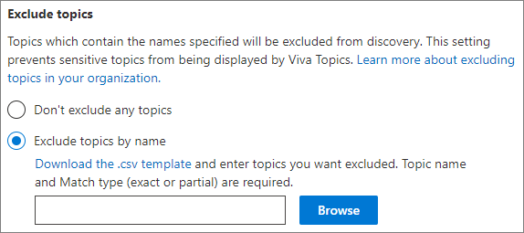
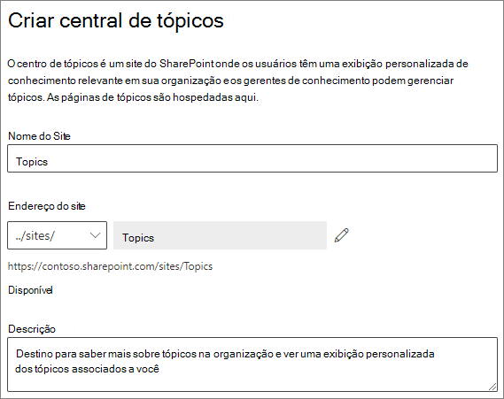

# Configurar tópicos do Microsoft Viva

Você pode usar o Centro de administração do Microsoft 365 para configurar e configurar [tópicos.](topic-experiences-overview.md) 

É importante planejar a melhor maneira de configurar e configurar tópicos em seu ambiente. Certifique-se de [ler Plan for Microsoft Viva Topics](plan-topic-experiences.md) antes de começar os procedimentos deste artigo.

Você deve estar inscrito nos [Tópicos](https://www.microsoft.com/microsoft-viva/topics) do Viva e ser um administrador global ou administrador do SharePoint para acessar o centro de administração do Microsoft 365 e configurar Tópicos.

Se você configurou o SharePoint para [exigir dispositivos gerenciados,](https://docs.microsoft.com/sharepoint/control-access-from-unmanaged-devices)certifique-se de configurar tópicos de um dispositivo gerenciado.

## Demonstração de vídeo

Este vídeo mostra o processo de configuração de tópicos no Microsoft 365.

 

> [!VIDEO https://www.microsoft.com/videoplayer/embed/RE4Li0E]  

 

## Configurar tópicos

Para configurar tópicos

1. No Centro [de administração do Microsoft 365,](https://admin.microsoft.com)selecione **Instalação** e, em seguida, veja a seção **Arquivos e** conteúdo.
2. Na seção **Arquivos e conteúdo,** clique em **Conectar pessoas ao conhecimento.**

     

3. Na página **Conectar pessoas ao conhecimento,** clique em **Começar** para ajudar você durante o processo de configuração.

     

4. On the **Choose how Viva Topics can find topics** page, you will configure topic discovery. Na seção **Selecionar fontes de tópicos do SharePoint,** selecione quais sites do SharePoint serão rastreados como fontes para seus tópicos durante a descoberta. Escolha entre:
    - **Todos os sites:** todos os sites do SharePoint em sua organização. Isso inclui sites atuais e futuros.
    - **Todos, exceto sites selecionados:** digite os nomes dos sites que você deseja excluir.  Você também pode carregar uma lista de sites que deseja excluir da descoberta. Os sites criados no futuro serão incluídos como fontes para descoberta de tópicos. 
    - **Somente sites selecionados:** digite os nomes dos sites que você deseja incluir. Você também pode carregar uma lista de sites. Os sites criados no futuro não serão incluídos como fontes para descoberta de tópicos.
    - **Nenhum site:** não inclua sites do SharePoint.

     
   
5. Na seção **Excluir tópicos por nome,** você pode adicionar nomes de tópicos que deseja excluir da descoberta de tópicos. Use essa configuração para impedir que informações confidenciais são incluídas como tópicos. As opções são:
    - **Não exclua nenhum tópico** 
    - **Excluir tópicos por nome**

     

    (Os gerentes de conhecimento também podem excluir tópicos no centro de tópicos após a descoberta.)

    #### Como excluir tópicos por nome    

    Se você precisar excluir tópicos, depois de selecionar Excluir **tópicos** por nome, baixe o modelo .csv e atualize-o com a lista de tópicos que você deseja excluir dos resultados de descoberta.

     

    No modelo CSV, insira as seguintes informações sobre os tópicos que você deseja excluir:

    - **Nome:** digite o nome do tópico que você deseja excluir. Há duas maneiras de fazer isso:
        - Exact match: You can include the exact name or acronym (for example, *Contoso* or *ATL*).
        - Parciais: você pode excluir todos os tópicos que têm uma palavra específica.  Por exemplo, *o arco* excluirá  todos os tópicos com o arco de palavras nele, como arco *círculo,* arco *de Arc arc arc ou* arco *de treinamento.* Observe que ele não excluirá tópicos nos quais o texto é incluído como parte de uma palavra, *como* Arquitetura .
    - **Significa (opcional)**: se você quiser excluir um acrônimo, digite as palavras que o acrônimo significa.
    - **MatchType-Exact/Partial**: digite se o nome digitado foi um *tipo de* combinação exato *ou* parcial.

    Depois de concluir e salvar o arquivo .csv, selecione **Procurar** para localizá-lo e selecioná-lo.
    
    Selecione **Avançar**.

6. Nos **tópicos Quem podem ver e onde eles** podem vê-los, você configurará a visibilidade do tópico. Na configuração Quem pode **ver tópicos,** escolha quem terá acesso aos detalhes do tópico, como tópicos destacados, cartões de tópicos, respostas de tópicos em pesquisa e páginas de tópicos. Você pode selecionar:
    - **Todos na minha organização**
    - **Somente pessoas ou grupos de segurança selecionados**
    - **Ninguém**

      

    > [!Note] 
    > Embora essa configuração permita que você selecione qualquer usuário em sua organização, somente os usuários que têm licenças de Experiências de Tópico atribuídas a eles poderão exibir tópicos.

7. Na página **Permissões de gerenciamento de tópicos,** escolha quem poderá criar, editar ou gerenciar tópicos. Na seção **Quem pode criar e editar tópicos,** você pode selecionar:
    - **Todos na minha organização**
    - **Somente pessoas ou grupos de segurança selecionados**
    - **Ninguém**

     

8. Na seção **Quem pode gerenciar tópicos,** você pode selecionar:
    - **Todos na minha organização**
    - **Somente pessoas ou grupos de segurança selecionados**

     

    Selecione **Avançar**.

9. Na página **Criar centro de** tópicos, você pode criar seu site central de tópicos no qual as páginas de tópicos podem ser exibidas e os tópicos podem ser gerenciados. Na caixa **Nome do site,** digite um nome para o centro de tópicos. Opcionalmente, você pode digitar uma breve descrição na caixa **Descrição.** 

   Selecione **Avançar**.

     

10. Na página **Revisão e acabamento**, você pode olhar para a configuração selecionada e escolher fazer alterações. Se estiver satisfeito com as suas seleções, selecione **Ativar**.

11. A **página Tópicos do Viva** será exibida, confirmando que agora o sistema começará a analisar os sites selecionados para tópicos e a criar o site central de tópicos. Selecione **Concluído**.

12. You'll be returned to your **Connect people to knowledge** page. A partir desta página, é possível selecionar **Gerenciar** para fazer quaisquer alterações em suas configurações. 

        

## Atribua licenças

Depois de configurar as experiências de tópico, você deve atribuir licenças para os usuários que usarão Tópicos. Somente os usuários com uma licença podem ver informações sobre tópicos, incluindo destaques, cartões de tópicos, páginas de tópicos e o centro de tópicos. 

Atribuição de licenças:

1. No Centro de administração do Microsoft 365, em **Usuários**, clique em **Usuários ativos**.

2. Selecione os usuários que você deseja licenciar e clique em **Licenças e aplicativos.**

3. Em **Aplicativos,** **certifique-se de que a Pesquisa de Conectores do Graph com Experiências** de Índice e **Tópicos** estão selecionadas.

4. Clique em **Salvar alterações**.

## Gerenciar experiências de tópico

Depois de configurar tópicos, você pode alterar as configurações escolhidas durante a configuração no Centro de administração do [Microsoft 365.](https://admin.microsoft.com/AdminPortal#/featureexplorer/csi/KnowledgeManagement) Confira as seguintes referências:

- [Gerenciar a descoberta de tópicos nos tópicos do Microsoft Viva](topic-experiences-discovery.md)
- [Gerenciar visibilidade de tópicos nos tópicos do Microsoft Viva](topic-experiences-knowledge-rules.md)
- [Gerenciar permissões de tópico nos tópicos do Microsoft Viva](topic-experiences-user-permissions.md)
- [Alterar o nome do centro de tópicos nos tópicos do Microsoft Viva](topic-experiences-administration.md)

## Confira também

[Visão geral das experiências de tópico](topic-experiences-overview.md)
