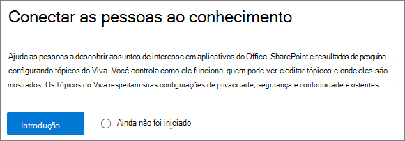
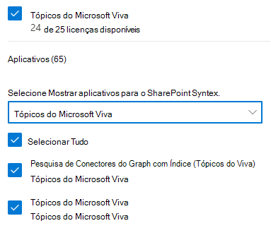

# Configurar experiências de tópico no Microsoft 365

Você pode usar o centro de administração do Microsoft 365 para configurar e configurar [experiências de tópico](knowledge-management-overview.md). 

É importante planejar a melhor maneira de configurar e configurar tópicos em seu ambiente. Certifique-se de ler [planejar experiências de tópico](plan-topic-experiences.md) antes de começar os procedimentos neste artigo.

Você deve ser um administrador global ou administrador do SharePoint para acessar o centro de administração do Microsoft 365 e configurar experiências de tópico.

## Configurar experiências de tópico

Para configurar experiências de tópico no Microsoft 365

1. No [centro de administração do Microsoft 365](https://admin.microsoft.com), selecione **configuração** e, em seguida, exiba a seção **arquivos e conteúdo** .
2. Na seção **arquivos e conteúdo** , clique em **conectar pessoas a conhecimento**.

     

3. Na página **conectar pessoas a conhecimento** **, clique em introdução para** orientá-lo no processo de instalação.

     

4. Na página **escolha como a rede de conhecimento pode encontrar tópicos** , você configurará a descoberta de tópicos. Na seção **selecionar fontes de tópicos do SharePoint** , selecione quais sites do SharePoint serão rastreados como fontes para seus tópicos durante a descoberta. Escolha entre:
    - **Todos os sites**: todos os sites do SharePoint em sua organização. Isso inclui sites atuais e futuros.
    - **Todos, exceto sites selecionados**: digite os nomes dos sites que você deseja excluir.  Você também pode carregar uma lista de sites que deseja recusar da descoberta. Os sites criados no futuro serão incluídos como fontes para descoberta de tópicos. 
    - **Somente sites selecionados**: digite os nomes dos sites que você deseja incluir. Você também pode carregar uma lista de sites. Os sites criados no futuro não serão incluídos como fontes para descoberta de tópicos.
    - **Nenhum site**: não inclua nenhum site do SharePoint.

     
   
5. Na seção **excluir tópicos por nome** , você pode adicionar nomes de tópicos que você deseja excluir da descoberta de tópicos. Use essa configuração para evitar que informações confidenciais sejam incluídas como tópicos. As opções são:
    - **Não excluir nenhum tópico** 
    - **Excluir tópicos por nome**

     

    (Os gerentes de conhecimento também podem excluir tópicos no centro de tópicos após a descoberta.)

    #### Como excluir tópicos por nome    

    Se você precisar excluir tópicos, depois de selecionar **excluir tópicos por nome**, selecione baixar o modelo. csv e atualizá-lo com a lista de tópicos que você deseja excluir dos resultados da descoberta.

     

    No modelo CSV, insira as seguintes informações sobre os tópicos que você deseja excluir:

    - **Name**: digite o nome do tópico que você deseja excluir. Há duas maneiras de fazer isso:
        - Correspondência exata: você pode incluir o nome exato ou o acrônimo (por exemplo, *contoso* ou *ATL*).
        - Correspondência parcial: você pode excluir todos os tópicos que possuem uma palavra específica.  Por exemplo, o *arco* excluirá todos os tópicos com a palavra *arco* nele, como *círculo de arco*, solda de arco de *plasma* ou arco de *treinamento*. Observe que ele não excluirá tópicos nos quais o texto está incluído como parte de uma palavra, como *arquitetura*.
    - **Significa (opcional)**: se você deseja excluir um acrônimo, digite as palavras que o acrônimo significa.
    - **MatchType-Exact/partial**: digite se o nome inserido foi um tipo de correspondência *exata* ou *parcial* .

    Depois de concluir e salvar seu arquivo. csv, selecione **procurar** para localizá-lo e selecioná-lo.
    
    Selecione **Avançar**.

6. Na página **quem pode ver os tópicos e onde eles podem vê-los** , você configurará a visibilidade do tópico. Na configuração **quem pode ver os tópicos da configuração de rede de conhecimento** , você escolhe quem terá acesso aos detalhes do tópico, como tópicos realçados, cartões de tópicos, respostas de tópicos em pesquisa e páginas de tópicos. Você pode selecionar:
    - **Todos na minha organização**
    - **Apenas pessoas ou grupos de segurança selecionados**
    - **Ninguém**

      

 > [!Note] 
 > Embora essa configuração permita que você selecione qualquer usuário da sua organização, somente os usuários que tiverem o tópico experiências de licenças atribuídas poderão exibir tópicos.

7. Na página **permissões para gerenciamento de tópicos** , escolha quem poderá criar, editar ou gerenciar tópicos. Na seção **quem pode criar e editar tópicos** , você pode selecionar:
    - **Todos na minha organização**
    - **Apenas pessoas ou grupos de segurança selecionados**
    - **Ninguém**

     

8. Na seção **quem pode gerenciar tópicos** , você pode selecionar:
    - **Todos na minha organização**
    - **Apenas pessoas ou grupos de segurança selecionados**

     

    Selecione **Avançar**.

9. Na página **criar centro de tópicos** , você pode criar seu site do centro de tópicos no qual as páginas de tópicos podem ser exibidas e os tópicos podem ser gerenciados. Na caixa **nome do site** , digite um nome para o seu centro de tópico. Opcionalmente, você pode digitar uma descrição curta na caixa **Descrição** . 

Selecione **Avançar**.

     

10. Na página **Revisão e acabamento**, você pode olhar para a configuração selecionada e escolher fazer alterações. Se estiver satisfeito com as suas seleções, selecione **Ativar**.

11. A página **da rede de conhecimento ativada** será exibida, confirmando que o sistema agora vai começar a analisar os sites selecionados para tópicos e criar o site do centro de conhecimento. Selecione **Concluído**.

12. Você retornará à página **conectar pessoas para o conhecimento** . A partir desta página, é possível selecionar **Gerenciar** para fazer quaisquer alterações em suas configurações. 

        

## Atribua licenças

Depois de configurar as experiências de tópico, você deve atribuir licenças para os usuários que utilizarão experiências de tópico. Somente os usuários com uma licença podem ver informações sobre tópicos, incluindo realces, cartões de tópicos, páginas de tópicos e o tópico central. 

Atribuição de licenças:

1. No Centro de administração do Microsoft 365, em **Usuários**, clique em **Usuários ativos**.

2. Selecione os usuários que você deseja licenciar, e clique **Gerenciar licenças de produtos**.

3. Selecione **Atribuir mais**.

4. Em **licenças**, selecione **experiências de tópico**.

5. Em **aplicativos**, certifique-se **de que a pesquisa de conectores do Graph com** as experiências de índice e **tópico** esteja selecionada.

    > [!div class="mx-imgBorder"]
    > 

6. Clique em **Salvar alterações**.

## Gerenciar experiências de tópico

Depois de configurar experiências de tópico, você poderá alterar as configurações escolhidas durante a instalação no centro de [Administração do Microsoft 365](https://admin.microsoft.com/AdminPortal#/featureexplorer/csi/KnowledgeManagement). Confira as seguintes referências:

- [Gerenciar descoberta de tópicos no Microsoft 365](topic-experiences-discovery.md)
- [Gerenciar a visibilidade de tópicos no Microsoft 365](topic-experiences-knowledge-rules.md)
- [Gerenciar permissões de tópico no Microsoft 365](topic-experiences-user-permissions.md)
- [Alterar o nome da central de tópicos no Microsoft 365](topic-experiences-administration.md)

## Também consulte

[Visão geral do gerenciamento de conhecimento](knowledge-management-overview.md)
