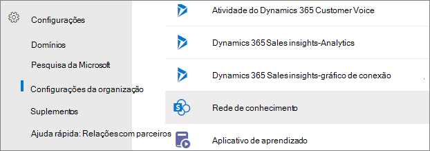
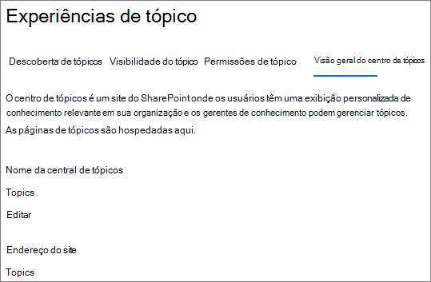

# Visão geral do centro de tópicos em Tópicos do Microsoft Viva

Em Tópicos do Microsoft Viva, o centro de tópicos é um site SharePoint moderno que serve como um centro de conhecimento para sua organização. Ele é criado durante a instalação [de Tópicos do Viva](set-up-topic-experiences.md) no centro de Microsoft 365 de administração.

O centro de tópicos tem uma home page padrão com a Web Part **Tópicos** onde todos os usuários licenciados podem ver os tópicos aos quais eles têm uma conexão. 

Embora todos os usuários licenciados que possam exibir tópicos tenham acesso à central de tópicos, os gerentes de conhecimento também podem gerenciar tópicos por meio da página **Gerenciar tópicos.** A **guia Gerenciar tópicos** só será exibida para usuários que tenham as permissões Gerenciar tópicos. 

## Onde está meu centro de tópicos

O centro de tópicos é criado durante a instalação de Tópicos do Viva. Após a conclusão da instalação, um administrador pode encontrar a URL na página [Gerenciamento do Centro de Tópicos.](./topic-experiences-administration.md#to-access-topics-management-settings)

1. No centro Microsoft 365 de administração, selecione **Configurações** e, em seguida, selecione **Configurações de organização**.
2. Na guia **Serviços,** selecione **Experiências de Tópico**.

     

3. Selecione a **guia Central de** tópicos. Em **Endereço do site** é um link para o centro de tópicos.

     

## Página inicial

 

> [!VIDEO https://www.microsoft.com/videoplayer/embed/RE4LAhZ]  

 

Na home page da central de tópicos, você pode ver os tópicos em sua organização aos quais você tem uma conexão.

- Conexões sugeridas - Você verá tópicos listados em **Listamos você nesses tópicos. Fizemos certo?** Estes são tópicos nos quais sua conexão com o tópico foi sugerida por meio da AI. Por exemplo, você pode ser um autor de um arquivo ou site relacionado. Você deve confirmar que deve permanecer listado como uma pessoa relacionada para o tópico.

    
 
- Conexões confirmadas - Estes são tópicos nos quais você está fixado na página de tópicos ou você confirmou uma conexão sugerida com o tópico. Os tópicos mudarão da seção sugerida para confirmada quando você confirmar uma conexão sugerida.
 
    

Depois que um usuário confirmar sua conexão com um tópico, o usuário poderá fazer edições para a página de tópicos para fazer a cura de sua conexão. Por exemplo, eles podem fornecer mais informações sobre sua conexão com o tópico.

## Gerenciar página de tópicos

Para trabalhar na página **Gerenciar tópicos** do centro de tópicos, você precisa ter as permissões necessárias Gerenciar tópicos necessários para a função de gerente de conhecimento. O administrador pode atribuir essas permissões aos usuários durante a configuração de gerenciamento de conhecimento [ou](set-up-topic-experiences.md)novos usuários podem ser [adicionados](topic-experiences-knowledge-rules.md) posteriormente por um administrador por meio do Microsoft 365 de administração.

Na página **Gerenciar tópicos,** o painel de tópicos mostra todos os tópicos aos que você tem acesso, que foram identificados de seus locais de origem especificados. Cada tópico mostrará a data em que o tópico foi descoberto. Um usuário que foi atribuído Gerenciar permissões de tópicos pode revisar os tópicos não confirmados e optar por:

- Confirme o tópico: Indica aos usuários que um tópico sugerido por AI foi validado por um curador humano.

- Publique o tópico: Edite as informações do tópico para melhorar a qualidade do tópico identificado inicialmente e realça o tópico para todos os usuários que têm acesso a tópicos.
 
- Remova o tópico: torna o tópico indiscoverable para os usuários finais. O tópico é movido para a guia **Removido** e pode ser confirmado posteriormente, se necessário. 

Para obter mais informações sobre como gerenciar tópicos na página **Gerenciar tópicos,** consulte [Gerenciar tópicos](manage-topics.md).

## Criar ou editar um tópico

Se você tiver permissões Criar e editar tópicos, poderá:

- [Editar tópicos existentes](edit-a-topic.md): Você pode fazer alterações nas páginas de tópicos existentes que foram criadas por meio da descoberta.

- [Criar novos tópicos](create-a-topic.md): Você pode criar novos tópicos para aqueles que não foram encontrados por meio da descoberta ou se as ferramentas de AI não encontraram evidências suficientes para criar um tópico.

## Confira também

[Gerenciar tópicos no centro de tópicos](manage-topics.md)

