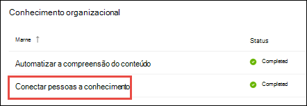

# Visão geral do centro de tópicos (versão prévia)

> [!Note] 
> O conteúdo deste artigo é para a visualização privada do Project Cortex. [Saiba mais sobre o Project Cortex](https://aka.ms/projectcortex).

O tópico central é um site moderno do SharePoint que serve como um centro de conhecimento para sua organização. Ele é criado durante [a configuração do Knowledge Management](set-up-knowledge-network.md) no centro de administração do Microsoft 365.

Por meio do centro de tópicos, os usuários com as permissões adequadas podem fazer o seguinte:

- Confirmar ou rejeitar tópicos descobertos
- Criar uma nova página de tópico
- Editar uma página de tópico existente

> [!Note] 
> Você pode saber mais sobre cada tarefa em [trabalhar com os tópicos no centro de tópicos](work-with-topics.md).

## Onde está o tópico central

Seu centro de tópicos é criado durante a configuração do gerenciamento de conhecimento. Após a conclusão da instalação, um administrador pode encontrar a URL na [página Gerenciamento da central de conhecimento](manage-knowledge-network.md).

1. No centro de administração do Microsoft 365, selecione **Configurar** no painel de navegação e, na seção **conhecimento organizacional** , selecione **conectar pessoas a conhecimento**.

     

2. Na página **conectar pessoas a conhecimento** , na seção **noções básicas** , confira endereço do **centro de tópicos** para a URL do site.

## Permissões para usar o centro de tópicos

Para trabalhar no centro de tópicos, você precisa ter as permissões necessárias. Seu administrador pode atribuir essas permissões aos usuários durante a [configuração de gerenciamento de conhecimento](set-up-knowledge-network.md)ou os novos usuários podem ser [adicionados posteriormente](give-user-permissions-to-the-topic-center.md) por um administrador por meio do centro de administração do Microsoft 365.

Os usuários do centro de tópicos podem receber dois conjuntos de permissões:

- **Criar e editar tópicos**: criar novos tópicos ou atualizar conteúdo do tópico, como descrição, documentos e pessoas associadas. Atribua essa permissão aos especialistas no assunto, que estão configurados com as páginas de tópicos de revisão.
- **Gerenciar tópicos**: Use o painel de tópicos para analisar os tópicos em toda a organização. Os usuários podem executar ações como confirmar e rejeitar tópicos não confirmados.

Um usuário pode ter os dois conjuntos de permissões ou somente um se necessário. 

## Revisão de tópicos no painel de tópico

O painel de tópico mostra tópicos que foram extraídos dos locais de origem especificados. Cada tópico mostrará a data de descoberta do tópico e se algum comentário tiver sido fornecido nele. Um usuário que recebeu as permissões **gerenciar tópicos** pode revisar os tópicos não confirmados e optar por:
- Confirmar o tópico: realça o tópico para os usuários que têm acesso e permite que eles vejam o cartão de tópicos e a página de tópico associados.
- Rejeitar o tópico: torna o tópico não disponível para os usuários. O tópico é movido para a guia **rejeitada** e pode ser confirmado posteriormente, se necessário.

## Criar ou editar um tópico

Se você tiver permissões **criar e editar tópicos** , poderá optar por:

- Editar tópicos existentes: você pode fazer alterações em páginas de tópicos existentes que foram criadas por meio de descoberta.
- Criar novos tópicos: você pode criar novos tópicos para aqueles que não foram encontrados por meio de descoberta, ou se as ferramentas AI não encontraram evidências suficientes para criar um tópico.

## Confira também

  

