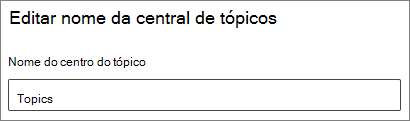

# Alterar o nome do centro de tópicos em Tópicos do Microsoft VivaChange the name of the topic center in Microsoft Viva Topics

Você pode alterar o nome do centro de tópicos no Microsoft 365 [de administração.](https://admin.microsoft.com)You can change the name of your topic center in the [Microsoft 365 admin center](https://admin.microsoft.com). Você deve ser um administrador global ou um SharePoint para executar essas tarefas.You must be a global administrator or SharePoint administrator to perform these tasks.

## Para acessar as configurações de gerenciamento de tópicos:To access topics management settings:

1. No centro Microsoft 365 de administração, clique **em Configurações**, em seguida, **Configurações de organização**.In the Microsoft 365 admin center, click **Settings**, then **Org settings**.
2. Na guia **Serviços,** clique em **Experiências de tópico.**On the **Services** tab, click **Topic experiences**.

     

3. Selecione a **guia Central de** tópicos. Consulte as seções a seguir para obter informações sobre cada configuração.Select the **Topic center** tab. See the following sections for information about each setting.

     

##  Atualizar o nome da central de tópicosUpdate your topic center name

Para alterar o nome do centro de tópicosTo change the name of the topic center

1. Na guia **Central de Tópicos,** em **Nome da Central de Tópicos,** selecione **Editar**.On the **Topic center** tab, under **Topic center name**, select **Edit**.
2. Na página **Editar nome da central de** tópicos, na caixa **Nome** da central de tópicos, digite o novo nome para o centro de tópicos.On the **Edit topic center name** page, in the **Topic center name** box, type the new name for your topic center.
3. Selecione **Salvar**Select **Save**

      

## Confira tambémSee also

[Gerenciar a descoberta de tópicos em Tópicos do Microsoft VivaManage topic discovery in Microsoft Viva Topics](topic-experiences-discovery.md)

[Gerenciar visibilidade de tópicos em Tópicos do Microsoft VivaManage topic visibility in Microsoft Viva Topics](topic-experiences-knowledge-rules.md)

[Gerenciar permissões de tópicos em Tópicos do Microsoft VivaManage topic permissions in Microsoft Viva Topics](topic-experiences-user-permissions.md)
