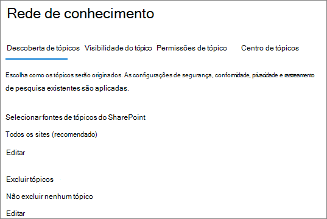
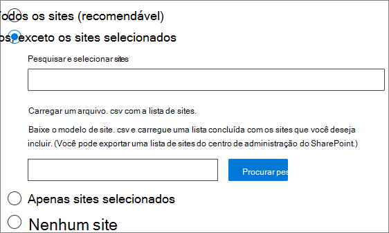
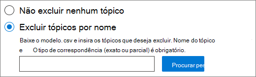

# <a name="manage-topic-discovery-in-microsoft-365"></a><span data-ttu-id="8d424-103">Gerenciar descoberta de tópicos no Microsoft 365</span><span class="sxs-lookup"><span data-stu-id="8d424-103">Manage topic discovery in Microsoft 365</span></span>

<span data-ttu-id="8d424-104">Você pode gerenciar as configurações de descoberta de tópico no [centro de administração do Microsoft 365](https://admin.microsoft.com).</span><span class="sxs-lookup"><span data-stu-id="8d424-104">You can manage topic discovery settings in the [Microsoft 365 admin center](https://admin.microsoft.com).</span></span> <span data-ttu-id="8d424-105">Você deve ser um administrador global ou administrador do SharePoint para executar essas tarefas.</span><span class="sxs-lookup"><span data-stu-id="8d424-105">You must be a global administrator or SharePoint administrator to perform these tasks.</span></span>

## <a name="to-access-topics-management-settings"></a><span data-ttu-id="8d424-106">Para acessar as configurações de gerenciamento de tópicos:</span><span class="sxs-lookup"><span data-stu-id="8d424-106">To access topics management settings:</span></span>

1. <span data-ttu-id="8d424-107">No centro de administração do Microsoft 365, clique em **configurações** e em **configurações da organização**.</span><span class="sxs-lookup"><span data-stu-id="8d424-107">In the Microsoft 365 admin center, click **Settings**, then **Org settings**.</span></span>
2. <span data-ttu-id="8d424-108">Na guia **Serviços** , clique em **rede de conhecimento**.</span><span class="sxs-lookup"><span data-stu-id="8d424-108">On the **Services** tab, click **Knowledge network**.</span></span>

     

3. <span data-ttu-id="8d424-110">Selecione a guia **descoberta de tópicos** . Consulte as seções a seguir para obter informações sobre cada configuração.</span><span class="sxs-lookup"><span data-stu-id="8d424-110">Select the **Topic discovery** tab. See the following sections for information about each setting.</span></span>

     

## <a name="select-sharepoint-topic-sources"></a><span data-ttu-id="8d424-112">Selecionar fontes de tópicos do SharePoint</span><span class="sxs-lookup"><span data-stu-id="8d424-112">Select SharePoint topic sources</span></span>

<span data-ttu-id="8d424-113">Você pode alterar os sites do SharePoint em sua organização que serão rastreados para tópicos.</span><span class="sxs-lookup"><span data-stu-id="8d424-113">You can change the SharePoint sites in your organization that will be crawled for topics.</span></span>

<span data-ttu-id="8d424-114">Se quiser incluir ou excluir uma lista específica de sites, você pode usar o modelo. csv a seguir:</span><span class="sxs-lookup"><span data-stu-id="8d424-114">If you want to include or exclude a specific list of sites, you can use the following .csv template:</span></span>

``` csv
Site name,URL
```

<span data-ttu-id="8d424-115">Se você adicionar sites usando o seletor de sites, eles serão adicionados à lista existente de sites a serem incluídos ou excluídos.</span><span class="sxs-lookup"><span data-stu-id="8d424-115">If you add sites using the site picker, they are added to the existing list of sites to include or exclude.</span></span> <span data-ttu-id="8d424-116">Se você carregar um arquivo. csv, ele substituirá qualquer lista existente.</span><span class="sxs-lookup"><span data-stu-id="8d424-116">If you upload a .csv file, it overwrites any existing list.</span></span> <span data-ttu-id="8d424-117">Se você tiver incluído ou excluído sites específicos anteriormente, você e baixar a lista como um arquivo. csv, fazer alterações e carregar a nova lista.</span><span class="sxs-lookup"><span data-stu-id="8d424-117">If you have previously included or excluded specific sites, you and download the list as a .csv file, make changes, and upload the new list.</span></span>

<span data-ttu-id="8d424-118">Para escolher sites para descoberta de tópico</span><span class="sxs-lookup"><span data-stu-id="8d424-118">To choose sites for topic discovery</span></span>

1. <span data-ttu-id="8d424-119">Na guia **descoberta de tópico** , em **selecionar fontes de tópicos do SharePoint**, selecione **Editar**.</span><span class="sxs-lookup"><span data-stu-id="8d424-119">On the **Topic discovery** tab, under **Select SharePoint topic sources**, select **Edit**.</span></span>
2. <span data-ttu-id="8d424-120">Na página **selecionar fontes de tópicos do SharePoint** , selecione quais sites do SharePoint serão rastreados como fontes para seus tópicos durante a descoberta.</span><span class="sxs-lookup"><span data-stu-id="8d424-120">On the **Select SharePoint topic sources** page, select which SharePoint sites will be crawled as sources for your topics during discovery.</span></span> <span data-ttu-id="8d424-121">Isso inclui:</span><span class="sxs-lookup"><span data-stu-id="8d424-121">This includes:</span></span>
    - <span data-ttu-id="8d424-122">**Todos os sites**: todos os sites do SharePoint em seu locatário.</span><span class="sxs-lookup"><span data-stu-id="8d424-122">**All sites**: All SharePoint sites in your tenant.</span></span> <span data-ttu-id="8d424-123">Isso captura sites atuais e futuros.</span><span class="sxs-lookup"><span data-stu-id="8d424-123">This captures current and future sites.</span></span>
    - <span data-ttu-id="8d424-124">**Todos, exceto sites selecionados**: digite os nomes dos sites que você deseja excluir.</span><span class="sxs-lookup"><span data-stu-id="8d424-124">**All, except selected sites**: Type the names of the sites you want to exclude.</span></span>  <span data-ttu-id="8d424-125">Você também pode carregar uma lista de sites que deseja recusar da descoberta.</span><span class="sxs-lookup"><span data-stu-id="8d424-125">You can also upload a list of sites you want to opt out from discovery.</span></span> <span data-ttu-id="8d424-126">Os sites criados no futuro serão incluídos como fontes para descoberta de tópicos.</span><span class="sxs-lookup"><span data-stu-id="8d424-126">Sites created in the future will be included as sources for topic discovery.</span></span> 
    - <span data-ttu-id="8d424-127">**Somente sites selecionados**: digite os nomes dos sites que você deseja incluir.</span><span class="sxs-lookup"><span data-stu-id="8d424-127">**Only selected sites**: Type the names of the sites you want to include.</span></span> <span data-ttu-id="8d424-128">Você também pode carregar uma lista de sites.</span><span class="sxs-lookup"><span data-stu-id="8d424-128">You can also upload a list of sites.</span></span> <span data-ttu-id="8d424-129">Os sites criados no futuro não serão incluídos como fontes para descoberta de tópicos.</span><span class="sxs-lookup"><span data-stu-id="8d424-129">Sites created in the future will not be included as sources for topic discovery.</span></span>
    - <span data-ttu-id="8d424-130">**Nenhum site**: os tópicos não serão gerados ou atualizados automaticamente com o conteúdo do SharePoint.</span><span class="sxs-lookup"><span data-stu-id="8d424-130">**No sites**: Topics won't be automatically generated or updated with SharePoint content.</span></span> <span data-ttu-id="8d424-131">Os tópicos existentes permanecem no centro de tópicos.</span><span class="sxs-lookup"><span data-stu-id="8d424-131">Existing topics remain in the topic center.</span></span>

    
   
3. <span data-ttu-id="8d424-133">Clique em **Salvar**.</span><span class="sxs-lookup"><span data-stu-id="8d424-133">Click **Save**.</span></span>

## <a name="exclude-topics-by-name"></a><span data-ttu-id="8d424-134">Excluir tópicos por nome</span><span class="sxs-lookup"><span data-stu-id="8d424-134">Exclude topics by name</span></span>

<span data-ttu-id="8d424-135">Você pode excluir tópicos da descoberta carregando uma lista usando um arquivo. csv.</span><span class="sxs-lookup"><span data-stu-id="8d424-135">You can exclude topics from discovery by uploading a list using a .csv file.</span></span> <span data-ttu-id="8d424-136">Se já tiver excluído os tópicos, você poderá baixar o arquivo. csv, fazer alterações e carregá-lo novamente.</span><span class="sxs-lookup"><span data-stu-id="8d424-136">If you've previously excluded topics, you can download the .csv, make changes, and upload it again.</span></span>

1. <span data-ttu-id="8d424-137">Na guia **descoberta de tópico** , em **excluir tópicos**, selecione **Editar**.</span><span class="sxs-lookup"><span data-stu-id="8d424-137">On the **Topic discovery** tab, under **Exclude topics**, select **Edit**.</span></span>
2. <span data-ttu-id="8d424-138">Clique em **excluir tópicos por nome**.</span><span class="sxs-lookup"><span data-stu-id="8d424-138">Click **Exclude topics by name**.</span></span>
3. <span data-ttu-id="8d424-139">Se você precisar criar uma lista, baixe o modelo. csv e adicione os tópicos que você deseja excluir (consulte *trabalhar com o modelo. csv* abaixo).</span><span class="sxs-lookup"><span data-stu-id="8d424-139">If you need to create a list, download the .csv template and add the topics that you want to exclude (see *Working with the .csv template* below).</span></span> <span data-ttu-id="8d424-140">Quando o arquivo estiver pronto, clique em **procurar** e carregar o arquivo.</span><span class="sxs-lookup"><span data-stu-id="8d424-140">When the file is ready, click **Browse** and upload the file.</span></span> <span data-ttu-id="8d424-141">Se houver uma lista existente, você poderá baixar o. csv que contém a lista.</span><span class="sxs-lookup"><span data-stu-id="8d424-141">If there's an existing list, you can download the .csv containing the list.</span></span>
4. <span data-ttu-id="8d424-142">Clique em **Salvar**.</span><span class="sxs-lookup"><span data-stu-id="8d424-142">Click **Save**.</span></span>

    

### <a name="working-with-the-csv-template"></a><span data-ttu-id="8d424-144">Trabalhar com o modelo. csv</span><span class="sxs-lookup"><span data-stu-id="8d424-144">Working with the .csv template</span></span>

<span data-ttu-id="8d424-145">Você pode copiar o modelo CSV abaixo:</span><span class="sxs-lookup"><span data-stu-id="8d424-145">You can copy the csv template below:</span></span>

``` csv
Name (required),Expansion,MatchType- Exact/Partial (required)
```

<span data-ttu-id="8d424-146">No modelo CSV, insira as seguintes informações sobre os tópicos que você deseja excluir:</span><span class="sxs-lookup"><span data-stu-id="8d424-146">In the CSV template, enter the following information about the topics you want to exclude:</span></span>

- <span data-ttu-id="8d424-147">**Name**: digite o nome do tópico que você deseja excluir.</span><span class="sxs-lookup"><span data-stu-id="8d424-147">**Name**: Type the name of the topic you want to exclude.</span></span> <span data-ttu-id="8d424-148">Há duas maneiras de fazer isso:</span><span class="sxs-lookup"><span data-stu-id="8d424-148">There are two ways to do this:</span></span>
    - <span data-ttu-id="8d424-149">Correspondência exata: você pode incluir o nome exato ou o acrônimo (por exemplo, *contoso* ou *ATL*).</span><span class="sxs-lookup"><span data-stu-id="8d424-149">Exact match: You can include the exact name or acronym (for example, *Contoso* or *ATL*).</span></span>
    - <span data-ttu-id="8d424-150">Correspondência parcial: você pode excluir todos os tópicos que possuem uma palavra específica.</span><span class="sxs-lookup"><span data-stu-id="8d424-150">Partial match: You can exclude all topics that have a specific word in it.</span></span>  <span data-ttu-id="8d424-151">Por exemplo, o *arco* excluirá todos os tópicos com a palavra *arco* nele, como *círculo de arco*, solda de arco de *plasma* ou arco de *treinamento*. Observe que ele não excluirá tópicos nos quais o texto está incluído como parte de uma palavra, como *arquitetura*.</span><span class="sxs-lookup"><span data-stu-id="8d424-151">For example, *arc* will exclude all topics with the word *arc* in it, such as *Arc circle*, *Plasma arc welding*, or *Training arc*. Note that it will not exclude topics in which the text is included as part of a word, such as *Architecture*.</span></span>
- <span data-ttu-id="8d424-152">**Significa (opcional)**: se você deseja excluir um acrônimo, digite as palavras que o acrônimo significa.</span><span class="sxs-lookup"><span data-stu-id="8d424-152">**Stands for (optional)**: If you want to exclude an acronym, type the words the acronym stands for.</span></span>
- <span data-ttu-id="8d424-153">**MatchType-Exact/partial**: digite se o nome inserido foi um tipo de correspondência *exata* ou *parcial* .</span><span class="sxs-lookup"><span data-stu-id="8d424-153">**MatchType-Exact/Partial**: Type whether the name you entered was an *exact* or *partial* match type.</span></span>

     

## <a name="see-also"></a><span data-ttu-id="8d424-155">Também consulte</span><span class="sxs-lookup"><span data-stu-id="8d424-155">See also</span></span>

[<span data-ttu-id="8d424-156">Gerenciar a visibilidade de tópicos no Microsoft 365</span><span class="sxs-lookup"><span data-stu-id="8d424-156">Manage topic visibility in Microsoft 365</span></span>](topic-experiences-knowledge-rules.md)

[<span data-ttu-id="8d424-157">Gerenciar permissões de tópico no Microsoft 365</span><span class="sxs-lookup"><span data-stu-id="8d424-157">Manage topic permissions in Microsoft 365</span></span>](topic-experiences-user-permissions.md)

[<span data-ttu-id="8d424-158">Alterar o nome da central de tópicos no Microsoft 365</span><span class="sxs-lookup"><span data-stu-id="8d424-158">Change the name of the topic center in Microsoft 365</span></span>](topic-experiences-administration.md)

