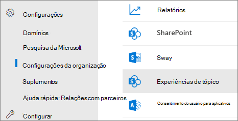

# <a name="manage-topic-discovery-in-microsoft-viva-topics"></a><span data-ttu-id="58d38-103">Gerenciar a descoberta de tópicos nos tópicos do Microsoft Viva</span><span class="sxs-lookup"><span data-stu-id="58d38-103">Manage topic discovery in Microsoft Viva Topics</span></span>

<span data-ttu-id="58d38-104">Você pode gerenciar as configurações de descoberta de tópicos no [centro de administração do Microsoft 365.](https://admin.microsoft.com)</span><span class="sxs-lookup"><span data-stu-id="58d38-104">You can manage topic discovery settings in the [Microsoft 365 admin center](https://admin.microsoft.com).</span></span> <span data-ttu-id="58d38-105">Você deve ser um administrador global ou administrador do SharePoint para executar essas tarefas.</span><span class="sxs-lookup"><span data-stu-id="58d38-105">You must be a global administrator or SharePoint administrator to perform these tasks.</span></span>

## <a name="to-access-topics-management-settings"></a><span data-ttu-id="58d38-106">Para acessar as configurações de gerenciamento de tópicos:</span><span class="sxs-lookup"><span data-stu-id="58d38-106">To access topics management settings:</span></span>

1. <span data-ttu-id="58d38-107">No centro de administração do Microsoft 365, clique em **Configurações** e, em seguida, **nas configurações da organização.**</span><span class="sxs-lookup"><span data-stu-id="58d38-107">In the Microsoft 365 admin center, click **Settings**, then **Org settings**.</span></span>
2. <span data-ttu-id="58d38-108">Na guia **Serviços,** clique em Experiências **de Tópico.**</span><span class="sxs-lookup"><span data-stu-id="58d38-108">On the **Services** tab, click **Topic experiences**.</span></span>

     

3. <span data-ttu-id="58d38-110">Selecione a **guia Descoberta de** Tópico. Consulte as seções a seguir para obter informações sobre cada configuração.</span><span class="sxs-lookup"><span data-stu-id="58d38-110">Select the **Topic discovery** tab. See the following sections for information about each setting.</span></span>

     

## <a name="select-sharepoint-topic-sources"></a><span data-ttu-id="58d38-112">Selecionar fontes de tópicos do SharePoint</span><span class="sxs-lookup"><span data-stu-id="58d38-112">Select SharePoint topic sources</span></span>

<span data-ttu-id="58d38-113">Você pode alterar os sites do SharePoint em sua organização que serão rastreados para tópicos.</span><span class="sxs-lookup"><span data-stu-id="58d38-113">You can change the SharePoint sites in your organization that will be crawled for topics.</span></span>

<span data-ttu-id="58d38-114">Se você quiser incluir ou excluir uma lista específica de sites, poderá usar o seguinte modelo .csv:</span><span class="sxs-lookup"><span data-stu-id="58d38-114">If you want to include or exclude a specific list of sites, you can use the following .csv template:</span></span>

``` csv
Site name,URL
```

<span data-ttu-id="58d38-115">Se você adicionar sites usando o selador de site, eles serão adicionados à lista de sites existente para incluir ou excluir.</span><span class="sxs-lookup"><span data-stu-id="58d38-115">If you add sites using the site picker, they are added to the existing list of sites to include or exclude.</span></span> <span data-ttu-id="58d38-116">Se você carregar um arquivo .csv, ele substituirá qualquer lista existente.</span><span class="sxs-lookup"><span data-stu-id="58d38-116">If you upload a .csv file, it overwrites any existing list.</span></span> <span data-ttu-id="58d38-117">Se você incluiu ou excluiu sites específicos anteriormente, baixe a lista como um arquivo .csv, faça alterações e carregue a nova lista.</span><span class="sxs-lookup"><span data-stu-id="58d38-117">If you have previously included or excluded specific sites, you and download the list as a .csv file, make changes, and upload the new list.</span></span>

<span data-ttu-id="58d38-118">Para escolher sites para descoberta de tópicos</span><span class="sxs-lookup"><span data-stu-id="58d38-118">To choose sites for topic discovery</span></span>

1. <span data-ttu-id="58d38-119">Na guia **Descoberta de Tópico,** em **Selecionar fontes de tópicos do SharePoint,** selecione **Editar**.</span><span class="sxs-lookup"><span data-stu-id="58d38-119">On the **Topic discovery** tab, under **Select SharePoint topic sources**, select **Edit**.</span></span>
2. <span data-ttu-id="58d38-120">Na página **Selecionar fontes de tópicos do SharePoint,** selecione quais sites do SharePoint serão rastreados como fontes para seus tópicos durante a descoberta.</span><span class="sxs-lookup"><span data-stu-id="58d38-120">On the **Select SharePoint topic sources** page, select which SharePoint sites will be crawled as sources for your topics during discovery.</span></span> <span data-ttu-id="58d38-121">Isso inclui:</span><span class="sxs-lookup"><span data-stu-id="58d38-121">This includes:</span></span>
    - <span data-ttu-id="58d38-122">**Todos os sites:** todos os sites do SharePoint em seu locatário.</span><span class="sxs-lookup"><span data-stu-id="58d38-122">**All sites**: All SharePoint sites in your tenant.</span></span> <span data-ttu-id="58d38-123">Isso captura sites atuais e futuros.</span><span class="sxs-lookup"><span data-stu-id="58d38-123">This captures current and future sites.</span></span>
    - <span data-ttu-id="58d38-124">**Todos, exceto sites selecionados:** digite os nomes dos sites que você deseja excluir.</span><span class="sxs-lookup"><span data-stu-id="58d38-124">**All, except selected sites**: Type the names of the sites you want to exclude.</span></span>  <span data-ttu-id="58d38-125">Você também pode carregar uma lista de sites que deseja excluir da descoberta.</span><span class="sxs-lookup"><span data-stu-id="58d38-125">You can also upload a list of sites you want to opt out from discovery.</span></span> <span data-ttu-id="58d38-126">Os sites criados no futuro serão incluídos como fontes para descoberta de tópicos.</span><span class="sxs-lookup"><span data-stu-id="58d38-126">Sites created in the future will be included as sources for topic discovery.</span></span> 
    - <span data-ttu-id="58d38-127">**Somente sites selecionados:** digite os nomes dos sites que você deseja incluir.</span><span class="sxs-lookup"><span data-stu-id="58d38-127">**Only selected sites**: Type the names of the sites you want to include.</span></span> <span data-ttu-id="58d38-128">Você também pode carregar uma lista de sites.</span><span class="sxs-lookup"><span data-stu-id="58d38-128">You can also upload a list of sites.</span></span> <span data-ttu-id="58d38-129">Os sites criados no futuro não serão incluídos como fontes para descoberta de tópicos.</span><span class="sxs-lookup"><span data-stu-id="58d38-129">Sites created in the future will not be included as sources for topic discovery.</span></span>
    - <span data-ttu-id="58d38-130">**Nenhum site:** os tópicos não serão gerados automaticamente ou atualizados com o conteúdo do SharePoint.</span><span class="sxs-lookup"><span data-stu-id="58d38-130">**No sites**: Topics won't be automatically generated or updated with SharePoint content.</span></span> <span data-ttu-id="58d38-131">Os tópicos existentes permanecem no centro de tópicos.</span><span class="sxs-lookup"><span data-stu-id="58d38-131">Existing topics remain in the topic center.</span></span>

    
   
3. <span data-ttu-id="58d38-133">Clique em **Salvar**.</span><span class="sxs-lookup"><span data-stu-id="58d38-133">Click **Save**.</span></span>

## <a name="exclude-topics-by-name"></a><span data-ttu-id="58d38-134">Excluir tópicos por nome</span><span class="sxs-lookup"><span data-stu-id="58d38-134">Exclude topics by name</span></span>

<span data-ttu-id="58d38-135">Você pode excluir tópicos da descoberta carregando uma lista usando um arquivo .csv.</span><span class="sxs-lookup"><span data-stu-id="58d38-135">You can exclude topics from discovery by uploading a list using a .csv file.</span></span> <span data-ttu-id="58d38-136">Se você excluiu tópicos anteriormente, poderá baixar o .csv, fazer alterações e carregar novamente.</span><span class="sxs-lookup"><span data-stu-id="58d38-136">If you've previously excluded topics, you can download the .csv, make changes, and upload it again.</span></span>

1. <span data-ttu-id="58d38-137">On the **Topic discovery** tab, under **Exclude topics**, select **Edit**.</span><span class="sxs-lookup"><span data-stu-id="58d38-137">On the **Topic discovery** tab, under **Exclude topics**, select **Edit**.</span></span>
2. <span data-ttu-id="58d38-138">Clique **em Excluir tópicos por nome.**</span><span class="sxs-lookup"><span data-stu-id="58d38-138">Click **Exclude topics by name**.</span></span>
3. <span data-ttu-id="58d38-139">Se você precisar criar uma lista, baixe o modelo .csv e adicione os tópicos que deseja excluir (consulte Trabalhando com o modelo *.csv* abaixo).</span><span class="sxs-lookup"><span data-stu-id="58d38-139">If you need to create a list, download the .csv template and add the topics that you want to exclude (see *Working with the .csv template* below).</span></span> <span data-ttu-id="58d38-140">Quando o arquivo estiver pronto, clique **em Procurar** e carregue o arquivo.</span><span class="sxs-lookup"><span data-stu-id="58d38-140">When the file is ready, click **Browse** and upload the file.</span></span> <span data-ttu-id="58d38-141">Se houver uma lista existente, você poderá baixar o .csv que contém a lista.</span><span class="sxs-lookup"><span data-stu-id="58d38-141">If there's an existing list, you can download the .csv containing the list.</span></span>
4. <span data-ttu-id="58d38-142">Clique em **Salvar**.</span><span class="sxs-lookup"><span data-stu-id="58d38-142">Click **Save**.</span></span>

    

### <a name="working-with-the-csv-template"></a><span data-ttu-id="58d38-144">Trabalhando com o modelo .csv</span><span class="sxs-lookup"><span data-stu-id="58d38-144">Working with the .csv template</span></span>

<span data-ttu-id="58d38-145">Você pode copiar o modelo csv abaixo:</span><span class="sxs-lookup"><span data-stu-id="58d38-145">You can copy the csv template below:</span></span>

``` csv
Name (required),Expansion,MatchType- Exact/Partial (required)
```

<span data-ttu-id="58d38-146">No modelo CSV, insira as seguintes informações sobre os tópicos que você deseja excluir:</span><span class="sxs-lookup"><span data-stu-id="58d38-146">In the CSV template, enter the following information about the topics you want to exclude:</span></span>

- <span data-ttu-id="58d38-147">**Nome:** digite o nome do tópico que você deseja excluir.</span><span class="sxs-lookup"><span data-stu-id="58d38-147">**Name**: Type the name of the topic you want to exclude.</span></span> <span data-ttu-id="58d38-148">Há duas maneiras de fazer isso:</span><span class="sxs-lookup"><span data-stu-id="58d38-148">There are two ways to do this:</span></span>
    - <span data-ttu-id="58d38-149">Exact match: You can include the exact name or acronym (for example, *Contoso* or *ATL*).</span><span class="sxs-lookup"><span data-stu-id="58d38-149">Exact match: You can include the exact name or acronym (for example, *Contoso* or *ATL*).</span></span>
    - <span data-ttu-id="58d38-150">Parciais: você pode excluir todos os tópicos que têm uma palavra específica.</span><span class="sxs-lookup"><span data-stu-id="58d38-150">Partial match: You can exclude all topics that have a specific word in it.</span></span>  <span data-ttu-id="58d38-151">Por exemplo, *o arco* excluirá  todos os tópicos com o arco de palavras nele, como arco *círculo,* arco *de Arc arc arc ou* arco *de treinamento.* Observe que ele não excluirá tópicos nos quais o texto é incluído como parte de uma palavra, *como* Arquitetura .</span><span class="sxs-lookup"><span data-stu-id="58d38-151">For example, *arc* will exclude all topics with the word *arc* in it, such as *Arc circle*, *Plasma arc welding*, or *Training arc*. Note that it will not exclude topics in which the text is included as part of a word, such as *Architecture*.</span></span>
- <span data-ttu-id="58d38-152">**Significa (opcional)**: se você quiser excluir um acrônimo, digite as palavras que o acrônimo significa.</span><span class="sxs-lookup"><span data-stu-id="58d38-152">**Stands for (optional)**: If you want to exclude an acronym, type the words the acronym stands for.</span></span>
- <span data-ttu-id="58d38-153">**MatchType-Exact/Partial**: digite se o nome digitado foi um *tipo de* combinação exato *ou* parcial.</span><span class="sxs-lookup"><span data-stu-id="58d38-153">**MatchType-Exact/Partial**: Type whether the name you entered was an *exact* or *partial* match type.</span></span>

     

## <a name="see-also"></a><span data-ttu-id="58d38-155">Confira também</span><span class="sxs-lookup"><span data-stu-id="58d38-155">See also</span></span>

[<span data-ttu-id="58d38-156">Gerenciar visibilidade do tópico no Microsoft 365</span><span class="sxs-lookup"><span data-stu-id="58d38-156">Manage topic visibility in Microsoft 365</span></span>](topic-experiences-knowledge-rules.md)

[<span data-ttu-id="58d38-157">Gerenciar permissões de tópico no Microsoft 365</span><span class="sxs-lookup"><span data-stu-id="58d38-157">Manage topic permissions in Microsoft 365</span></span>](topic-experiences-user-permissions.md)

[<span data-ttu-id="58d38-158">Alterar o nome do centro de tópicos no Microsoft 365</span><span class="sxs-lookup"><span data-stu-id="58d38-158">Change the name of the topic center in Microsoft 365</span></span>](topic-experiences-administration.md)
