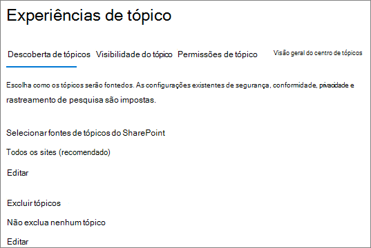

# <a name="manage-topic-discovery-in-microsoft-365"></a>Gerenciar descoberta de tópicos no Microsoft 365

Você pode gerenciar as configurações de descoberta de tópico no [centro de administração do Microsoft 365](https://admin.microsoft.com). Você deve ser um administrador global ou administrador do SharePoint para executar essas tarefas.

## <a name="to-access-topics-management-settings"></a>Para acessar as configurações de gerenciamento de tópicos:

1. No centro de administração do Microsoft 365, clique em **configurações** e em **configurações da organização**.
2. Na guia **Serviços** , clique em **rede de conhecimento**.

     

3. Selecione a guia **descoberta de tópicos** . Consulte as seções a seguir para obter informações sobre cada configuração.

     

## <a name="select-sharepoint-topic-sources"></a>Selecionar fontes de tópicos do SharePoint

Você pode alterar os sites do SharePoint em sua organização que serão rastreados para tópicos.

Se quiser incluir ou excluir uma lista específica de sites, você pode usar o modelo. csv a seguir:

``` csv
Site name,URL
```

Se você adicionar sites usando o seletor de sites, eles serão adicionados à lista existente de sites a serem incluídos ou excluídos. Se você carregar um arquivo. csv, ele substituirá qualquer lista existente. Se você tiver incluído ou excluído sites específicos anteriormente, você e baixar a lista como um arquivo. csv, fazer alterações e carregar a nova lista.

Para escolher sites para descoberta de tópico

1. Na guia **descoberta de tópico** , em **selecionar fontes de tópicos do SharePoint**, selecione **Editar**.
2. Na página **selecionar fontes de tópicos do SharePoint** , selecione quais sites do SharePoint serão rastreados como fontes para seus tópicos durante a descoberta. Isso inclui:
    - **Todos os sites**: todos os sites do SharePoint em seu locatário. Isso captura sites atuais e futuros.
    - **Todos, exceto sites selecionados**: digite os nomes dos sites que você deseja excluir.  Você também pode carregar uma lista de sites que deseja recusar da descoberta. Os sites criados no futuro serão incluídos como fontes para descoberta de tópicos. 
    - **Somente sites selecionados**: digite os nomes dos sites que você deseja incluir. Você também pode carregar uma lista de sites. Os sites criados no futuro não serão incluídos como fontes para descoberta de tópicos.
    - **Nenhum site**: os tópicos não serão gerados ou atualizados automaticamente com o conteúdo do SharePoint. Os tópicos existentes permanecem no centro de tópicos.

    
   
3. Clique em **Salvar**.

## <a name="exclude-topics-by-name"></a>Excluir tópicos por nome

Você pode excluir tópicos da descoberta carregando uma lista usando um arquivo. csv. Se já tiver excluído os tópicos, você poderá baixar o arquivo. csv, fazer alterações e carregá-lo novamente.

1. Na guia **descoberta de tópico** , em **excluir tópicos**, selecione **Editar**.
2. Clique em **excluir tópicos por nome**.
3. Se você precisar criar uma lista, baixe o modelo. csv e adicione os tópicos que você deseja excluir (consulte *trabalhar com o modelo. csv* abaixo). Quando o arquivo estiver pronto, clique em **procurar** e carregar o arquivo. Se houver uma lista existente, você poderá baixar o. csv que contém a lista.
4. Clique em **Salvar**.

    

### <a name="working-with-the-csv-template"></a>Trabalhar com o modelo. csv

Você pode copiar o modelo CSV abaixo:

``` csv
Name (required),Expansion,MatchType- Exact/Partial (required)
```

No modelo CSV, insira as seguintes informações sobre os tópicos que você deseja excluir:

- **Name**: digite o nome do tópico que você deseja excluir. Há duas maneiras de fazer isso:
    - Correspondência exata: você pode incluir o nome exato ou o acrônimo (por exemplo, *contoso* ou *ATL*).
    - Correspondência parcial: você pode excluir todos os tópicos que possuem uma palavra específica.  Por exemplo, o *arco* excluirá todos os tópicos com a palavra *arco* nele, como *círculo de arco*, solda de arco de *plasma* ou arco de *treinamento*. Observe que ele não excluirá tópicos nos quais o texto está incluído como parte de uma palavra, como *arquitetura*.
- **Significa (opcional)**: se você deseja excluir um acrônimo, digite as palavras que o acrônimo significa.
- **MatchType-Exact/partial**: digite se o nome inserido foi um tipo de correspondência *exata* ou *parcial* .

     

## <a name="see-also"></a>Também consulte

[Gerenciar a visibilidade de tópicos no Microsoft 365](topic-experiences-knowledge-rules.md)

[Gerenciar permissões de tópico no Microsoft 365](topic-experiences-user-permissions.md)

[Alterar o nome da central de tópicos no Microsoft 365](topic-experiences-administration.md)

