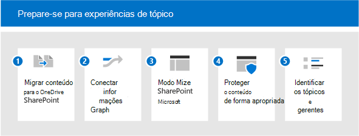

# Prepare seu ambiente para os tópicos do Microsoft VivaGet your environment ready for Microsoft Viva Topics

Para usar ao máximo os tópicos do Viva, você deseja ter o máximo de conteúdo possível incluído para a descoberta de tópicos, para que possa ter um conjunto rico de tópicos para seus usuários.To make the most of Viva Topics, you want to have as much content as possible included for topic discovery, so that you can have a rich set of topics for your users. Mas qual conteúdo deve ser usado para descoberta de tópicos?But what content should be used for topic discovery? Como maximizar o conteúdo indexado enquanto permanece no controle?How do you maximize the content that is indexed, while staying in control? Quanto mais conteúdo está no escopo, melhor as informações que a inteligência artificial pode descobrir.The more content is in scope, the better the insights the artificial intelligence can discover. Este artigo orienta você pelas etapas de planejamento para garantir que você está incluindo o conteúdo apropriado e que você tenha as pessoas e recursos certos para fazer uma boa experiência para seus usuários.This article walks you through planning steps to ensure that you are including the appropriate content, and that you have the right people and resources to make a good experience for your users.

Para planejar os Tópicos do Viva, você precisa:To plan for Viva Topics, you need to:

1. [Migrar conteúdo para o SharePointMigrate content to SharePoint](#1-migrate-content-to-microsoft-365)
    - A indexação de tópicos inclui apenas conteúdo em sites do SharePoint.Topic indexing only includes content on SharePoint sites.
      - Sempre que possível, migre conteúdo valioso para o SharePoint Online de fontes externas.Where possible, migrate valuable content into SharePoint Online from external sources.
      - Priorizar fontes de conteúdo com alto potencial para conhecer melhor o conteúdo.Prioritize content sources with high potential for tacit knowledge.
      - Realça os benefícios do gerenciamento de conhecimento para incentivar os usuários a mover conteúdo do OneDrive para sites do SharePoint.Highlight the benefits of knowledge management to encourage users to move content from OneDrive to SharePoint sites.

2. [Conectar informações ao Microsoft GraphConnect information to Microsoft Graph](#2-connect-information-to-microsoft-graph)
    - No futuro, o conteúdo externo pode ser trazido para o gráfico de conhecimento e ficar disponível.In the future, external content can be brought into the knowledge graph and become available.
    - Para o conteúdo que não pode ser movido, considere usar os Conectores do Graph para aprimorar a pesquisa e preparar a inclusão futura.For content that cannot be moved, consider using Graph Connectors to enhance search and prepare for future inclusion.

3. [Modernizar páginas do SharePointModernize SharePoint pages](#3-modernize-sharepoint-pages)
    - Os cartões de tópico só podem ser divulgados em páginas modernas.Topic cards can only be surfaced on modern pages.
    - Identifique páginas clássicas de alto perfil que são candidatas à modernização.Identify high profile classic pages that are modernization candidates.

4. [Proteger o conteúdo adequadamenteSecure content appropriately](#4-secure-content-appropriately)
    - Os recursos de tópicos são cortados com base nas permissões de um usuário.Topic resources are security trimmed based on a user's permissions.
    - Identifique qualquer conteúdo que possa ter permissões incorretamente amplas ou restritivas:Identify any content that might have incorrectly broad or restrictive permissions:
      - Incentivar os proprietários do site a usar os relatórios de compartilhamento para revisar as permissõesEncourage site owners to use the Sharing reports to review permissions
      - Fazer com que os administradores auditem conteúdo amplamente compartilhado usando a PesquisaHave admins audit broadly shared content using Search
      - Incentive os proprietários de conteúdo a compartilhar conteúdo que não seja sensível e que possa ter benefícios mais amplos para a organização.Encourage content owners to share content that is not sensitive and may have broader benefit to the organization.
    - Revise a configuração do Microsoft Graph em usuários e conteúdo:Review your Microsoft Graph configuration on users and content:
      - A indexação de tópicos reconhece a configuração excluindo o conteúdo da Pesquisa ou do Delve (por exemplo, NOINDEX).Topic indexing honors configuration excluding content from Search or Delve (for example, NOINDEX). Revise se essas configurações ainda são relevantes.Review whether these configurations are still relevant.

5. [Identificar gerentes de conhecimento e tópicosIdentify knowledge managers and topics](#5-identify-knowledge-managers-and-topics)
    - Use taxonomias existentes para criar tópicos manualmente ou ajudar a confirmar tópicos sugeridos por IA.Use existing taxonomies to manually create topics, or help to confirm AI-suggested topics.
    - Identifique especialistas no assunto (SMEs) para tópicos previstos ou semedados.Identify subject matter experts (SMEs) for anticipated or seeded topics.
    - Identifique sites que abrangem um grande corpo de dados valiosos que podem ser usados para a mineração de tópicos piloto.Identify sites that cover a large body of valuable data that can be used to pilot topic mining.
    - Envolva gerentes de conhecimento e comunidades de práticas.Engage Knowledge Managers and communities of practice.

## 1. Migrar conteúdo para o Microsoft 3651. Migrate content to Microsoft 365

Há várias ferramentas e serviços para ajudar na migração: você pode obter uma visão geral e informações sobre como migrar em Migrar seu conteúdo para o [Microsoft 365.](https://docs.microsoft.com/sharepointmigration/migrate-to-sharepoint-online)There are several tools and services to help with your migration - you can get an overview and information about how to migrate at [Migrate your content to Microsoft 365](https://docs.microsoft.com/sharepointmigration/migrate-to-sharepoint-online). As ferramentas de migração incluem:Migration tools include:

- [Gerenciador de MigraçãoMigration Manager](https://docs.microsoft.com/sharepointmigration/mm-get-started)
- [Ferramenta de Migração do SharePoint (SPMT)SharePoint Migration Tool (SPMT)](https://docs.microsoft.com/sharepointmigration/introducing-the-sharepoint-migration-tool)
- [Microsoft 365 FastTrackMicrosoft 365 FastTrack](https://www.microsoft.com/fasttrack/microsoft-365)
- [Serviços e ferramentas de migração de parceirosPartner migration tools and services](https://www.microsoft.com/solution-providers)

Faça o máximo da sua migração:Make the most of your migration:

- Migre para um site moderno, que inclui o Microsoft Teams.Migrate to a modern site - that includes Microsoft Teams. Embora a indexação possa acontecer em qualquer site do SharePoint (clássico ou moderno), exibir tópicos para os usuários por meio de destaques e cartões só acontece em páginas modernas.While indexing can happen on any SharePoint site (classic or modern), displaying topics to users through highlights and cards only happens on modern pages.
- Manter nomes de usuário - a maioria das ferramentas de migração permite que você mapeie as identidades dos usuários durante a migração, para que as propriedades como Criado por ou Modificado por sejam mantidas após a migração.Maintain usernames - most migration tools allow you to map user identities across the migration, so that properties like Created By or Modified By are maintained after the migration. Isso é importante para os tópicos porque a autoria dos arquivos é usada para identificar os especialistas que são adicionados a uma página de tópico ou cartão.This is important for topics because the authorship of files is used to identify the experts that are added to a topic page or card. 
- Tornar os nomes de contas de serviço descritivos – haverá alguns casos em que não é possível manter nomes de usuário.Make service account names descriptive - There will be some cases where maintaining usernames isn't possible. Por exemplo, se você estiver migrando o conteúdo que foi criado por alguém que não é mais um funcionário da organização.For example, if you're migrating content that was created by someone who is no longer an employee of the organization. Nesse caso, a maioria das ferramentas de migração move um arquivo como se tivesse sido criado por uma conta de administrador ou uma conta de serviço.In this instance, most migration tools will move a file as if it was created by an admin account or a service account. Se isso acontecer com frequência, essa conta de serviço poderá ser listada em relação aos tópicos como um especialista.If this happens frequently, then that service account could then be listed against topics as an expert. É aqui que a nomeação dessa conta se torna muito importante.This is where the naming of that account becomes really important. Se você fizer isso descritivo, a presença dessas contas não humanas será compreensível pelos tópicos de consumo de usuários.If you make it descriptive, the presence of these non-human accounts will be understandable by your users consuming topics.

## 2. Conectar informações ao Microsoft Graph2. Connect information to Microsoft Graph

Se não for possível migrar algum conteúdo, conecte-o ao Microsoft Graph:If you can’t migrate some content, then connect it with the Microsoft Graph:

- Considere implementar [conectores de conteúdo do Graph.](https://docs.microsoft.com/microsoftsearch/connectors-overview)Consider implementing [Graph Content Connectors](https://docs.microsoft.com/microsoftsearch/connectors-overview). Usando conectores, o conteúdo externo pode ser indexado no Microsoft Graph, onde os usuários podem descobrir isso por meio da Pesquisa da Microsoft.Using connectors, external content can be indexed into the Microsoft Graph, where users can then discover it through Microsoft Search.
- Desenvolvimentos futuros trazerão dados externos para tópicos do Viva.Future developments will bring external data into Viva Topics.

## 3. Modernizar páginas do SharePoint3. Modernize SharePoint pages

Como os cartões de tópico e os destaques só podem aparecer em páginas modernas, atualize todas as páginas que você deseja incluir nos Tópicos do Viva do clássico para o moderno.Because topic cards and highlights can only appear on modern pages, update any pages you want to include in Viva Topics from classic to modern. Confira [Modernizar seus sites clássicos do SharePoint.](https://docs.microsoft.com/sharepoint/dev/transform/modernize-classic-sites)See [Modernize your classic SharePoint sites](https://docs.microsoft.com/sharepoint/dev/transform/modernize-classic-sites). Você pode usar o [scanner de modernização do SharePoint](https://docs.microsoft.com/sharepoint/dev/transform/modernize-scanner) para preparar seus sites clássicos para modernização.You can use the [SharePoint Modernization scanner](https://docs.microsoft.com/sharepoint/dev/transform/modernize-scanner) to prepare your classic sites for modernization.

Se você tiver muitos sites clássicos, priorize as páginas de alto perfil para converter em modernas.If you have a lot of classic sites, prioritize high profile pages to convert to modern.

## 4. Proteger o conteúdo adequadamente4. Secure content appropriately

Quando os usuários interagem com um cartão de tópico ou uma página de tópico, eles podem ver recursos diferentes.When users interact with a topic card or a topic page, they may see different resources. Isso porque eles têm acesso a arquivos diferentes associados ao tópico.This is because they have access to different files that are associated with the topic. Se suas permissões subjacentes são muito estritas, os aspectos serendipitous da descoberta de informações por meio de tópicos podem ser reduzidos.If your underlying permissions are too strict, then the serendipitous aspects of information discovery through topics could be diminished. Por outro lado, se eles são muito amplos, um tópico pode apresentar conteúdo para um usuário que você não pretende que ele veja.On the other hand, if they're too broad, then a topic could surface content to a user that you don't intend them to see.
O gerenciamento de permissões é fundamental aqui.Good permissions management is critical here. E o bom gerenciamento de permissões baseia-se em uma parceria contínua entre administradores e proprietários de conteúdo.And good permissions management is based on an ongoing partnership between administrators and content owners. Embora isso possa ser uma atividade contínua, há algumas etapas práticas que você pode seguir ao se preparar para os tópicos:While this might be an ongoing activity, there are some practical steps that you can take when preparing for topics:

- Incentive os proprietários do site a revisar o compartilhamento e as permissões.Encourage site owners to review sharing and permissions.

  Os proprietários de site do SharePoint podem revisar um relatório de compartilhamento para seu site que mostra detalhes completos de todas as permissões e links de compartilhamento configurados no site, consulte [Compartilhamento de relatórios.](https://docs.microsoft.com/sharepoint/sharing-reports)SharePoint site owners can review a sharing report for their site that shows full details of all permissions and sharing links configured on the site, see [Sharing reports](https://docs.microsoft.com/sharepoint/sharing-reports). Isso lista usuários internos e externos (convidados).This lists internal and external (guest) users.

  Os **proprietários** do site também podem ver quem tem permissões para o site indo para as páginas Permissões do Site e Configurações **de Permissões Avançadas.**Site owners can also see who has permissions for the site by going to the **Site Permissions** and **Advanced Permissions Settings** pages.

  1. Em seu site, escolha **as permissões do** Site de  >  **Configurações.**On your site, choose **Settings** > **Site permissions**. Verifique quem está listado em Proprietários de Site, Membros do Site e Visitantes do Site.Check to see who is listed under Site Owners, Site Members, and Site Visitors. Verifique se há usuários convidados.Check for any Guest users.
  2. Na página **Permissões,** escolha **Configurações de Permissões Avançadas.**On the **Permissions** page, choose **Advanced Permissions Settings**. Você pode verificar se há permissões exclusivas e ver quem tem acesso limitado a todos os itens no site.You can check for unique permissions and see who has limited access to any items in the site.

- Audite os Grupos do Microsoft 365 e o Teams para garantir que eles sejam definidos adequadamente como grupos ou equipes públicas ou privadas.Audit Microsoft 365 Groups and Teams to make sure they are appropriately set as public or private groups or teams. Os novos Grupos do Microsoft 365 e do Teams são definidos como privados por padrão, mas quando lançados pela primeira vez foram públicos por padrão.New Teams and Microsoft 365 Groups are set to private by default, but when first released were public by default. Se você era usuários anteriores dessas tecnologias, talvez queira revisar.If you were earlier adopters of these technologies, you might want to review. Além disso, a função de uma equipe frequentemente evolui durante seu ciclo de vida, e a configuração pode precisar ser atualizada para refletir o uso atual da equipe.Also, the function of a team often evolves over its lifecycle, and the setting might need to be updated to reflect the current use of the team.
- Revise o uso de "todos", "todos exceto usuários externos" ou grupos de segurança amplos.Review use of “everyone”, “everyone except external users” or broad security groups. O conteúdo pode ser compartilhado incorretamente com esses valores.Content may be incorrectly shared with these values. Para revisar o uso desses grupos, você pode:To review the use of these groups you can:
  - Criar uma conta que não tenha associações de grupoCreate an account that has no group memberships
  - Use a pesquisa com essa conta para descobrir o conteúdo amplamente compartilhado.Use search with this account to discover content that is broadly shared.
  - Se o conteúdo inadequado estiver visível para essa conta por meio de pesquisa, você poderá trabalhar com os proprietários do site para corrigir a configuração de permissão.If inappropriate content is visible to this account through search, then you can work with the site owners to correct the permission configuration.

Além das permissões, você também pode controlar o escopo do que pode ser descoberto por meio de tópicos.In addition to permissions, you can also control the scope of what is discoverable through topics. Você está sempre no controle do que é indexado.You are always in control of what is indexed.

Os administradores podem configurar a indexação no Centro de Administração do Microsoft 365.Administrators can configure indexing in the Microsoft 365 Admin Center. Ao configurar o Gerenciamento [de Conhecimento,](set-up-topic-experiences.md)você pode:When you set up [Knowledge Management](set-up-topic-experiences.md), you can:

- Permitir a descoberta em todos os sites do SharePoint ou especificar sites para incluir ou excluir como fontes de tópico.Allow discovery across all SharePoint sites or specify sites to include or exclude as topic sources.
- Onde você tiver termos confidenciais, também poderá excluir tópicos por nome.Where you have sensitive terms, you can also exclude topics by name. Por exemplo, se você tiver o nome de um projeto sensível, onde não quiser que um destaque ou cartão apareça, independentemente das permissões do usuário, você poderá excluir esse nome de projeto.For example, if you have the name of a sensitive project, where you don't want a highlight or card to appear, irrespective of the user's permissions, you can exclude that project name.

No nível do conteúdo, você também pode controlar o que pode ser descoberto.At the content level, you can also control what is discoverable. Qualquer configuração que você tenha feito para excluir o conteúdo da pesquisa também será usada pela descoberta de conteúdo.Any configuration that you've done to exclude content from search will also be used by content discovery. Portanto, por exemplo, se você excluiu uma biblioteca de documentos específica de aparecer nos resultados da pesquisa, essa biblioteca de documentos não será usada para descoberta de tópicos.So, for example, if you have excluded a specific document library from appearing in search results, this document library will not be used for topic discovery.

## 5. Identifique gerentes de conhecimento e tópicos5. Identify knowledge managers and topics

O gerenciamento de tópicos envolve três funções importantes, incluindo duas novas funções do Azure Active Directory (AAD), administrador de conhecimento e Gerente de Conhecimento:Managing topics involves three key roles, including two new Azure Active Directory (AAD) roles: Knowledge administrator and Knowledge manager:

- O KA (Administrador de Conhecimento) é uma função técnica, normalmente em TI.The Knowledge administrator (KA) is a technical role, typically in IT. Essa função permite a configuração dos Tópicos do Viva no centro de administração do M365, bem como a configuração de descoberta e visibilidade de tópicos.This role allows the setup of the Viva Topics in the M365 admin center, as well as the configuration of topic discovery and visibility.
- O gerente de Conhecimento (KM) trabalha com os próprios tópicos e supervisiona sua qualidade e sua totalidade.The Knowledge manager (KM) works with the topics themselves and oversees their quality and completeness.
- Os colaboradores de tópicos (TCs) não se baseiam em uma função do AAD, mas em permissões no centro de administração.Topic contributors (TCs) are not based on an AAD role, but permissions in the admin center. Eles são especialistas no assunto capazes de remediar o conteúdo em tópicos, adicionando recursos e pessoas.They are subject-matter experts able to curate the content on topics, adding resources and people.

Dependendo da sua organização, você pode ter algumas ou muitas pessoas atuando nessas funções.Depending on your organization you may have few or many people acting in these roles. Para algumas organizações, elas podem ser as mesmas pessoas.For some organizations, these may be the same people.

| Administrador de conhecimentoKnowledge admin | Gerente de conhecimentoKnowledge manager | Colaborador de tópicosTopic contributor |
|:-------|:-------|:-------|:-------|
| Função AADAAD role | Função AADAAD role | SMESME |
| Tem acesso ao centro de administraçãoHas access to the admin center | Tem acesso ao centro de administraçãoHas access to the admin center | Sem acesso ao centro de administraçãoNo access to the admin center |
| Configura tópicos do VivaSets up Viva Topics | Possui o gerenciamento e a qualidade dos tópicosOwns management and quality of topics | Contribui para tópicos com base em seus conhecimentos.Contributes to topics based on their expertise. |
| Garante que os padrões de segurança e conformidade sejam aplicados e compreendam o contrato de licenciamento.Ensures that security and compliance standards are enforced and understands licensing agreement.| Executa tarefas de gerenciamento de tópicos, como criar, editar, excluir e rejeitar tópicos.Performs topic management tasks such as create, edit, delete, and reject topics. Dá suporte a colaboradores de tópicos com suas tarefas.Supports Topic contributors with their tasks. | Cura as informações e o conteúdo nas páginas de tópicos, incluindo quais pessoas e recursos são fixados nesse tópico.Curates the information and content on topic pages, including which people and resources are pinned to that topic. |

Destaques e cartões aparecerão para os usuários no contexto de seu trabalho, por exemplo, à medida que navegarem por páginas modernas no SharePoint.Highlights and cards will appear to users in the context of their work, for example as they browse modern pages in SharePoint. Você controla a experiência do usuário final para tópicos.You control the end user experience for topics.

- Quem pode ver Tópicos?Who can see Topics? A visibilidade do tópico está configurada no Centro de Administração do Microsoft 365.Topic visibility is configured in the Microsoft 365 Admin Center. Escolha quais grupos permitirão ver tópicos:Choose which groups to allow to see topics:
  - Todos na minha organização.Everyone in my organization. "Todos" não inclui convidados, são todos os usuários internos em seu diretório"Everyone" does not include guests, it is all internal users in your directory
  - Somente pessoas selecionadas ou grupos de segurança (essa opção é boa enquanto você ainda está lançando tópicos do Viva, para que você possa testar com um subconjunto de usuários).Only Selected people or security groups (this option is good while you are still rolling out Viva Topics, so you can test with a subset of users). Se quiser que os convidados consultem Tópicos, você precisará usar a opção "pessoas ou grupos de segurança selecionados" e conceder uma licença a eles.If you want guests to view Topics, you will need to use the “selected people or security groups” option, and grant them a license.
  - Ninguém.No one.

    Todos os usuários, mesmo os convidados, precisarão ter uma licença aplicada para exibir a experiência do tópico.All users, even guest users, will need to have a license applied in order to view the topic experience. E lembre-se de que as permissões sempre controlam o que pode ser visto.And remember that permissions always control what can be seen.

- Quais tópicos estão visíveis?Which Topics are visible? Você pode optar por:You can choose to:
  - Mostrar todos os tópicos de candidatos.Show all candidate topics.
  - Mostrar apenas tópicos confirmados.Show only confirmed topics.

Agora que temos os gerentes, especialistas e usuários, podemos falar sobre os próprios tópicos.Now that we have the managers, experts, and users, we can talk about the topics themselves.

- É uma boa prática fazer a semeia de tópicos em sua lista de tópicos.It's a good practice to seed topics into your topic list. A qualidade e a quantidade de tópicos são baseadas em seu conteúdo. Ele só será criado como um tópico se estiver incluído no conteúdo que está no escopo.The quality and quantity of topics is based on your content - it will only be created as a topic if it is included in the content that is in scope. Se houver informações e evidências suficientes para o tópico, eles serão criados pela IA.If there's sufficient information and evidence for the topic, it will be created by the AI. A seeding topics is where the Knowledge Manager and subject-matter experts can help.Seeding topics is where the Knowledge Manager and subject-matter experts can help. Combinar o conhecimento humano com a IA é a melhor rota para tópicos de qualidade.Combining human knowledge with the AI is the best route for quality topics. Portanto, se houver tópicos antecipados, você poderá criar manualmente esses tópicos no Centro de tópicos.So if there are topics you anticipate you can manually create these in the Topic center. Fazer isso dará à IA um sinal forte da relevância desse tópico e identificará recursos e pessoas a associar a esse tópico.Doing that will give the AI a strong signal of the relevance of that topic and it will identify resources and people to associate with that topic.
- Use taxonomias existentes para ajudar no planejamento de tópicos, seja no SharePoint ou em outro lugar.Use existing taxonomies to help your topic planning, either from SharePoint or elsewhere. Taxonomias existentes geralmente incluem termos organizacionais, produtos, áreas de assunto e assim por diante.Existing taxonomies often include organizational terms, products, subject areas, and so on. As fontes para tópicos também podem vir de listas de projetos, indicadores de pesquisa existentes e assim por diante.Sources for topics can also come from lists of projects, existing search bookmarks, and so on.
