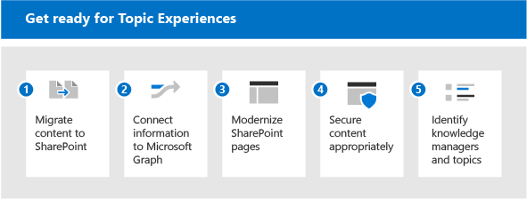

# Preparar seu ambiente para tópicos do Microsoft Viva

Para usar ao máximo os Tópicos do Viva, você deseja ter o máximo de conteúdo possível incluído para a descoberta de tópicos, para que você possa ter um conjunto rico de tópicos para seus usuários. Mas qual conteúdo deve ser usado para a descoberta de tópicos? Como maximizar o conteúdo indexado enquanto permanece no controle? Quanto mais conteúdo está no escopo, melhor as percepções que a inteligência artificial pode descobrir. Este artigo orienta você através de etapas de planejamento para garantir que você está incluindo o conteúdo apropriado e que você tem as pessoas e recursos certos para fazer uma boa experiência para seus usuários.

Para planejar tópicos do Viva, você precisa:

1. [Migrar conteúdo para o SharePoint](#1-migrate-content-to-microsoft-365)
    - A indexação de tópicos inclui apenas conteúdo em sites do SharePoint.
      - Sempre que possível, migre conteúdo valioso para o SharePoint Online de fontes externas.
      - Priorizar fontes de conteúdo com alto potencial para conhecimento tácito.
      - Realça os benefícios do gerenciamento de conhecimento para incentivar os usuários a mover conteúdo do OneDrive para sites do SharePoint.

2. [Conectar informações ao Microsoft Graph](#2-connect-information-to-microsoft-graph)
    - No futuro, o conteúdo externo pode ser trazido para o gráfico de conhecimento e ficar disponível.
    - Para conteúdo que não pode ser movido, considere usar os Conectores do Graph para aprimorar a pesquisa e preparar a inclusão futura.

3. [Modernizar páginas do SharePoint](#3-modernize-sharepoint-pages)
    - Os cartões de tópico só podem ser divulgados em páginas modernas.
    - Identifique páginas clássicas de alto perfil que são candidatos à modernização.

4. [Proteger o conteúdo adequadamente](#4-secure-content-appropriately)
    - Os recursos de tópicos são de segurança cortadas com base nas permissões de um usuário.
    - Identifique qualquer conteúdo que possa ter permissões incorretamente amplas ou restritivas:
      - Incentivar proprietários de sites a usar os relatórios de compartilhamento para revisar permissões
      - Fazer com que os administradores auditem conteúdo amplamente compartilhado usando a Pesquisa
      - Incentive os proprietários de conteúdo a compartilhar conteúdo que não seja sensível e que possa ter benefícios mais amplos para a organização.
    - Revise sua configuração do Microsoft Graph em usuários e conteúdo:
      - A indexação de tópicos honra a configuração excluindo o conteúdo da Pesquisa ou do Delve (por exemplo, NOINDEX). Revise se essas configurações ainda são relevantes.

5. [Identificar gerentes de conhecimento e tópicos](#5-identify-knowledge-managers-and-topics)
    - Use taxonomias existentes para criar tópicos manualmente ou ajudar a confirmar tópicos sugeridos pela IA.
    - Identifique os especialistas em assuntos (SMEs) para tópicos antecipados ou semeados.
    - Identifique sites que abrangem um grande corpo de dados valiosos que podem ser usados para a mineração de tópico piloto.
    - Envolva gerentes de conhecimento e comunidades de prática.

## 1. Migrar conteúdo para o Microsoft 365

Há várias ferramentas e serviços para ajudar na migração - você pode obter uma visão geral e informações sobre como migrar em Migrar seu conteúdo [para o Microsoft 365](/sharepointmigration/migrate-to-sharepoint-online). As ferramentas de migração incluem:

- [Gerenciador de Migração](/sharepointmigration/mm-get-started)
- [Ferramenta de Migração do SharePoint (SPMT)](/sharepointmigration/introducing-the-sharepoint-migration-tool)
- [Microsoft 365 FastTrack](https://www.microsoft.com/fasttrack/microsoft-365)
- [Ferramentas e serviços de migração de parceiros](https://www.microsoft.com/solution-providers)

Faça o máximo de sua migração:

- Migrar para um site moderno - que inclui o Microsoft Teams. Embora a indexação possa acontecer em qualquer site do SharePoint (clássico ou moderno), exibir tópicos para os usuários por meio de realçamentos e cartões só acontece em páginas modernas.
- Manter nomes de usuário - a maioria das ferramentas de migração permitem mapear identidades de usuários durante a migração, para que propriedades como Created By ou Modified By sejam mantidas após a migração. Isso é importante para os tópicos porque a autoria de arquivos é usada para identificar os especialistas adicionados a uma página de tópico ou cartão. 
- Tornar os nomes de conta de serviço descritivos - Haverá alguns casos em que a manutenção de nomes de usuário não é possível. Por exemplo, se você estiver migrando o conteúdo criado por alguém que não é mais um funcionário da organização. Nesta instância, a maioria das ferramentas de migração move um arquivo como se tivesse sido criado por uma conta de administrador ou uma conta de serviço. Se isso acontecer com frequência, essa conta de serviço poderá ser listada em relação a tópicos como um especialista. É aqui que o nome dessa conta se torna realmente importante. Se você tornar descritivo, a presença dessas contas não humanas será compreensível pelos usuários que consomem tópicos.

## 2. Conectar informações ao Microsoft Graph

Se você não puder migrar algum conteúdo, conecte-o ao Microsoft Graph:

- Considere a implementação de [Conectores de Conteúdo do Graph.](/microsoftsearch/connectors-overview) Usando conectores, o conteúdo externo pode ser indexado no Microsoft Graph, onde os usuários podem descobrir isso por meio da Pesquisa da Microsoft.
- Os desenvolvimentos futuros trarão dados externos para Os Tópicos do Viva.

## 3. Modernizar páginas do SharePoint

Como os cartões de tópico e os destaques só podem aparecer em páginas modernas, atualize todas as páginas que você deseja incluir em Tópicos do Viva do clássico ao moderno. Consulte [Modernize seus sites clássicos do SharePoint.](/sharepoint/dev/transform/modernize-classic-sites) Você pode usar o [scanner de Modernização do SharePoint](/sharepoint/dev/transform/modernize-scanner) para preparar seus sites clássicos para modernização.

Se você tiver muitos sites clássicos, priorize páginas de alto perfil para converter em modernas.

## 4. Proteja o conteúdo adequadamente

Quando os usuários interagem com um cartão de tópico ou uma página de tópico, eles podem ver recursos diferentes. Isso porque eles têm acesso a arquivos diferentes associados ao tópico. Se suas permissões subjacentes são muito estritas, os aspectos serendipitous da descoberta de informações por meio de tópicos podem ser reduzidos. Por outro lado, se eles são muito amplos, um tópico pode surgir conteúdo para um usuário que você não pretende que ele veja.
O bom gerenciamento de permissões é fundamental aqui. E o bom gerenciamento de permissões baseia-se em uma parceria contínua entre administradores e proprietários de conteúdo. Embora isso possa ser uma atividade contínua, existem algumas etapas práticas que você pode seguir ao se preparar para tópicos:

- Incentive os proprietários do site a revisar o compartilhamento e as permissões.

  Os proprietários de sites do SharePoint podem revisar um relatório de compartilhamento para seu site que mostra detalhes completos de todas as permissões e links de compartilhamento configurados no site, consulte [Compartilhamento de relatórios](/sharepoint/sharing-reports). Isso lista usuários internos e externos (convidados).

  Os **proprietários** do site também podem ver quem tem permissões para o site, indo para as páginas Permissões de Site e **Configurações de Permissões Avançadas.**

  1. Em seu site, escolha **Configurações**  >  **Permissões de site**. Verifique quem está listado em Proprietários de Site, Membros do Site e Visitantes do Site. Verifique se há usuários convidados.
  2. Na página **Permissões,** escolha **Configurações de Permissões Avançadas**. Você pode verificar se há permissões exclusivas e ver quem tem acesso limitado a qualquer item no site.

- Audite grupos e equipes do Microsoft 365 para garantir que eles sejam adequadamente definidos como grupos ou equipes públicas ou privadas. Os novos Grupos do Teams e do Microsoft 365 são definidos como privados por padrão, mas quando lançados pela primeira vez eram públicos por padrão. Se você fosse adotando essas tecnologias anteriormente, talvez quisesse revisar. Além disso, a função de uma equipe geralmente evolui ao longo de seu ciclo de vida, e a configuração pode precisar ser atualizada para refletir o uso atual da equipe.
- Revise o uso de "todos", "todos, exceto usuários externos" ou grupos de segurança amplos. O conteúdo pode ser compartilhado incorretamente com esses valores. Para revisar o uso desses grupos, você pode:
  - Criar uma conta que não tenha associações de grupo
  - Use a pesquisa com essa conta para descobrir o conteúdo amplamente compartilhado.
  - Se o conteúdo inadequado estiver visível para essa conta por meio da pesquisa, você poderá trabalhar com os proprietários do site para corrigir a configuração de permissão.

Além das permissões, você também pode controlar o escopo do que é descoberto por meio de tópicos. Você está sempre no controle do que está indexado.

Os administradores podem configurar a indexação no Centro de Administração do Microsoft 365. Ao configurar o [Gerenciamento de Conhecimento,](set-up-topic-experiences.md)você pode:

- Permitir a descoberta em todos os sites do SharePoint ou especificar sites para incluir ou excluir como fontes de tópicos.
- Onde você tem termos confidenciais, você também pode excluir tópicos por nome. Por exemplo, se você tiver o nome de um projeto sensível, onde não deseja que um destaque ou cartão apareça, independentemente das permissões do usuário, você poderá excluir esse nome de projeto.

No nível do conteúdo, você também pode controlar o que é descoberto. Qualquer configuração que você tenha feito para excluir conteúdo da pesquisa também será usada pela descoberta de conteúdo. Portanto, por exemplo, se você excluiu uma biblioteca de documentos específica de aparecer nos resultados da pesquisa, essa biblioteca de documentos não será usada para descoberta de tópicos.

## 5. Identificar gerentes de conhecimento e tópicos

O gerenciamento de tópicos envolve três funções principais, incluindo duas novas funções do Azure Active Directory (AAD), administrador de conhecimento e gerente de conhecimento:

- O Administrador de Conhecimento (KA) é uma função técnica, normalmente em TI. Essa função permite a instalação dos Tópicos do Viva no centro de administração do M365, bem como a configuração da descoberta e visibilidade do tópico.
- O Gerente de Conhecimento (KM) trabalha com os próprios tópicos e supervisiona sua qualidade e sua conclusão.
- Os colaboradores de tópicos (TCs) não se baseiam em uma função AAD, mas em permissões no centro de administração. Eles são especialistas em assuntos capazes de fazer a cura do conteúdo em tópicos, adicionando recursos e pessoas.

Dependendo da sua organização, você pode ter poucas ou muitas pessoas atuando nessas funções. Para algumas organizações, elas podem ser as mesmas pessoas.

| Administrador de conhecimento | Gerente de conhecimento | Colaborador de tópicos |
|:-------|:-------|:-------|:-------|
| Função AAD | Função AAD | SME |
| Tem acesso ao centro de administração | Tem acesso ao centro de administração | Sem acesso ao centro de administração |
| Configura tópicos do Viva | Possui gerenciamento e qualidade de tópicos | Contribui para tópicos com base em seus conhecimentos. |
| Garante que os padrões de segurança e conformidade sejam impostos e compreendam o contrato de licenciamento.| Executa tarefas de gerenciamento de tópicos, como criar, editar, excluir e rejeitar tópicos. Dá suporte a colaboradores de tópicos com suas tarefas. | Cura as informações e o conteúdo em páginas de tópicos, incluindo quais pessoas e recursos estão fixados a esse tópico. |

Destaques e cartões serão exibidos para os usuários no contexto de seu trabalho, por exemplo, à medida que navegam em páginas modernas no SharePoint. Você controla a experiência do usuário final para tópicos.

- Quem pode ver Tópicos? A visibilidade do tópico é configurada no Centro de Administração do Microsoft 365. Escolha quais grupos permitirem ver tópicos:
  - Todos na minha organização. "Todos" não inclui convidados, são todos os usuários internos em seu diretório
  - Somente pessoas selecionadas ou grupos de segurança (essa opção é boa enquanto você ainda estiver implantando Tópicos do Viva, para que você possa testar com um subconjunto de usuários). Se quiser que os convidados exibirem Tópicos, você precisará usar a opção "pessoas selecionadas ou grupos de segurança" e conceder a eles uma licença.
  - Ninguém.

    Todos os usuários, mesmo os usuários convidados, precisarão ter uma licença aplicada para exibir a experiência do tópico. E lembre-se de que as permissões sempre controlam o que pode ser visto.

- Quais tópicos estão visíveis? Você pode optar por:
  - Mostrar todos os tópicos do candidato.
  - Mostrar apenas tópicos confirmados.

Agora que temos os gerentes, especialistas e usuários, podemos falar sobre os tópicos por conta própria.

- É uma boa prática semeá-los na sua lista de tópicos. A qualidade e a quantidade de tópicos se baseia em seu conteúdo - ele só será criado como um tópico se estiver incluído no conteúdo que está no escopo. Se houver informações e evidências suficientes para o tópico, ele será criado pela IA. Os tópicos de semeamento são onde o Gerente de Conhecimento e os especialistas no assunto podem ajudar. Combinar o conhecimento humano com a IA é a melhor rota para tópicos de qualidade. Portanto, se houver tópicos que você prevejo, você pode criar manualmente esses tópicos no centro de tópicos. Isso dará à IA um sinal forte da relevância desse tópico e identificará recursos e pessoas para associar a esse tópico.
- Use taxonomias existentes para ajudar no planejamento de tópicos, no SharePoint ou em outro lugar. As taxonomias existentes geralmente incluem termos organizacionais, produtos, áreas de assunto e assim por diante. As fontes para tópicos também podem vir de listas de projetos, indicadores de pesquisa existentes e assim por diante.