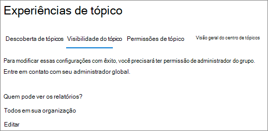
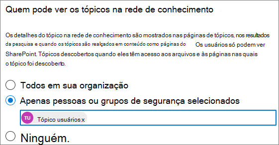

# Gerenciar a visibilidade de tópicos no Microsoft 365

Você pode gerenciar o conjunto de usuários que podem ver destaques de tópico, cartões de tópico e o tópico central no [centro de administração do Microsoft 365](https://admin.microsoft.com). Você deve ser um administrador global ou administrador do SharePoint para executar essas tarefas.

## Para acessar as configurações de gerenciamento de tópicos:

1. No centro de administração do Microsoft 365, clique em **configurações** e em **configurações da organização**.
2. Na guia **Serviços** , clique em **rede de conhecimento**.

     

3. Selecione a guia **visibilidade de tópico** . Consulte as seções a seguir para obter informações sobre cada configuração.

     

##  Alterar quem pode ver os tópicos em sua organização

Você pode alterar os usuários que podem ver tópicos em sua organização.

1. Na guia **visibilidade do tópico** , em **quem pode ver os tópicos na rede de conhecimento**, selecione **Editar**.
2. Na página **quem pode ver os tópicos da página da rede de conhecimento** , você escolhe quem terá acesso aos detalhes do tópico, como tópicos realçados, cartões de tópicos, respostas de tópicos em pesquisa e páginas de tópicos. Você pode selecionar:
    - **Todos em sua organização**
    - **Apenas pessoas ou grupos de segurança selecionados**
    - **Ninguém**

     

3. Selecione **Salvar**.  
 
> [!Note] 
> Embora essa configuração permita que você selecione qualquer usuário da sua organização, somente os usuários que tiverem o tópico experiências de licenças atribuídas poderão exibir tópicos.

## Também consulte

[Gerenciar descoberta de tópicos no Microsoft 365](topic-experiences-discovery.md)

[Gerenciar permissões de tópico no Microsoft 365](topic-experiences-user-permissions.md)

[Alterar o nome da central de tópicos no Microsoft 365](topic-experiences-administration.md)

