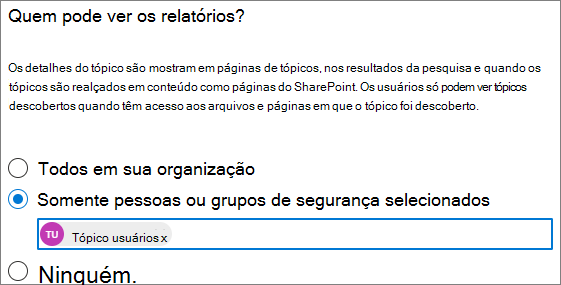

# Gerenciar visibilidade de tópicos em Tópicos do Microsoft VivaManage topic visibility in Microsoft Viva Topics

Você pode gerenciar o conjunto de usuários que podem ver destaques de tópicos, cartões de tópico e o centro de tópicos no centro de Microsoft 365 [de administração.](https://admin.microsoft.com)You can manage the set of users who can see topic highlights, topic cards, and the topic center in the [Microsoft 365 admin center](https://admin.microsoft.com). Você deve ser um administrador global ou um SharePoint para executar essas tarefas.You must be a global administrator or SharePoint administrator to perform these tasks.

## Para acessar as configurações de gerenciamento de tópicos:To access topics management settings:

1. No centro Microsoft 365 de administração, clique **em Configurações**, em seguida, **Configurações de organização**.In the Microsoft 365 admin center, click **Settings**, then **Org settings**.
2. Na guia **Serviços,** clique em **Experiências de tópico.**On the **Services** tab, click **Topic experiences**.

     

3. Selecione a **guia Visibilidade do** tópico. Consulte as seções a seguir para obter informações sobre cada configuração.Select the **Topic visibility** tab. See the following sections for information about each setting.

     

##  Alterar quem pode ver tópicos em sua organizaçãoChange who can see topics in your organization

Você pode alterar os usuários que podem ver tópicos em sua organização.You can change the users who can see topics in your organization.

1. Na guia **Visibilidade do** tópico, em Who **pode ver tópicos**, selecione **Editar**.On the **Topic visibility** tab, under **Who can see topics**, select **Edit**.
2. Na página Who pode ver **tópicos,** escolha quem terá acesso aos detalhes do tópico, como tópicos destacados, cartões de tópicos, respostas de tópicos na pesquisa e páginas de tópicos.On the **Who can see topics** page, you choose who will have access to topic details, such as highlighted topics, topic cards, topic answers in search, and topic pages. Você pode selecionar:You can select:
    - **Todos em sua organização****Everyone in your organization**
    - **Somente pessoas selecionadas ou grupos de segurança****Only selected people or security groups**
    - **Ninguém****No one**

     

3. Selecione **Salvar**.Select **Save**.  
 
> [!Note] 
> Embora essa configuração permita que você selecione qualquer usuário em sua organização, somente os usuários que têm licenças de Experiências de Tópico atribuídas a eles poderão exibir tópicos.While this setting allows you to select any user in your organization, only users who have Topic Experiences licenses assigned to them will be able to view topics.

## Confira tambémSee also

[Gerenciar a descoberta de tópicos em Tópicos do Microsoft VivaManage topic discovery in Microsoft Viva Topics](topic-experiences-discovery.md)

[Gerenciar permissões de tópicos em Tópicos do Microsoft VivaManage topic permissions in Microsoft Viva Topics](topic-experiences-user-permissions.md)

[Alterar o nome do centro de tópicos em Tópicos do Microsoft VivaChange the name of the topic center in Microsoft Viva Topics](topic-experiences-administration.md)

