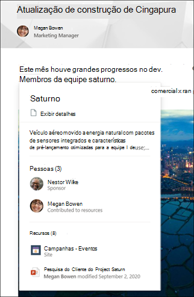

# Visão geral dos Tópicos do Microsoft Viva 

Os Tópicos do Viva usam a tecnologia de IA da Microsoft, o Microsoft 365, o Microsoft Graph, a Pesquisa da Microsoft e outros componentes e serviços para trazer conhecimento aos seus usuários em aplicativos Microsoft 365 que eles usam diariamente, começando com páginas modernas do SharePoint e a Pesquisa da Microsoft.

 

> [!VIDEO https://www.microsoft.com/videoplayer/embed/RE4LhZP]  

 

Os Tópicos do Viva ajudam a abordar um dos principais problemas comerciais de várias empresas, fornecendo as informações aos usuários sempre que elas precisam. Por exemplo, novos funcionários precisam aprender rapidamente muitas informações novas e se deparam com termos sobre os quais não conhecem ao ler informações da empresa. Para saber mais, o usuário pode precisar se afastar do que está fazendo e passar um tempo valioso pesquisando detalhes, como informações sobre o termo, quem na organização é um especialista no assunto e talvez sites e documentos relacionados ao termo.

Os Tópicos do Viva usam IA para pesquisar e identificar **tópicos** na sua organização. Esse serviço compila informações sobre eles, como uma breve descrição, as pessoas que trabalham com o tópico, sites, arquivos e páginas relacionadas a ele. Um gerente de conhecimento ou colaborador pode optar por atualizar as informações do tópico conforme necessário. Os tópicos estão disponíveis para os usuários, o que significa que, para cada instância do tópico que aparece em um site do SharePoint moderno em notícias e páginas, o texto será realçado. Os usuários podem optar por selecionar o tópico para saber mais sobre ele por meio dos detalhes do tópico. Tópicos também podem ser encontrados na Pesquisa do SharePoint.

## Como os tópicos são exibidos para os usuários

Quando um tópico for mencionado no conteúdo de notícias e páginas do SharePoint, você o verá realçado. Você pode abrir o resumo do tópico no destaque. Abra os detalhes do tópico no título do resumo. O tópico mencionado pode ser identificado automaticamente ou ter sido adicionado à página com uma referência direta ao tópico pelo autor da página. 

      

## Indexação de conhecimento

Os Tópicos do Viva usam a tecnologia de IA da Microsoft para identificar **tópicos** no seu ambiente do Microsoft 365.

Um tópico é uma frase ou termo que é organizacionalmente significativo ou importante. Ela tem um significado específico para a organização e tem recursos relacionados a ela que podem ajudar as pessoas a compreender o que ele é e onde encontrar mais informações sobre ele. Há vários tipos diferentes de tópicos que serão importantes para sua organização. Inicialmente, a tecnologia de IA da Microsoft se concentra nos seguintes tipos:
- Project
- Event
- Organização
- Local
- Produto
- Trabalho criativo
- Campo de estudo

Quando um tópico é identificado e a IA determina que há informações suficientes para que ele seja um tópico sugerido, uma **página de tópico** exibe as informações coletadas pela indexação de tópicos, como:

- Nomes alternativos e acrônimos.
- Uma breve descrição do tópico.
- Pessoas que podem ter conhecimento sobre o tópico.
- Arquivos, páginas e sites relacionados ao tópico.

Os administradores de conhecimento podem optar por rastrear todos os sites do SharePoint em seu locatário para tópicos ou apenas selecionar tópicos determinados.

Consulte [Descoberta e curadoria de tópicos](./topic-experiences-discovery-curation.md)

## Funções

Ao usar os Tópicos do Viva no seu ambiente do Microsoft 365, os usuários terão as seguintes funções:

- Visualizadores de tópicos: os usuários que podem ver destaques de tópicos em sites modernos do SharePoint aos quais têm ao menos acesso de *Leitura* e na Pesquisa da Microsoft. Eles podem selecionar destaques do tópico para ver detalhes dele nas páginas do tópico. Os visualizadores de tópicos podem fornecer comentários sobre como um tópico é útil para eles.

- Colaboradores: usuários com direitos para editar tópicos existentes ou criar novos. Os administradores de conhecimento atribuem permissões de colaborador aos usuários por meio das configurações dos Tópicos do Viva no Centro de administração do Microsoft 365. Observe que você também pode optar por dar a todos os participantes do tópico a permissão para editar e criar tópicos para que todos possam contribuir com os tópicos que eles vejam.

- Gerentes de conhecimento: usuários que orientam tópicos no ciclo de vida do tópico. Os gerentes de conhecimento usam a página **Gerenciar Tópicos** da Central de tópicos para confirmar os tópicos sugeridos por IA, remover tópicos que não são mais relevantes, editar tópicos existentes ou criar novos tópicos e são os únicos usuários que têm acesso a ela.  Os administradores de conhecimento atribuem permissões de gerente de conhecimento aos usuários por meio das configurações de administração dos Tópicos do Viva, no Centro de administração do Microsoft 365. 

- Administradores de conhecimento: os administradores de conhecimento configuram os Tópicos do Viva e os gerenciam por meio de controles de administração no Centro de administração do Microsoft 365. Atualmente, um administrador global do Microsoft 365 ou do SharePoint pode servir como administrador de conhecimento.

Confira [funções dos Tópicos do Viva](topic-experiences-roles.md) para mais informações.

## Gerenciamento de tópicos

O gerenciamento de tópicos é feito na página **Gerenciar tópicos** no **Centro de tópicos** da sua organização. O Centro de Tópicos é criado durante a instalação e serve como o centro de conhecimento da sua organização. 

Embora todos os usuários licenciados possam ver os tópicos aos quais estão conectados na Central de Tópicos, somente os usuários com permissões de *Gerenciar tópicos* (gerentes de conhecimento) podem exibir e usar a página Gerenciar tópicos.

Os gerentes de conhecimento podem:

- Confirmar ou remover tópicos que foram descobertos em seu locatário.
- Criar novos tópicos manualmente conforme necessário (por exemplo, se não foram fornecidas informações suficientes para que sejam descobertas através da IA).
- Editar páginas de tópicos existentes. 

Consulte [Gerenciar tópicos na Central de tópicos](manage-topics.md) para saber mais.  

## Controles de administrador

Os controles de administrador no Centro de administração do Microsoft 365 permitem que você gerencie Tópicos do Viva. Eles permitem que um administrador global do Microsoft 365 ou do SharePoint:

- Controle quais usuários em sua organização têm permissão para ver tópicos nas páginas modernas do SharePoint ou nos resultados de pesquisa do SharePoint.
- Controle quais sites do SharePoint serão rastreados para identificar tópicos.
- Exclua tópicos específicos de serem encontrados.
- Controle quais usuários podem gerenciar tópicos no centro de tópicos.
- Controle quais usuários podem criar e editar tópicos.
- Controle qual usuário pode exibir tópicos.

Confira [atribuir permissões de usuário](./plan-topic-experiences.md#user-permissions), [gerenciar visibilidade de tópicos](./topic-experiences-knowledge-rules.md) e [gerenciar descoberta de tópicos](./topic-experiences-discovery.md) para obter mais informações sobre os controles de administrador.

## Curadoria de tópicos e comentários

A IA trabalhará continuamente para oferecer sugestões para melhorar seus tópicos à medida que as alterações ocorrerem em seu ambiente. 

Os usuários com permissões para editar ou criar tópicos podem fazer atualizações diretamente nas páginas de tópicos se quiserem fazer correções ou adicionar informações adicionais. Eles também podem adicionar novos tópicos que a IA não pôde identificar. Se houver informações suficientes sobre esses tópicos adicionados manualmente e a IA conseguir identificar esse tipo de tópico, sugestões adicionais da IA podem aprimorar esses tópicos adicionados manualmente 

Os usuários aos quais você permitir o acesso aos tópicos no trabalho diário podem ser indagados se o tópico foi útil para eles. O sistema analisa essas respostas e as usa para melhorar o destaque do tópico e ajudar a determinar o que é mostrado nos resumos de tópicos e detalhes do tópico.

Além disso, os usuários com permissões adequadas podem marcar itens como uma conversa do Yammer relevante para um tópico e adicioná-los a um tópico específico. 

Consulte [Descoberta e curadoria de tópicos](./topic-experiences-discovery-curation.md)

## Confira também
