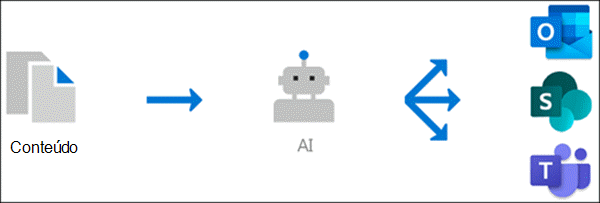

# Visão geral da experiência do tópico (versão prévia)Topic Experiences overview (Preview)

> [!Note] 
> O conteúdo deste artigo é para a visualização privada do Project Cortex.The content in this article is for Project Cortex Private Preview. [Mais informações sobre o Projeto Cortex](https://aka.ms/projectcortex).[Find out more about Project Cortex](https://aka.ms/projectcortex).

As experiências de tópico usam a tecnologia Microsoft AI, a Microsoft 365, o Delve, o Microsoft Graph, a pesquisa e outros componentes e serviços para criar uma rede de conhecimento em seu ambiente do Microsoft 365.Topic experiences uses Microsoft AI technology, Microsoft 365, Delve, Microsoft Graph, Search, and other components and services to build a knowledge network in your Microsoft 365 environment. 

      

Seu objetivo é converter informações em conhecimento e fornecê-las aos seus usuários em aplicativos que usam diariamente, como páginas modernas do SharePoint e pesquisa da Microsoft.Its goal is to convert information into knowledge and deliver it to your users in apps they use everyday, such as SharePoint modern pages and Microsoft Search.

As experiências de tópico ajudam a lidar com um problema de negócios principal em muitas empresas, fornecendo as informações aos usuários quando eles precisam.Topic experiences helps to address a key business issue in many companies - providing the information to users when they need it. Por exemplo, novos funcionários precisam aprender muitas novas informações rapidamente e encontrar termos que não conhecem nada sobre ao ler as informações da empresa.For example, new employees need to learn a lot of new information quickly, and encounter terms they know nothing about when reading through company information. Para saber mais, o usuário pode precisar sair do que está fazendo e gastar um tempo valioso procurando por detalhes, como informações sobre o que é o termo, quem é especialista no assunto, e talvez sites e documentos que estão relacionados ao termo.To learn more, the user might need to step away from what they are doing and spend valuable time searching for details, such as information about what the term is, who in the organization is a subject matter expert, and maybe sites and documents that are related to the term.

A experiência do tópico usa o AI para pesquisar e identificar **Tópicos** automaticamente em sua organização.Topic experiences uses AI to automatically search for and identify **topics** in your organization. Ele compila as informações sobre elas, como uma breve descrição, especialistas no assunto e sites, arquivos e páginas que estão relacionados a ele.It compiles information about them, such as a short description, subject matter experts on the topic, and sites, files, and pages that are related to it. Um gerente de conhecimento ou colaborador pode optar por atualizar as informações do tópico, conforme necessário.A knowledge manager or contributor can choose to update the topic information as needed. Os tópicos estão disponíveis para os usuários, o que significa que, para cada instância do tópico que aparece em um site moderno do SharePoint em notícias e páginas, o texto será realçado.The topics are available to your users, which means that for every instance of the topic that appears in a modern SharePoint site in news and pages, the text will be highlighted. Os usuários podem optar por selecionar o tópico para saber mais sobre ele por meio dos detalhes do tópico.Users can choose to select the topic to learn more about it through the topic details. Os tópicos também podem ser encontrados na pesquisa do SharePoint.Topics can also be found in SharePoint Search.

## Como os tópicos são exibidos para os usuáriosHow topics are displayed to users

Quando um tópico é mencionado em conteúdo nas notícias e páginas do SharePoint, você o verá realçado.When a topic is mentioned in content on SharePoint news and pages, you'll see it highlighted. Você pode abrir o resumo do tópico no destaque.You can open the topic summary from the highlight. Abra o tópico detalhes do título do resumo.Open the topic details from the title of the summary. O tópico mencionado pode ser identificado automaticamente ou adicionado à página com uma referência direta ao tópico pelo autor da página.The mentioned topic could be identified automatically or have been added to the page with a direct reference to the topic by the page author. 

      

## Indexação de conhecimentoKnowledge indexing

A experiência do tópico usa a tecnologia Microsoft AI para identificar os **Tópicos** no seu ambiente do Microsoft 365.Topic experiences uses Microsoft AI technology to identify **topics** in your Microsoft 365 environment.

Um tópico é uma frase ou um termo que é organizacional significativo ou importante.A topic is a phrase or term that is organizationally significant or important. Ele tem um significado específico para a organização e tem recursos relacionados a ele que podem ajudar as pessoas a entender o que é e encontrar mais informações sobre ele.It has a specific meaning to the organization, and has resources related to it that can help people understand what it is and find more information about it.

Quando um tópico é identificado e o AI determina que ele tem informações suficientes para ser um tópico sugerido, uma **página de tópico** é criada para ele que contém informações que foram coletadas por meio da indexação de tópicos, como:When a topic is identified and AI determines that it has enough information for it to be a suggested topic, a **topic page** is created for it that contains information that was gathered through topic indexing, such as:

- Nomes alternativos e/ou acrônimos.Alternate names and/or acronyms.
- Uma breve descrição do tópico.A short description of the topic.
- Usuários que podem ter conhecimento do tópico.Users who might be knowledgeable about the topic.
- Arquivos, páginas e sites relacionados ao tópico.Files, pages, and sites that are related to the topic.

Seus administradores de conhecimento podem optar por rastrear todos os sites do SharePoint em seu locatário para tópicos ou apenas selecionar determinados itens.Your knowledge admins can choose to crawl all SharePoint sites in your tenant for topics, or to just select certain ones.

## FunçõesRoles

Quando você usar experiências de tópico no seu ambiente Microsoft 365, seus usuários terão as seguintes funções:When you use Topic experiences in you Microsoft 365 environment, your users will have the following roles:

- Visualizador de tópicos: usuários que conseguirão ver destaques de tópicos em sites modernos do SharePoint que tenham pelo menos acesso de *leitura* ao e no Microsoft Search.Topic viewer: Users who will be able to see topic highlights on SharePoint modern sites that they have at least *Read* access to, and in Microsoft Search. Eles poderão selecionar destaques do tópico para ver os detalhes do tópico nas páginas do tópico.They will be able to select topic highlights to see topic details in topic pages. Os visualizadores de tópicos poderão fornecer comentários sobre a utilidade de um tópico.Topic viewers will be able to provide feedback on how useful a topic is to them.

- Colaboradores: usuários que têm direitos para editar tópicos existentes ou criar novos.Contributors: Users who have rights to edit existing topics or create new ones. Administradores de conhecimento atribuem permissões de colaborador aos usuários por meio do tópico experiências de configurações no centro de administração do Microsoft 365.Knowledge admins assign contributor permissions to users through the Topic experiences settings in the Microsoft 365 admin center. Observe que você também pode optar por permitir que todos os usuários do tópico editem e criem tópicos para que eles também possam contribuir para os tópicos que eles veem.Note that you can also choose to give all topic viewers the permission to edit and create topics so that they can also contribute to topics that they see.

- Gerentes de conhecimento: usuários que orientam os tópicos por meio do ciclo de vida do tópico.Knowledge managers: Users who guide topics through the topic lifecycle. Os gerentes de conhecimento usam a página **gerenciar tópicos** no centro de tópico para confirmar ou remover tópicos sugeridos do Ai, bem como editar tópicos existentes ou criar novos, e são os únicos usuários que têm acesso a ele.Knowledge managers use the **Manage Topics** page in the Topic center to confirm or remove AI-suggested topics, as well as edit existing topics or create new ones, and are the only users who have access to it. Administradores de conhecimento atribuem permissões de gerentes de conhecimento aos usuários pelo tópico experiências de administração no centro de administração do Microsoft 365.Knowledge admins assign knowledge manager permissions to users through the Topic experiences admin settings in the Microsoft 365 admin center. 

- Administradores de conhecimento: os administradores de conhecimento configuram experiências de tópico e o gerenciam através dos controles de administrador no centro de administração do Microsoft 365.Knowledge admins: Knowledge admins set up Topic experiences and manage it through the admin controls in the Microsoft 365 admin center. Atualmente, um administrador global do Microsoft 365 ou do SharePoint pode servir como um administrador de conhecimento.Currently, a Microsoft 365 global or SharePoint administrator can serve as a knowledge admin.

Consulte [tópico experiências funções](topic-experiences-roles.md) para obter mais informações.See [Topic Experiences roles](topic-experiences-roles.md) for more information.

## Gerenciamento de tópicosTopic management

O gerenciamento de tópicos é feito na página **gerenciar tópicos** no centro de **Tópicos** da sua organização.Topic management is done in the **Manage topics** page in your organization's **Topic center**. O tópico central é criado durante a instalação e serve como seu centro de conhecimento para sua organização.The Topic center is created during setup and serves as your center of knowledge for your organization. 

Embora todos os usuários licenciados possam ver os tópicos com os quais estão conectados no centro de tópicos, somente os usuários com permissões *gerenciar tópicos* (gerentes de conhecimento) poderão exibir e usar a página Gerenciar tópicos.While all licensed users will be able to see topics they are connected with in the Topic center, only users with *Manage topics* permissions (knowledge managers) will be able to view and use the Manage topics page.

Os gerentes de conhecimento poderão:Knowledge managers will be able to:

- Confirmar ou rejeitar tópicos que foram descobertos em seu locatário.Confirm or reject topics that were discovered in your tenant.
- Crie novos tópicos manualmente, conforme necessário (por exemplo, se não forem fornecidas informações suficientes para serem descobertas por meio do AI).Create new topics manually as needed (for example, if not enough information was provided for it to be discovered through AI).
- Editar páginas de tópico existentes.Edit existing topic pages. 

Consulte [gerenciar tópicos no tópico central](manage-topics.md) para obter mais informações.See [Manage topics in the Topic center](manage-topics.md) for more information.  

## Controles de administradorAdmin controls

Os controles de administrador no centro de administração do Microsoft 365 permitem que você gerencie sua rede de conhecimento.Admin controls in the Microsoft 365 admin center allow you to manage your knowledge network. Eles permitem que um administrador global do Microsoft 365 ou do SharePoint:They allow a Microsoft 365 global or SharePoint administrator to:

- Controlar quais usuários da sua organização podem ver os tópicos nas páginas modernas do SharePoint ou nos resultados de pesquisa do SharePoint.Control which users in your organization are allowed to see topics in SharePoint modern pages or in SharePoint search results.
- Controlar quais sites do SharePoint serão rastreados para Pesquisar tópicos.Control which SharePoint sites will be crawled to search for topics.
- Configure o tópico Discovery para excluir tópicos específicos de serem localizados.Configure topic discovery to exclude specific topics from being found.
- Controlar quais usuários podem gerenciar tópicos no centro de tópicos.Control which users can manage topics in the topic center.
- Controlar quais usuários podem criar e editar tópicos no centro de tópicos.Control which users can create and edit topics in the topic center.
- Controle qual usuário poderá exibir tópicos.Control which user will be able to view topics.

Consulte [atribuir permissões de usuário](https://docs.microsoft.com/microsoft-365/knowledge/plan-topic-experiences#user-permissions), [gerenciar visibilidade de tópico](https://docs.microsoft.com/microsoft-365/knowledge/topic-experiences-knowledge-rules)e [gerenciar descoberta de tópicos](https://docs.microsoft.com/microsoft-365/knowledge/topic-experiences-discovery) para obter mais informações sobre controles de administrador.See [assign user permissions](https://docs.microsoft.com/microsoft-365/knowledge/plan-topic-experiences#user-permissions), [manage topic visibility](https://docs.microsoft.com/microsoft-365/knowledge/topic-experiences-knowledge-rules), and [manage topic discovery](https://docs.microsoft.com/microsoft-365/knowledge/topic-experiences-discovery) for more information about admin controls.

## Opinião sobre & de tópicosTopic curation & feedback

O AI funcionará continuamente para fornecer sugestões para melhorar seus tópicos à medida que as alterações ocorrerem em seu ambiente.AI will continually work to provide you suggestions to improve your topics as changes occur in your environment. 

Os usuários que permitem o acesso para ver os tópicos em seus trabalhos diários podem ser solicitados se o tópico foi útil para eles.Users who you allow access to see topics in their daily work might be asked if the topic was useful to them. O AI examina essas respostas e as usa para ajudar a determinar o que é mostrado nos resumos de tópicos e nos detalhes do tópico.AI looks at these responses and use them to help determine what's shown on topic summaries and in topic details.

Os usuários com permissões para editar ou criar tópicos podem fazer atualizações nas páginas de tópicos diretamente, caso pretendam fazer correções ou adicionar mais informações.Users with edit or create topics permissions can make updates to topic pages directly if they want to make corrections or add additional information. 

Além disso, os usuários com permissões adequadas podem marcar itens como a conversa do Yammer que são relevantes para um tópico e adicioná-los a um tópico específico.Additionally, users with proper permissions can tag items such as Yammer conversation that are relevant to a topic, and add them to a specific topic. 

## Confira tambémSee also

