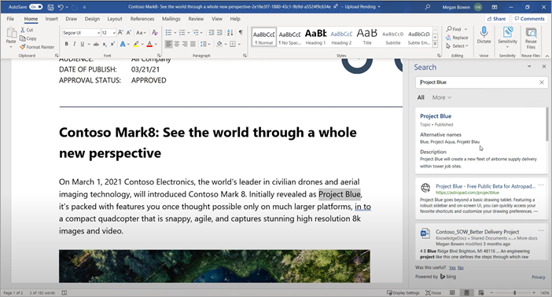

# Visão geral dos Tópicos do Microsoft VivaMicrosoft Viva Topics overview 

Os Tópicos do Viva usam tecnologia de AI da Microsoft, Microsoft 365, Microsoft Graph, Pesquisa e outros componentes e serviços para trazer conhecimento aos usuários nos aplicativos do Microsoft 365 que eles usam diariamente SharePoint, começando com páginas modernas, Pesquisa da Microsoft e Pesquisa no Word, PowerPoint, Outlook e Excel.Viva Topics uses Microsoft AI technology, Microsoft 365, Microsoft Graph, Search, and other components and services to bring knowledge to your users in the Microsoft 365 apps they use everyday, starting with SharePoint modern pages, Microsoft Search, and Search in Word, PowerPoint, Outlook, and Excel.

 

> [!VIDEO https://www.microsoft.com/videoplayer/embed/RE4LhZP]  

 

Os Tópicos do Viva ajudam a resolver um problema comercial importante em muitas empresas , fornecendo as informações aos usuários quando precisam.Viva Topics helps to address a key business issue in many companies — providing the information to users when they need it. Por exemplo, novos funcionários precisam aprender rapidamente muitas informações novas e se deparam com termos sobre os quais não conhecem ao ler informações da empresa.For example, new employees need to learn a lot of new information quickly, and encounter terms they know nothing about when reading through company information. Para saber mais, o usuário pode precisar se afastar do que está fazendo e passar um tempo valioso pesquisando detalhes, como informações sobre o termo, quem na organização é um especialista no assunto e talvez sites e documentos relacionados ao termo.To learn more, the user might need to step away from what they are doing and spend valuable time searching for details, such as information about what the term is, who in the organization is a subject matter expert, and maybe sites and documents that are related to the term.

Os Tópicos do Viva usam IA para pesquisar e identificar *tópicos* na sua organização.Viva Topics uses AI to automatically search for and identify *topics* in your organization. Esse serviço compila informações sobre eles, como uma breve descrição, as pessoas que trabalham com o tópico, sites, arquivos e páginas relacionadas a ele.It compiles information about them, such as a short description, people working on the topic, and sites, files, and pages that are related to it. Um gerente de conhecimento ou colaborador pode optar por atualizar as informações do tópico conforme necessário.A knowledge manager or contributor can choose to update the topic information as needed. Os tópicos estão disponíveis para os usuários, o que significa que, para cada instância do tópico que aparece em um site do SharePoint moderno em notícias e páginas, o texto será realçado.The topics are available to your users, which means that for every instance of the topic that appears in a modern SharePoint site in news and pages, the text will be highlighted. Os usuários podem optar por selecionar o tópico para saber mais sobre ele por meio dos detalhes do tópico.Users can choose to select the topic to learn more about it through the topic details. Tópicos também podem ser encontrados na Pesquisa do SharePoint.Topics can also be found in SharePoint Search.

## Como os tópicos são exibidos para os usuáriosHow topics are displayed to users

Os tópicos são exibidos para os usuários por meio de:Topics are displayed to users through:

- [Destaques de tópicos](topic-experiences-overview.md#topic-highlights) em SharePoint páginas[Topic highlights](topic-experiences-overview.md#topic-highlights) in SharePoint pages
- Respostas de tópico nos [resultados da pesquisa](topic-experiences-overview.md#search-results)Topic answers in [search results](topic-experiences-overview.md#search-results)
- Pesquisar em [aplicativos do office](topic-experiences-overview.md#office-application-search)Search in [office applications](topic-experiences-overview.md#office-application-search)
- [Home page do Centro de](topic-experiences-overview.md#topic-center) Tópicos[Topic center](topic-experiences-overview.md#topic-center) home page

### Destaques de tópicosTopic highlights

Quando um tópico for mencionado no conteúdo de notícias e páginas do SharePoint, você o verá realçado.When a topic is mentioned in content on SharePoint news and pages, you'll see it highlighted. Você pode abrir o resumo do tópico no destaque.You can open the topic summary from the highlight. Abra os detalhes do tópico do título do resumo para exibir a página de tópico completo.Open the topic details from the title of the summary to view the full topic page. O tópico mencionado pode ser identificado automaticamente ou pode ter sido adicionado à página com uma referência direta ao tópico pelo autor da página.The mentioned topic could be identified automatically or could have been added to the page with a direct reference to the topic by the page author. 

    

### Resultados da pesquisaSearch results

Você pode  ver uma resposta de tópico nos resultados da pesquisa quando pesquisa na página inicial do SharePoint, pesquise em Office.com ou pesquise em um site SharePoint depois de alterar o escopo de pesquisa para incluir a organização completa.You can see a [topic answer](search.md#topic-answer) in search results when you search from the SharePoint start page, search on Office.com, or search from a SharePoint site after you you change the search scope to include the full organization. A resposta do tópico aparecerá no tópico da lista de resultados e dará a você um pequeno conjunto de informações relacionadas a esse tópico.The topic answer will appear at the topic of the results list and give you a short set of information related to that topic. 

    

### Office pesquisa de aplicativosOffice application search

Quando você usa a Pesquisa em Office aplicativos como Word, PowerPoint, Outlook ou Excel — por meio  da caixa de pesquisa ou selecionando Pesquisar no menu de contexto — as respostas do tópico são exibidas nos resultados da pesquisa.When you use Search in Office apps such as Word, PowerPoint, Outlook, or Excel — either through the search box or by selecting **Search** in the context menu — topic answers are displayed in the search results.

   

   

### Centro de tópicosTopic center

Os usuários podem ver tópicos em sua organização aos quais têm uma conexão na [home page da central de tópicos.](topic-center-overview.md#home-page)Users can see topics in their organization to which they have a connection on the [topic center home page](topic-center-overview.md#home-page).

## Indexação de conhecimentoKnowledge indexing

Os Tópicos do Viva usam a tecnologia de IA da Microsoft para identificar *tópicos* no seu ambiente do Microsoft 365.Viva Topics uses Microsoft AI technology to identify *topics* in your Microsoft 365 environment.

Um tópico é uma frase ou termo que é organizacionalmente significativo ou importante.A topic is a phrase or term that is organizationally significant or important. Ela tem um significado específico para a organização e tem recursos relacionados a ela que podem ajudar as pessoas a compreender o que ele é e onde encontrar mais informações sobre ele.It has a specific meaning to the organization, and has resources related to it that can help people understand what it is and find more information about it. Há vários tipos diferentes de tópicos que serão importantes para sua organização.There are lots of different types of topics that will be important to your organization. Inicialmente, a tecnologia de IA da Microsoft se concentra nos seguintes tipos:Initially, the Microsoft AI technology focuses on the following types:

- ProjectProject
- EventEvent
- OrganizaçãoOrganization
- LocalLocation
- ProdutoProduct
- Trabalho criativoCreative work
- Campo de estudoField of study

Quando um tópico é identificado e a IA determina que há informações suficientes para que ele seja um tópico sugerido, uma *página de tópico* exibe as informações coletadas pela indexação de tópicos, como:When a topic is identified and AI determines that it has enough information for it to be a suggested topic, a *topic page* displays the information that was gathered through topic indexing, such as:

- Nomes alternativos e acrônimos.Alternate names and acronyms.
- Uma breve descrição do tópico.A short description of the topic.
- Pessoas que podem ter conhecimento sobre o tópico.People who might be knowledgeable about the topic.
- Arquivos, páginas e sites relacionados ao tópico.Files, pages, and sites that are related to the topic.

Os administradores de conhecimento podem optar por rastrear todos os sites do SharePoint em seu locatário para tópicos ou apenas selecionar tópicos determinados.Your knowledge admins can choose to crawl all SharePoint sites in your tenant for topics, or to just select certain ones.

Para obter mais informações, consulte [Descoberta e cura de tópicos.](./topic-experiences-discovery-curation.md)For more information, see [Topic discovery and curation](./topic-experiences-discovery-curation.md).

## FunçõesRoles

Ao usar os Tópicos do Viva no seu ambiente do Microsoft 365, os usuários terão as seguintes funções:When you use Viva Topics in your Microsoft 365 environment, your users will have the following roles:

- Visualizadores de tópicos: os usuários que podem ver destaques de tópicos em sites modernos do SharePoint aos quais têm ao menos acesso de *Leitura* e na Pesquisa da Microsoft.Topic viewers: Users who can see topic highlights on SharePoint modern sites that they have at least *Read* access to, and in Microsoft Search. Eles podem selecionar destaques do tópico para ver detalhes dele nas páginas do tópico.They can select topic highlights to see topic details in topic pages. Os visualizadores de tópicos podem fornecer comentários sobre como um tópico é útil para eles.Topic viewers can provide feedback on how useful a topic is to them.

- Colaboradores: usuários com direitos para editar tópicos existentes ou criar novos.Contributors: Users who have rights to edit existing topics or create new ones. Os administradores de conhecimento atribuem permissões de colaborador aos usuários por meio das configurações dos Tópicos do Viva no Centro de administração do Microsoft 365.Knowledge admins assign contributor permissions to users through the Viva Topics settings in the Microsoft 365 admin center. Observe que você também pode optar por dar a todos os participantes do tópico a permissão para editar e criar tópicos para que todos possam contribuir com os tópicos que eles vejam.Note that you can also choose to give all topic viewers the permission to edit and create topics so that everyone can contribute to topics that they see.

- Gerentes de conhecimento: usuários que orientam tópicos no ciclo de vida do tópico.Knowledge managers: Users who guide topics through the topic lifecycle. Os gerentes de conhecimento usam a página Gerenciar **tópicos** no centro de tópicos para confirmar os tópicos sugeridos pela IA, remover tópicos que não são mais relevantes, bem como editar tópicos existentes ou criar novos e são os únicos usuários que têm acesso a ele.Knowledge managers use the **Manage topics** page in the topic center to confirm AI-suggested topics, remove topics that are no longer relevant, as well as edit existing topics or create new ones, and are the only users who have access to it. Os administradores de conhecimento atribuem permissões de gerente de conhecimento aos usuários por meio das configurações de administração dos Tópicos do Viva, no Centro de administração do Microsoft 365.Knowledge admins assign knowledge manager permissions to users through the Viva Topics admin settings in the Microsoft 365 admin center. 

- Administradores de conhecimento: os administradores configuram Tópicos do Viva e gerenciam-os por meio dos controles de administrador no Microsoft 365 de administração.Knowledge admins: Admins set up Viva Topics and manage it through the admin controls in the Microsoft 365 admin center. Atualmente, um administrador global do Microsoft 365 ou do SharePoint pode servir como administrador de conhecimento.Currently, a Microsoft 365 global or SharePoint administrator can serve as a knowledge admin.

Para obter mais informações, consulte [Funções de Tópicos do Viva.](topic-experiences-roles.md)For more information, see [Viva Topics roles](topic-experiences-roles.md).

## Gerenciamento de tópicosTopic management

O gerenciamento de tópicos é feito na página **Gerenciar tópicos** no centro de tópicos *da sua organização.*Topic management is done in the **Manage topics** page in your organization's *topic center*. O centro de tópicos é criado durante a instalação e serve como centro de conhecimento para sua organização.The topic center is created during setup and serves as your center of knowledge for your organization. 

Embora todos os usuários licenciados possam ver tópicos com os que estão conectados no centro de tópicos, somente os usuários com permissões Gerenciar tópicos *(gerentes* de conhecimento) podem exibir e usar a página Gerenciar **tópicos.**While all licensed users can see topics they're connected with in the topic center, only users with *Manage topics* permissions (knowledge managers) can view and use the **Manage topics** page.

Os gerentes de conhecimento podem:Knowledge managers can:

- Confirmar ou remover tópicos que foram descobertos em seu locatário.Confirm or remove topics that were discovered in your tenant.
- Criar novos tópicos manualmente conforme necessário (por exemplo, se não foram fornecidas informações suficientes para que sejam descobertas através da IA).Create new topics manually as needed (for example, if not enough information was provided for it to be discovered through AI).
- Editar páginas de tópicos existentes.Edit existing topic pages.

Para obter mais informações, [consulte Gerenciar tópicos no centro de tópicos](manage-topics.md).For more information, see [Manage topics in the topic center](manage-topics.md).  

## Controles de administradorAdmin controls

Os controles de administrador no Microsoft 365 de administração permitem que você gerencie Tópicos do Viva.Admin controls in the Microsoft 365 admin center allow you to manage Viva Topics. Eles permitem que um administrador global do Microsoft 365 ou do SharePoint:They allow a Microsoft 365 global or SharePoint administrator to:

- Controle quais usuários em sua organização têm permissão para ver tópicos nas páginas modernas do SharePoint ou nos resultados de pesquisa do SharePoint.Control which users in your organization are allowed to see topics in SharePoint modern pages or in SharePoint search results.
- Controle quais sites do SharePoint serão rastreados para identificar tópicos.Control which SharePoint sites will be crawled to identify topics.
- Exclua tópicos específicos de serem encontrados.Exclude specific topics from being found.
- Controle quais usuários podem gerenciar tópicos no centro de tópicos.Control which users can manage topics in the topic center.
- Controle quais usuários podem criar e editar tópicos.Control which users can create and edit topics.
- Controle qual usuário pode exibir tópicos.Control which user can view topics.

Para obter mais informações sobre controles de administrador, consulte [assign user permissions](./plan-topic-experiences.md#user-permissions), [manage topic visibility](./topic-experiences-knowledge-rules.md), and [manage topic discovery](./topic-experiences-discovery.md).For more information about admin controls, see [assign user permissions](./plan-topic-experiences.md#user-permissions), [manage topic visibility](./topic-experiences-knowledge-rules.md), and [manage topic discovery](./topic-experiences-discovery.md).

## Curadoria de tópicos e comentáriosTopic curation & feedback

A IA trabalhará continuamente para oferecer sugestões para melhorar seus tópicos à medida que as alterações ocorrerem em seu ambiente.AI will continually work to provide you suggestions to improve your topics as changes occur in your environment. 

Os usuários com permissões para editar ou criar tópicos podem fazer atualizações diretamente nas páginas de tópicos se quiserem fazer correções ou adicionar informações adicionais.Users with edit or create topics permissions can make updates to topic pages directly if they want to make corrections or add additional information. Eles também podem adicionar novos tópicos que a IA não pôde identificar.They can also add new topics that AI wasn't able to identify. Se houver informações suficientes sobre esses tópicos adicionados manualmente e a AI for capaz de identificar esse tipo de tópico, sugestões adicionais da AI podem aprimorar esses tópicos adicionados manualmente.If there's enough information on these manually added topics, and AI is able to identify this type of topic, additional suggestions from AI might enhance these manually added topics.

Os usuários aos quais você permitir o acesso aos tópicos no trabalho diário podem ser indagados se o tópico foi útil para eles.Users that you allow access to see topics in their daily work might be asked if the topic was useful to them. O sistema analisa essas respostas e as usa para melhorar o destaque do tópico e ajudar a determinar o que é mostrado nos resumos de tópicos e detalhes do tópico.The system looks at these responses and uses them to improve the topic highlight, and help determine what's shown on topic summaries and in topic details.

Além disso, os usuários com permissões adequadas podem marcar itens como uma conversa do Yammer relevante para um tópico e adicioná-los a um tópico específico.Additionally, users with proper permissions can tag items such as Yammer conversation that are relevant to a topic, and add them to a specific topic. 

Para obter mais informações, consulte [Descoberta e cura de tópicos.](./topic-experiences-discovery-curation.md)For more information, see [Topic discovery and curation](./topic-experiences-discovery-curation.md).

## Confira tambémSee also

[Usar a Pesquisa da Microsoft para encontrar tópicos em Tópicos do VivaUse Microsoft Search to find topics in Viva Topics](./search.md)