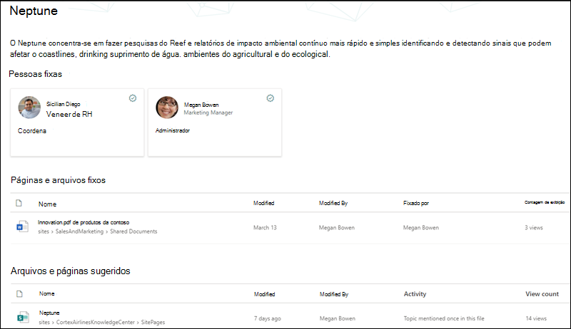
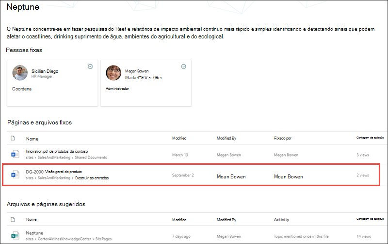

# Tópico experiências de filtragem de segurança (versão prévia)

> [!Note] 
> O conteúdo deste artigo é para a visualização privada do Project Cortex. [Mais informações sobre o Projeto Cortex](https://aka.ms/projectcortex).

Tópico experiências os usuários não poderão exibir informações nos tópicos que suas permissões existentes do Office 365 impedem que eles vejam. Tudo o que um usuário vê em uma página de tópico (por exemplo, sites do SharePoint, documentos, arquivos) serão informações que eles já podem ver. As experiências de tópico não fazem alterações nas permissões existentes.

## Por que dois usuários podem ter modos de exibição diferentes do mesmo tópico

Quando um tópico é criado através do AI ou da seção de manual, ele pode conter uma descrição do tópico, nomes alternativos, pessoas associadas ao tópico, bem como sites, páginas e arquivos relacionados ao tópico. Quando essas informações são exibidas em uma página de tópico, é possível que dois usuários que estejam exibindo o mesmo tópico não vejam as mesmas informações.
  
Por exemplo, quando o usuário 1 exibe a página de tópico Neptune, isso é o que eles podem ver.

   

No entanto, quando o usuário 2 examina a mesma página de tópico Neptune, seu modo de exibição difere do usuário 1.  O usuário 2 é capaz de ver o arquivo de *visão geral do produto DG-2000* na seção **arquivos fixos e páginas** da página de tópico, que não aparece para o usuário 1. 

   

A diferença no que os usuários podem ver no mesmo tópico é porque os usuários podem não ter as permissões do Office 365 para exibir um site ou arquivo relacionado.  A experiência do tópico respeita as permissões que são definidas nos itens de um tópico e não podem alterar o acesso a elas. No nosso exemplo, o usuário 1 não pode exibir o arquivo de *visão geral do produto DG-2000* na página de tópico para Neptune porque o usuário 1 não tem as permissões do Office 365 para exibir o arquivo.

Se um usuário não conseguir ver informações suficientes em um tópico para ser útil, o tópico não estará disponível para o usuário. Nesse caso, o usuário não verá o tópico realçado. No entanto, um usuário diferente que tenha permissões para obter mais informações no tópico para que ele seja útil, poderá ver o tópico.

## Permissões de tópico para gerentes de conhecimento e colaboradores de tópico

Os usuários que receberam permissões para gerenciar tópicos-gerentes de conhecimento – só poderão exibir as informações que têm permissões para ver nos tópicos.

Da mesma forma, os usuários que têm permissões de criação e edição de tópico – os colaboradores do tópico só poderão exibir as informações que têm permissões para ver nos tópicos. 

## AI versus informações de tópico organizadas manualmente

Os tópicos podem conter informações geradas pelo AI e informações adicionadas ou editadas por colaboradores de tópico ou gerentes de conhecimento.

 - As informações de um tópico que foram adicionadas pelo AI são visíveis apenas para pessoas que têm acesso ao conteúdo de origem.
 - As informações que foram adicionadas ou editadas manualmente por um tópico Contribuidor ou gerente de conhecimento estão visíveis para todas as pessoas que podem ver o tópico.

A tabela a seguir descreve quais usuários – visualizadores de tópicos, colaboradores e gerentes de conhecimento-podem ver em um determinado tópico com base em suas permissões.

|Item de tópico|O que os usuários podem ver|
|:---------|:------------------|
|Nome do tópico|Os usuários podem ver o nome do tópico de todos os tópicos no centro de tópicos. Alguns tópicos podem não estar visíveis se tiverem uma relevância baixa para o usuário.|
|Descrição do tópico|As descrições geradas pelo AI são visíveis apenas para os usuários que têm permissões para o conteúdo de origem. Descrições inseridas ou editadas manualmente são visíveis para todos os usuários.|
|Pessoas|Pessoas fixas estão visíveis para todos os usuários. As pessoas sugeridas são visíveis apenas para os usuários que têm permissões para o conteúdo de origem.|
|Arquivos|Os arquivos são visíveis apenas para os usuários que têm permissões para o conteúdo de origem.|
|Páginas|As páginas são visíveis apenas para os usuários que têm permissões para o conteúdo de origem.|
|Sites|Os sites são visíveis apenas para os usuários que têm permissões para o conteúdo de origem.|

## Confira também

