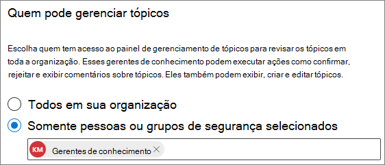

# Gerenciar permissões de tópicos em Tópicos do Microsoft VivaManage topic permissions in Microsoft Viva Topics

Você pode gerenciar as configurações de permissões de tópicos no Microsoft 365 [de administração.](https://admin.microsoft.com)You can manage topic permissions settings in the [Microsoft 365 admin center](https://admin.microsoft.com). Você deve ser um administrador global ou um SharePoint para executar essas tarefas.You must be a global administrator or SharePoint administrator to perform these tasks.

Com as configurações de permissões de tópicos, você pode escolher:With topic permissions settings you can choose:

- Quais usuários podem criar e editar tópicos: Criar novos tópicos que não foram encontrados durante a descoberta ou editar detalhes de tópicos existentes.Which users can create and edit topics: Create new topics that were not found during discovery or edit existing topic details.
- Quais usuários podem gerenciar tópicos: Acessar o centro de gerenciamento de tópicos e exibir comentários sobre tópicos, bem como mover tópicos pelo ciclo de vida.Which users can manage topics: Access the topic management center and view feedback on topics as well as move topics through the lifecycle.

## Para acessar as configurações de gerenciamento de tópicos:To access topics management settings:

1. No centro Microsoft 365 de administração, clique **em Configurações**, em seguida, **Configurações de organização**.In the Microsoft 365 admin center, click **Settings**, then **Org settings**.
2. Na guia **Serviços,** clique em **Experiências de tópico.**On the **Services** tab, click **Topic experiences**.

     

3. Selecione a **guia Permissões de** tópico. Consulte as seções a seguir para obter informações sobre cada configuração.Select the **Topic permissions** tab. See the following sections for information about each setting.

     

## Alterar quem tem permissões para atualizar detalhes do tópicoChange who has permissions to update topic details

Para atualizar quem tem permissões para criar e editar tópicos:To update who has permissions to create and edit topics:

1. Na guia **Permissões de tópico,** em Who **pode criar e editar tópicos,** selecione **Editar**.On the **Topic permissions** tab, under **Who can create and edit topics**, select **Edit**.
2. Na página **Who pode criar e editar tópicos,** você pode selecionar:On the **Who can create and edit topics** page, you can select:
    - **Todos em sua organização****Everyone in your organization**
    - **Somente pessoas selecionadas ou grupos de segurança****Only selected people or security groups**
    - **Ninguém****No one**

      

3. Selecione **Salvar**.Select **Save**.

Para atualizar quem tem permissões para gerenciar tópicos:To update who has permissions to manage topics:

1. Na guia **Permissões de tópico,** em Who **pode gerenciar tópicos,** selecione **Editar**.On the **Topic permissions** tab, under **Who can manage topics**, select **Edit**.
2. Na página **Who pode gerenciar tópicos,** você pode selecionar:On the **Who can manage topics** page, you can select:
    - **Todos em sua organização****Everyone in your organization**
    - **Pessoas ou grupos de segurança selecionados****Selected people or security groups**

      

3. Selecione **Salvar**.Select **Save**.

## Confira tambémSee also

[Gerenciar a descoberta de tópicos em Tópicos do Microsoft VivaManage topic discovery in Microsoft Viva Topics](topic-experiences-discovery.md)

[Gerenciar visibilidade de tópicos em Tópicos do Microsoft VivaManage topic visibility in Microsoft Viva Topics](topic-experiences-knowledge-rules.md)

[Alterar o nome do centro de tópicos em Tópicos do Microsoft VivaChange the name of the topic center in Microsoft Viva Topics](topic-experiences-administration.md)
