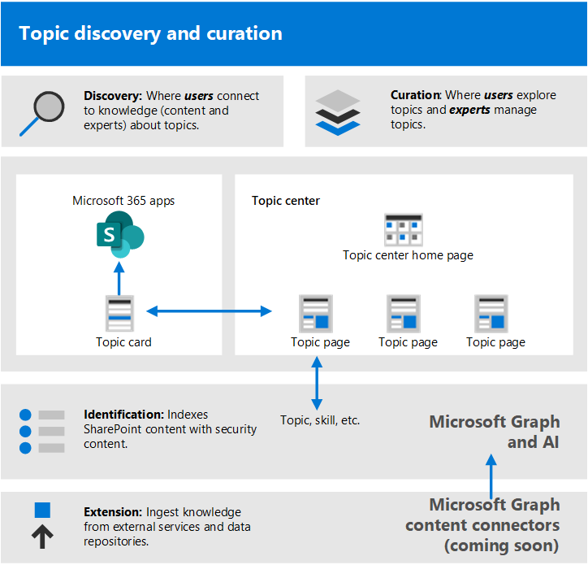

# Começar a impulsionar a adoção de tópicos do Microsoft VivaGet started driving adoption of Microsoft Viva Topics

Antes de começar a adoção, você precisa entender os conceitos envolvidos no gerenciamento de conhecimento e tópicos do Viva.Before you get started with adoption, you need to understand the concepts involved in knowledge management and Viva Topics. O diagrama a seguir mostra o que acontece durante a descoberta e a cura do tópico:The following diagram shows what happens during topic discovery and curation:

- **Descoberta:** os usuários podem descobrir conhecimento nos aplicativos que usam todos os dias por meio de cartões de tópicos. Eles também podem descobrir tópicos na Pesquisa da Microsoft.**Discovery**: Users can discover knowledge in the apps they use every day through topic cards - they can also discover topics in Microsoft Search.
- **Curação:** especialistas no assunto (SMEs) refinam tópicos por meio de páginas de tópicos, e a IA aprende com a entrada.**Curation**: Subject matter experts (SMEs) refine topics through topic pages, and AI learns from their input. A Central de Tópicos contém páginas de tópico que os usuários podem explorar e especialistas podem gerenciar.The Topic center contains topic pages that users can explore and experts can manage.
- **Identificação:** com o conhecimento do Microsoft Graph e inteligência artificial (IA), as pessoas (tópicos, habilidades e assim por diante) são identificadas e organizadas automaticamente em tópicos relacionados.**Identification**: With Microsoft Graph and Artificial Intelligence (AI) knowledge and people (topics, skills, and so on) are identified and automatically organized into related topics. O conteúdo do SharePoint é indexado com conteúdo de segurança.SharePoint content is indexed with security content.
- **Extensão:** com os conectores de conteúdo do Microsoft Graph (em breve), você pode ingerir conhecimento de serviços externos e repositórios de dados.**Extension**: With Microsoft Graph content connectors (coming soon), you can ingest knowledge from external services and data repositories.

Para obter mais informações, você pode revisar a [visão geral](topic-experiences-overview.md) de uma introdução.For more information, you can review the [overview](topic-experiences-overview.md) for an introduction.

Lembre-se de que:Keep in mind that:

- A descoberta de tópicos é aprimorada quando há mais conteúdo disponível.Topic discovery is improved when more content is available.
- A segurança, a privacidade e o local dos seus dados são preservados mesmo que as informações são apresentadas em uma nova experiência.The security, privacy, and location of your data is preserved even though the information is presented in a new experience.
- Os usuários precisam de uma licença para exibir tópicos do Viva.Users need a license to view Viva Topics.
- Inicialmente, a descoberta está no conteúdo do idioma inglês.Discovery is initially on English language content.

Para ajudar a se preparar, pense nestas perguntas:To help prepare, think through these questions:

- Qual conteúdo deve ser usado para descoberta de tópicos?What content should be used for topic discovery?
- Quem gerenciará os tópicos?Who will manage topics?
- Quem verá destaques e cartões de tópico?Who will see topic cards and highlights?
- Quais tópicos são esperados?Which topics are expected?

Revise esta lista de pré-requisitos para obter o máximo dos Tópicos do Viva:Review this list of prerequisites for getting the most out of Viva Topics:

|Produto ou recursoProduct or feature |DescriçãoDescription |
|:-------|:--------|
|SharePoint Online com páginas modernas do SharePointSharePoint Online with modern SharePoint pages |A mineração de tópicos inclui apenas conteúdo em sites do SharePoint, e os cartões de tópico só podem ser divulgados em páginas modernas.Topic mining only includes content on SharePoint sites, and topic cards can only be surfaced on modern pages.|
|Microsoft GraphMicrosoft Graph |Você pode controlar se os tópicos são incluídos ou excluídos da Pesquisa ou do Delve com as configurações do Microsoft Graph.You can control whether topics are included or excluded from Search or Delve with the Microsoft Graph settings. |

## Planejar a adoçãoPlan for adoption

Para planejar a adoção de tópicos do Viva, você precisa:To plan for adoption of Viva Topics, you need to:

1. Planeje sua abordagem e cenários de destino:Plan your approach and target scenarios:
    - Pense em definir e priorizar [os cenários.](#target-scenarios)Think about defining and prioritizing the [scenarios](#target-scenarios).
    - Pense nos [participantes e nos membros](#identify-stakeholders) da equipe do projeto que você precisa envolver.Think about the [stakeholders](#identify-stakeholders) and project team members you need to have involved.  
    - Descubra o impacto nos negócios que você deseja impulsionar e como irá [medir o sucesso.](#create-a-success-plan)Figure out what business impact you want to drive towards and how you're going to [measure success](#create-a-success-plan).

2. Envolva sua organização:Engage your organization:
    - Identifique os grupos comerciais e as equipes de negócios que precisam estar envolvidos e obtenha alinhamento entre eles e os cenários que você está planejando.Identify the business groups and business teams that need to be involved and gain alignment across those and the scenarios that you're planning.
    - Comece a pensar em como envolver alguns usuários inserdos para obter comentários críticos e antecipados para que você possa iterar para chegar à melhor solução.Start thinking about how to engage some early adopters to get critical, early feedback so you can iterate to get to the best solution.
    - Comece a criar a comunidade e pense em como os Tópicos do Viva podem ser usados em toda a organização por esses grupos diferentes.Start building the community and think about how Viva Topics can be used across your organization by these different groups.

3. Treine sua organização: a maioria das pessoas compreenderá intuitivamente o conceito de tópicos e como os cartões de tópico compilam informações relevantes, entenderão e verão o valor.Train your organization: Most people will intuitively understand the concept of topics and how topic cards compile relevant information, and understand and see the value. Mas talvez você queira criar um treinamento personalizado para sua própria cultura e organização, para mostrar como você deseja que os Tópicos do Viva sejam usados.But you might want to create training that is tailored to your own culture and organization, to show how you want Viva Topics to be used. Alguns recursos de treinamento:Some training resources:
    - [Central de Recursos do Project Cortex.](https://aka.ms/projectcortex)[Project Cortex Resource Center](https://aka.ms/projectcortex). Inclui visão geral e informações de recursos, vídeos e apresentações gravados no horário do escritório e informações sobre parceiros e suas ofertas.Includes overviews and feature information, recorded office hour videos and presentations, and information about partners and their offerings.
    - Em breve, vídeos de treinamento e ajuda para usuários finais.Coming soon, training videos and help for end users.

4. [Crie uma rede de defensores:](#build-a-champion-network)[Build a champion network](#build-a-champion-network):
    - Você pode ter comunidades de práticas ou redes de defensores já em uso.You might have communities of practice or champion networks already in place. Essas são ótimas maneiras de socializar e de fazer com que os colegas se envolvam em ajudar uns aos outros.These are great ways to socialize and evangelize and get peers involved in helping each other. E eles podem compartilhar histórias de sucesso que podem ser muito valiosas.And they can share success stories which can be really valuable. Eles podem oferecer conselhos e gerar emoção.They can offer advice and generate excitement.

### Cenários de destinoTarget scenarios

Você precisa determinar como deseja usar os Tópicos do Viva em sua organização para ter sucesso com os tópicos.You need to determine how you want to use Viva Topics in your organization before you can have success with topics. Aqui estão alguns cenários em que tópicos e gerenciamento de conhecimento podem ajudar sua organização:Here are a few scenarios where knowledge management and topics can help your organization:

- Integração de função & treinamento: compreender a terminologia, os principais projetos e a cultura de uma nova organização são etapas importantes na integração.Role onboarding & training: Understanding a new organization's terminology, key projects, and culture are important steps in onboarding. A descoberta fácil de tópicos pode ajudar os novos funcionários a aumentar a velocidade de novos trabalhos, funções ou projetos.Easy discovery of topics can help new employees ramp up on new job, roles, or projects quickly.
- Descoberta de experiência e compartilhamento de informações: quando os tópicos são gerenciados e compartilhados, as pessoas em suas organizações podem encontrar informações e especialistas mais facilmente para ajudá-los no trabalho do dia a dia.Expertise finding and information sharing: When topics are managed and shared, people in your organizations can more easily find information and experts to help them in their day to day work.
- Tomada de decisões expandida e tempo aprimorado no mercado: quando as informações e os especialistas são fáceis de alcançar, você pode tomar decisões com mais facilidade e facilitar o tempo de folga dos projetos.Expanded decision making and improved time to market: When information and experts are easy to reach, you can make decisions more easily and shave time off projects.

Por exemplo, aqui está um cenário de integração de função:For example, here's a scenario for role onboarding:

- Um funcionário (Jordânia) está assumindo uma nova função ou foi contratado recentemente e está apenas começando com uma função.An employee (Jordan) is taking on a new role, or has been newly hired and is just starting with a role. Jordânia quer se envolver e ser produtivo o mais rápido possível.Jordan wants to get involved and productive as quickly as possible. Mas a Jordânia também precisa de ajuda para encontrar um ponto de partida.But Jordan also needs help with finding a starting place.
- Um colega (Kim) que estava na função antes da Jordânia criar páginas de tópicos que podem ajudar novos funcionários e qualquer pessoa que está procurando por essas informações.A colleague (Kim) who was in the role before Jordan created topic pages that can help out new employees and anyone else looking for that information.
- Kim era um SME e tinha permissões para ver páginas de tópico não confirmadas.Kim was an SME and had permissions to look at unconfirmed topic pages. Páginas de tópico não confirmadas são ótimos pontos de partida para o que a IA descobriu e criou, e Kim conseguiu editá-las para adicionar recursos especializados, definições e fixar outros recursos.Unconfirmed topic pages are great starting points for what the AI has discovered and created, and Kim was able to edit them to add expert resources, definitions, and pin other resources.
- Conforme a Jordânia lê uma nova postagem no SharePoint, eles veem um destaque de tópico e passam o mouse sobre ele para obter rapidamente uma definição do termo e quem contatar com mais perguntas.As Jordan reads through a new post on SharePoint, they see a topic highlight, and hover over it to quickly get a definition of the term and who to contact with more questions. Antes, a Jordânia talvez tivesse que procurar essas informações e entrar em contato com colegas para ver quem perguntar sobre algo.Before, Jordan might have had to hunt around for this information and contact colleagues to see who to ask about something.
- Expor essas informações por meio de tópicos pode ser poderoso, porque embora essas informações possam ter sido disponibilizadas antes, podem ter sido em silos e difíceis de encontrar.Exposing this information through topics can be powerful, because although this information may have been available before, it might have been siloed and hard to find. Trazer isso para os aplicativos que a Jordânia está usando e ajudá-los a encontrar esses especialistas também pode impulsionar um sentido de envolvimento e comunidade.Bringing it into the applications that Jordan is using and helping them find these experts can also drive a sense of engagement and community. Isso também pode ajudá-los a se sentir mais capacitados ao lidar com a nova função.It can also help them feel more empowered when dealing with the new role.

Depois de identificar seus cenários, você pode priorizar os cenários:After you identify your scenarios, you can prioritize the scenarios:

Uma maneira de priorizá-los é plotar seus cenários em uma grade mostrando impacto versus facilidade de implementação.One way to prioritize them is to plot out your scenarios in a grid showing impact vs. ease of implementation. Procure cenários que tenham alto impacto e sejam fáceis de implementar e tornar esses cenários de sua prioridade máxima.Look for scenarios that have both high impact and are easy to implement and make those ones your top priority. Cenários de baixo impacto e difíceis de implementar são sua prioridade mais baixa.Low impact and hard-to-implement scenarios are your lowest priority. Quando você tem uma rápida conquista com um cenário de alto impacto e fácil de implementar, isso ajuda as pessoas a se animarem e ver as possibilidades de uso de tópicos.When you have a quick win with a high impact, easy-to-implement scenario, it helps people get excited and see the possibilities of using topics.

Escolha alguns cenários principais para se concentrar inicialmente, trabalhe com os usuários iniciais para obter comentários e, em seguida, roll out em estágios.Pick a couple of key scenarios to focus on initially, work with your early adopters to get some feedback, and then roll out in stages. Dessa forma, você pode iterar, fazer melhorias e obter comentários para que você possa aumentar a adoção ao longo do tempo.This way you can iterate, make improvements, and gain feedback so you can grow adoption over time. 

### Identificar participantesIdentify stakeholders

Identifique os participantes do seu projeto.Identify the stakeholders for your project. As principais funções são o patrocinador executivo, o proprietário do sucesso e os campeões.The key roles are the Executive sponsor, Success owner, and Champions.

|FunçãoRole |ResponsabilidadesResponsibilities |DepartmentDepartment |
|:-------|:-------|:--------|
| Patrocinadores executivosExecutive sponsor(s)   | Comunicar visão de alto nível e valores à empresaCommunicate high-level vision and values to the company   |  Liderança executivaExecutive leadership   |
| Líder(s) do projetoProject lead(s) | Supervisionar todo o processo de execução e lançamento de lançamentoOversee the entire launch execution and rollout process | Gerenciamento de projetoProject management |
| Administradores de conhecimentoKnowledge administrators| Configurar e configurar tópicos do VivaSet up and configure Viva Topics | Departamento de ITIT department |
| Gerentes de conhecimentoKnowledge managers | Gerenciar tópicos e supervisionar a taxonomiaManage topics and oversee the taxonomy | Qualquer departamentoAny department |
| Gerentes de taxonomiaTaxonomy managers | Supervisionar a taxonomiaOversee the taxonomy | Qualquer departamentoAny department |
| Especialistas no assunto e colaboradores do tópicoSubject-matter experts and topic contributors | Gerar ou revisar tópicos e descriçõesGenerate or review topics and descriptions | Qualquer departamentoAny department |
| CampeõesChampions | Ajudar o evangelize e gerenciar tratamento de objeçãoHelp evangelize and manage objection handling | Qualquer departamento (funcionário)Any department (staff) |
| Administrador de locatáriosTenant administrator | Definir configurações no nível do locatárioConfigure tenant-level settings | Departamento de ITIT department |
| Administrador da Plataforma Do PowerPower Platform administrator| Configurar o ambiente de serviços de dados comunsConfigure common data services environment | Departamento de ITIT department |
| Administrador ou gerente de pesquisaSearch administrator or manager | Definir configurações de pesquisaConfigure search settings | Departamento de ITIT department |

Em uma organização maior, você também pode ter várias pessoas nessas funções e precisará impulsionar a coordenação entre elas.In a larger organization, you might also have multiple people in these roles, and you'll need to drive coordination amongst them. Em uma empresa menor, uma única pessoa pode executar várias dessas funções.In a smaller company, a single person might perform several of these roles. Funções diferentes podem estar mais envolvidas em fases diferentes do projeto.Different roles might be more involved in different phases of the project. Por exemplo, os administradores de locatários estão mais envolvidos na configuração dos recursos, enquanto especialistas no assunto e campeões não se envolvem até que você comece a definir tópicos.For example, Tenant administrators are more involved in setting up the features, while Subject-matter experts and Champions don't get involved until you start defining topics.
 
Embora seja recomendável que cada uma dessas funções seja atendida durante a sua lançamento, talvez você descubra que não precisa de todas elas para começar a usar sua solução identificada.Though we recommend having each of these roles fulfilled throughout your rollout, you may find that you don't require them all to get started with your identified solution.

### Criar um plano de sucessoCreate a success plan

Use esses indicadores para medir o sucesso dos Tópicos do Viva em sua organização.Use these indicators to measure the success of Viva Topics in your organization. Veja:Look at:

1. Uso do tópico:Topic usage:
      - Impressões de tópicoTopic impressions
      - Quantidade de tópicos – confirmados e não confirmados em sua lista de tópicos organizados.Quantity of topics – both confirmed and unconfirmed in your curated topic list.
      - Número de páginas de tópico publicadas.Number of published topic pages.
1. Comentários do usuário final nos cartões de tópico.End-user feedback from topic cards.
1. Faça pesquisas de satisfação do funcionário.Do employee satisfaction surveys. Os Tópicos do Viva devem melhorar a capacidade dos funcionários de encontrar informações, portanto, encontre maneiras de coletar seus comentários e comentários sobre essa experiência.Viva Topics should improve employees' ability to find information, so find ways to gather their input and feedback on that experience.
1. Impacto positivo na análise de pesquisa.Positive impact to search analytics. Como os tópicos aparecem na experiência de pesquisa, ao longo do tempo, você pode ver taxas menores de pesquisas abandonadas porque as pessoas são mais facilmente capazes de encontrar os tópicos na pesquisa.Because topics appear in the search experience, over time you might see lowered rates of abandoned searches because people are more easily able to find the topics in search. 

### Criar uma rede de defensoresBuild a champion network

Crie uma rede de defensores em sua organização.Build a champion network in your organization. Os campeões são importantes porque podem:Champions are important because they can:

- Criar um círculo de influência em suas equipesCreate a circle of influence within their teams
- Gerenciamento de tópicos de unidade & manutençãoDrive topic management & maintenance

Você pode recrutar campeões de diferentes funções – Gerentes de Conhecimento e especialistas no assunto.You can recruit champions from different roles – Knowledge Managers and subject-matter experts.

Muitas redes de defensores usam o Yammer como sua plataforma.Lots of champion networks use Yammer as their platform. No Yammer, as pessoas podem postar perguntas, obter respostas e compartilhar histórias de sucesso.In Yammer, people can post questions and get answers, and share success stories. É difícil falar sozinho, para que você possa contar com a rede de pessoas em toda a empresa para oferecer conselhos aos colegas e mostrar como a equipe está usando tópicos do Viva para que outras equipes possam pensar em seus próprios cenários.It's hard to get the word out alone, so you can rely on the network of people throughout your company to offer advice to their peers and show how their team is using Viva Topics so other teams can think about their own scenarios.

Algumas organizações estão usando hackers (formais ou informais, virtuais ou pessoalmente) para reunir grupos de pessoas para trabalhar em um projeto específico.Some organizations are using hackathons (formal or informal, virtual or in person) to gather groups of people to work on a specific project. Por exemplo, você pode reunir seus especialistas no assunto e fazer com que eles trabalhem juntos para coletar um conjunto de páginas de tópicos.For example, you could gather your subject-matter experts and have them work together to curate a set of topic pages.

Pense em como você pode reconhecer seus campeões.Think about how you can recognize your champions. Recompense suas atividades, dê a eles algum reconhecimento e gere uma sensação de comunidade visível e envolvimento para que eles sintam que estão contribuindo para algo e também estão recebendo algo de volta de seus investimentos.Reward their activities, give them some recognition, and generate a visible community feeling and engagement so that they feel like they're contributing to something and they're also getting something back from their investments.

Agora que você está pronto para a adoção, certifique-se de que está incentivando o envolvimento contínuo.Now that you're ready to roll out, you want to make sure that you're encouraging ongoing engagement.

- Mantenha grupos ativos do Yammer para seus campeões.Maintain active Yammer groups for your champions.
- Compartilhe histórias de sucesso.Share success stories.
- Hospede periodicamente eventos de envolvimento para compartilhar histórias ou introduzir novos recursos.Periodically host engagement events to share stories or introduce new features.
- Definir desafios para pessoas e executar concorrentes.Set challenges for people and run competitions.

## Próximas etapasNext steps

Quando estiver pronto para lançar tópicos do Viva, você precisará envolver as pessoas.When you're ready to roll out Viva Topics, you'll need to get people involved.

- Comece a introduzir o conjunto de recursos e fazer com que eles pense em seus cenários.Start introducing the feature set and getting them to think about their scenarios.
- Reúna os stakeholders e crie cenários.Gather the stakeholders and create scenarios.
- Conduza a comunidade e pense em como você os envolverá.Drive the community and think about how you're going to engage them.
- Conclua as etapas de preparação.Then complete preparation steps. Algumas podem ser preparação técnica e algumas preparação para negócios.Some may be technical readiness, and some business readiness.
- Por fim, socialize e promova.Finally, socialize and promote.
