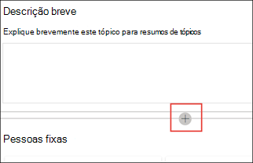

# Trabalhar com tópicos no centro de tópicos (versão prévia)Work with topics in the topic center (Preview)

> [!Note] 
> O conteúdo deste artigo é para a visualização privada do Project Cortex.The content in this article is for Project Cortex Private Preview. [Mais informações sobre o Projeto Cortex](https://aka.ms/projectcortex).[Find out more about Project Cortex](https://aka.ms/projectcortex).

No centro de tópicos, um gerente de conhecimento pode examinar os tópicos que foram extraídos e descobertos nos locais de origem do SharePoint que você especificou e pode confirmá-los ou rejeitá-los.In the topic center, a knowledge manager can review topics that have been mined and discovered in the SharePoint source locations you specified, and can either confirm or reject them. Um gerente de conhecimento também pode criar e publicar novas páginas de tópico, se uma não foi encontrada no tópico Discovery, ou editar as existentes, caso precisem ser atualizadas.A knowledge manager can also create and publish new topic pages if one was not found in topic discovery, or edit existing ones if they need to be updated.

## RequirementsRequirements

Para trabalhar no centro de tópicos, você precisa ter as permissões necessárias.In order to work in the topic center, you need to have the required permissions. Seu administrador pode adicionar você durante [a configuração do gerenciamento de conhecimento](set-up-knowledge-network.md)ou novos usuários podem ser [adicionados posteriormente](give-user-permissions-to-the-topic-center.md).Your admin can add you during [knowledge management setup](set-up-knowledge-network.md), or new users can be [added afterwards](give-user-permissions-to-the-topic-center.md).

Os usuários do centro de tópicos podem receber dois conjuntos de permissões:Topic center users can be given two sets of permissions:

- Criar e editar tópicos: criar novos tópicos ou atualizar conteúdo do tópico, como descrição, documentos e pessoas associadas.Create and edit topics: Create new topics or update topic content such as the description, documents and associated persons.

- Gerenciar tópicos: Use o painel de gerenciamento de tópicos para analisar os tópicos em toda a organização.Manage topics: Use the Topic management dashboard to review topics across the organization. Os usuários podem executar ações como os tópicos confirmar e rejeitar.Users can perform actions such as confirm and reject topics.

## Analisar tópicos sugeridosReview suggested topics

Na home page do centro de tópicos, os tópicos que foram descobertos em seus locais de origem do SharePoint especificados serão listados na guia **sugerida** . Um usuário com permissões para gerenciar tópicos pode revisar os tópicos não confirmados e optar por confirmá-los ou rejeitá-los.On the topic center home page, topics that were discovered in your specified SharePoint source locations will be listed in the **Suggested** tab. A user with permissions to manage topics can review unconfirmed topics and choose to confirm or reject them.

Para revisar um tópico sugerido:To review a suggested topic:

1. Na guia **sugerido** , selecione o tópico para abrir a página de tópico.On the **Suggested** tab, select the topic to open the topic page. 

2. Na página tópico, revise a página de tópico e selecione **Editar** se precisar fazer qualquer alteração na página.On the topic page, review the topic page, and select **Edit** if you need to make any changes to the page.

3. Na home page do centro de conhecimento, para o tópico selecionado, você pode:On the Knowledge Center home page, for the selected topic, you can:

    1. Selecione a opção para confirmar que você deseja manter o tópico.Select the check to confirm that you want to keep the topic.
    
    1. Selecione o **x** se você quiser rejeitar o tópico.Select the **x** if you want to reject the topic.

    Os tópicos confirmados serão removidos da lista não **confirmada** e agora serão exibidos na guia **confirmado** .Confirmed topics will be removed from the **Unconfirmed** list and will now display in the **Confirmed** tab.

    Os tópicos rejeitados serão removidos da lista não **confirmada** e agora serão exibidos na guia **rejeitada ou excluída** .Rejected topics will be removed from the **Unconfirmed** list and will now display in the **Rejected or Excluded** tab.

## Examinar tópicos confirmadosReview confirmed topics

Na home page do centro de tópicos, os tópicos que foram descobertos em seus locais de origem do SharePoint especificados e foram confirmados por um gerente de conhecimento ou crowdsourced confirmados por 2 ou mais pessoas pelo mecanismo de comentários do cartão serão listados na guia **confirmado** . Um usuário com permissões para gerenciar tópicos pode examinar tópicos confirmados e optar por rejeitá-los.On the topic center home page, topics that were discovered in your specified SharePoint source locations and have been confirmed by a knowlege manager or crowdsourced confirmed by 2 or more people through the card feedback mechanism will be listed in the **Confirmed** tab. A user with permissions to manage topics can review confirmed topics and choose to reject them.

Para revisar um tópico confirmado:To review a confirmed topic:

1. Na guia **confirmado** , selecione o tópico para abrir a página de tópico.On the **Confirmed** tab, select the topic to open the topic page. 

2. Na página tópico, revise a página de tópico e selecione **Editar** se precisar fazer qualquer alteração na página.On the topic page, review the topic page, and select **Edit** if you need to make any changes to the page.

3. Você pode rejeitá-lo muitoYou can reject it too

## Analisar tópicos publicadosReview published topics
Os tópicos publicados foram editados de modo que as informações do speific sempre apareçam para as pessoas que confiarão na página.Published topics have been edited so that speific information will always appear to whoever encountrs the page. Tópicos criados manualmente são exibidos aqui.Manually created topics show here.

   
## Criar um novo tópicoCreate a new topic

Um usuário com permissões criar ou editar tópico pode criar um novo tópico, se necessário.A user with create or edit topic permissions can create a new topic if needed. Talvez seja necessário fazer isso se o tópico não foi descoberto por meio de descoberta ou se a tecnologia AI não encontrou evidências suficientes para estabelecer um tópico.You might need to do this if the topic was not discovered through discovery or if the AI technology did not find enough evidence to establish it as a topic.

Para criar um novo tópico:To create a new topic:

1. Na página central de tópicos, selecione **novo** e, em seguida, selecione **página de tópico**.On the topic center page, select **New** , then select **Topic Page**.

    

2. Na página novo tópico, você pode preencher as informações sobre o novo modelo de tópico:On the new topic page, you can fill in the information on the new topic template:

    1. Na seção **nomear este tópico** , digite o nome do novo tópico.In the **Name this topic** section, type the name of the new topic.
    
    1. Na seção **nomes alternativos** , digite nomes ou acrônimos que também são usados para referir-se ao tópico.In the **Alternate names** section, type names or acronyms that are also used to refer to the topic.
    
    1. Na seção **Descrição curta** , digite uma ou duas sentenças descrição do tópico.In the **Short description** section, type a one or two sentence description of the topic. Este texto será usado para o cartão de tópico associado.This text will be used for the associated topic card.
    
    1. Na seção **pessoas** , digite os nomes dos especialistas no assunto do tópico.In the **People** section, type the names of subject matter experts for the topic.
    
    1. Na seção **arquivos e páginas** , selecione **Adicionar** e, na próxima página, você pode selecionar arquivos associados do onedrive ou páginas do SharePoint Online.In the **Files and pages** section, select **Add** and then on the next page you can select associated OneDrive files or SharePoint Online pages.
    
    1. Na seção **sites** , selecione **Adicionar**.In the **Sites** section, select **Add**. No painel  **sites** exibido, selecione os sites associados ao tópico.In the  **Sites** pane that displays, select the sites that are associated to the topic.

    
    
3. Se você precisar adicionar outros componentes à página, como texto, imagens, WebParts, links, etc., selecione o ícone de tela no meio da página para localizar e adicioná-los.If you need to add other components to the page, such as text, images, webparts, links, etc., select the canvas icon in the middle of the page to locate and add them.

    

4. Quando terminar, selecione **publicar** para publicar a página de tópico.When you are done, select **Publish** to publish the topic page. As páginas de tópicos publicadas serão exibidas na guia **páginas** .Published topic pages will display in the **Pages** tab.

> [!Note] 
> A página do novo tópico é formada por Web Parts que são compatíveis com a *rede de conhecimento*.The new topic page is made up of web parts that are *knowledge network aware*. Isso significa que, como o AI coleta mais informações sobre o tópico, as informações nessas Web Parts serão atualizadas com sugestões para tornar a página mais útil para os usuários.This means that as AI gathers more information on the topic, the information in these web parts will be updated with suggestions to make the page more useful to users.

## Editar uma página de tópico existenteEdit an existing topic page

As páginas de tópico existentes podem ser encontradas na página **páginas** .Existing topic pages can be found in the **Pages** page. 

1. Na página central de tópicos, selecione **páginas**.On the Topic Center page, select **Pages**.

2. Na página **páginas** , você verá uma lista de páginas de tópicos.On the **Pages** page, you will see a list of topic pages. Use a caixa de pesquisa para localizar a página de tópico que você deseja atualizar.Use the Search box to find the topic page you want to update. Clique no nome da página de tópico que você deseja editar.Click on the name of the topic page that you want to edit.

3. Na página tópico, selecione **Editar**.On the topic page, select **Edit**.

4. Faça as alterações necessárias para a página.Make the changes you need to the page. Isso inclui atualizações para os seguintes campos:This includes updates to the following fields:

    1. Nomes alternativosAlternate names
    1. DescriçãoDescription
    1. PessoasPeople
    1. Arquivos e páginasFiles and pages
    1. SitesSites
    1. Você também pode adicionar itens estáticos à página, como texto, imagens ou link, selecionando o ícone de tela.You can also add static items to the page—such as text, images, or link—by selecting the canvas icon.

5. Selecione **republicar** para salvar suas alterações.Select **Republish** to save your changes.

<!--## See also-->

