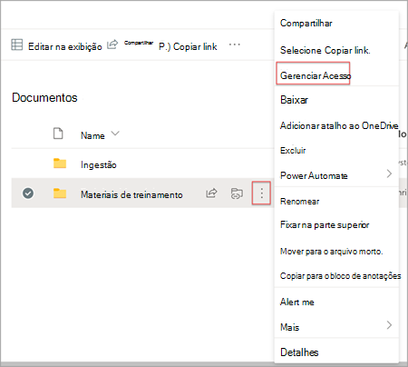
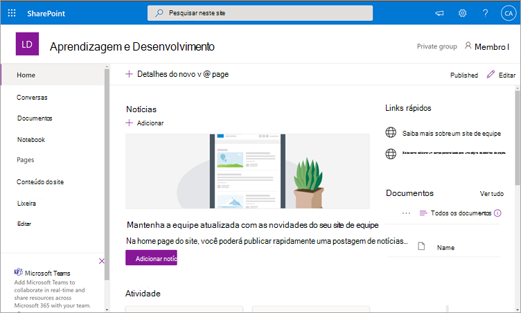
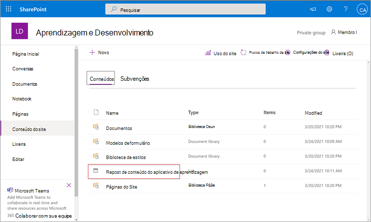
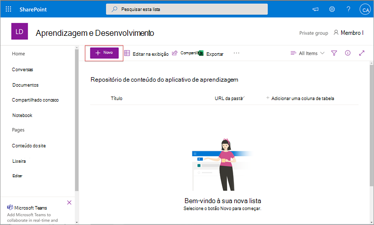
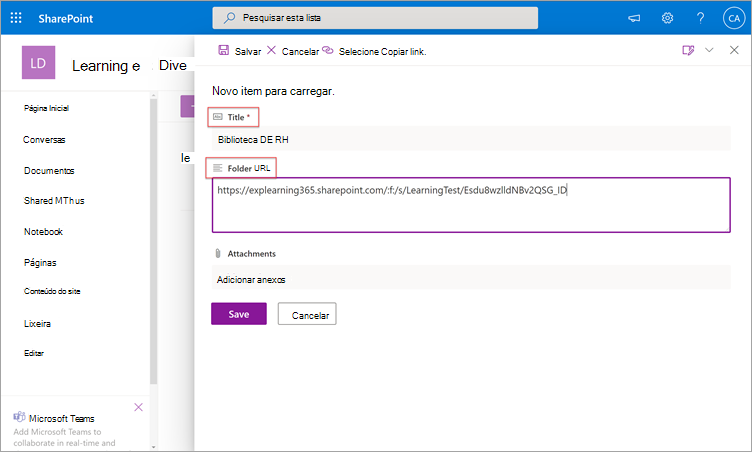
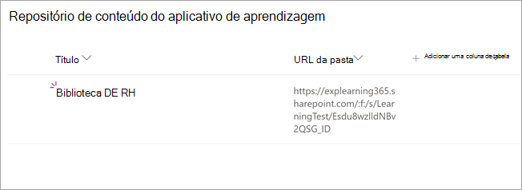
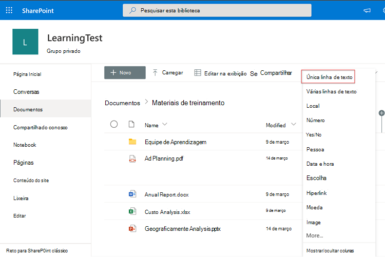
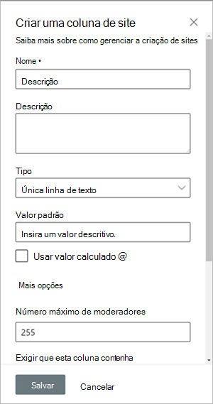
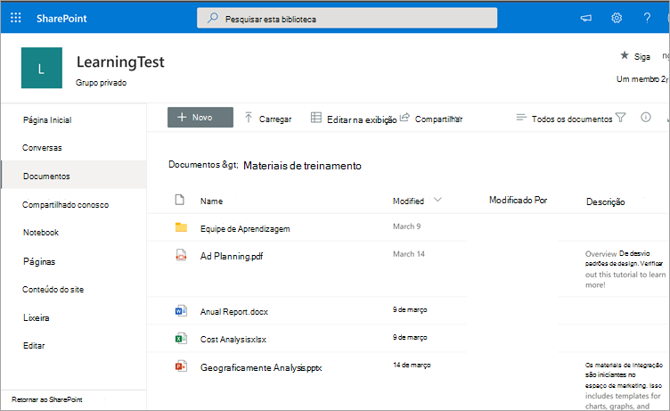
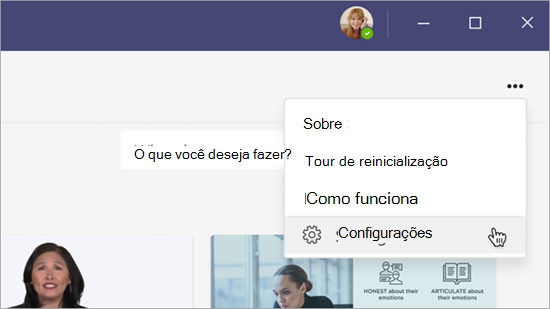

# Em breve: Configure SharePoint como uma fonte de conteúdo de aprendizagem para o Microsoft Viva Learning (Visualização)

> [!NOTE]
> As informações neste artigo se relacionam a um produto de visualização que pode ser substancialmente modificado antes de ser lançado comercialmente. 

Você pode configurar SharePoint como uma fonte de conteúdo de aprendizagem para disponibilizar o conteúdo da sua organização no Viva Learning (Visualização).

## Visão Geral

O administrador de conhecimento (ou administrador global) fornece uma URL de site para onde o Serviço de Aprendizagem pode criar um local centralizado vazio, o Repositório de Conteúdo do Aplicativo de Aprendizagem, na forma de uma lista SharePoint estruturada. Essa lista pode ser usada pela sua organização para abrigar links para pastas SharePoint que contêm conteúdo de aprendizagem. Os administradores são responsáveis por coletar e fazer a curadoria de uma lista de URLs para pastas. Essas pastas só devem incluir conteúdo que pode ser disponibilizado no Viva Learning (Visualização).

O Viva Learning (Visualização) dá suporte aos seguintes tipos de documento:

- Word, PowerPoint, Excel, PDF
- Áudio (.m4a)
- Vídeo (.mov, .mp4, .avi)

Para obter mais informações, [consulte SharePoint limites](/office365/servicedescriptions/sharepoint-online-service-description/sharepoint-online-limits?redirectSourcePath=%252farticle%252fSharePoint-Online-limits-8f34ff47-b749-408b-abc0-b605e1f6d498). 

## Permissões

As URLs da pasta da biblioteca de documentos podem ser coletadas de qualquer SharePoint site na organização. O Viva Learning (Visualização) segue todas as permissões de conteúdo existentes. Portanto, somente o conteúdo para o qual um usuário tem permissão para acessar é pesquisável e visível no Viva Learning (Visualização). Qualquer conteúdo dentro dessas pastas será pesquisável, mas somente o conteúdo para o qual o funcionário individual tem permissões pode ser usado.

A exclusão de conteúdo do repositório da sua organização não é suportada no momento.

Para remover conteúdo não intencionalmente à superfície, siga estas etapas:

1.  Para restringir o acesso à biblioteca de documentos, selecione a opção **Mostrar ações** e selecione **Gerenciar acesso**.
     
     

2.  Exclua o documento original na biblioteca de documentos.

Para obter mais informações, consulte [Sharing and permissions in the SharePoint modern experience](/sharepoint/modern-experience-sharing-permissions). 

## Serviço de Aprendizagem

O Serviço de Aprendizagem usa as URLs de pasta fornecidas para obter metadados de todo o conteúdo armazenado nessas pastas. Dentro de 24 horas após fornecer a URL da pasta no repositório centralizado, os funcionários podem pesquisar e usar o conteúdo da sua organização no Viva Learning (Visualização). Todas as alterações no conteúdo, incluindo metadados e permissões atualizadas, também serão aplicadas no Serviço de Aprendizagem dentro de 24 horas.

## Configurar SharePoint como fonte

Você deve ser um administrador Microsoft 365 global, SharePoint administrador ou administrador de conhecimento para executar essas tarefas.

Para configurar SharePoint como fontes de conteúdo de aprendizagem no Viva Learning (Visualização), siga estas etapas:

1.  Na navegação à esquerda do centro de administração Microsoft 365, acesse **Configurações**  >  **Org.**
 
2.  Na página **Configurações da** Organização, na guia **Serviços,** selecione **Viva Learning (Visualização)**.

     

3.  No painel **Viva Learning (Visualização),** em SharePoint, fornece a URL do site para o site SharePoint onde você deseja que o Viva Learning (Visualização) crie um repositório centralizado.

     

4.  Uma SharePoint é criada automaticamente no site SharePoint fornecido.

     

     Na navegação à esquerda do site SharePoint, selecione Conteúdo do **site**  >  **Aprendendo Repositório de Conteúdo do Aplicativo.** 

      

5. Na página **Repositório de Conteúdo do Aplicativo** de Aprendizagem, preencha a lista de SharePoint com URLs para as pastas de conteúdo de aprendizagem.

   1. Selecione **Novo** para exibir o **painel Novo item.** 

       
 
   2. No painel **Novo item,** no campo **Título,** adicione um nome de diretório de sua escolha. No campo **URL da pasta,** adicione a URL à pasta de conteúdo de aprendizagem. Selecione **Salvar**.

       

   3. A **página Repositório de Conteúdo do Aplicativo** de Aprendizagem é atualizada com o novo conteúdo de aprendizado.

       

> [!NOTE]
> Para permitir um acesso mais amplo ao Repositório de Conteúdo do Aplicativo de Aprendizagem, um link para a lista em breve estará disponível na interface do Viva Learning (Visualização), onde os usuários podem solicitar acesso e, finalmente, ajudar a preencher a lista. Os proprietários de sites e administradores globais serão necessários para conceder acesso à lista. O Access é específico apenas da lista e não se aplica ao site onde a lista está armazenada. Para obter mais informações, consulte Fornecer o conteúdo [da sua própria](#provide-your-own-organizations-content) organização posteriormente neste artigo.

### Curação da biblioteca de documentos da URL da pasta

Os metadados padrão (como data modificada, criada por, nome do documento, tipo de conteúdo e nome da organização) são automaticamente retirados para o Viva Learning (Visualização) pela API do Microsoft Graph.
 
Para melhorar a relevância geral da descoberta e da pesquisa do conteúdo, recomendamos adicionar uma coluna **Descrição.**

Para adicionar uma **coluna Descrição** à página da biblioteca de documentos, siga estas etapas:

1.  Na página **Documentos,** selecione **Adicionar coluna**.

2. Selecione a **opção Mostrar ações** e selecione Linha única de **texto**.

     

3. No painel **Criar uma coluna,** no campo **Nome,** adicione um nome descritivo para a coluna. Selecione **Salvar**.

     
 
4. Na página **Documentos,** na coluna **Descrição,** adicione descrições personalizadas para cada item. Se nenhuma descrição for fornecida, o Viva Learning (Visualização) fornecerá uma mensagem padrão que realça o conteúdo como sendo de sua própria SharePoint biblioteca. 

     
 
### Fornecer o conteúdo de sua própria organização

Os administradores de conhecimento podem acessar o Repositório de Conteúdo de Aplicativos de Aprendizagem da sua organização em SharePoint, onde eles podem fornecer referências a bibliotecas de documentos entre organizações. O conteúdo dentro dessas bibliotecas será então visualizado como conteúdo de aprendizagem no Viva Learning (Visualização).

1. No Viva Learning (Visualização), selecione **Mais opções** (**...**) e selecione **Configurações**.

     
     
2. Em **Configurações**, selecione **Permissões**.

     

3. Selecione **Verificar o acesso** para se conectar à biblioteca centralizada da sua organização.
     
