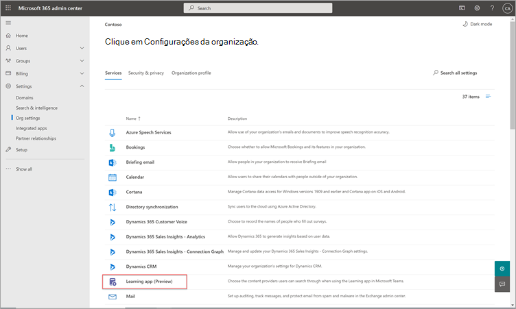

# Em breve: Configure SharePoint como uma fonte de conteúdo de aprendizagem para o Microsoft Viva Learning (Visualização)Coming soon: Configure SharePoint as a learning content source for Microsoft Viva Learning (Preview)

> [!NOTE]
> As informações neste artigo se relacionam a um produto de visualização que pode ser substancialmente modificado antes de ser lançado comercialmente.The information in this article relates to a preview product that may be substantially modified before it's commercially released. 

Você pode configurar SharePoint como uma fonte de conteúdo de aprendizagem para disponibilizar o conteúdo da sua organização no Viva Learning (Visualização).You can configure SharePoint as a learning content source to make your organization's own content available in Viva Learning (Preview).

## Visão GeralOverview

O administrador de conhecimento (ou administrador global) fornece uma URL de site para onde o Serviço de Aprendizagem pode criar um local centralizado vazio, o Repositório de Conteúdo do Aplicativo de Aprendizagem, na forma de uma lista SharePoint estruturada.The knowledge admin (or global administrator) provides a site URL to where the Learning Service can create an empty centralized location—the Learning App Content Repository—in the form of a structured SharePoint list. Essa lista pode ser usada pela sua organização para abrigar links para pastas SharePoint que contêm conteúdo de aprendizagem.This list can be used by your organization to house links to cross-company SharePoint folders that contain learning content. Os administradores são responsáveis por coletar e fazer a curadoria de uma lista de URLs para pastas.Admins are responsible for collecting and curating a list of URLs for folders. Essas pastas só devem incluir conteúdo que pode ser disponibilizado no Viva Learning (Visualização).These folders should only include content that can be made available in Viva Learning (Preview).

O Viva Learning (Visualização) dá suporte aos seguintes tipos de documento:Viva Learning (Preview) supports the following document types:

- Word, PowerPoint, Excel, PDFWord, PowerPoint, Excel, PDF
- Áudio (.m4a)Audio (.m4a)
- Vídeo (.mov, .mp4, .avi)Video (.mov, .mp4, .avi)

Para obter mais informações, [consulte SharePoint limites](/office365/servicedescriptions/sharepoint-online-service-description/sharepoint-online-limits?redirectSourcePath=%252farticle%252fSharePoint-Online-limits-8f34ff47-b749-408b-abc0-b605e1f6d498).For more information, see [SharePoint limits](/office365/servicedescriptions/sharepoint-online-service-description/sharepoint-online-limits?redirectSourcePath=%252farticle%252fSharePoint-Online-limits-8f34ff47-b749-408b-abc0-b605e1f6d498). 

## PermissõesPermissions

As URLs da pasta da biblioteca de documentos podem ser coletadas de qualquer SharePoint site na organização.Document library folder URLs can be collected from any SharePoint site in the organization. O Viva Learning (Visualização) segue todas as permissões de conteúdo existentes.Viva Learning (Preview) follows all existing content permissions. Portanto, somente o conteúdo para o qual um usuário tem permissão para acessar é pesquisável e visível no Viva Learning (Visualização).Therefore, only content for which a user has permission to access is searchable and visible within Viva Learning (Preview). Qualquer conteúdo dentro dessas pastas será pesquisável, mas somente o conteúdo para o qual o funcionário individual tem permissões pode ser usado.Any content within these folders will be searchable, but only content to which the individual employee has permissions can be used.

A exclusão de conteúdo do repositório da sua organização não é suportada no momento.Content deletion from your organization’s repository is not currently supported.

Para remover conteúdo não intencionalmente à superfície, siga estas etapas:To remove unintentionally surfaced content, follow these steps:

1.  Para restringir o acesso à biblioteca de documentos, selecione a opção **Mostrar ações** e selecione **Gerenciar acesso**.To restrict access to the document library, select the **Show actions** option, and then select **Manage access**.
     
     

2.  Exclua o documento original na biblioteca de documentos.Delete the original document within the document library.

Para obter mais informações, consulte [Sharing and permissions in the SharePoint modern experience](/sharepoint/modern-experience-sharing-permissions).For more information, see [Sharing and permissions in the SharePoint modern experience](/sharepoint/modern-experience-sharing-permissions). 

## Serviço de AprendizagemLearning Service

O Serviço de Aprendizagem usa as URLs de pasta fornecidas para obter metadados de todo o conteúdo armazenado nessas pastas.The Learning Service uses the provided folder URLs to get metadata from all content stored in those folders. Dentro de 24 horas após fornecer a URL da pasta no repositório centralizado, os funcionários podem pesquisar e usar o conteúdo da sua organização no Viva Learning (Visualização).Within 24 hours of supplying the folder URL in the centralized repository, employees can search for and use your organization’s content within Viva Learning (Preview). Todas as alterações no conteúdo, incluindo metadados e permissões atualizadas, também serão aplicadas no Serviço de Aprendizagem dentro de 24 horas.All changes to content, including updated metadata and permissions, will also be applied in the Learning Service within 24 hours.

## Configurar SharePoint como fonteConfigure SharePoint as a source

Você deve ser um administrador Microsoft 365 global, SharePoint administrador ou administrador de conhecimento para executar essas tarefas.You must be a Microsoft 365 global administrator, SharePoint administrator, or knowledge admin to perform these tasks.

Para configurar SharePoint como fontes de conteúdo de aprendizagem no Viva Learning (Visualização), siga estas etapas:To configure SharePoint as a learning content sources in for Viva Learning (Preview), follow these steps:

1.  Na navegação à esquerda do centro de administração Microsoft 365, acesse **Configurações**  >  **Org.**In the left navigation of the Microsoft 365 admin center, go to **Settings** > **Org settings**.
 
2.  Na página **Configurações da** Organização, na guia **Serviços,** selecione **Viva Learning (Visualização)**.On the **Org settings** page, on the **Services** tab, select **Viva Learning (Preview)**.

     

3.  No painel **Viva Learning (Visualização),** em SharePoint, fornece a URL do site para o site SharePoint onde você deseja que o Viva Learning (Visualização) crie um repositório centralizado.On the **Viva Learning (Preview)** panel, under SharePoint, provides the site URL to the SharePoint site where you want Viva Learning (Preview) to create a centralized repository.

     

4.  Uma SharePoint é criada automaticamente no site SharePoint fornecido.A SharePoint list is created automatically within the provided SharePoint site.

     

     Na navegação à esquerda do site SharePoint, selecione Conteúdo do **site**  >  **Aprendendo Repositório de Conteúdo do Aplicativo.**In the left navigation of the SharePoint site, select **Site contents** > **Learning App Content Repository**. 

      

5. Na página **Repositório de Conteúdo do Aplicativo** de Aprendizagem, preencha a lista de SharePoint com URLs para as pastas de conteúdo de aprendizagem.On the **Learning App Content Repository** page, populate the SharePoint list with URLs to the learning content folders.

   1. Selecione **Novo** para exibir o **painel Novo item.**Select **New** to view the **New item** panel. 

       
 
   2. No painel **Novo item,** no campo **Título,** adicione um nome de diretório de sua escolha.On the **New item** panel, in the **Title** field, add a directory name of your choice. No campo **URL da pasta,** adicione a URL à pasta de conteúdo de aprendizagem.In the **Folder URL** field, add the URL to the learning content folder. Selecione **Salvar**.Select **Save**.

       

   3. A **página Repositório de Conteúdo do Aplicativo** de Aprendizagem é atualizada com o novo conteúdo de aprendizado.The **Learning App Content Repository** page is updated with the new learning content.

       

> [!NOTE]
> Para permitir um acesso mais amplo ao Repositório de Conteúdo do Aplicativo de Aprendizagem, um link para a lista em breve estará disponível na interface do Viva Learning (Visualização), onde os usuários podem solicitar acesso e, finalmente, ajudar a preencher a lista.To allow for broader access to the Learning App Content Repository, a link to the list soon will be available in the Viva Learning (Preview) interface where users can request access and ultimately help populate the list. Os proprietários de sites e administradores globais serão necessários para conceder acesso à lista.Site owners and global administrators will be required to grant access to the list. O Access é específico apenas da lista e não se aplica ao site onde a lista está armazenada.Access is specific to the list only and does not apply to the site where the list is stored. Para obter mais informações, consulte Fornecer o conteúdo [da sua própria](#provide-your-own-organizations-content) organização posteriormente neste artigo.For more information, see [Provide your own organization's content](#provide-your-own-organizations-content) later in this article.

### Curação da biblioteca de documentos da URL da pastaFolder URL document library curation

Os metadados padrão (como data modificada, criada por, nome do documento, tipo de conteúdo e nome da organização) são automaticamente retirados para o Viva Learning (Visualização) pela API do Microsoft Graph.Default metadata (such as modified date, created by, document name, content type, and organization name) is automatically pulled into Viva Learning (Preview) by the Microsoft Graph API.
 
Para melhorar a relevância geral da descoberta e da pesquisa do conteúdo, recomendamos adicionar uma coluna **Descrição.**To improve overall discovery and search relevance of the content, we recommend adding a **Description** column.

Para adicionar uma **coluna Descrição** à página da biblioteca de documentos, siga estas etapas:To add a **Description** column to the document library page, follow these steps:

1.  Na página **Documentos,** selecione **Adicionar coluna**.On the **Documents** page, select **Add column**.

2. Selecione a **opção Mostrar ações** e selecione Linha única de **texto**.Select the **Show actions** option, and then select **Single line of text**.

     

3. No painel **Criar uma coluna,** no campo **Nome,** adicione um nome descritivo para a coluna.On the **Create a column** panel, in the **Name** field, add a descriptive name for the column. Selecione **Salvar**.Select **Save**.

     
 
4. Na página **Documentos,** na coluna **Descrição,** adicione descrições personalizadas para cada item.On the **Documents** page, in the **Description** column, add custom descriptions for each item. Se nenhuma descrição for fornecida, o Viva Learning (Visualização) fornecerá uma mensagem padrão que realça o conteúdo como sendo de sua própria SharePoint biblioteca.If no description is supplied, Viva Learning (Preview) will provide a default message that highlights the content as being from your own SharePoint library. 

     
 
### Fornecer o conteúdo de sua própria organizaçãoProvide your own organization's content

Os administradores de conhecimento podem acessar o Repositório de Conteúdo de Aplicativos de Aprendizagem da sua organização em SharePoint, onde eles podem fornecer referências a bibliotecas de documentos entre organizações.Knowledge admins can access their organization’s Learning App Content Repository in SharePoint, where they can provide references to cross-organization document libraries. O conteúdo dentro dessas bibliotecas será então visualizado como conteúdo de aprendizagem no Viva Learning (Visualização).Content within these libraries will be then surfaced as learning content in Viva Learning (Preview).

1. No Viva Learning (Visualização), selecione **Mais opções** (**...**) e selecione **Configurações**.In Viva Learning (Preview), select **More options** (**...**), and then select **Settings**.

     
     
2. Em **Configurações**, selecione **Permissões**.Under **Settings**, select **Permissions**.

     

3. Selecione **Verificar o acesso** para se conectar à biblioteca centralizada da sua organização.Select **Check access** to connect to your organization’s centralized library.
     
