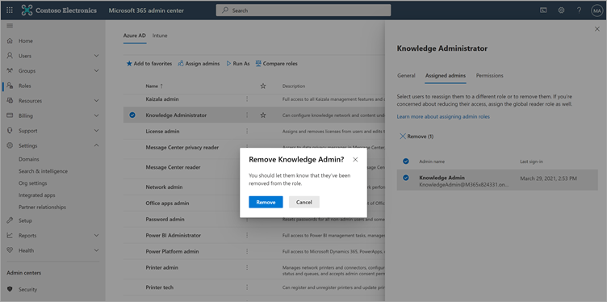

# Configurar fontes de conteúdo de aprendizagem para o Microsoft Viva Learning (Visualização) no Microsoft 365 de administraçãoConfigure learning content sources for Microsoft Viva Learning (Preview) in the Microsoft 365 admin center

> [!NOTE]
> As informações neste artigo se relacionam a um produto de visualização que pode ser substancialmente modificado antes de ser lançado comercialmente.The information in this article relates to a preview product that may be substantially modified before it's commercially released. 

Os administradores do centro de administração do Microsoft 365, por conta própria ou atribuindo a função de administrador de conhecimento a indivíduos selecionados em sua organização, podem gerenciar configurações relacionadas ao Viva Learning (Visualização) e podem configurar as fontes de conteúdo de aprendizagem.The administrators for the Microsoft 365 admin center—either by themselves or by assigning the knowledge admin role to selected individuals in your organization—can manage settings related to Viva Learning (Preview) and can configure the learning content sources.

O administrador seleciona quais outras fontes de conteúdo de aprendizagem (por exemplo, SharePoint ou fontes de provedores de conteúdo de terceiros) estarão disponíveis para os usuários do Viva Learning (Visualização).The administrator selects which other learning content sources (for example, SharePoint or supported third-party content provider sources) will be available to users of Viva Learning (Preview). Em seguida, o administrador configura essas fontes para garantir que o conteúdo está disponível para pesquisa e descoberta e pode ser navegado pelos funcionários que usam o Viva Learning (Visualização).The admin then configures those sources to make sure the content is available for search and discovery and can be browsed by the employees who use Viva Learning (Preview).

> [!NOTE]
>  Os usuários se insinam em aprendizados que não são da Microsoft e do LinkedIn Pro em um navegador ou visualizador incorporado.Users sign in to non-Microsoft and LinkedIn Learning Pro learnings in a browser or embedded viewer. Esse aprendizado configurado está sujeito à licença, privacidade e termos de serviço separados entre sua organização e terceiros, e não aos termos do Viva Learning (Visualização).This configured learning is subject to the separate license, privacy and service terms between your organization and the third party, and not the Viva Learning (Preview) terms. Antes de selecionar esse tipo de aprendizado, verifique se você tem um contrato para sua organização e usuários.Before selecting this type of learning, verify you have an agreement in place for your organization and users.

## Atribuir a função de administrador de conhecimento (Opcional)Assign the knowledge admin role (Optional)

Você deve ser um Microsoft 365 global para executar essas tarefas.You must be a Microsoft 365 global administrator to perform these tasks.

> [!TIP]
> O administrador de conhecimento deve ser moderadamente técnico e ter credenciais de administrador SharePoint existentes, preferencialmente alguém que seja bem versado na parte de educação, aprendizagem, treinamento ou experiência de funcionários da organização.The knowledge admin should be moderately technical and have existing SharePoint admin credentials, preferably someone who is well-versed in the education, learning, training, or employee experience part of the organization.

### Adicionar um administrador de conhecimentoAdd a knowledge admin

Para adicionar um administrador de conhecimento para o Viva Learning (Visualização), siga estas etapas:To add a knowledge admin for Viva Learning (Preview), follow these steps:

1.  Na navegação à esquerda do centro de administração Microsoft 365, vá para **Funções**.In the left navigation of the Microsoft 365 admin center, go to **Roles**.

2.  Na página **Funções,** na guia **Azure AD,** selecione **Administrador de Conhecimento**.On the **Roles** page, on the **Azure AD** tab, select **Knowledge Administrator**.
 
3.  No painel **Administrador de Conhecimento,** selecione **Administradores atribuídos** e selecione **Adicionar**.On the **Knowledge Administrator** panel, select **Assigned admins**, and then select **Add**.

     

3.  No painel **Adicionar administradores,** selecione a pessoa escolhida para a função e selecione **Adicionar**.On the **Add admins** panel, select the person you choose for the role, and then select **Add**.

     

### Remover um administrador de conhecimentoRemove a knowledge admin

Para remover um administrador de conhecimento para o Viva Learning (Visualização), siga estas etapas:To remove a knowledge admin for Viva Learning (Preview), follow these steps:

1.  Na navegação à esquerda do centro de administração Microsoft 365, vá para **Funções**.In the left navigation of the Microsoft 365 admin center, go to **Roles**.

2.  Na página **Funções,** na guia **Azure AD** e selecione **Administrador de Conhecimento**.On the **Roles** page, on the **Azure AD** tab, and then select **Knowledge Administrator**.
 
3.  No painel **Administrador de** Conhecimento, na guia Administradores **Atribuídos,** selecione **Remover** e selecione a pessoa que você deseja remover da função.On the **Knowledge Administrator** panel, on the **Assigned Admins** tab, select **Remove**, and then select the person you want to remove from the role. Para confirmar, selecione **Remover**.To confirm, select **Remove**.

     

## Configurar configurações para as fontes de conteúdo de aprendizagemConfigure settings for the learning content sources

Você deve ser um administrador Microsoft 365 global ou administrador de conhecimento para executar essas tarefas.You must be a Microsoft 365 global administrator or knowledge admin to perform these tasks.

Para definir configurações para aprender fontes de conteúdo no Viva Learning, siga estas etapas:To configure settings for learning content sources in Viva Learning, follow these steps:

1.  Na navegação à esquerda do centro de administração Microsoft 365, acesse **Configurações**  >  **Org.**In the left navigation of the Microsoft 365 admin center, go to **Settings** > **Org settings**.

2.  Na página **Configurações da** Organização, na guia **Serviços,** selecione **Viva Learning (Visualização)**.On the **Org settings** page, on the **Services** tab, select **Viva Learning (Preview)**.

     

3.  No painel **Viva Aprendizagem (Visualização),** selecione as fontes de conteúdo de aprendizagem que você deseja configurar para a organização e selecione **Salvar**.On the **Viva Learning (Preview)** panel, select the learning content sources you want to configure for the organization, and then select **Save**.

     

Entre todas as fontes de aprendizado existentes, algumas serão habilitadas por padrão.Among all the learning sources that exist, some will be enabled by default. Essas fontes de aprendizado incluem:These learning sources include:

- LinkedIn Learning (conteúdo gratuito)LinkedIn Learning (free content)
- Microsoft LearnMicrosoft Learn
- Microsoft 365 TreinamentoMicrosoft 365 Training

> [!NOTE]
> O conteúdo gratuito do LinkedIn é fornecido aos usuários sob as políticas de privacidade e o contrato de usuário do LinkedIn.LinkedIn free content is provided to users under the LinkedIn privacy policies and user agreement. O LinkedIn receberá o endereço IP do usuário, todos os cookies definidos anteriormente pelo LinkedIn e definirá um novo cookie para controlar o uso de conteúdo gratuito.LinkedIn will receive the user’s IP address, any cookies previously set by LinkedIn, and will set a new cookie to track use of free content. Os usuários não precisam entrar no LinkedIn para receber conteúdo gratuito.Users are not required to sign in with LinkedIn to receive free content.  
Para conteúdo premium do LinkedIn, sua organização precisa de uma assinatura para sua equipe acessar esse conteúdo.For LinkedIn premium content, your organization needs a subscription for your team to access that content. Os usuários precisarão entrar no LinkedIn para acessar esse aprendizado, que é fornecido nos termos dos termos da sua organização e dos termos do usuário com o LinkedIn.Users will need to sign into LinkedIn to access that learning, which is provided under the terms of your organization’s and user terms with LinkedIn.   Para conteúdo que não seja da Microsoft (exceto conteúdo gratuito do LinkedIn), verifique se sua organização tem uma assinatura para que os usuários acessem esse conteúdo usando uma conta de trabalho antes de conectá-lo ao Viva Learning (Visualização).For non-Microsoft content (except free LinkedIn content), ensure your organization has a subscription for your users to access that content using a work account before connecting it to Viva Learning (Preview). As assinaturas pessoais dos usuários para provedores de aprendizado que não sejam da Microsoft não serão integradas ao Viva Learning (Visualização).Users’ personal subscriptions to non-Microsoft learning providers will not be integrated with Viva Learning (Preview). Os usuários se insinam em aprendizados que não são da Microsoft e do LinkedIn Pro em um navegador ou visualizador incorporado.Users sign in to non-Microsoft and LinkedIn Learning Pro learnings in a browser or embedded viewer. Se os usuários navegarem para o conteúdo em que não têm uma assinatura organizacional, eles poderão ver uma página de provedor onde podem se inscrever para uma assinatura individual.If users navigate to content where they do not have an organizational subscription, they may see a provider page where they could sign up for an individual subscription. Todo o aprendizado que não é da Microsoft é fornecido nos termos do provedor não Microsoft e não como parte do Viva Learning.All non-Microsoft learning is provided under the non-Microsoft provider’s terms and not as part of Viva Learning. 

Para habilitar ou desabilitar uma fonte de conteúdo de aprendizagem, selecione a caixa de seleção ao lado da fonte.To enable or disable a learning content source, select the check box next to the source. Se uma fonte estiver habilitada, uma marca de seleção ficará visível.If a source is enabled, a check mark will be visible.

## Provedores de conteúdo de terceirosThird-party content providers 

O conjunto de provedores de aprendizagem conectados disponíveis pode mudar a qualquer momento.The set of available connected learning providers might change at any time. Mais provedores ingressarão à medida que o programa cresce.More providers will join as the program grows. Os provedores disponíveis também podem optar por descontinuar sua conexão com o Viva Learning (Visualização).Available providers might also choose to discontinue their connection with Viva Learning (Preview).

### Skillsoft como fonte de conteúdoSkillsoft as a content source  

Para o Viva Learning (Visualização), os usuários que têm a Skillsoft habilitada e optam por exibir o conteúdo da Skillsoft chegarão em uma página do Percipio que pede a eles para inserir o nome do site percipio da sua organização.For Viva Learning (Preview), users who have Skillsoft enabled and choose to view Skillsoft content will land on a Percipio page that asks them to input your organization's Percipio site name. Depois que os usuários inserirem o nome do site da sua organização, eles serão direcionados para a página para entrar no site do Percipio da sua organização.After users input your organization's site name, they will be directed to page to sign in to your organization's Percipio site. Os usuários entrarão usando suas credenciais existentes e verão o conteúdo selecionado originalmente.Users will sign in by using their existing credentials and see the content they originally selected. Os usuários serão solicitados a inserir o nome do site do Percipio apenas uma vez, até que o cache do navegador seja limpo.Users will be asked to input the Percipio site name only once, until their browser cache is cleared. Para simplificar essa experiência para seus usuários, recomendamos incluir seu nome de site do Percipio em comunicações internas que você envia sobre o Viva Learning (Visualização).To streamline this experience for your users, we recommend including your Percipio site name in internal communications you send about Viva Learning (Preview).

Essa é uma experiência temporária para visualização, e estamos trabalhando com a Skillsoft para habilitar a integração específica do locatário para disponibilidade geral, que ignorará a etapa que exige que os usuários forneçam o nome de site do Percipio da sua organização.This is intended to be a temporary experience for preview, and we are working with Skillsoft to enable tenant-specific integration for general availability, which will bypass the step that requires users to provide your organization's Percipio site name. 

### Detalhes sobre o substrato da MicrosoftDetails on Microsoft substrate  

Para dados que você copia para o Viva Learning (Visualização) de um serviço não Microsoft (provedor de aprendizagem ou sistema de gerenciamento de aprendizagem), você não é capaz de extrair, corrigir ou excluir diretamente esses dados no Viva Learning (Visualização).For data that you copy to Viva Learning (Preview) from a non-Microsoft service (learning provider or learning management system), you are not able to directly extract, correct, or delete that data in Viva Learning (Preview). Atualizemos os dados que você importa de provedores que não são da Microsoft prontamente para refletir alterações e exclusões nos dados de origem que não são da Microsoft.We refresh the data you import from non-Microsoft providers promptly to reflect changes and deletions in the non-Microsoft source data.

Você precisa trabalhar com o fornecedor do serviço não Microsoft para acessar, corrigir, excluir ou extrair dados sob os termos de licença, serviço ou privacidade do serviço que não é da Microsoft.You need to work with the supplier of the non-Microsoft service to access, correct, delete or extract data under the license, service, or privacy terms of the non-Microsoft service. As alterações feitas lá serão refletidas nos dados processados para seu uso no Viva Learning (Visualização) após a conclusão dos ciclos de atualização de dados do serviço não Microsoft e do Viva Learning (Visualização).The changes made there will be reflected in the data processed for your use in Viva Learning (Preview) upon completion of the data update cycles of the non-Microsoft service and Viva Learning (Preview). Se você desativar a conexão entre o Viva Learning (Visualização) e um serviço que não seja da Microsoft, todos os dados importados anteriormente desse serviço serão excluídos.If you turn off the connection between Viva Learning (Preview) and a non-Microsoft service, all data you had previously imported from that service will be deleted. 

## Próxima etapaNext step

[Configurar SharePoint como uma fonte de conteúdo de aprendizagem para o Microsoft Viva Learning (Visualização)Configure SharePoint as a learning content source for Microsoft Viva Learning (Preview)](configure-sharepoint-content-source.md)