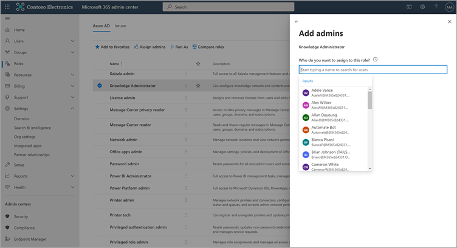

# Configurar fontes de conteúdo de aprendizagem para o Microsoft Viva Learning (Visualização) no Microsoft 365 de administração

> [!NOTE]
> As informações neste artigo se relacionam a um produto de visualização que pode ser substancialmente modificado antes de ser lançado comercialmente. 

Os administradores do centro de administração do Microsoft 365, por conta própria ou atribuindo a função de administrador de conhecimento a indivíduos selecionados em sua organização, podem gerenciar configurações relacionadas ao Viva Learning (Visualização) e podem configurar as fontes de conteúdo de aprendizagem.

O administrador seleciona quais outras fontes de conteúdo de aprendizagem (por exemplo, SharePoint ou fontes de provedores de conteúdo de terceiros) estarão disponíveis para os usuários do Viva Learning (Visualização). Em seguida, o administrador configura essas fontes para garantir que o conteúdo está disponível para pesquisa e descoberta e pode ser navegado pelos funcionários que usam o Viva Learning (Visualização).

> [!NOTE]
>  Os usuários se insinam em aprendizados que não são da Microsoft e do LinkedIn Pro em um navegador ou visualizador incorporado. Esse aprendizado configurado está sujeito à licença, privacidade e termos de serviço separados entre sua organização e terceiros, e não aos termos do Viva Learning (Visualização). Antes de selecionar esse tipo de aprendizado, verifique se você tem um contrato para sua organização e usuários.

## Atribuir a função de administrador de conhecimento (Opcional)

Você deve ser um Microsoft 365 global para executar essas tarefas.

> [!TIP]
> O administrador de conhecimento deve ser moderadamente técnico e ter credenciais de administrador SharePoint existentes, preferencialmente alguém que seja bem versado na parte de educação, aprendizagem, treinamento ou experiência de funcionários da organização.

### Adicionar um administrador de conhecimento

Para adicionar um administrador de conhecimento para o Viva Learning (Visualização), siga estas etapas:

1.  Na navegação à esquerda do centro de administração Microsoft 365, vá para **Funções**.

2.  Na página **Funções,** na guia **Azure AD,** selecione **Administrador de Conhecimento**.
 
3.  No painel **Administrador de Conhecimento,** selecione **Administradores atribuídos** e selecione **Adicionar**.

     

3.  No painel **Adicionar administradores,** selecione a pessoa escolhida para a função e selecione **Adicionar**.

     

### Remover um administrador de conhecimento

Para remover um administrador de conhecimento para o Viva Learning (Visualização), siga estas etapas:

1.  Na navegação à esquerda do centro de administração Microsoft 365, vá para **Funções**.

2.  Na página **Funções,** na guia **Azure AD** e selecione **Administrador de Conhecimento**.
 
3.  No painel **Administrador de** Conhecimento, na guia Administradores **Atribuídos,** selecione **Remover** e selecione a pessoa que você deseja remover da função. Para confirmar, selecione **Remover**.

     

## Configurar configurações para as fontes de conteúdo de aprendizagem

Você deve ser um administrador Microsoft 365 global ou administrador de conhecimento para executar essas tarefas.

Para definir configurações para aprender fontes de conteúdo no Viva Learning, siga estas etapas:

1.  Na navegação à esquerda do centro de administração Microsoft 365, acesse **Configurações**  >  **Org.**

2.  Na página **Configurações da** Organização, na guia **Serviços,** selecione **Viva Learning (Visualização)**.

     

3.  No painel **Viva Aprendizagem (Visualização),** selecione as fontes de conteúdo de aprendizagem que você deseja configurar para a organização e selecione **Salvar**.

     

Entre todas as fontes de aprendizado existentes, algumas serão habilitadas por padrão. Essas fontes de aprendizado incluem:

- LinkedIn Learning (conteúdo gratuito)
- Microsoft Learn
- Microsoft 365 Treinamento

> [!NOTE]
> O conteúdo gratuito do LinkedIn é fornecido aos usuários sob as políticas de privacidade e o contrato de usuário do LinkedIn. O LinkedIn receberá o endereço IP do usuário, todos os cookies definidos anteriormente pelo LinkedIn e definirá um novo cookie para controlar o uso de conteúdo gratuito. Os usuários não precisam entrar no LinkedIn para receber conteúdo gratuito.  
Para conteúdo premium do LinkedIn, sua organização precisa de uma assinatura para sua equipe acessar esse conteúdo. Os usuários precisarão entrar no LinkedIn para acessar esse aprendizado, que é fornecido nos termos dos termos da sua organização e dos termos do usuário com o LinkedIn.   Para conteúdo que não seja da Microsoft (exceto conteúdo gratuito do LinkedIn), verifique se sua organização tem uma assinatura para que os usuários acessem esse conteúdo usando uma conta de trabalho antes de conectá-lo ao Viva Learning (Visualização). As assinaturas pessoais dos usuários para provedores de aprendizado que não sejam da Microsoft não serão integradas ao Viva Learning (Visualização). Os usuários se insinam em aprendizados que não são da Microsoft e do LinkedIn Pro em um navegador ou visualizador incorporado. Se os usuários navegarem para o conteúdo em que não têm uma assinatura organizacional, eles poderão ver uma página de provedor onde podem se inscrever para uma assinatura individual. Todo o aprendizado que não é da Microsoft é fornecido nos termos do provedor não Microsoft e não como parte do Viva Learning. 

Para habilitar ou desabilitar uma fonte de conteúdo de aprendizagem, selecione a caixa de seleção ao lado da fonte. Se uma fonte estiver habilitada, uma marca de seleção ficará visível.

## Provedores de conteúdo de terceiros 

O conjunto de provedores de aprendizagem conectados disponíveis pode mudar a qualquer momento. Mais provedores ingressarão à medida que o programa cresce. Os provedores disponíveis também podem optar por descontinuar sua conexão com o Viva Learning (Visualização).

### Skillsoft como fonte de conteúdo  

Para o Viva Learning (Visualização), os usuários que têm a Skillsoft habilitada e optam por exibir o conteúdo da Skillsoft chegarão em uma página do Percipio que pede a eles para inserir o nome do site percipio da sua organização. Depois que os usuários inserirem o nome do site da sua organização, eles serão direcionados para a página para entrar no site do Percipio da sua organização. Os usuários entrarão usando suas credenciais existentes e verão o conteúdo selecionado originalmente. Os usuários serão solicitados a inserir o nome do site do Percipio apenas uma vez, até que o cache do navegador seja limpo. Para simplificar essa experiência para seus usuários, recomendamos incluir seu nome de site do Percipio em comunicações internas que você envia sobre o Viva Learning (Visualização).

Essa é uma experiência temporária para visualização, e estamos trabalhando com a Skillsoft para habilitar a integração específica do locatário para disponibilidade geral, que ignorará a etapa que exige que os usuários forneçam o nome de site do Percipio da sua organização. 

### Detalhes sobre o substrato da Microsoft  

Para dados que você copia para o Viva Learning (Visualização) de um serviço não Microsoft (provedor de aprendizagem ou sistema de gerenciamento de aprendizagem), você não é capaz de extrair, corrigir ou excluir diretamente esses dados no Viva Learning (Visualização). Atualizemos os dados que você importa de provedores que não são da Microsoft prontamente para refletir alterações e exclusões nos dados de origem que não são da Microsoft.

Você precisa trabalhar com o fornecedor do serviço não Microsoft para acessar, corrigir, excluir ou extrair dados sob os termos de licença, serviço ou privacidade do serviço que não é da Microsoft. As alterações feitas lá serão refletidas nos dados processados para seu uso no Viva Learning (Visualização) após a conclusão dos ciclos de atualização de dados do serviço não Microsoft e do Viva Learning (Visualização). Se você desativar a conexão entre o Viva Learning (Visualização) e um serviço que não seja da Microsoft, todos os dados importados anteriormente desse serviço serão excluídos. 

## Próxima etapa

[Configurar SharePoint como uma fonte de conteúdo de aprendizagem para o Microsoft Viva Learning (Visualização)](configure-sharepoint-content-source.md)