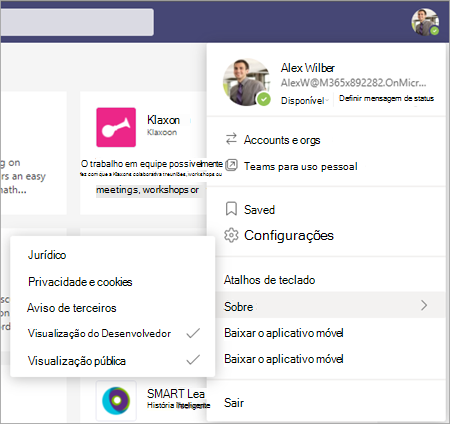
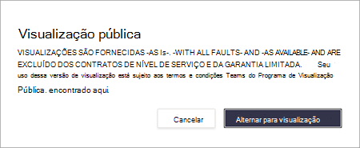
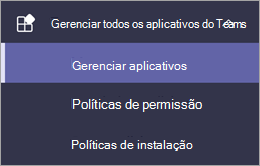
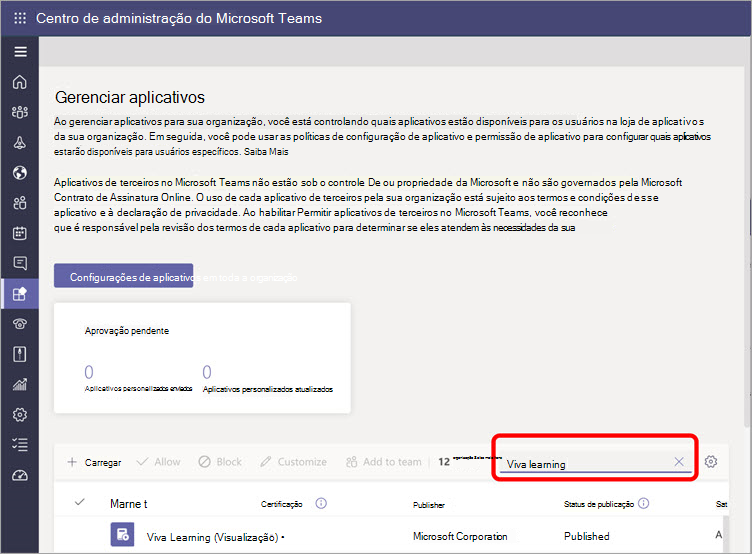
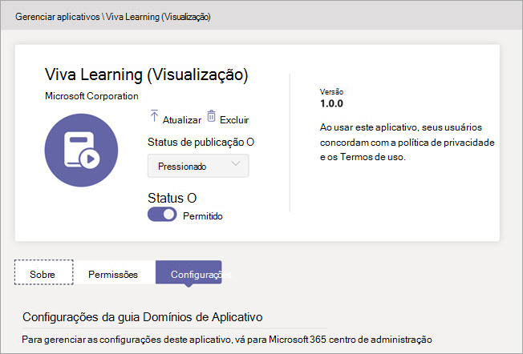
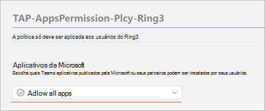

# Configurar o Microsoft Viva Learning (Visualização) no Teams de administraçãoSet up Microsoft Viva Learning (Preview) in the Teams admin center

> [!NOTE]
> As informações neste artigo se relacionam a um produto de visualização que pode ser substancialmente modificado antes de ser lançado comercialmente.The information in this article relates to a preview product that may be substantially modified before it's commercially released. 

O Teams administrador precisa executar determinadas etapas para habilitar o Viva Learning (Visualização) para seus usuários no locatário.The Teams administrator needs to perform certain steps to enable Viva Learning (Preview) for their users in the tenant. Essas etapas variam de acordo com a forma como o locatário está habilitado: [*Visualização Pública*](set-up-teams-admin-center.md#public-preview-tenants) ou [ *Visualização Privada* (ou Beta).](set-up-teams-admin-center.md#private-preview-tenants)These steps vary based on how the tenant is enabled:  [*Public Preview*](set-up-teams-admin-center.md#public-preview-tenants) or [*Private Preview* (or Beta)](set-up-teams-admin-center.md#private-preview-tenants).

## Locatários de Visualização PúblicaPublic Preview tenants

### Etapas de administrador para locatários de Visualização PúblicaAdministrator steps for Public Preview tenants

Como o Viva Learning (Visualização) ainda não está disponível geralmente, determinadas etapas são necessárias para habilitar os recursos e definir permissões para usuários ou grupos específicos.Because the Viva Learning (Preview) is not yet generally available, certain steps are required to enable the features and set permissions for specific users or groups. 

1. Habilitar recursos de Visualização Pública para usuários do Viva Learning (Visualização).Enable Public Preview features for Viva Learning (Preview) users.

    a.a. Modifique Teams política de atualização para habilitar recursos de Visualização Pública.Modify Teams update policy to enable Public Preview features. Consulte [Microsoft Teams Visualização Pública](/microsoftteams/public-preview-doc-updates).See [Microsoft Teams Public Preview](/microsoftteams/public-preview-doc-updates).

    b.b. Habilita a política de atualização para usuários ou grupos que realizarão testes do Viva Learning (Visualização).Enable the update policy for users or groups who will perform Viva Learning (Preview) testing. Consulte [Atribuir políticas a usuários e grupos](/microsoftteams/assign-policies-users-and-groups).See [Assign policies to users and groups](/microsoftteams/assign-policies-users-and-groups).

2. Modifique a política de permissão do aplicativo para usuários do Viva Learning (Visualização).Modify the app permission policy for Viva Learning (Preview) users.

    a.a. A menos que ele faça parte da política global, permita que todos os aplicativos da Microsoft na política de permissão do aplicativo.Unless it's currently part of the global policy, allow all Microsoft apps in the app permission policy. Consulte [Gerenciar políticas de permissão do aplicativo em Microsoft Teams](/microsoftteams/teams-app-permission-policies).See [Manage app permission policies in Microsoft Teams](/microsoftteams/teams-app-permission-policies). 

    b.b. Habilita a política de permissão do aplicativo para usuários ou grupos que realizarão testes do Viva Learning (Visualização).Enable the app permission policy for users or groups who will perform Viva Learning (Preview) testing. Consulte [Atribuir políticas a usuários e grupos](/microsoftteams/assign-policies-users-and-groups).See [Assign policies to users and groups](/microsoftteams/assign-policies-users-and-groups).

3.  Notifique os usuários que testarão o Viva Learning (Visualização) para alternar seu cliente de com build para [Visualização Pública para Teams](set-up-teams-admin-center.md#user-steps-for-public-preview-tenants).Notify users who will test Viva Learning (Preview) to [switch their build client to Public Preview for Teams](set-up-teams-admin-center.md#user-steps-for-public-preview-tenants).

> [!IMPORTANT]
> Para locatários de Visualização Pública, o Viva  Learning (Visualização) não será exibido em aplicativos gerenciados no Teams de administração até o lançamento final do produto.For Public Preview tenants, Viva Learning (Preview) will not be displayed in **Managed apps** in the Teams admin center until final product release. No entanto, os usuários habilitados para Visualização Pública podem encontrar o Viva Learning (Visualização) no Teams de aplicativos e usá-lo, depois que as políticas e permissões corretas foram configuradas.However, enabled Public Preview users can find Viva Learning (Preview) in the Teams app store and use it, once the correct policies and permissions have been set up.

### Etapas do usuário para locatários de Visualização PúblicaUser steps for Public Preview tenants

Os usuários que foram habilitados para testes de Visualização Pública  — habilitando as políticas descritas anteriormente [—](set-up-teams-admin-center.md#administrator-steps-for-public-preview-tenants) precisam alternar para Visualização Pública em seu cliente Teams público.Users who have been enabled for Public Preview testing — by enabling the [policies previously described](set-up-teams-admin-center.md#administrator-steps-for-public-preview-tenants) — need to [switch to Public Preview](/microsoftteams/public-preview-doc-updates#enable-public-preview) in their Teams client.

1. Os usuários devem selecionar suas imagens de perfil > **Sobre**  >  **Visualização Pública.**Users must select their profile image > **About** > **Public Preview**.
   
    
    
2. Os usuários devem aceitar os termos e condições de Visualização Pública.Users must accept the Public Preview terms and conditions.

    
 
3. Os usuários agora podem encontrar o Viva Learning (Visualização) no Teams app store e começar a usá-lo.Users can now find Viva Learning (Preview) in the Teams app store and start using it.

## Locatários de Visualização PrivadaPrivate Preview tenants

### Etapas de administrador para locatários de Visualização Privada (ou Beta)Administrator steps for Private Preview (or Beta) tenants

Para locatários de Visualização Privada, não há políticas adicionais que precisam ser habilitadas.For Private Preview tenants, there are no additional policies that need to be enabled. No entanto, o Viva Learning (Visualização) deve ser disponibilizado para os usuários em sua organização.However, Viva Learning (Preview) must be made available for users in your organization.

1. Na navegação à esquerda do centro de administração Teams, acesse **Teams**  >  **aplicativos Gerenciar aplicativos**.In the left navigation of the Teams admin center, go to **Teams apps** > **Manage apps**.

   

2. Na página **Gerenciar aplicativos,** na caixa de pesquisa, digite *Viva Learning* e selecione Viva **Learning (Visualização).**On the **Manage apps** page, in the search box, type *Viva Learning*, and then select **Viva Learning (Preview)**.

   

3. Na página **Viva Aprendizagem (Visualização),** em **Status,** selecione **Permitido** ativar o Viva Learning (Visualização).On the **Viva Learning (Preview)** page, under **Status**, select **Allowed** to turn on Viva Learning (Preview).

   

<!---
The Teams admin installs Viva Learning (Preview) and applies permission policies through the Teams admin center.

1. For Viva Learning (Preview), you must first set the Update policy in Teams. For more information, see [Microsoft Teams Public Preview](/MicrosoftTeams/public-preview-doc-updates).

    1. Sign in to the Teams admin center.

    2. Select **Teams** > **Update policies**.

    3. Select **Add**. 

    4. Name the update policy, add a policy, and turn on **Show preview features**.

2. The admin must notify users of the policy update so that they move their build into the Public Preview for Teams. 

    1. Users must select their profile image > **About** > **Public Preview**.
   
        
    
    2. Users must accept the **Public preview** terms and conditions.

        
 
3. For organizations that have restrictive policies and need to enable Viva Learning (Preview), follow the process in the next section.

## Manage settings for Viva Learning (Preview)

You must be an administrator in the Teams admin center to perform these tasks.

To make Viva Learning (Preview) available for users in your organization, follow these steps:

1. In the left navigation of the Teams admin center, go to **Teams apps** > **Manage apps**.

   

2. On the **Manage apps** page, in the search box, type *Viva learning*, and then select **Viva Learning (Preview)**.

   

3. On the **Viva Learning (Preview)** page:

   1. Under **Status**, select **Allowed** to turn on Viva Learning (Preview).

   2. On the **Settings** tab, under **App settings**, go to the Microsoft 365 admin center to [configure learning content sources](content-sources-365-admin-center.md).

   

4. After **Manage app** settings, go to **Permission policies** and **Setup policies** to grant permission to employees who should have access to Viva Learning (Preview) as part of your organization's participation in the preview.

> [!NOTE]
>  If your organization is in Ring 4.0 as part of Teams TAP100 program, you might need to enable approved users in Ring 3.0 to access Viva Learning (Preview).   As part of the preview, Viva Learning (Preview) is released in Ring 3.0. If your organization is in Ring 4.0, you won’t see Viva Learning (Preview) on the **Manage apps** page. To test the app, you need to create a custom apps permission policy, set it to **Allow all apps**, and assign it to Ring 3.0 approved users.      

--->

## Próxima etapaNext step

[Configurar fontes de conteúdo de aprendizagem para o Viva Learning (Visualização) no Microsoft 365 de administraçãoConfigure learning content sources for Viva Learning (Preview) in the Microsoft 365 admin center](content-sources-365-admin-center.md)
