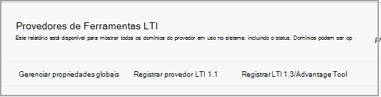

# Usar Microsoft Teams classes com quadro-pretoUse Microsoft Teams classes with Blackboard

> [!IMPORTANT]
> Algumas informações estão relacionadas a produtos pré-lançados que podem ser substancialmente modificados antes de seu lançamento comercial.Some information relates to prereleased product which may be substantially modified before it's commercially released. A Microsoft não faz garantias, expressas ou implícitas, quanto às informações fornecidas aqui.Microsoft makes no warranties, express or implied, with respect to the information provided here.

Microsoft Teams é um aplicativo de interoperabilidade de ferramentas (LTI) do Learning que ajuda educadores e alunos a navegar facilmente entre seu Learning Management System (LMS) e Teams.Microsoft Teams classes is a Learning Tools Interoperability (LTI) app that helps educators and students easily navigate between their Learning Management System (LMS) and Teams. Os usuários podem acessar suas equipes de classe associadas ao curso diretamente de dentro do LMS.Users can access their class teams associated with their course directly from within their LMS.

## Aprovar o aplicativo no locatário Microsoft Azure locatárioApprove the app in the Microsoft Azure tenant

As tarefas a seguir são concluídas pelo administrador Microsoft Office 365 e o administrador Learn Ultra do Quadro Preto.The following tasks are completed by the Microsoft Office 365 admin and the Blackboard Learn Ultra admin.

Antes de gerenciar Microsoft Office 365 integração no Blackboard Learn Ultra, o administrador do Microsoft Office 365 deve aprovar o MSFT Teams de quadro preto para o aplicativo **Learn Ultra Azure** para o locatário Microsoft Azure da instituição.Before managing the integration within Blackboard Learn Ultra, the Microsoft Office 365 admin must approve the Blackboard **MSFT Teams for Learn Ultra Azure** app for the institution’s Microsoft Azure tenant.

1. Encontre sua ID do Locatário da Microsoft.Find your Microsoft Tenant ID. Veja [como encontrar o locatário](/azure/active-directory/fundamentals/active-directory-how-to-find-tenant).See [how to find the tenant](/azure/active-directory/fundamentals/active-directory-how-to-find-tenant).

2. Redirecionar o Ponto de Extremidade de Consentimento do Administrador da Plataforma de Identidade da Microsoft de acordo com o exemplo a seguir:Redirect the Microsoft Identity Platform Admin Consent Endpoint according to the following example:

   `https://login.microsoftonline.com/{tenant}/adminconsent?client_id=2d94989f-457a-47c1-a637-e75acdb11568`

   > [!NOTE]
   > Substitua {tenant} pela ID de locatário da Microsoft da sua organização.Replace {tenant} with your organization’s Microsoft tenant ID.

## Registrar os aplicativos de integraçãoRegister the integration apps

Como administrador do Blackboard Learn Ultra, você precisará registrar 2 aplicativos de integração LTI 1.3 em seu ambiente de teste:As a Blackboard Learn Ultra admin, you'll need to register 2 LTI 1.3 integration apps within your Test environment:

- A integração de Classe de Aprendizado de Quadro Teams para dar suporte à sincronização de lista de escalasThe Blackboard Learn Class Teams integration to support the roster sync

- O Microsoft Teams lti da equipe de classeThe Microsoft Teams class team LTI app

1. Anote as seguintes IDs de cliente LTI para ambos os Aplicativos:Make a note of the following LTI Client IDs for both Apps:

    - Quadro-preto - f1561daa-1b21-4693-ba90-6c55f1a0eb41Blackboard - f1561daa-1b21-4693-ba90-6c55f1a0eb41

    - Microsoft - 027328b7-c2e3-4c9e-aaa1-07802dae6c89Microsoft - 027328b7-c2e3-4c9e-aaa1-07802dae6c89

2. Acesse o Painel de Administração e, em **Integrações,** localize os Provedores de Ferramentas LTI.Access the Admin Panel, and under **Integrations**, locate the LTI Tool Providers.

   

3. Selecione **Registrar LTI1.3/Advantage Tool**.Select **Register LTI1.3/Advantage Tool**.

4. Insira o primeiro das IDs do Cliente fornecidas (quadro-negro ou Microsoft) e selecione **Enviar**.Enter the first of the Client IDs provided (either Blackboard or Microsoft), and select **Submit**.

   

5. Revise as configurações pré-preenchidas e verifique se o status da ferramenta está marcado como aprovado.Review the pre-populated settings and ensure that the tool status is marked as approved.

6. Role até a parte inferior e selecione **Enviar**.Scroll to the bottom, and then select **Submit**.

7. Repita as etapas anteriores para registrar o segundo dos aplicativos LTI em seu ambiente.Repeat the previous steps to register the second of the LTI apps within your environment.

## Configurar o aplicativo REST e o compartilhamento de recursos de origem cruzadaSet up the REST Application and Cross Origin Resource Sharing

O administrador Learn Ultra do Quadro Preto também precisará configurar o Aplicativo REST e a configuração de Compartilhamento de Recursos de Origem Cruzada.The Blackboard Learn Ultra admin will also need to configure the REST Application and the Cross Origin Resource Sharing configuration.

Conclua o seguinte para configurar o aplicativo RESTComplete the following to set up the REST Application

1. Acesse a seção Aprender Ferramentas de Administração e selecione **Integrações da API REST** na **seção Integrações.**Access the Learn Administration Tools, and then select **REST API Integrations** from the **Integrations** section.

2. Selecione **Criar integrações** e insira a mesma ID de Aplicativo/Cliente inserida para a ferramenta LTI de Integração Teams Classe de Aprendizado de Quadro Preto.Select **Create integrations** and enter the same Application/Client ID that you entered for the Blackboard Learn Class Teams Integration LTI tool.

3. Insira o Usuário de Aprendizado (pode ser seu próprio nome de usuário de administrador de aprendizado) ou selecione **Procurar** para localizar.Enter the Learn User (this could be your own learn admin username), or select **Browse** to locate.

4. Selecione **Sim** para **Acesso de Usuário Final**.Select **Yes** for **End User Access**.

5. Selecione **Sim** para **Autorizado para Agir como Usuário**Select **Yes** for **Authorized to Act as User**

6. Selecione **Enviar uma** vez concluído.Select **Submit** once complete.

## Configurar o compartilhamento de recursos de origem cruzadaSet up Cross-Origin Resource Sharing

1. Acesse a seção Aprender Ferramentas de Administração e selecione **Compartilhamento de** Recursos de origem cruzada na **seção Integrações.**Access the Learn Administration Tools, and select **Cross-Origin Resource Sharing** from the **Integrations** section.

2. Selecione **Criar Configuração**.Select **Create Configuration**.

3. Insira `https://bb-ms-teams-ultra-ext.api.blackboard.com` a origem.Enter `https://bb-ms-teams-ultra-ext.api.blackboard.com` in the origin.

4. Adicione a palavra **Autorização** nos **Headers Permitidos.**Add the word **Authorization** in the **Allowed Headers**.

5. Definir **Disponível como** **Sim**.Set **Available** to **Yes**.

6. Selecione **Enviar uma** vez concluído.Select **Submit** once complete.

## Habilitar Teams classe em Blackboard LearnEnable Class Teams in Blackboard Learn

Depois de habilitar as ferramentas LTI, a próxima etapa será configurar a integração do Microsoft Class Teams do seu próprio locatário Microsoft Office 365.Once you've enabled the LTI tools, your next step will be to set up the Microsoft Class Teams integration from your own Microsoft Office 365 tenant. Você pode fazer isso seguindo estas etapas como administrador do Blackboard Learn Ultra.You can do this by following these steps as the Blackboard Learn Ultra admin.

1. Em **Aprender Ferramentas de** Administração e  >  **Utilitários,** selecione Microsoft Teams Administrador de **Integração.**In **Learn Admin** > **Tools and Utilities**, select **Microsoft Teams Integration Admin**.

   

2. Selecione a caixa de seleção **Habilitar Microsoft Teams**.Select the checkbox for **Enable Microsoft Teams**.

3. Insira sua ID de locatário conforme referenciado na seção em Administrador do Microsoft O365Enter your tenant ID as referenced in the section under Microsoft O365 Admin

 > [!NOTE]
 > Você não poderá salvar as configurações até que o aplicativo tenha sido aprovado pelo administrador do O365. Consulte [Aprovar o aplicativo no Microsoft Azure locatário](#approve-the-app-in-the-microsoft-azure-tenant).You won't be able to save the settings until the app has been approved by the O365 admin. See [Approve the app in Microsoft Azure tenant](#approve-the-app-in-the-microsoft-azure-tenant).

4. Quando o administrador global do O365 tiver aprovado o aplicativo Teams quadro-preto no locatário da Microsoft, selecione **Enviar**.When the global O365 admin has approved the Blackboard Teams application in your Microsoft Tenant, select **Submit**.
