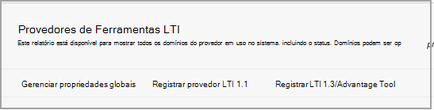

# Usar Microsoft Teams classes com quadro-preto

> [!IMPORTANT]
> Algumas informações estão relacionadas a produtos pré-lançados que podem ser substancialmente modificados antes de seu lançamento comercial. A Microsoft não faz garantias, expressas ou implícitas, quanto às informações fornecidas aqui.

Microsoft Teams é um aplicativo de interoperabilidade de ferramentas (LTI) do Learning que ajuda educadores e alunos a navegar facilmente entre seu Learning Management System (LMS) e Teams. Os usuários podem acessar suas equipes de classe associadas ao curso diretamente de dentro do LMS.

## Aprovar o aplicativo no locatário Microsoft Azure locatário

As tarefas a seguir são concluídas pelo administrador Microsoft Office 365 e o administrador Learn Ultra do Quadro Preto.

Antes de gerenciar Microsoft Office 365 integração no Blackboard Learn Ultra, o administrador do Microsoft Office 365 deve aprovar o MSFT Teams de quadro preto para o aplicativo **Learn Ultra Azure** para o locatário Microsoft Azure da instituição.

1. Encontre sua ID do Locatário da Microsoft. Veja [como encontrar o locatário](/azure/active-directory/fundamentals/active-directory-how-to-find-tenant).

2. Redirecionar o Ponto de Extremidade de Consentimento do Administrador da Plataforma de Identidade da Microsoft de acordo com o exemplo a seguir:

   `https://login.microsoftonline.com/{tenant}/adminconsent?client_id=2d94989f-457a-47c1-a637-e75acdb11568`

   > [!NOTE]
   > Substitua {tenant} pela ID de locatário da Microsoft da sua organização.

## Registrar os aplicativos de integração

Como administrador do Blackboard Learn Ultra, você precisará registrar 2 aplicativos de integração LTI 1.3 em seu ambiente de teste:

- A integração de Classe de Aprendizado de Quadro Teams para dar suporte à sincronização de lista de escalas

- O Microsoft Teams lti da equipe de classe

1. Anote as seguintes IDs de cliente LTI para ambos os Aplicativos:

    - Quadro-preto - f1561daa-1b21-4693-ba90-6c55f1a0eb41

    - Microsoft - 027328b7-c2e3-4c9e-aaa1-07802dae6c89

2. Acesse o Painel de Administração e, em **Integrações,** localize os Provedores de Ferramentas LTI.

   

3. Selecione **Registrar LTI1.3/Advantage Tool**.

4. Insira o primeiro das IDs do Cliente fornecidas (quadro-negro ou Microsoft) e selecione **Enviar**.

5. Revise as configurações pré-preenchidas e verifique se o status da ferramenta está marcado como aprovado.

6. Role até a parte inferior e selecione **Enviar**.

7. Repita as etapas anteriores para registrar o segundo dos aplicativos LTI em seu ambiente.

## Configurar o aplicativo REST e o compartilhamento de recursos de origem cruzada

O administrador Learn Ultra do Quadro Preto também precisará configurar o Aplicativo REST e a configuração de Compartilhamento de Recursos de Origem Cruzada.

Conclua o seguinte para configurar o aplicativo REST

1. Acesse a seção Aprender Ferramentas de Administração e selecione **Integrações da API REST** na **seção Integrações.**

2. Selecione **Criar integrações** e insira a mesma ID de Aplicativo/Cliente inserida para a ferramenta LTI de Integração Teams Classe de Aprendizado de Quadro Preto.

3. Insira o Usuário de Aprendizado (pode ser seu próprio nome de usuário de administrador de aprendizado) ou selecione **Procurar** para localizar.

4. Selecione **Sim** para **Acesso de Usuário Final**.

5. Selecione **Sim** para **Autorizado para Agir como Usuário**

6. Selecione **Enviar uma** vez concluído.

## Configurar o compartilhamento de recursos de origem cruzada

1. Acesse a seção Aprender Ferramentas de Administração e selecione **Compartilhamento de** Recursos de origem cruzada na **seção Integrações.**

2. Selecione **Criar Configuração**.

3. Insira `https://bb-ms-teams-ultra-ext.api.blackboard.com` a origem.

4. Adicione a palavra **Autorização** nos **Headers Permitidos.**

5. Definir **Disponível como** **Sim**.

6. Selecione **Enviar uma** vez concluído.

## Habilitar Teams classe em Blackboard Learn

Depois de habilitar as ferramentas LTI, a próxima etapa será configurar a integração do Microsoft Class Teams do seu próprio locatário Microsoft Office 365. Você pode fazer isso seguindo estas etapas como administrador do Blackboard Learn Ultra.

1. Em **Aprender Ferramentas de** Administração e  >  **Utilitários,** selecione Microsoft Teams Administrador de **Integração.**

   

2. Selecione a caixa de seleção **Habilitar Microsoft Teams**.

3. Insira sua ID de locatário conforme referenciado na seção em Administrador do Microsoft O365

 > [!NOTE]
 > Você não poderá salvar as configurações até que o aplicativo tenha sido aprovado pelo administrador do O365. Consulte [Aprovar o aplicativo no Microsoft Azure locatário](#approve-the-app-in-the-microsoft-azure-tenant).

4. Quando o administrador global do O365 tiver aprovado o aplicativo Teams quadro-preto no locatário da Microsoft, selecione **Enviar**.
